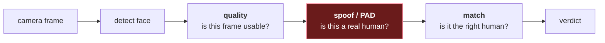

# Face Biometrics — A Course

Face recognition is really several separate problems wearing one name. This folder keeps
them separate, because the failure modes, the metrics and the literature genuinely are
different.

**This is reference learning material.** It's about the published research and the
standards, not about any particular system you might be building.

Same teaching contract as the fingerprint course next door:

- I explain things you might already know. Skim if so.
- Analogies before math, *why* before *how*.
- Every file ends with **Check yourself** questions, answered in that area's exercises file.
- No stupid questions. This field is 30 years of acronyms that everyone pretends are obvious.

## This folder's own chapters

Material every area needs, so by the rule in [`../CLAUDE.md`](../CLAUDE.md) it lives here
rather than inside any one child.

| # | File | Read it | Covers |
|---|------|---------|--------|
| 1 | [Estimating error rates](01-estimating-error-rates.md) | **Prerequisite** — before any area's metrics chapter | Confidence intervals, the rule of three, sample size, correlated samples, DET curves |
| 2 | [Retries and attempt caps](02-retries-and-attempt-caps.md) | **Prerequisite** — before designing any gate users can re-attempt | Why a retry is a new sample, abandonment, unbounded attempts as an attack |
| 3 | [Running an evaluation](03-running-an-evaluation.md) | Background — read before starting an investigation | Pre-registration, n=1, calibration splits, instrument drift, corrections files |
| 4 | [Exercises & answers](04-exercises.md) | Reference | Worked answers for this folder |

Chapters added later take 05 onward; the exercises file stays last.

None of these three name a metric. Files 03 and 04 don't even name a modality — a gate users
retry and an investigation run badly work the same way whatever is being measured.

Note what file 01 is *not*: it never names a metric. Each area defines its own — APCER and
BPCER for presentation attacks, FMR and FNMR for matching — and file 01 is the statistics
underneath all of them, which are the same statistics.

## The areas

| Area | Question it answers | Status |
|---|---|---|
| [**spoof/**](spoof/) — presentation attack detection | *Is there a real human in front of the camera, or a photo of one?* | Written |
| **match/** — face recognition & verification | *Are these two faces the same person?* | Not yet |
| **quality/** — capture quality | *Is this image good enough to decide anything from?* | Not yet |

They are ordered deliberately. **Spoof detection comes first** because it is the one most
often bolted on last and the one that most often fails in production. A face matcher that
scores 99.8% means nothing if a printed photo scores the same.

Each area is a self-contained course — read `spoof/` end to end, assuming only file 01
above.

> **Where the shared material will go.** Detection, bounding boxes, crop conventions and
> capture quality are needed by *every* area, so by the rule in `../CLAUDE.md` they belong
> here in `face/` rather than inside any one child. Right now they live in
> [`spoof/05-the-pipeline.md`](spoof/05-the-pipeline.md) because `spoof/` is the only child
> and lifting them out early would mean guessing the boundary with nothing to check it
> against. When `match/` arrives, that chapter splits: the detect-and-crop half moves up
> to `face/`, and what stays in `spoof/` is the preprocessing contract and postprocessing,
> which are PAD-model-specific. Noted here so it's a planned move rather than a surprise.

## How they fit together

The order matters and is not arbitrary. Matching a spoof tells you the *photo* belongs to
the right person — which is exactly what an attacker wants you to conclude. PAD has to
gate the matcher, not run alongside it.

## The one-paragraph summary

A camera cannot tell a face from a picture of a face; both are just light. Everything in
**spoof/** is about recovering the difference from cues that survive the lens — texture,
depth, reflectance, motion, frequency artefacts. Everything in **match/** is about
mapping a face to a vector such that the same person lands nearby and different people
land far apart. The two problems pull in opposite directions: a good matcher is *invariant*
to lighting, pose and camera, while a good spoof detector lives on exactly those signals.
That tension is why one network rarely does both well.
