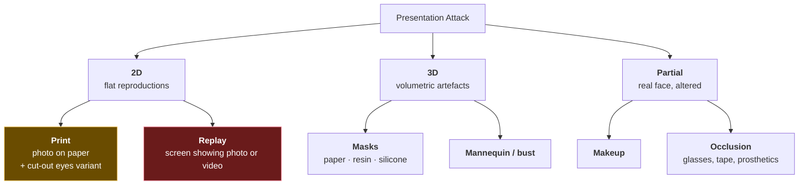
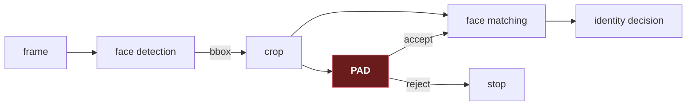

# 1. What a presentation attack actually is

## 1.1 The problem in one sentence

A camera measures light. A face reflects light. **A photograph of a face also reflects
light.** Nothing in the sensor distinguishes them — the difference has to be recovered
from artefacts, and that recovery is the entire field.

Hold that thought, because it explains why this problem is harder than it sounds. You are
not asking "is this a face?" — a detector answers that. You are asking "is the *thing that
produced these photons* a living person or a rendering of one?" The camera has already
thrown that information away. You are reconstructing it from residue.

> **Teacher's aside.** People new to this often assume liveness is basically motion
> detection — "make them blink and you're done." That was true for about two years around
> 2010. Then attackers started replaying videos of people blinking. Every cue in this
> field has the same arc: it works, it gets published, it gets defeated, it becomes one
> signal among many. There is no final cue. Plan for that from the start.

## 1.2 The vocabulary — and why it's so ugly

The everyday words are *anti-spoofing* and *liveness detection*. The standards body chose
neither. ISO/IEC 30107 says **presentation attack detection**, and once you see the
reasoning it's hard to unsee.

| Term | Means | Why the standard prefers it |
|---|---|---|
| **Presentation attack (PA)** | Presenting something to the sensor to subvert the biometric system | Neutral about *how*. Covers photos, masks, and also a real person coerced or impersonating |
| **PAI** — Presentation Attack Instrument | The physical artefact used: the printed photo, the phone, the silicone mask | Lets you say "APCER for *this PAI species*", which matters — see §1.5 |
| **Bona fide presentation** | A genuine attempt by a genuine user | Not "real" or "live" — a bona fide user might be photographed *by* the system, so "live" gets confusing fast |
| **PAD** | Presentation attack detection | The mechanism |

The reason "liveness" lost is precise: **liveness is a claim about biology, and most
detectors never measure biology.** A model that spots moiré on a screen has detected an
*attack*, not an *absence of life*. Calling it liveness overclaims — and overclaiming to a
security reviewer is how you lose an argument you were otherwise winning.

Two more that get muddled constantly:

- **Presentation attack** — fooling the *sensor*. A photo held to a camera.
- **Injection attack** — bypassing the sensor entirely. A virtual camera feeding frames
  straight into the app.

**PAD does not stop injection attacks.** If an attacker replaces the camera driver, your
model receives whatever they choose and scores it happily. Injection is defended by
attestation, secure capture paths, and SDK integrity — different discipline, different
team, and worth saying out loud when someone asks "will this stop deepfakes?"

## 1.3 The attack families

**Print.** A photo on paper or card. The cheapest attack and the one every dataset has.
Tell-tales: paper texture, flatness, no specular highlight moving with the head, printer
half-toning, colour-gamut shift.

**Replay.** A phone or tablet showing a photo or video. Now the most common real-world
attack, because everyone carries a high-resolution display. Tell-tales: **moiré** (the
interference between the display's pixel grid and the camera's sensor grid), screen
reflections, the bezel if the crop is wide enough, backlight uniformity, refresh banding.

**Masks.** Paper masks are cheap and easy to spot. Silicone masks are expensive and very
hard — they have real 3D structure, so depth cues fail, and their reflectance can be
tuned. Most public datasets contain few or none. If your threat model includes funded
attackers, assume your model has never seen one.

**Partial.** A real face with something added. These sit awkwardly: the presentation *is*
a live human, so "liveness" cues all fire correctly. Makeup-based impersonation is
genuinely hard and mostly unsolved.

**A note on deepfakes.** A deepfake displayed on a screen is a *replay attack* and your
PAD sees a screen — the replay cues still apply. A deepfake *injected* past the camera is
not a presentation attack at all (§1.2). Keeping those two apart prevents most of the
confusion in this area.

## 1.4 What the attacker actually controls

Worth thinking about explicitly, because it tells you which cues are load-bearing.

| Attacker can change cheaply | Attacker struggles to change |
|---|---|
| Print quality, paper type, glossiness | Making a flat thing have depth |
| Screen brightness, size, resolution | Removing the display's own pixel grid |
| Distance and angle to defeat moiré | Reproducing skin's subsurface scattering |
| Cropping out the bezel | Faking a pulse in reflected light |
| Recording a video of blinking | Responding correctly to an unpredictable challenge |

The right-hand column is where durable cues live, and it is roughly ordered by cost. That
is also the order in which they get defeated as attacker budget rises.

## 1.5 PAI species — the concept that fixes bad reporting

ISO/IEC 30107-3 introduces **PAI species**: a group of attack instruments made the same
way. "Photos printed on A4 matte at 600dpi" is one species. "iPhone 13 replay at 50cm" is
another.

This matters because **error rates are meaningless when averaged over species.** A model
might be perfect on prints and useless on replays. Report one number and you've hidden
that. The standard therefore says: report APCER **per species**, and take the *worst* as
your headline.

> ⚠️ **The single most common misreading of a PAD result.** A paper reports "APCER 1.2%"
> and you assume attacks get through 1.2% of the time. But if that's an average over five
> species and one of them is at 6%, an attacker doesn't sample uniformly at random — they
> find the 6% and use it every time. **Attackers optimise; averages assume they don't.**
> Always ask which species, and always look for the maximum.

## 1.6 Where PAD sits in a system

Two structural points people get wrong:

**PAD gates the matcher; it does not vote with it.** If they run in parallel and you
combine scores, a high-confidence *match* on a printed photo can outweigh a mild spoof
suspicion — which is precisely the attack. The spoof decision must be able to veto.

**PAD needs the detector's bounding box, not just the frame.** Every model in this course
classifies a *crop*, at a specific margin around the face. File 05 covers why that margin
is a model parameter and not a preference. It follows that "assume there's always a face"
never removes the need for detection — you need the *box*, not the reassurance.

## 1.7 What "good" even looks like

Numbers in this field are much softer than in fingerprint matching. Some honest bounds:

- **Intra-dataset** (train and test on the same dataset) results above 99% are routine and
  mean very little. File 08 explains why.
- **Cross-dataset** results — train on one, test on another — commonly land at 15–30%
  HTER. That is somewhere between "useful signal" and "coin flip with good PR."
- **Unseen attack types** are worse still. A model trained on prints and replays will not
  reliably catch a silicone mask.

Compare with fingerprints, where rolled-to-rolled matching is genuinely a solved problem
at >99%. Face PAD has no equivalent solved corner. Even the easy case — print attacks,
good lighting, cooperative user — is only solved *within* a dataset.

This is not pessimism; it's the operating condition. Systems that work in production do so
because they combine a mediocre model with capture-quality gates, sensible thresholds, and
a retry flow — not because the model is excellent.

---

## Check yourself

1. Why did the standard choose "presentation attack detection" over "liveness detection"?
   Give a concrete case where "liveness" would be the wrong word.
2. A vendor says their product blocks deepfakes. What two questions do you ask?
3. What is a PAI species, and why does averaging APCER across species mislead?
4. Your model is trained on print and replay attacks. A team asks whether it will catch a
   silicone mask. What do you say, and why?
5. Someone proposes fusing the PAD score and the face-match score into one number. What's
   the attack that makes this a bad idea?

(Answers in [`11-exercises.md`](11-exercises.md).)
