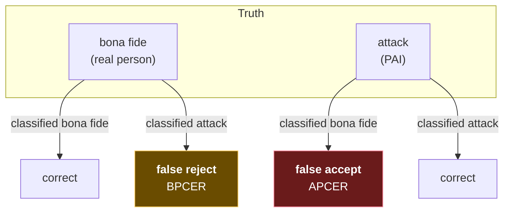

# 2. How PAD is scored

⭐ **The most useful file here.** PAD's metrics are a swamp of near-synonyms, several of
which are deprecated but still everywhere. This file exists so you can read a results table
and know what you're looking at.

## 2.1 The two errors

Every PAD system makes exactly two kinds of mistake, and you must always know which is
which:

| Error | What happened | Who is hurt |
|---|---|---|
| **False accept** | An attack was classified as bona fide | Security. The attacker wins |
| **False reject** | A genuine user was classified as an attack | The user. They can't sign up |

That's it. Everything below is naming.



## 2.2 The ISO names — APCER and BPCER

From **ISO/IEC 30107-3**, and these are the ones to use:

**APCER** — *Attack Presentation Classification Error Rate*

> The proportion of **attack** presentations wrongly classified as bona fide.

```
APCER = (attacks accepted) / (total attacks)
```

**BPCER** — *Bona fide Presentation Classification Error Rate*

> The proportion of **bona fide** presentations wrongly classified as attacks.

```
BPCER = (genuine rejected) / (total genuine)
```

A memory hook that survives pressure: **the first letter tells you the ground truth of the
sample being counted.** A-PCER counts attacks. B-PCER counts bona fide. The error is always
"classified as the other thing."

> ⚠️ **The reversal trap.** People routinely get these backwards, because in *face
> matching* the familiar pair is FAR/FRR where FAR is about impostors being accepted.
> Here, low APCER = secure, low BPCER = usable. If a paper reports "APCER 0.1%, BPCER 30%"
> that model is extremely secure and completely unusable — it rejects nearly a third of
> real users. Both numbers, always.

### The per-species rule

Repeating file 01 §1.5 because it belongs here too: APCER is defined **per PAI species**,
and the reported figure should be the **worst species**, not the mean.

```
APCER_reported = max over species s of APCER(s)
```

BPCER has no species — genuine users are just genuine users — so it is a single number.

## 2.3 ACER — widely used, formally deprecated

**ACER** — *Average Classification Error Rate*:

```
ACER = (APCER + BPCER) / 2
```

You will see this constantly, especially in papers using OULU-NPU. It is **deprecated in
ISO/IEC 30107-3:2017** for industry PAD evaluation, while remaining in wide use in research
papers and competitions — so you will keep meeting it, and should keep discounting it.

The deprecation was correct, for a reason worth internalising: **averaging the two errors
implies they cost the same.** They almost never do. Rejecting a genuine user costs a
support ticket. Accepting an attack costs a fraudulent account. A single averaged number
lets a model hide a terrible APCER behind an excellent BPCER, and vice versa.

Read ACER when a paper gives you nothing else, but never *report* it alone.

## 2.4 HTER — the older name you'll meet in cross-dataset work

**HTER** — *Half Total Error Rate*:

```
HTER = (FAR + FRR) / 2
```

Structurally identical to ACER, with the older FAR/FRR naming. It dominates the
Replay-Attack lineage and most cross-dataset papers.

There's a procedural detail that matters more than the formula. HTER is normally quoted
with the decision threshold **fixed on a development set**, then applied unchanged to the
test set. That's the honest protocol, because it mimics deployment: you must choose a
threshold before you see the attacks.

Contrast with **EER** below, which chooses the threshold *after* seeing the test data — so
an EER is always optimistic relative to a real deployment.

## 2.5 EER, and why it flatters

**EER** — *Equal Error Rate*: the point where APCER equals BPCER, found by sweeping the
threshold.

It's a useful single-number summary of a *score distribution* and a bad summary of a
*system*, because:

1. It picks the threshold with hindsight, using the test labels.
2. It asserts the two errors are equally costly, which they aren't.
3. Real systems rarely operate at the EER point.

Use EER to compare models' raw separating power. Never quote it as expected production
performance.

## 2.6 AUC, and what it hides

**AUC** — *Area Under the ROC Curve*. One number in [0.5, 1], and the figure most PAD papers
lead with.

Its appeal is that it needs no threshold: it summarises the score distributions across every
operating point at once. That is also the objection. **You have to pick a threshold to ship**,
so a threshold-free summary describes something you will never run.

Two systems can share an AUC and behave completely differently where it matters:

```
system A   AUC 0.95   BPCER at 1% APCER:   8%
system B   AUC 0.95   BPCER at 1% APCER:  34%
```

Nothing is wrong with the arithmetic. AUC integrates over the whole curve, including the
region where APCER is 40% — territory no deployment visits. Two curves enclosing the same
area can be shaped so that one is far better in the low-APCER corner and far worse elsewhere.

The other property to know: AUC is **equivalent to the probability that a randomly chosen
attack scores lower than a randomly chosen bona fide sample**. That is a genuinely useful
thing to know about a model's raw separating power. It is not a statement about any
deployable configuration.

| Use AUC for | Don't use it for |
|---|---|
| Ranking models during development | Predicting production behaviour |
| A quick sanity check that a signal exists at all | Choosing between finalists |
| Reporting on a single-species set | Anything where per-species reporting is required |

That last row matters here more than in most fields. AUC has no species dimension — it pools
all attacks into one distribution — so it silently averages away the worst species that
§2.2's rule exists to surface. A model excellent on print and useless on replay can post a
strong AUC.

> ⚠️ **AUC is near-useless at the low error rates PAD operates at.** The whole decision
> region — say APCER below 5% — is a sliver of the area being integrated. Report BPCER at a
> fixed APCER (§2.7) instead, and if you need a curve, plot DET
> ([`face/01` §1.8](../01-estimating-error-rates.md)) rather than ROC.

## 2.7 BPCER @ APCER — the reporting format that's actually useful

The format worth insisting on:

> **BPCER at a fixed APCER**, e.g. `BPCER @ APCER = 1%`

Read as: "hold attacks-getting-through at 1%, and this is the share of genuine users we
reject." It reflects how a system is really tuned — you decide the security level the
business will accept, then measure the user cost of meeting it.

The mirror form, `APCER @ BPCER = 1%`, is equally valid; pick whichever end your
requirement is stated at.

| Format | Good for | Weak because |
|---|---|---|
| APCER + BPCER pair | Everything. The default | Needs two numbers |
| BPCER @ APCER=x% | Tuning to a security target | — |
| ACER / HTER | Quick comparison | Hides asymmetry; ACER deprecated |
| EER | Comparing raw model quality | Threshold chosen with hindsight |
| "Accuracy" | Nothing | See §2.7 |

## 2.8 Why plain "accuracy" is worthless here

Test sets in this field are rarely balanced. CelebA-Spoof, for instance, contains far more
attack images than bona fide ones.

Take a set that is 80% attacks. A model that calls **everything** an attack scores 80%
accuracy while rejecting every real user. A press release could truthfully say "80%
accurate."

Any PAD result quoted as a single "accuracy" figure should be treated as unreported until
you see the confusion matrix.

## 2.9 A worked example

100 bona fide presentations and 100 attacks, split 50 print / 50 replay.

Results: 8 genuine users rejected. 1 print accepted. 12 replays accepted.

```
BPCER        = 8 / 100                    = 8%
APCER(print) = 1 / 50                     = 2%
APCER(replay)= 12 / 50                    = 24%
APCER         = max(2%, 24%)              = 24%    ← report the worst species
ACER         = (24 + 8) / 2               = 16%    (deprecated, shown for reference)
```

Now the point of the exercise. If you had averaged across species:

```
APCER_avg = 13 / 100 = 13%
```

13% versus 24% — the averaged figure is nearly half the honest one. And an attacker will
never present a print; they'll present a replay, forever, and get through **a quarter of
the time**. The average describes an attacker who chooses randomly. No such attacker
exists.

## 2.10 What a threshold does to all of this

Every model emits a score; the threshold turns it into a decision. Moving it trades one
error against the other, always:

```
   threshold low                              threshold high
   (accept easily)                            (reject easily)
   ─────────────────────────────────────────────────────────►
   APCER ▲ high      attacks get through
   BPCER ▼ low       users sail through

                                              APCER ▼ low
                                              BPCER ▲ high  users blocked
```

There is no threshold that reduces both. The only thing that moves the whole curve is a
better model — which is what a **DET curve** (BPCER against APCER across all thresholds)
shows you. Two models can be compared honestly only by their curves, never by one point
each, because each point was chosen by whoever wrote the paper.

> **Teacher's aside.** This is why "what's your accuracy?" is the wrong first question to
> ask a PAD vendor, and "can I see the DET curve, and which PAI species are in it?" is the
> right one. The second question is much harder to answer with marketing.

---

## Check yourself

1. Define APCER and BPCER without looking. Which one does a *user* feel?
2. Why was ACER removed from the standard? Give a case where it actively misleads.
3. A model reports EER 3%. Why can't you conclude it will make 3% errors in production?
4. You test on 30 bona fide and 270 attacks. A model rejects everything. What's its
   accuracy, its APCER, and its BPCER?
5. Your security team says at most 2% of attacks may succeed. Which metric format do you
   ask the vendor for?
6. Two papers report ACER 5% and 4% on the same dataset. Can you conclude the second is
   better? What would you need?

(Answers in [`11-exercises.md`](11-exercises.md).)
