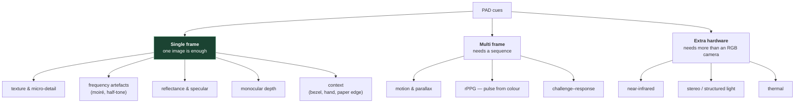

# 3. The cues — what a detector is actually looking at

File 01 said a camera can't tell a face from a picture of one, and that the difference must
be recovered from artefacts. This file is the list of artefacts.

Worth knowing even if you never train a model, because it lets you ask a sharp question of
any system: **which physical difference is this exploiting?** If nobody can answer, the
model is exploiting dataset bias (file 08) and will not travel.

## 3.1 The map



The single-frame column is what a base64-image API can use. Everything in the multi-frame
column needs a video or a capture loop, and everything in the hardware column needs a
sensor most deployments don't have.

## 3.2 Texture and micro-detail

**The physics.** Skin is *translucent*. Light enters the surface, bounces around under it,
and exits somewhere nearby — **subsurface scattering**. It's why skin looks soft and why
rendering it convincingly is famously hard in graphics. Paper and glass don't do this.
Paper scatters at the surface; a screen emits.

**What survives to the image.** Re-captured images pick up texture that wasn't in the
original: paper fibre, printer half-tone dots, the display's pixel structure. They also
*lose* fine detail — pores and fine hair get smoothed by the print-and-rephotograph round
trip.

**Historically** this was captured by LBP (Local Binary Patterns) and similar hand-designed
descriptors. Modern CNNs learn it, which is a large part of what a small
texture-classifier like MiniFASNet (file 06) is doing.

**Where it fails.** Texture is highly camera-dependent. Train on a 1080p webcam, deploy on
a 12MP phone, and the micro-texture statistics are simply different. This is the single
biggest contributor to cross-dataset collapse.

## 3.3 Frequency artefacts — moiré

The most distinctive replay cue, and the most satisfying to understand.

A display is a grid of pixels. A camera sensor is a grid of photosites. Photograph one
grid with another and the two interfere, producing a low-frequency pattern that exists in
neither — **moiré**.

```
display grid      sensor grid       what the camera records
||||||||||   ×    ||||||||||   =    ▓▓░░▓▓░░▓▓░░
||||||||||        ||||||||||        ░░▓▓░░▓▓░░▓▓
(fine, regular)   (fine, regular)   (coarse banding — moiré)
```

In the frequency domain it's unmistakable: energy concentrated at specific spatial
frequencies that a natural face has no reason to produce. This is why several
architectures add a **Fourier / FFT branch** as auxiliary supervision — MiniFASNet does
exactly this (file 06 §6.4). You're teaching the network to look at the spectrum, where
the giveaway is loud.

Print attacks have a related artefact: **half-toning**, the dot pattern a printer uses to
simulate continuous tone. Also periodic, also visible in the spectrum.

**Where it fails.** Moiré depends on the ratio of the two grids and thus on distance and
angle. An attacker who moves the phone closer, further, or tilts it can make moiré
disappear. It's a strong cue when present and simply absent otherwise — never build a
system that *requires* it.

## 3.4 Reflectance and specular highlights

Skin, paper and glass reflect light differently:

| Surface | Behaviour |
|---|---|
| **Skin** | Mostly diffuse, plus small moving specular highlights on forehead, nose, cheekbones |
| **Paper (matte)** | Diffuse, uniform. Suspiciously even |
| **Paper (glossy)** | Large flat specular patches — a whole sheet catching light at once |
| **Screen** | *Emits* rather than reflects. Brightness barely responds to ambient light |

That last row is exploitable and underused: an emissive surface doesn't dim when you dim
the room. Some systems flash the screen a known colour and look for the reflection on the
face — a **light challenge** (file 04), which is really an active reflectance probe.

**Where it fails.** Ambient lighting varies enormously, and matte prints in soft even light
look diffuse in much the same way skin does.

## 3.5 Depth

A real face is a 3D object. A print and a screen are planes.

Monocular depth estimation from a single frame is possible but noisy. The stronger version
uses **motion parallax**: move the camera or the head slightly, and near points (nose)
shift more than far ones (ears). A flat surface produces no parallax at all.

Some architectures supervise depth explicitly — predicting a per-pixel depth map for bona
fide faces and a flat map for attacks — rather than training a plain binary classifier.
Liu et al. (2018) introduced this, and CDCN builds on it. The intuition is good: a binary
label teaches the network *that* something differs, while a depth map teaches it *how*, so
it generalises better.

**Where it fails.** Masks. A silicone mask has real depth. Every depth cue passes it. This
is why mask attacks are the expensive end of the threat model.

## 3.6 Motion and rPPG

**Motion.** Blinks, micro-expressions, small head movements. Beat by replaying a video.
Weak on its own, useful as one signal.

**rPPG — remote photoplethysmography.** The genuinely elegant one. Your heart pushes blood
through facial capillaries; blood absorbs green light more than red; so the average colour
of a face **oscillates very slightly at your pulse rate**. A camera can recover it from a
video of a still face.

A printed photo has no pulse. A replayed video's pulse signal is largely destroyed by the
re-capture.

**Where it fails.** rPPG needs a decent stretch of video (typically several seconds),
tolerable lighting, and a reasonably still subject. It's fragile in motion and useless on
a single image. Real deployments treat it as corroboration, not a gate.

## 3.7 Context — the underrated one

Widen the crop and attacks often reveal themselves at the *edges*:

- the **bezel** of the phone showing the replayed face
- a **hand** holding the print
- the cut **edge of the paper**
- the desk behind, at a different focal plane

This is cheap and effective, and it's why crop margin is a real design decision (file 05).
A tight crop sees only skin texture; a 2.5× crop can see the bezel. Some models
deliberately run at multiple scales for exactly this reason.

**Where it fails.** A careful attacker fills the frame with the screen so no bezel is
visible. But careful attackers are rarer than lazy ones, and this catches the lazy ones
cheaply.

## 3.8 Hardware cues

If you control the sensor, the problem gets much easier:

| Sensor | Why it helps | Cost |
|---|---|---|
| **Near-infrared** | Screens emit almost nothing in NIR — a replay looks like a black rectangle. Skin reflects NIR distinctively | Extra camera |
| **Stereo / structured light** | Real depth. Kills all flat attacks outright | Extra hardware; phone-dependent |
| **Thermal** | Faces are warm, screens and paper aren't | Expensive, rare |

NIR is the best value of the three and is why some access-control terminals are far harder
to spoof than a phone app. If your deployment is a fixed kiosk, this is worth raising
before anyone writes a model.

**Where it fails.** You usually don't control the sensor. A web or mobile SDK gets an RGB
frame and that's that.

## 3.9 Putting it together

| Cue | Single frame? | Beats print | Beats replay | Beats silicone mask |
|---|---|---|---|---|
| Texture | ✅ | ✅ | ✅ | ❌ |
| Moiré / frequency | ✅ | partly (half-tone) | ✅ when present | ❌ |
| Reflectance | ✅ | partly | ✅ | partly |
| Depth (monocular) | ✅ | ✅ | ✅ | ❌ |
| Parallax | ❌ | ✅ | ✅ | ❌ |
| rPPG | ❌ | ✅ | ✅ | ✅ |
| Context / bezel | ✅ | ✅ | ✅ | ❌ |
| NIR | ✅ | ✅ | ✅ | partly |

Read the **mask column**. Almost everything fails. Only rPPG and NIR have a real claim, and
both need something a plain single-image API doesn't have. If someone asks whether your
RGB single-frame model stops silicone masks, the honest answer is no, and the table is why.

Read the **single-frame column** too, because it defines what any base64-image API can
possibly do: texture, frequency, reflectance, monocular depth, context. That's the whole
toolbox. Everything else needs a capture loop.

---

## Check yourself

1. Explain moiré to someone non-technical in two sentences.
2. Why does subsurface scattering matter, and which attack does it help you catch?
3. A model uses only monocular depth. Rank print / replay / silicone mask by how well it
   does, and say why.
4. Why does rPPG fail on a single image? What's the minimum a system needs for it?
5. You must choose *one* cue for a web SDK with an RGB camera and one still frame. Which,
   and what do you accept losing?
6. Someone widens the crop from 1.5× to 2.5× and accuracy improves. Which cue did they
   probably just hand the model?

(Answers in [`11-exercises.md`](11-exercises.md).)
