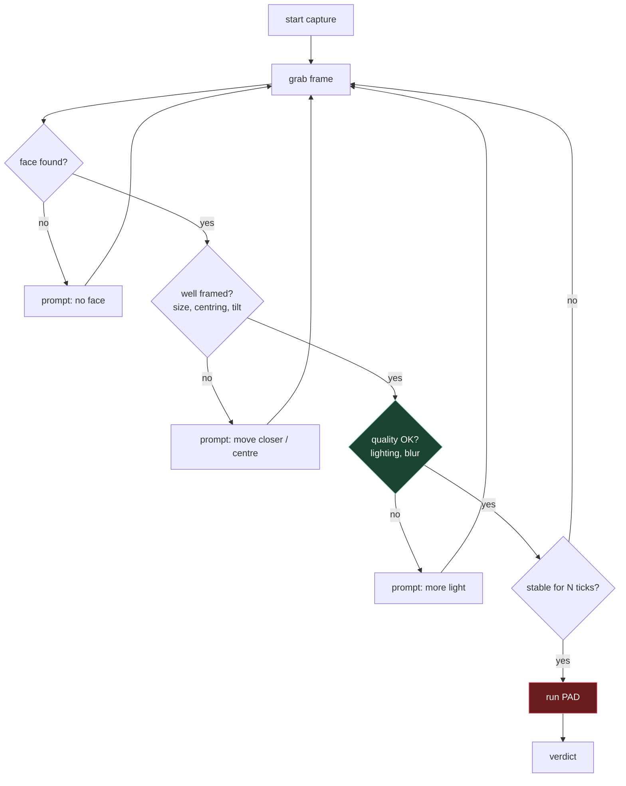

# 4. Passive, active, and the capture loop

File 03 split the cues by what they need — one frame, a sequence, or extra hardware. That
split has a product consequence, and this file is about it.

## 4.1 The distinction

**Passive PAD** — the user does nothing unusual. They present their face; the system
decides. Everything happens on frames the user would have produced anyway.

**Active PAD** — the system asks for something and checks the response. Blink, turn left,
read a number, hold still while the screen flashes.

The trade is the whole story:

| | Passive | Active |
|---|---|---|
| User friction | None | Real. Instructions, retries, confusion |
| Drop-off | Low | Measurable, sometimes severe |
| Accessibility | Better | Excludes some users outright |
| Time to decide | One frame | Seconds |
| Beaten by a pre-recorded video | Often | Not if the challenge is unpredictable |
| Beaten by injection | Yes | Yes (§4.5) |

> **Teacher's aside.** The instinct is that active is "more secure" and passive is "more
> convenient", so security-minded people reach for active. But an active check is only
> worth its friction if the challenge is genuinely **unpredictable and verified**. A
> system that says "blink now" and merely checks *that a blink occurred* has bought almost
> nothing — the attacker plays a video of someone blinking. What matters isn't
> active-vs-passive; it's whether the response could have been prepared in advance.

## 4.2 Challenge–response, done properly

For an active check to be worth anything:

1. **The challenge is unpredictable.** Chosen at request time from a large space, not a
   fixed sequence an attacker can rehearse.
2. **The response is verified against the specific challenge.** Not "did something
   happen", but "did *the requested thing* happen".
3. **The window is tight.** Long enough for a human, short enough to prevent live
   puppeteering of a rendered avatar.
4. **The challenge is issued server-side.** A client that picks its own challenge can be
   asked to pick an easy one.

Point 4 gets missed constantly. If the SDK chooses the challenge and reports the outcome,
an attacker with a modified client controls both.

## 4.3 Light challenge — the interesting middle

Flash the screen a known colour or sequence, and check the reflection on the face.

This is clever because it's **active but invisible**. The user isn't asked to do anything,
so friction is near-passive, but the system injects a signal it controls and can verify.

It leans on reflectance (file 03 §3.4): a real face reflects the flash across its 3D
surface with predictable falloff; a screen showing a face is emissive and barely responds;
a print reflects flatly.

Limits: needs a screen to flash, so it's a phone/laptop technique. Fails in bright ambient
light. Distinguishing "true reflection" from "attacker's screen also brightened" needs
care.

## 4.4 The capture loop

Real SDKs don't classify one frame in isolation. They run a loop:

The gates before PAD are doing something specific and underrated: **they raise the quality
of the frame the model finally sees**, which does more for real-world accuracy than a
better model usually does.

A model evaluated on clean benchmark images and then fed whatever a user's front camera
produces at arm's length in a dim room will underperform its paper numbers badly. The
capture loop closes some of that gap by simply not submitting bad frames.

> ⚠️ **Quality gates are not spoof detection.** They answer "is this frame judgeable?", not
> "is this an attack". Conflating them produces a system that rejects genuine users for
> being in a dim room and reports it as a spoof. Keep the two verdicts separate in your
> API, even if the product collapses them into one message.

## 4.5 What neither approach fixes

Both passive and active PAD assume **the frames come from the camera you think they do**.

An injection attack — a virtual camera device, a patched SDK, a replayed video stream fed
into the app — defeats both. The system asks for a blink; the injected stream contains a
blink; everything passes.

Defences are a different discipline: device attestation, hardware-backed keys, secure
capture paths, SDK integrity checks, server-side liveness on a signed video. It's worth
knowing where the boundary is so you don't argue for a better model when the actual gap is
attestation.

## 4.6 Choosing

| Situation | Reach for |
|---|---|
| Onboarding at scale, drop-off matters | Passive, with a good capture loop |
| High-value transaction, occasional | Active challenge–response |
| Fixed kiosk you control | Passive + NIR hardware — beats both |
| Server API receiving a single image | Passive; nothing else is possible |
| Regulated context needing an audit trail | Active, recorded, with the challenge logged |

That last row is worth pausing on: sometimes the value of an active check isn't detection,
it's **evidence**. A logged unpredictable challenge and its recorded response is something
you can show later. A passive score is a number nobody can re-examine.

---

## Check yourself

1. What single property makes an active challenge worth its friction?
2. Why is a light challenge "active but invisible", and what does it exploit?
3. A vendor's SDK picks the challenge on the client and returns pass/fail. What's wrong?
4. Give two reasons the capture loop improves real-world accuracy without improving the
   model.
5. Your API takes one base64 image. Which cues from file 03 are available, and which
   whole category is off the table?
6. A team proposes active liveness to stop injection attacks. Are they right?

(Answers in [`11-exercises.md`](11-exercises.md).)
