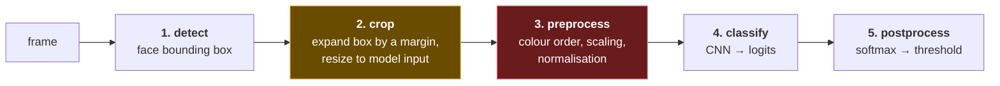

# 5. The pipeline — detect, crop, classify

Every single-frame PAD system has the same three stages. The middle one is where most
implementation bugs live, and it's the one papers describe in a single clause.

## 5.1 The shape



Stages 2 and 3 are highlighted because they're the ones that fail **silently**. A wrong
crop or a wrong colour order doesn't crash — it returns a confident wrong answer, which is
the worst failure mode a security component can have.

## 5.2 Detection — you need the box, not the reassurance

The classifier does not take a frame. It takes a **crop centred on a bounding box**. So
even in a system where you're certain a face is present, you still need detection, because
you need coordinates.

This trips people up. "Assume there's always a face" sounds like it removes a dependency.
It doesn't — it removes the *presence* question while leaving the *location* question,
and the location question is the one the classifier actually needs answered.

**YuNet** is the common lightweight choice — small, fast, and shipped inside OpenCV as
`cv2.FaceDetectorYN`, which also returns five landmarks (eyes, nose, mouth corners).

### The detector threshold is not a security control

A detector score threshold trades two things that are **not symmetric**:

- Too high → real faces missed → genuine users blocked outright
- Too low → false detections → the classifier gets a patch of wall, and rejects it

The second failure is self-correcting; the first is not. A missed detection is
indistinguishable from a rejection as far as the user is concerned, and no classifier ever
gets the chance to weigh in.

> **Teacher's aside.** Detectors get noticeably less confident on **tightly cropped
> faces** — a head that fills the frame with the crown and chin cut off scores lower than
> the same face at conversational distance. Which is unfortunate, because a phone held at
> arm's length produces exactly that framing. A threshold tuned on webcam-distance
> benchmark images will quietly reject a large slice of real mobile captures. Tune this on
> captures from the device class you actually serve.

## 5.3 The crop margin is a model parameter

Here is the thing papers gloss over and implementations get wrong.

A model is trained on crops taken at a particular **expansion factor** around the detected
box. Feed it a different margin at inference and you're feeding it a distribution it never
saw.

```
   1.0×              1.5×                    2.7×
 ┌────────┐      ┌────────────┐        ┌──────────────────┐
 │ ▓▓▓▓▓▓ │      │            │        │                  │
 │ ▓ face │      │   ▓▓▓▓▓▓   │        │                  │
 │ ▓▓▓▓▓▓ │      │   ▓ face   │        │    ▓▓▓▓▓▓        │
 └────────┘      │   ▓▓▓▓▓▓   │        │    ▓ face        │
                 │            │        │    ▓▓▓▓▓▓        │
  skin only      └────────────┘        │                  │
                                       └──────────────────┘
                  some context          bezel, hand, paper edge
```

Different margins expose **different cues** (file 03):

| Margin | What the model can see |
|---|---|
| ~1.0–1.5× | Skin texture, pores, subsurface scattering. No context |
| ~2.5× | Some background: hairline, ears, shoulders. Paper edges start appearing |
| ~2.7–4.0× | Phone bezel, the hand holding the print, the desk behind |

This is why ensembles sometimes run the *same* architecture at *different* scales — they're
deliberately looking at different evidence. The Silent-Face project (file 06) does exactly
this.

**The consequence for anyone integrating a pretrained model:** the expansion factor is
part of the model's contract, like input size and colour order. It is not a tuning knob.
Change it and the scores stop meaning what the training set says they mean.

### Handling a box that runs off the frame

The naive crop breaks when the expanded box exceeds the image, which happens constantly
once a face fills a normal amount of the frame.

Two options:

1. **Pad** the missing region — usually black, sometimes reflected.
2. **Clamp** the expansion to what fits, then shift the box back inside.

Option 2 is generally right for these models, because they were never trained on synthetic
black borders. A patch that's 100% real pixels at a smaller-than-ideal margin is closer to
the training distribution than a patch at the nominal margin with a black void in it.

The standard formulation, as used by the Silent-Face lineage:

```
scale     = min((H-1)/h, (W-1)/w, desired_expansion)
new_w     = w * scale
new_h     = h * scale
cx, cy    = box centre
left, top = cx - new_w/2, cy - new_h/2
# translate back inside the frame if it overflows, then:
patch     = resize(image[top:top+new_h, left:left+new_w], model_input_size)
```

Because `scale` is already clamped to fit, a pure translation always suffices — you never
need to shrink twice or pad.

## 5.4 Preprocessing — the silent killer

Getting this wrong produces a **constant output**, not an error.

Four independent decisions, each with a wrong answer that looks fine:

| Decision | Options | Symptom when wrong |
|---|---|---|
| Colour order | RGB or BGR | Degraded or constant output. No exception |
| Value range | `[0,1]` or `[0,255]` | Model collapses to one class for every input |
| Normalisation | none, or mean/std | Systematically shifted scores |
| Layout | NCHW or NHWC | Usually errors — the one that fails loudly |

> ⚠️ **The `/255` trap.** Several models — MiniFASNet among them — take raw `[0,255]`
> float input with **no** division and **no** mean/std. Divide by 255 out of habit and the
> network sees values so small it produces near-identical logits for every input. The
> symptom is *the same three numbers regardless of what you feed it*. If you ever see a
> model output that doesn't move, check this before anything else.
>
> This is worth a regression test that deliberately performs the mistake and asserts the
> constant-output signature. It's the kind of bug that gets reintroduced.

**Colour order** deserves its own warning. OpenCV loads BGR. PIL and most ML tutorials use
RGB. Half the models in this space were trained with OpenCV in the loop and expect BGR.
There is no way to detect the mistake from the output — the model just gets slightly worse
in a way you'd attribute to the model rather than to yourself.

### Resize is not a detail either

The interpolation used to reach the model's input size affects the result. OpenCV's
`INTER_LINEAR` uses a half-pixel-centre convention; naive implementations often don't. On
small inputs — and 80×80 is small — the difference can move a logit by a noticeable
fraction.

If a reference implementation used `cv2.resize`, use `cv2.resize`. Matching the training
pipeline matters more than the theoretical merits of a filter.

## 5.5 Postprocessing

Most classifiers emit **unnormalised logits**; apply softmax, then threshold.

Two traps:

**Which index is the genuine class?** It is not always 0. MiniFASNet's three-class output
is `[print, live, replay]` — **live is index 1**. Assume index 0 and you invert the model
while producing entirely plausible-looking probabilities.

**Argmax and threshold are different rules.** On a three-class model:

```
probs = [0.44, 0.33, 0.23]     # argmax is class 0
```

Argmax says class 0. A threshold of `p[0] >= 0.5` says no. Both are defensible; they are
not the same rule and they disagree exactly on the marginal cases you care about. A
threshold is preferable because it's tunable and comparable across models; argmax is not.

For a **two-class** model, note that `softmax(logits)[0] >= 0.5` is algebraically identical
to `logit[0] - logit[1] >= 0`. Some implementations write one form, some the other. They
are the same test, and knowing that saves an argument.

## 5.6 The whole thing, as a checklist

If you're integrating a pretrained PAD model, you need all seven of these from its authors:

1. Input size
2. Crop expansion factor
3. Colour order
4. Value range and whether to divide by 255
5. Normalisation constants, if any
6. Class order, and which index is genuine
7. The resize filter used in training

Miss any one and the model runs, returns numbers, and is wrong. Where a model card doesn't
state one, treat the value you adopt as an assumption to be tested against known-label
samples — not as a fact.

---

## Check yourself

1. Why do you still need face detection in a system where a face is guaranteed present?
2. A model expects a 2.7× crop and you give it 1.5×. Which cues have you removed?
3. Your expanded box runs off the frame. Why is clamping usually better than black padding?
4. A model returns almost identical logits for every image. What's your first hypothesis?
5. `[0.44, 0.33, 0.23]` on a real/print/replay model. What does argmax say? What does a
   0.5 threshold on "real" say? Which would you ship?
6. You're handed an ONNX file and told "128×128 RGB". What else must you ask before you
   can trust a single score?

(Answers in [`11-exercises.md`](11-exercises.md).)
