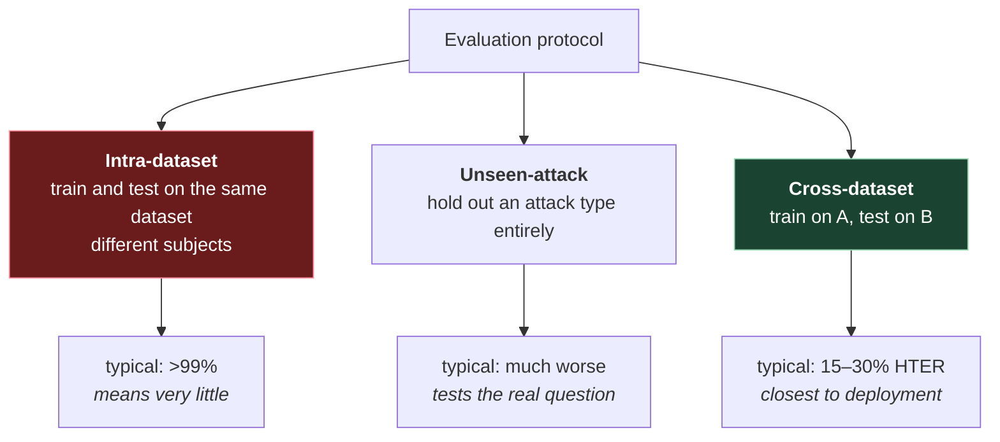

# 7. Datasets and protocols

In fingerprint matching, the dataset mostly determines *how hard* the problem is. In face
PAD, the dataset determines **what problem you solved at all** — because a model learns
the attacks it was shown and frequently nothing beyond them.

So the protocol matters as much as the number.

## 7.1 The datasets you'll see named

| Name | Scale | Attacks | Notable for |
|---|---|---|---|
| **Replay-Attack** (Idiap, 2012) | 50 subjects | print, replay | The classic. Small, old, largely saturated. Source of the HTER convention |
| **CASIA-FASD** (2012) | 50 subjects | print, cut-photo, replay | Multiple capture qualities. Old but still used for cross-dataset pairs |
| **MSU-MFSD** (2014) | 35 subjects | print, replay | Mobile capture |
| **OULU-NPU** (2017) | 55 subjects, 4950 videos | print, replay | ⭐ **Four explicit protocols** testing different generalisation axes — §7.3. Six mobile front cameras, three sessions |
| **SiW** (2018) | 165 subjects | print, replay | Pose, illumination and expression variation |
| **CelebA-Spoof** (2020) | 10,177 subjects, 625,537 images | print, cut paper, replay, **3D paper mask** | ⭐ Largest public. 43 attributes — 40 on live images, 3 on spoof |
| **CASIA-SURF** (2019) | 1000 subjects | print, cut | Multi-modal: RGB + depth + IR |
| **WMCA** (2019) | 72 identities, 1941 videos | ~80 PAIs in 7 categories: print, replay, funny glasses, fake head, rigid mask, **flexible silicone mask**, paper mask | ⭐ The one with silicone. Four channels: colour, depth, IR, thermal |

Two of these deserve their stars explained.

**CelebA-Spoof** is the one that made data scale a non-excuse. Its size and annotation
richness let you slice results by illumination, environment, and attack medium instead of
reporting one number.

**WMCA** matters because its ~80 attack instruments span seven categories including
**rigid masks, flexible silicone masks and fake heads** — the categories file 03's table
showed almost every cue failing on. It also carries depth, infrared and thermal alongside
colour, so it's the set for testing whether extra channels earn their hardware.

Note the distinction CelebA-Spoof's size can hide: it does contain a **3D paper mask**
class, but a paper mask is a rigid, flat-ish, matte artefact. A **flexible silicone** mask
is a different problem — real geometry, tunable reflectance. Evaluating on paper masks
tells you very little about silicone, and only WMCA in this list has both.

## 7.2 The three protocol families

This is the part to internalise. The same model, same weights, produces wildly different
numbers depending on which of these you run.

**Intra-dataset.** Train and test split by subject within one dataset. Same cameras, same
lighting rigs, same printers, same screens. Numbers above 99% are routine and tell you
almost nothing about deployment — the model may have learned "this dataset's replay
device" rather than "replay".

**Unseen-attack.** Hold out an entire attack type from training, test on it. Directly asks
the question that matters: does this generalise beyond what it was shown? Results drop
sharply, which is why fewer papers lead with it.

**Cross-dataset.** Train on dataset A, test on B. The standard shorthand is `C→R` (CASIA
to Replay-Attack) or `O→M`. This is the closest public proxy for deployment, because a new
dataset means new cameras, new subjects, new attack instruments — the same shift you get
when you ship.

> ⚠️ **Reading results tables.** If a paper reports only intra-dataset numbers, it has not
> demonstrated generalisation. This is not a subtle criticism — it's the difference between
> "works" and "works here". Look for the cross-dataset table; if there isn't one, ask why.

## 7.3 OULU-NPU's four protocols — a model worth copying

OULU-NPU is worth knowing in detail because its protocol design is unusually honest. Each
protocol isolates one axis of variation:

| Protocol | Holds out | Question it asks |
|---|---|---|
| **1** | Illumination and background | Does it survive a new environment? |
| **2** | Attack instruments (different printers/displays) | Does it survive a new *PAI species*? |
| **3** | Camera (leave-one-camera-out) | Does it survive new hardware? |
| **4** | All three at once | Does it survive deployment? |

Protocol 4 is the hard one, and the gap between a model's Protocol 1 and Protocol 4 numbers
is a decent single measure of how much it has actually learned versus memorised.

The idea generalises: **when you build your own evaluation, split along the axis you expect
to shift in production.** If you'll deploy on phones you've never tested, split by device.
If new attack media will appear, split by PAI species. A random split tests nothing you're
worried about.

## 7.4 Building your own evaluation set

Public benchmarks won't match your deployment. At some point you need your own, and there
are traps.

**You need both classes, and both are hard.**

- *Bona fide* is easy to collect at scale — real users generate it. But collecting it from
  production means you only have captures that **already passed** your existing system,
  which biases the set.
- *Attacks* have to be manufactured, and the quality of your manufacturing sets the
  difficulty. Attacks made half-heartedly by an engineer in an afternoon are easier than
  what a motivated fraudster produces, and a model that catches yours may catch nothing
  real.

**Label by PAI species, not just spoof/genuine.** File 02 §2.2: you need per-species APCER,
which requires per-species labels from the start. Retrofitting them is miserable.

**Beware "the incumbent said it was fine" as ground truth.** If you label a set as bona
fide because your existing vendor passed it, you've inherited that vendor's blind spots —
any attack that fooled them is now labelled genuine in your test set. It's a *useful*
baseline for measuring disagreement, but it is not ground truth, and the difference matters
when you report.

**Capture quality distribution should match production.** A test set of well-lit,
well-framed images will overstate your performance. Include the dim, the blurry, the
badly-framed, in the proportions you actually see.

> **Teacher's aside.** There's a tempting shortcut: take a folder of production selfies,
> assume they're all genuine, and measure the rejection rate. That gives you a real and
> useful **BPCER** — genuine users you'd block — and it's often eye-opening. But it gives
> you **no APCER at all**, because there are no attacks in it. A model that accepts
> everything scores perfectly on such a set. Half a measurement is fine as long as you say
> which half.

## 7.5 What to record per sample

If you're building an evaluation set, capture more than the label:

| Field | Why |
|---|---|
| Ground-truth class | Obvious |
| **PAI species** | Per-species APCER |
| Capture device / model | Cross-device analysis |
| Lighting condition | Where failures concentrate |
| Subject id | Prevents subject leakage across splits |
| Distance / framing | Correlates with detector confidence |

**Subject id matters more than it looks.** If the same person appears in both train and
test, the model can identify *them* rather than learn liveness, and your numbers inflate.
Every public benchmark splits by subject for this reason.

---

## Check yourself

1. Why does intra-dataset accuracy above 99% tell you little?
2. What does `C→R` mean, and why is it a better proxy for deployment?
3. OULU-NPU Protocol 4 holds out three things at once. Which, and why is the gap from
   Protocol 1 informative?
4. You collect production selfies that all passed your current vendor. Which metric can
   you compute, and which can you not?
5. Why must an evaluation set be split by subject rather than randomly?
6. Your threat model includes silicone masks. Which listed dataset would you look at, and
   what does it mean if you've only ever evaluated on CelebA-Spoof?

(Answers in [`11-exercises.md`](11-exercises.md).)
