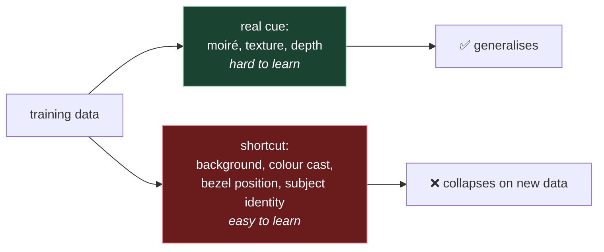

# 8. Why it doesn't generalise

⭐ The most important file after the metrics one. Everything above works in a lab. This is
about why it stops working when you ship, and what that implies for how you evaluate.

## 8.1 The central fact

> A face PAD model trained on one dataset and tested on another typically loses most of
> its apparent accuracy. Intra-dataset results above 99% routinely become 15–30% HTER
> cross-dataset.

That's not a bad model or a bad paper. It's the standing condition of the field, and the
reason has a name.

## 8.2 Domain shift

The model learns `P(attack | image)` on its training distribution. Deployment has a
different distribution. Everything that changes between them is a shift:

| Axis | Training | Deployment |
|---|---|---|
| **Camera** | A few lab devices | Hundreds of phone models, each with its own ISP, sharpening and noise profile |
| **Lighting** | Controlled rigs | Offices, cars, bedrooms at midnight |
| **Attack medium** | The printers and screens the researchers owned | Whatever a fraudster has |
| **Subjects** | Often young, often one region | Everyone |
| **Framing** | Standardised | Arm's length, tilted, partially cropped |
| **Compression** | Usually lossless or near | JPEG at whatever quality the app chose |

The **camera** row is the biggest single contributor and the least intuitive. A modern
phone camera doesn't hand you sensor data — it hands you the output of an image signal
processor doing denoising, sharpening, tone mapping and often face-aware beautification.
Those operations *alter exactly the micro-texture statistics* (file 03 §3.2) that the
model relies on. Two phones photographing the same printed photo produce genuinely
different texture signatures.

**Compression** is worth flagging separately: JPEG artefacts are periodic, and periodic
artefacts are what the frequency cue (file 03 §3.3) keys on. Heavy compression can mask
moiré, or manufacture something that resembles it.

## 8.3 Shortcut learning

The deeper problem. A network minimises training loss by any available means, and datasets
contain unintended correlations that are *easier* to learn than the real signal.

Concretely, if every replay attack in a dataset was captured on the same tablet, held at
roughly the same distance, in the same room, the model can achieve near-perfect training
accuracy by learning **"that room, that distance"** rather than **"a screen"**.



The model isn't cheating; it's doing exactly what you asked. The dataset made the shortcut
available and the loss function made it optimal.

Symptoms in the wild:

- Near-perfect intra-dataset, poor cross-dataset — the signature
- Accuracy that varies sharply by capture device
- Confident wrong answers on captures that look fine to a human
- Wildly different behaviour on the same face in two rooms

> **Teacher's aside.** This is why the auxiliary-supervision idea (file 03 §3.5, file 06
> §6.4) keeps recurring. A binary label can be satisfied by any shortcut. A **depth map**
> or an **FFT spectrum** target can only be satisfied by features that actually encode
> geometry or frequency — the shortcuts don't help you reconstruct them. You're
> constraining *how* the network is allowed to be right. That's the main structural defence
> against shortcut learning, and it's why those papers report better cross-dataset numbers
> despite similar intra-dataset ones.

## 8.4 Why more data alone doesn't fix it

The instinctive fix is a bigger dataset. It helps, but less than you'd hope, for two
reasons:

**Attacks are adversarial and open-ended.** Face *recognition* has a closed problem
definition — faces are faces, and more faces means better coverage. Attacks are invented
by people who read your papers. Every dataset is a snapshot of attacks known when it was
collected. There is no "enough".

**Collection bias compounds.** A large dataset gathered by one team with one protocol is
large *and* correlated. CelebA-Spoof is orders of magnitude bigger than Replay-Attack, and
cross-dataset generalisation from it is better but nowhere near solved.

## 8.5 What actually helps

Roughly in order of value per unit effort:

| Approach | What it does | Cost |
|---|---|---|
| **Richer supervision** | Depth maps, FFT, pixel-wise labels instead of one bit | Retraining; needs the annotations |
| **Domain generalisation methods** | Explicitly penalise domain-specific features during training | Research-grade complexity |
| **Aggressive augmentation** | Simulate camera/compression/lighting variation | Cheap. Do this regardless |
| **Sensor diversity** | NIR, depth — cues that shift less across devices | Hardware |
| **Ensembling across cue types** | Different models exploiting different physics fail differently | Latency, and see §8.6 |
| **On-domain calibration** | Retune thresholds on your own traffic | Cheap, and skipped far too often |
| **Capture-quality gating** | Only classify frames worth classifying | Cheap. Large real-world effect |

The last two are unglamorous and are usually where the biggest practical wins are, because
they don't require retraining anything.

## 8.6 Ensembling is not automatically better

Combining models feels like free robustness. It isn't, and this is worth being precise
about.

An ensemble helps when its members **fail independently** — different cues, different
failure modes. It hurts when members are correlated in their *false rejects*, because
combining under a majority-style rule accumulates their union.

Consider three models on genuine users, where model C is much stronger:

```
model A false-reject rate: 26%
model B false-reject rate: 19%
model C false-reject rate:  4%

majority-of-three:        ~13%
```

The ensemble is **three times worse than its best member** on false rejects, because A and
B outvote C on every capture they both dislike. Averaging strong and weak members doesn't
average their quality — under a voting rule it can concentrate their errors.

Two lessons:

1. **Measure the ensemble, don't assume it.** Compare it against each member alone on the
   same data. If it doesn't beat the best member, it isn't earning its latency.
2. **Weak members need a reason.** A model only belongs in the ensemble if it catches
   something the others miss — which is an APCER question, and you can't answer it without
   labelled attacks. If you only have genuine data, you can see the false-reject cost of
   adding a model but not its security benefit, and you should say so rather than guess.

Note also that a majority rule over an *even* number of members is subtly odd: "at least
half" of two is one, which is the same as "any". Ensemble size and voting rule have to be
chosen together.

## 8.7 What to do about all this

A practical stance:

1. **Assume the published number does not transfer.** Treat it as an upper bound.
2. **Measure on your own traffic before launch.** Even genuine-only data gives you BPCER,
   which is the number your support team will feel.
3. **Get some attacks, even imperfect ones.** A small, honestly-labelled set beats none.
   Without it you have no APCER and no basis for choosing between models.
4. **Recalibrate thresholds on-domain.** Vendor defaults were chosen on someone else's
   population.
5. **Gate on capture quality first.** Cheapest real improvement available.
6. **Expect to retrain or replace.** This is a moving target; treat the model as a
   component with a shelf life, not a solved dependency.
7. **Watch production drift.** Reject rate by device model and by hour of day will show you
   a problem long before anyone files a ticket.

---

## Check yourself

1. What is domain shift? Name the axis that usually matters most, and why it's not obvious.
2. Explain shortcut learning to someone who knows no ML. Why isn't the model "cheating"?
3. How does depth or FFT supervision defend against shortcut learning?
4. Why doesn't a much larger dataset solve this the way it does for face recognition?
5. Three models with false-reject rates 26%, 19% and 4% are combined by majority vote and
   the result is 13%. Explain how it can be worse than the best member.
6. You have 1000 genuine production captures and no attacks. Which metric can you compute,
   what decision can it support, and what must you refuse to conclude?

(Answers in [`11-exercises.md`](11-exercises.md).)
