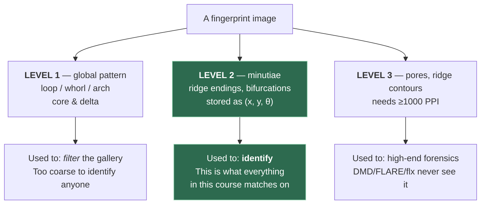
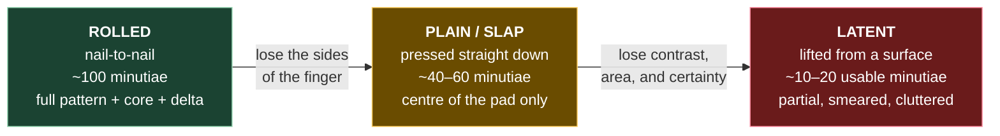

# 1. What a fingerprint actually is

## 1.1 The physical thing

Your fingertip skin isn't flat. It has raised lines (**ridges**) and the gaps between
them (**valleys**). When you press your finger on something, the ridges touch and the
valleys don't. That's why an inked print or a sensor image looks like a topographic map
of alternating dark and light lines.

Two facts make this useful for identification:

1. **Uniqueness.** The exact arrangement of ridges is determined by random stresses in
   fetal skin development, not by genetics. Even identical twins differ. This has never
   been *proven* mathematically, but it has ~120 years of forensic practice behind it.
2. **Permanence.** Ridge structure is set before birth and stays stable for life
   (barring scars). Cuts heal back to the same pattern unless they go deep.

> **Teacher's aside.** People often assume fingerprints are unique the way DNA is unique.
> Not quite. The claim that survives scrutiny is narrower: *the probability that two
> different fingers produce prints that a good matcher would confuse is very small.*
> That's a statement about the matcher too, not just about skin. Keep this in mind when
> we get to error rates in file 02 — the numbers there are the honest version of "unique."

## 1.2 Three levels of detail

This is standard forensic vocabulary. You'll see "Level 1/2/3" in papers constantly.



The one thing to take from that diagram: **Level 2 is the whole game.** Level 1 narrows the
search, Level 3 is a luxury, and all three repos in this course live entirely at Level 2.

Here's the vocabulary in one picture — the three Level-1 patterns with their population
frequencies, the core and delta, and the Level-2 minutiae types underneath:


<sub>Source: [Fingerprint Patterns and Minutiae Patterns](https://commons.wikimedia.org/wiki/File:Fingerprint_Patterns_and_Minutiae_Patterns.png), Wikimedia Commons, CC BY-SA 4.0. Note that of the nine minutiae types shown, most matchers store only **ridge ending** and **bifurcation** — see §1.2 Level 2 below for why.</sub>

### Level 1 — the global pattern

Zoom out. The ridges form a few recognisable overall shapes:

- **Loop** (~60–65% of fingers) — ridges enter from one side, curve around, exit the same side
- **Whorl** (~30%) — ridges form a circular or spiral pattern
- **Arch** (~5%) — ridges enter one side and exit the other, rising in the middle

Level 1 also includes two special points called **singular points**:

- **Core** — the centre of the innermost curving ridge. The "eye of the storm."
- **Delta** — a point where three ridge flows meet, forming a triangle.

#### The three patterns are one family, counted by singular points

Those three shapes look like three unrelated pictures. They aren't. **The only thing that
separates them is how many core–delta pairs the finger has.**

| Pattern | Cores | Deltas | Pairs |
|---|---|---|---|
| **Arch** (plain) | 0 | 0 | 0 |
| **Loop** | 1 | 1 | 1 |
| **Whorl** | 2 | 2 | 2 |

```
   ARCH                  LOOP                    WHORL
   0 pairs               1 pair                  2 pairs

  ───────────         ────╮                   ╭─────╮
  ──────────          ───╮╰──╮ ← core        ╭╯ ╭─╮ ╰╮ ← core(s)
  ─────────           ──╮╰───╯               │ ╭╯ ╰╮ │
   (ridges just         ╰────                ╰─╯   ╰─╯
    rise and cross)      ▲ delta            ▲         ▲
                                          delta     delta
```

So the ladder runs **arch → loop → whorl**, adding one pair each step. An arch isn't a
"minimal whorl" — it's the minimal member of the whole family, and its nearest neighbour
is the *loop*.

#### Real examples

ASCII only goes so far. These are real prints from Wikimedia Commons — click through to
each file page for its author and licence.

| Arch | Tented arch | Loop | Whorl |
|:---:|:---:|:---:|:---:|
| [](https://commons.wikimedia.org/wiki/File:Fingerprint_Arch.jpg) | [](https://commons.wikimedia.org/wiki/File:Tented_arch.jpg) | [](https://commons.wikimedia.org/wiki/File:Fingerprint_Loop.jpg) | [](https://commons.wikimedia.org/wiki/File:Fingerprint_Whorl.jpg) |
| 0 pairs | delta, but no recurve | 1 pair | 2 pairs |

**Do this before reading on:** open the loop and the whorl side by side and try to trace a
single ridge with your finger on the screen. On the loop you can enter from one edge,
round the core, and leave by the same edge. On the whorl you'll find yourself going in
circles — the ridge closes on itself and never exits. That difference *is* the
classification. Everything else is bookkeeping.

Whorl subtypes, if you want to see how the family splits:

- [Plain whorl](https://commons.wikimedia.org/wiki/File:Fingerprint_-_Plain_Whorl.jpg) —
  concentric circuits, two deltas
- [Central pocket loop whorl](https://commons.wikimedia.org/wiki/File:Fingerprint_-_Central_Pocket_Loop_Whorl.jpg) —
  a loop with a small whorl at its centre
- [Double loop whorl](https://commons.wikimedia.org/wiki/File:Double-Loop_Whorl.jpg) —
  two interlocking loops. The clearest evidence that a whorl is "two loops," not "a big arch"

And two overview charts worth a glance:
[classes](https://commons.wikimedia.org/wiki/File:Fingerprint_classes.jpg) ·
[patterns + minutiae together](https://commons.wikimedia.org/wiki/File:Fingerprint_Patterns_and_Minutiae_Patterns.png)

#### Why singular points always come in pairs — the Poincaré index

This is the part that makes the classification feel inevitable rather than arbitrary, and
it connects directly to the **orientation field** (file 03 §3.3).

Walk a small closed circle around a point and add up how much the ridge orientation
rotates as you go round:

| What you walked around | Total rotation |
|---|---|
| an ordinary point | **0°** |
| a **core** | **+180°** |
| a **delta** | **−180°** |

That quantity is the **Poincaré index**. Sum it over the whole fingertip and you get
**zero — always, for every finger that has ever existed.** Cores and deltas can only be
created or destroyed *together*.

Check it against the table:

- Arch: `0` ✓
- Loop: `+180 − 180 = 0` ✓
- Whorl: `2(+180) + 2(−180) = 0` ✓

There is no such thing as a half-whorl, or a finger with a lone delta. The pattern classes
aren't forensic convention — they're an enumeration of the only topologically possible
configurations. That's why the classification has survived 120 years essentially unchanged.

#### The blurry boundary, and the full list

There *is* a real continuum, but it sits at the **arch↔loop** boundary, not arch↔whorl:

- **Plain arch** — ridges cross the finger with a gentle rise. No delta, no recurve.
- **Tented arch** — a sharp upthrust, and *a delta appears* — but still no ridge that
  fully turns back on itself.
- **Loop** — a ridge genuinely recurves.

Tented arch is the awkward middle, and human examiners genuinely disagree on borderline
cases. At the other end, a whorl is better understood as **two loops** than as an
exaggerated arch — the standard classes literally include a *double loop whorl*, and a
*central pocket loop whorl* is a loop with a small whorl at its centre.

The full **Henry system** set is 8:

> plain arch · tented arch · radial loop · ulnar loop ·
> plain whorl · central pocket loop whorl · double loop whorl · accidental whorl

**Radial vs ulnar** describes which way a loop opens — radial toward the thumb, ulnar
toward the little finger. Note this depends on *which hand* the finger is on, so you
cannot determine it from an image alone without knowing the hand and whether the sensor
mirrors its output. Ulnar loops are far more common than radial.

**What Level 1 is good for:** narrowing the search. If your query is a whorl, you can
skip all the arches in the database. It is *not* enough to identify anyone — millions
of people have loops.

**Why you care for the three repos:** directly, you don't — **none of them classifies
patterns.** Level 1 is far too coarse for identification, and modern systems simply
compare against everything rather than pre-filtering a physical filing cabinet.

It comes back in one place, though: **cores and deltas are the singularities of the
orientation field**, so any pose estimator is implicitly hunting for them. When FLARE's
`GRIDNET4` votes for a fingerprint's centre (file 07 §7.4), it is doing a learned,
soft version of "find the core." The vocabulary returns even though the classification
doesn't.

### Level 2 — minutiae

This is the level that matters most, and it's the level DMD is built on.

Zoom in. Follow a single ridge with your eye. Eventually one of two things happens:

- **Ridge ending** — the ridge just stops
- **Bifurcation** — the ridge splits into two

These events are called **minutiae** (singular: *minutia*, from Latin "small detail").
A full fingerprint has roughly 30–100 of them. Their positions and orientations,
relative to each other, are what forensic examiners and most algorithms compare.

**A minutia is stored as three numbers:**

```
(x, y, θ)
```

- `x` — horizontal position in the image
- `y` — vertical position
- `θ` — the *direction* of the ridge at that point

The direction matters: a ridge ending pointing "up" is a different feature from one
pointing "down," even at the same location. Convention: θ points *along the ridge, away
from the ridge body* for an ending, and along the bisector for a bifurcation.

> ⚠️ **Coordinate conventions bite everyone.** Different tools disagree about whether y
> grows up or down, and whether θ is measured clockwise or counter-clockwise. The DMD
> README pins this down explicitly:
> - x increases **right**
> - y increases **down** (standard image coordinates)
> - θ measured from the +x axis with **clockwise positive**
>
> If you ever feed DMD minutiae from a different extractor and get garbage scores, this
> is the first thing to check. It is *the* classic bug in this field.

Other minutia types exist (lakes, spurs, crossovers, islands) but almost every algorithm
collapses everything to ending-or-bifurcation, or even ignores the type entirely.
**DMD ignores type** — it only uses `(x, y, θ)`.

### Level 3 — pores and ridge shape

Zoom in further. On the crest of each ridge are **sweat pores**, spaced every ~0.5mm.
The precise edge contours of ridges are also distinctive.

Level 3 needs at least 1000 PPI imaging to be visible. It's used in high-end forensic
work. Most systems, including DMD, work at 500 PPI and never see it.

## 1.3 PPI — why 500 keeps appearing

**PPI = pixels per inch**, the resolution of the fingerprint image.

500 PPI is the FBI/ANSI standard for law enforcement and the de facto default everywhere.
At 500 PPI, a ridge-to-ridge period is about 9–10 pixels, which is enough to see minutiae
clearly but not pores.

This is why almost every fingerprint codebase has a line like:

```python
self.scale = self.img_ppi * 1.0 / 500 * self.tar_shape[0] / self.middle_shape[0]
```

(that's `DMD/models/dataloader_densemnt.py:38`)

It's rescaling whatever resolution your images came in at, to the resolution the network
was trained at. If you feed a 1000 PPI image without telling the code, every ridge is
twice as wide as the network expects and accuracy collapses.

> **Check yourself:** the `N2NLatent` filenames in `DMD/datasets/N2NLatent_genuine_pairs.txt`
> contain strings like `1200PPI` and `1106PPI`. What does that tell you about the
> preprocessing that must have happened before those images entered the pipeline?

## 1.4 The types of fingerprint image — this is the crux

Not all fingerprint images are equal, and the *entire difficulty* of DMD's problem comes
from this table. Read it slowly.

| Type | How it's captured | Quality | Typical use |
|------|-------------------|---------|-------------|
| **Rolled** | Finger inked and rolled nail-to-nail on a card, or equivalent scanner | Excellent, large area, ~100 minutiae | Police booking, database enrolment |
| **Plain / slap** | Finger pressed straight down, not rolled | Good, smaller area | Phone unlock, border control, live scanners |
| **Latent** | The invisible smudge you leave on a glass, dusted with powder and photographed | **Terrible.** Partial, blurry, distorted, background clutter, maybe 10–20 usable minutiae | Crime scenes |

The same three types, drawn as the trade they actually represent — every step down this
diagram costs you ridge area, and ridge area is minutiae, and minutiae are evidence:



A rolled-vs-rolled match is close to a solved problem. Accuracy is >99% and has been for
years.

**Latent-vs-rolled is not solved.** A latent print might be:

- 15% of a fingertip
- overlapping with three other prints
- on a patterned surface, so the "background" has lines that look like ridges
- smeared, so the ridges are non-linearly distorted
- so faint that a human examiner has to *guess* where minutiae are

DMD's paper title is *"Latent Fingerprint Matching via Dense Minutia Descriptor."*
The word **latent** is the whole point. Every design decision in that repo — the
foreground mask, the score normalisation by overlap area, the per-minutia local patches —
is a response to "the query print is a partial smudge."

Notice this in the code, at `DMD/evaluate_mnt.py:166`:

```python
THRESHS = {0: 0.2, 1: 0.002, 2: 0.5} # 0 for plain, 1 for rolled, 2 for latent
```

The system has *different mask thresholds per image type*, and the evaluation call
passes `f2f_type=(2, 1)` — meaning "search image is a latent (2), gallery image is a
rolled (1)." The asymmetry is baked in.

## 1.5 Query / search vs gallery — the vocabulary of a database

- **Gallery** (also *reference*, *enrolled set*, *background*) — the database of known
  prints you're searching against. Usually rolled, good quality.
- **Query** (also *search*, *probe*, *latent*) — the print you're trying to identify.

You will see all six words used interchangeably in the literature. The DMD codebase uses
**query** in the dataset folder layout and **search** in the feature folders — for the
same thing. (`DMD/evaluate_mnt.py:433` maps `.../gallery/...` to the gallery folder and
everything else to the search folder.) Yes, that's mildly annoying. No, it's not a bug.

## 1.6 Datasets you'll see named

| Name | What it is |
|------|-----------|
| **NIST SD4** | 2000 pairs of rolled prints. Old, classic verification benchmark. |
| **NIST SD14** | 27,000 rolled pairs. DMD's weights were **trained** on this. |
| **NIST SD27** | 258 latent prints + their mated rolled prints. *The* latent benchmark. Small but brutal. |
| **N2N (Nail-to-Nail)** | NIST challenge dataset with many capture devices; the `N2NLatent` file in the repo is its latent subset. |
| **FVC 200x** | Fingerprint Verification Competition sets. Plain prints from live sensors. |

A thing worth internalising: **SD27 has only 258 latents.** When a paper reports "Rank-1
accuracy 65.7%" on SD27, that's 170 correct out of 258. A single extra hit moves the
number by 0.4%. Treat small differences between methods on SD27 with suspicion.

---

## Check yourself

1. In your own words: what is a minutia, and why do we store three numbers for it rather than two?
2. Which of Level 1 / 2 / 3 does DMD use? Which does it ignore, and why is that fine?
3. Why is latent-to-rolled matching harder than rolled-to-rolled? Give three distinct reasons.
4. You get a fingerprint image at 1000 PPI and pass it to DMD with `img_ppi: 500` left in
   the config. Describe what goes wrong, mechanically.
5. What's the difference between a *core* and a *delta*?

(Answers in `12-exercises.md`.)
