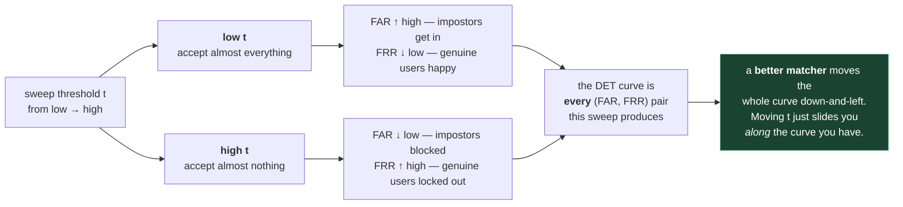

# 2. How matching is measured

This file has more jargon per square inch than any other. But once you have it, you can
read the results table of literally any biometrics paper. It's worth the hour.

## 2.1 A matcher is a function that outputs one number

Strip away everything. A fingerprint matcher is:

```
match(print_A, print_B)  →  a similarity score, a real number
```

Higher score = more likely the same finger. That's it. The score has **no inherent
meaning** — it's not a probability, it's not a percentage. DMD's scores can exceed 1.0
when score normalisation is on. All that matters is the **ordering** the scores induce.

Everything below is about how to turn "a pile of scores" into "a number I can put in a paper."

## 2.2 Genuine vs impostor

- **Genuine pair** (also *mated pair*) — two prints from the **same** finger. Should score high.
- **Impostor pair** (also *non-mated*) — two prints from **different** fingers. Should score low.

You compute scores for every pair you can, then look at the two distributions:

```
        impostor scores          genuine scores
             ▁▄█▇▃▁                  ▁▂▅█▆▂▁
    ─────────────────────────────────────────────►  score
                      ↑
                   threshold
```

A perfect matcher separates them completely. A real matcher has overlap. **All the
metrics below are different ways of describing that overlap.**

In this repo, the genuine pairs are given to you explicitly in a text file:

```
query_filename, gallery_filename
```

and — this is the important convention — **everything else is assumed impostor.**
From `DMD/README.md`: *"All remaining combinations are considered impostor pairs by default."*
The code builds a `target_matrix` of 0s, puts 1s at the genuine positions
(`DMD/evaluate_mnt.py:585-587`), and that's the ground truth.

## 2.3 The two tasks: verification vs identification

These have *different* metrics, and mixing them up is the single most common confusion.

```mermaid
flowchart TD
    Q["probe print"]

    Q --> V["<b>VERIFICATION — 1:1</b><br/>'You claim to be Alice.<br/>Is this Alice's print?'"]
    Q --> I["<b>IDENTIFICATION — 1:N</b><br/>'Whose print is this?'"]

    V --> V1["ONE comparison<br/>against Alice's template"]
    V1 --> V2{"score > threshold t ?"}
    V2 -->|yes| VA["accept"]
    V2 -->|no| VR["reject"]
    V2 -.-> VM["<b>metrics:</b> FAR / FRR / TAR<br/>ROC, DET, EER, TAR@FAR<br/><i>a threshold is mandatory</i>"]

    I --> I1["N comparisons<br/>against the whole gallery"]
    I1 --> I2["sort by score, take the top k"]
    I2 --> IA["ranked candidate list<br/>→ human examiner"]
    I2 -.-> IM["<b>metrics:</b> Rank-1, Rank-k<br/>CMC curve<br/><i>no threshold needed</i>"]

    style VM fill:#264653,stroke:#8ecae6,color:#fff
    style IM fill:#4a2545,stroke:#e0aaff,color:#fff
```



The asymmetry worth remembering: **verification needs a threshold, identification doesn't.**
That single difference is why the two families of metric exist and why a paper reporting only
Rank-1 has told you nothing about whether the system can be deployed at a fixed FAR.

### Verification (1:1)

*"You claim to be Alice. Is this print Alice's?"*

One comparison, yes/no answer. Phone unlock. You need a **threshold**: score above it →
accept, below → reject.

### Identification (1:N)

*"Whose print is this?"*

Compare the query against every entry in the gallery, sort by score, look at the top of
the list. Crime scene work. No threshold needed if you just want a ranked list of
candidates for a human to review.

DMD's evaluation reports **both**, in `DMD/utils/get_eval_metric.py`:
`rank1_general()` is identification, `TAR_flatten()` is verification.

## 2.4 Verification metrics

Pick a threshold `t`. Two kinds of mistake are possible:

| | You accept | You reject |
|---|---|---|
| **Genuine pair** | ✅ correct | ❌ **False Reject** |
| **Impostor pair** | ❌ **False Accept** | ✅ correct |

From this:

- **FAR** — *False Accept Rate*. Fraction of impostor pairs scoring above `t`.
  "How often do I let the wrong person in?"
- **FRR** — *False Reject Rate*. Fraction of genuine pairs scoring below `t`.
  "How often do I lock out the right person?"
- **TAR** — *True Accept Rate* = `1 - FRR`. Fraction of genuine pairs correctly accepted.
- **TRR** — *True Reject Rate* = `1 - FAR`. Rarely used.

**The fundamental trade-off:** raise `t` and FAR goes down but FRR goes up. Lower `t` and
the reverse. You cannot improve both by moving the threshold — only by building a
better matcher.

> **The synonym problem.** The ISO standard calls these **FMR** (False Match Rate) and
> **FNMR** (False Non-Match Rate) instead of FAR and FRR. Strictly, FMR/FNMR describe
> the *comparison algorithm* and FAR/FRR describe the *whole system* including failures
> to capture an image at all. In practice papers use them interchangeably.
> `get_eval_metric.py` computes both spellings — `metrics.roc_curve` gives far/tar and
> `metrics.det_curve` gives fmr/fnmr. Same underlying numbers.

### ROC and DET curves

Since `t` is arbitrary, sweep it across all values and plot the resulting (FAR, TAR) pairs.

- **ROC curve** — TAR on the y-axis vs FAR on the x-axis. Up-and-to-the-left is better.
- **DET curve** — FNMR vs FMR, usually on log-log axes. Down-and-to-the-left is better.
  Biometrics prefers DET because the interesting action happens at tiny FMR values
  (1e-4, 1e-6) which a linear ROC axis squashes into nothing.


<sub>Source: [Example of DET curves](https://commons.wikimedia.org/wiki/File:Example_of_DET_curves.png), Wikimedia Commons, CC BY-SA 3.0.</sub>

Read that plot the way a biometrics person does. Both axes are error rates, so **lower and
further left is better**, and method 1 (red) beats method 2 (green) everywhere. The axes are
log-scaled, which is the entire point: on a linear ROC the whole region below FAR = 1% —
i.e. every operating point anyone deploys — would be compressed against the left edge and
you couldn't see the difference between a good matcher and a great one.



That last box is the idea the whole section is built on: **the threshold picks your operating
point, the matcher picks your curve.** No amount of threshold tuning improves both error
rates at once.

### TAR @ FAR — the number papers actually report

A whole curve is hard to put in a table, so you report one point on it:

> **TAR @ FAR = 0.1%** — "when I tune the threshold so only 1 in 1000 impostor pairs
> gets through, what fraction of genuine pairs do I still accept?"

Here it is in the code (`DMD/utils/get_eval_metric.py:29-35`):

```python
far, tar, thresholds = metrics.roc_curve(target.flatten(), score_mat.flatten())
far_01  = np.where(far <= 0.001)[0][-1]     # last index where FAR ≤ 0.1%
tar_01  = tar[far_01]
far_001 = np.where(far <= 0.0001)[0][-1]    # last index where FAR ≤ 0.01%
tar_001 = tar[far_001]
```

Read that carefully — it's a nice idiom. `roc_curve` returns FAR sorted ascending. It
finds the *last* position where FAR is still within budget, and reads off TAR there. That
is exactly "the best TAR I can get without exceeding the FAR budget."

Note `.flatten()`: the whole score matrix and the whole target matrix are flattened into
one long list of pairs. For SD27 that's 258 × 258 = 66,564 pairs, of which 258 are
genuine. **The impostor set is ~258× bigger than the genuine set.** That imbalance is
why FAR = 0.01% is meaningful — you have enough impostor pairs to measure it.

### EER — Equal Error Rate

The threshold where FAR == FRR. A single summary number, lower is better. It's convenient
but it corresponds to an operating point nobody actually uses (you almost never want
FAR = FRR in a real deployment). DMD doesn't report it; many other papers do.

> **A second implementation to compare against.** The `flx` repo implements all of this
> independently and more carefully — `flx/benchmarks/verification.py` has `threshold_for_fmr`,
> `false_match_rate`, `false_non_match_rate` and a neat one-sort EER, and
> `flx/benchmarks/identification.py` adds **open-set** identification metrics (FPIR/FNIR)
> that DMD never computes. Reading two independent implementations of the same definition
> is the fastest way to make it stick. That's file 08 §8.7.

## 2.5 Identification metrics

### Rank-1 accuracy

Compare the query to all N gallery entries, sort scores descending. **Rank-1 accuracy**
is the fraction of queries whose correct mate is at position 1.

**Rank-k accuracy** is the fraction whose correct mate is somewhere in the top k. Rank-10
matters operationally: a forensic examiner will happily eyeball 10 candidates, so a system
with high Rank-10 is useful even if Rank-1 is mediocre.

### CMC curve

**Cumulative Match Characteristic** — plot rank-k accuracy against k. It's monotonically
non-decreasing and reaches 1.0 at k = N. Here's the repo's implementation
(`DMD/utils/get_eval_metric.py:15-27`), which is worth reading line by line:

```python
def rank1_general(score_mat, target, dataname):
    all_rank = np.argsort(score_mat, axis=1)      # ascending score order per query
    rank_value = np.arange(1, 21)
    cmc = np.zeros(20)
    for i in range(20):
        rank = all_rank[:, -rank_value[i]:]        # top-k (last k of ascending = highest k)
        rank_target = np.take_along_axis(target, rank, axis=1)
        correct = np.any(rank_target, axis=1)      # is a genuine mate anywhere in top-k?
        cmc[i] = np.sum(correct) / len(correct)
    print(f"{dataname}: rank1 value is {cmc[0]*100:.2f}%")
    print(f"{dataname}: rank10 value is {cmc[9]*100:.2f}%")
    return cmc
```

The `-rank_value[i]:` slice is the trick — `argsort` is ascending, so the *last* k columns
are the *highest* k scores. `np.any` handles the case where a query has more than one
correct mate in the gallery.

> **Trap:** Rank-1 depends on gallery size. Rank-1 of 80% on a 258-print gallery is a
> much weaker result than 80% on a 100,000-print gallery. Always check N before comparing
> papers.

## 2.6 The score matrix — the central data structure

Everything above is computed from one object: an **N_query × N_gallery matrix** of scores.

DMD literally writes this to disk as a CSV, with row and column labels
(`DMD/evaluate_mnt.py:546-549`):

```python
df = pandas.DataFrame(score_matrix)
df.columns = gallery_imgs
df.index   = search_imgs
df.to_csv(self.score_file)
```

Landing at something like `TEST_DATA/NIST_SD27/DMD_6/score_matrix_relax.csv`.

This is a genuinely nice design: **feature extraction, scoring, and evaluation are three
separate stages with files in between.** You can re-run the metrics without re-running the
GPU work. When you experiment, this is where you'll poke.

Alongside it is the **target matrix**, same shape, 1 where genuine and 0 where impostor.
Score matrix + target matrix → every metric in this file.

## 2.7 Reading a results table

You're now equipped. A typical line from a latent fingerprint paper:

> Method X: **Rank-1 = 66.7%**, **TAR@FAR=0.1% = 61.4%** on NIST SD27 (N = 258)

Translation: *"Given a latent, the correct rolled print was the single top candidate
two-thirds of the time. And if I tune this as a yes/no system where only 1 in 1000
wrong-finger comparisons sneaks through, I correctly confirm 61% of true matches."*

Both numbers are needed. A method can have good Rank-1 and bad TAR@FAR if its scores are
well-ordered *within* a query but not comparable *across* queries — which, incidentally,
is exactly the problem that **score normalisation** exists to fix. More on that in file 06.

---

## Check yourself

1. Explain FAR and FRR to someone who has never heard of biometrics. No formulas.
2. Why does the DMD code flatten the entire score matrix before calling `roc_curve`?
   What would go wrong if it computed a separate ROC per query?
3. A system reports Rank-1 = 95%. Is that good? What's the first question you should ask?
4. I raise my threshold. What happens to FAR, FRR, and TAR? Which way does my operating
   point move along the ROC curve?
5. Look at `rank1_general`. Why is the slice `[:, -k:]` and not `[:, :k]`?
6. If SD27 has 258 latents and 258 gallery prints, how many impostor pairs are there?
   How many genuine? What's the smallest non-zero FAR you can even measure?

(Answers in `12-exercises.md`.)
