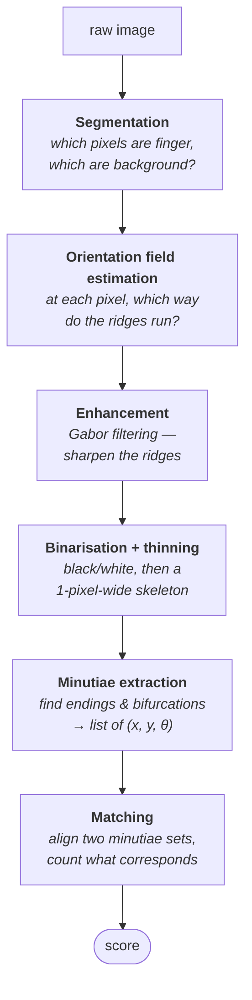
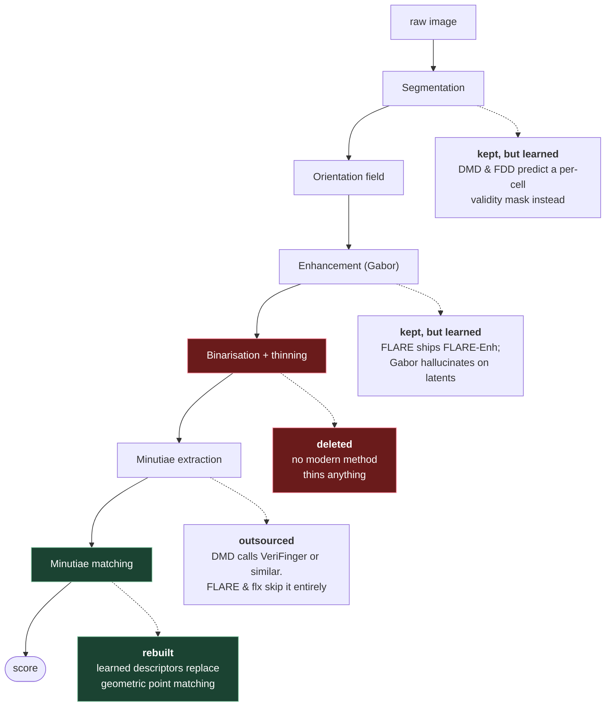
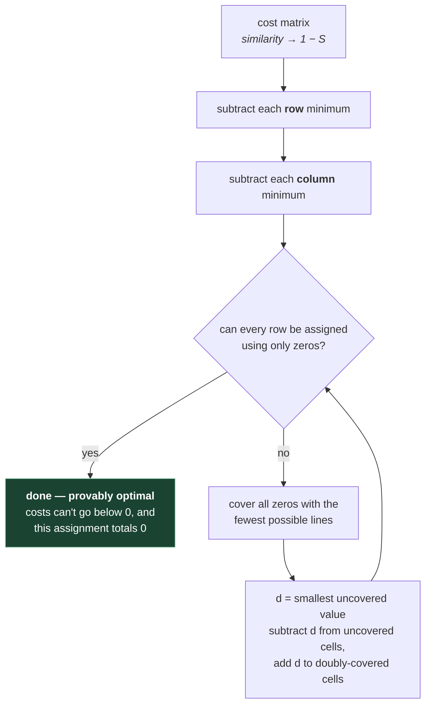

# 3. The classical pipeline

You need this file even though DMD replaces most of it. Two reasons:

1. DMD still *depends* on the classical minutiae extractor — it doesn't find minutiae
   itself at inference time, it's handed them.
2. DMD's matching stage is a direct descendant of classical minutiae matching, including
   one algorithm (relaxation labeling) lifted almost verbatim from a 2010 paper.

So: here's the 40-year-old pipeline that everything is built on or reacting against.

## 3.1 The stages



Every stage feeds the next, which is the pipeline's defining weakness: **an error at any
stage is inherited by every stage below it, and none of them can tell.** A wrong orientation
estimate produces a confidently enhanced image full of ridges that aren't there.

Here's the same pipeline coloured by what the modern repos actually do with it — this is the
map for the rest of the course:



DMD keeps the top box (someone else's job), skips the middle, and rebuilds the bottom.

## 3.2 Segmentation

Split the image into **foreground** (ridge-bearing skin) and **background**.

Classically: compute local variance in small blocks. Ridges alternate dark/light so
variance is high; empty background is flat so variance is low. Threshold it.

On latents this fails badly — the background *is* textured (wood grain, fabric, printed
paper), and the foreground is faint. This is why modern systems learn segmentation.

> **Where this reappears in DMD:** the network has a dedicated `foreground` head
> (`models/model_zoo.py:77-83`) ending in a `Sigmoid`, producing a soft per-cell
> validity value in [0,1]. It's segmentation, learned, at low resolution, per patch.
> It's arguably the most important single component for latent performance.

## 3.3 Orientation field

At every point, estimate the local ridge direction — an angle in [0°, 180°) (ridges have
no head or tail, so it's a direction modulo 180, not a full 360 vector; this "angular
doubling" trick trips people up constantly).

Classical method: gradients, squared and averaged over a block, then halve the angle.

The orientation field is used to (a) drive enhancement, (b) locate cores and deltas
(they're the singularities of this field), and (c) as a matching feature in its own right.

## 3.4 Enhancement with Gabor filters

A **Gabor filter** is a sinusoid multiplied by a Gaussian envelope. It responds strongly
to stripes of a particular *frequency* and *orientation*.


<sub>Source: [GaborFilter wParams](https://commons.wikimedia.org/wiki/File:GaborFilter_wParams.png), Wikimedia Commons, CC BY-SA 3.0.</sub>

Look at the kernel and the reason it suits fingerprints is obvious: it *is* a small patch of
striped texture. Convolving with it asks one question — "how much does this region look like
stripes at my orientation and my spacing?" Ridges answer loudly; random noise doesn't.

Fingerprint ridges are locally exactly that: parallel stripes with a known orientation
(from 3.3) and a known frequency (~1/9 cycles per pixel at 500 PPI). So you convolve each
image block with a Gabor filter tuned to that block's orientation and frequency. Noise
that doesn't look like correctly-oriented stripes gets suppressed; real ridges get sharpened.

This is genuinely elegant and it works well on decent images. On latents it amplifies
whatever the (often wrong) orientation estimate says, which can *hallucinate* ridges.
Hence the modern trend toward learned enhancement — that's what FLARE's `FLARE-Enh`
module does.

## 3.5 Binarisation, thinning, minutiae extraction

- **Binarisation** — threshold the enhanced image to pure black/white.
- **Thinning (skeletonisation)** — erode ridges down to 1-pixel-wide lines.
- **Crossing number** — for each skeleton pixel, walk its 8 neighbours in a circle and
  count transitions from white to black:

  | Crossing number | Meaning |
  |---|---|
  | 1 | **ridge ending** |
  | 2 | ordinary ridge pixel |
  | 3 | **bifurcation** |
  | 4+ | crossing / noise |

That's the whole classic minutiae detector. It's about six lines of code and it produces
enormous numbers of false minutiae on noisy images, which is why every real system has a
post-processing step that deletes spurious minutiae near the image border, near each
other, on short spurs, etc.

> **This is the step DMD does NOT do at inference.** Look at `dump_dataset_mnteval.py:26`:
>
> ```python
> mnts = fp_verifinger.load_minutiae(osp.join(mnt_gallery_folder, mnt_f))[:, :3]
> ```
>
> It *loads* minutiae from `.mnt` files produced by **VeriFinger**, a commercial SDK.
> The DMD README says as much: *"Extracted by VeriFinger or similar tools."*
>
> So DMD's evaluation assumes minutiae are given. The quality of that upstream extractor
> is a hidden variable in every reported number. (The paper also evaluates with minutiae
> from **FDD**, their own learned extractor, and notes that the score-normalisation flag
> behaves differently in that case.)
>
> The comment in that file is your escape hatch if you don't have VeriFinger:
> *"This can be loaded by other functions for specific minutia files; just make sure the
> first three columns of mnts are (x, y, theta)."*

## 3.6 Classical minutiae matching

Now you have two sets of minutiae, `{(x, y, θ)}` for query and gallery, and you must
score them. This is harder than it sounds, because of four problems:

1. **Unknown alignment.** The two prints were placed at different positions and rotations.
   You don't know the transform.
2. **Partial overlap.** Only part of the query overlaps the gallery print.
3. **Missing and spurious minutiae.** The extractor missed some, invented others.
4. **Non-linear distortion.** Skin is elastic. Pressing a finger stretches it
   non-uniformly, so no single rigid rotation+translation fits perfectly.

### Approach A: global alignment first

Guess the transform, apply it, then count minutiae that land close to each other.
Classic technique: **generalised Hough transform** — every possible pair (one query
minutia, one gallery minutia) votes for the transform that would align them; the transform
with the most votes wins. Robust but slow, and fails when overlap is small.

### Approach B: local descriptors, then consolidate

Don't align globally. Instead, describe each minutia by *its local neighbourhood* in a way
that's already rotation- and translation-invariant. Then:

1. Compare every query minutia's descriptor to every gallery minutia's descriptor
   → an N₁ × N₂ **local similarity matrix**.
2. Consolidate that matrix into one global score.

This is the **Minutia Cylinder-Code (MCC)** family (Cappelli et al., 2010), and **it is
exactly the structure DMD uses.** DMD replaces MCC's hand-designed descriptor with a
learned one, and keeps the consolidation machinery.

Worth being explicit about the shape, because it's the shape you'll see in the code:

```
                gallery minutiae →
              ┌─────────────────────┐
   query      │                     │
   minutiae   │   S[i][j] ∈ [-1,1]  │   N₁ × N₂ similarity matrix
      ↓       │                     │
              └─────────────────────┘
                        │
                        ▼
                  one scalar score
```

### Consolidation step 1: one-to-one assignment

A minutia can correspond to at most one minutia in the other print. So you want to pick
a set of pairs `(i, j)` maximising total similarity, with no `i` or `j` reused. That is
exactly the **assignment problem**, solved optimally by the **Hungarian algorithm**
(a.k.a. linear sum assignment, LSA) in O(n³).

In the DMD code: `evaluate_mnt.py` imports `linear_sum_assignment` from SciPy and, for
the GPU path, `batch_linear_assignment` from `torch_linear_assignment`. It converts
similarity to cost with `1 - S`, pads the matrix to square with a high cost (2), and
solves (`evaluate_mnt.py:298-312`).

### The assignment problem, worked through

That paragraph names the algorithm but doesn't show why you need one. This section does,
because the cost of this step is what makes DMD slow, and "slow" is half of the trade-off the
whole course is about.

#### Why one-to-one at all?

Not a technical convenience — physics. A minutia is a specific point of skin, and it cannot
correspond to two different points on the other finger.

Drop the constraint and the score stops meaning anything. One unusually "attractive" gallery
minutia would be claimed by twenty query minutiae at once, and impostor pairs would score
beautifully. **The one-to-one rule is what makes the score evidence rather than a popularity
contest.**

#### Greedy doesn't work

The obvious approach: take the best pair, cross out its row and column, repeat. It is not
optimal. Three minutiae are enough to break it:

```
similarities      g1     g2     g3
        q1       0.92   0.88   0.30
        q2       0.85   0.20   0.25
        q3       0.40   0.75   0.35
```

Greedy grabs **`(q1,g1) = 0.92`**, the largest number in the table. That consumes `q1` and
`g1`. Next best available is `(q3,g2) = 0.75`, leaving `q2` with `g3 = 0.25`.

> Greedy total: 0.92 + 0.75 + 0.25 = **1.92**

The optimum doesn't use `(q1,g1)` at all:

> Optimal: `q1→g2` (0.88) + `q2→g1` (0.85) + `q3→g3` (0.35) = **2.08**

Greedy fails because taking a cell doesn't just gain you its value — it **forecloses an entire
row and column**. `(q1,g1)` looks best in isolation, but it's the *only* good option `q2` has,
and stealing it strands `q2` on 0.25. You cannot see that by looking at one cell at a time.

#### But you can't try everything either

Pairing *n* against *n* gives *n!* assignments. At 100 minutiae — an ordinary rolled print —
that's about 10¹⁵⁷ permutations. Not a compute problem, an atoms-in-the-universe problem.

The Hungarian algorithm returns the guaranteed optimum in **O(n³)** — about a million
operations at n = 100. That gap, 10¹⁵⁷ down to 10⁶ with *no approximation*, is why the
algorithm is famous.

#### The one invariant it rests on

> **Subtract a constant from an entire row (or column) of the cost matrix, and the optimal
> assignment doesn't change.**

Why: every valid assignment uses **exactly one cell from each row and each column**. So
subtracting `c` from row *i* lowers the total of *every possible* assignment by exactly `c`.
All the totals shift together and their ranking is untouched.

That's licence to reshape the matrix freely — so reshape it to manufacture zeros. Converting
the similarities above to DMD's costs (`1 − S`):

```
costs             g1     g2     g3          row min
        q1       0.08   0.12   0.70          0.08
        q2       0.15   0.80   0.75          0.15
        q3       0.60   0.25   0.65          0.25
```

**Subtract each row's minimum:**

```
                  g1     g2     g3
        q1       0.00   0.04   0.62
        q2       0.00   0.65   0.60
        q3       0.35   0.00   0.40
     col min      0.00   0.00   0.40
```

**Subtract each column's minimum:**

```
                  g1     g2     g3
        q1       0.00   0.04   0.22
        q2       0.00   0.65   0.20
        q3       0.35   0.00   0.00
```

Now try to assign using **only zeros**. And here it doesn't work: `q1` and `q2` both have
their only zero in `g1`, so one of them must go unassigned. **Two of three — incomplete.**

This is the case a 2×2 example never shows you, and it's the reason the algorithm has more
than two steps.

#### When reduction isn't enough

Cover all the zeros with as few straight lines as possible — here **column `g1`** and
**row `q3`**, two lines. (Fewer lines than rows is exactly the signal that no complete
assignment exists yet.) Then:

- find the smallest **uncovered** value — `d = 0.04`, at `(q1,g2)`
- subtract `d` from every uncovered cell
- add `d` to every cell covered **twice** — here just `(q3,g1)`
- leave singly-covered cells alone

```
                  g1     g2     g3
        q1       0.00   0.00   0.18
        q2       0.00   0.61   0.16
        q3       0.39   0.00   0.00
```

New zeros appeared without destroying the old ones, and the invariant still holds. Try again:
`q2`'s only zero is `g1`, so `q2→g1`. That frees `g2` for `q1`, leaving `g3` for `q3`.

> **`q1→g2`, `q2→g1`, `q3→g3`** — true cost `0.12 + 0.15 + 0.65 = 0.92`

Which is exactly the optimum brute force found, and exactly the pairing greedy missed.

The bookkeeping closes too, which is a good way to convince yourself nothing was lost: the
total subtracted is `0.48` (rows) + `0.40` (columns) + `0.04` net (the adjustment) = **0.92**.
The reduced matrix scores the assignment at zero, so the true cost is everything you took out.



#### What DMD does with it

| Detail | Why |
|---|---|
| cost = `1 - S` | The solver **minimises**; you want to **maximise** similarity. `S ∈ [-1,1]`, so cost lands in `[0,2]` — non-negative, which the reduction argument requires |
| pad to square with cost **2** | Hungarian needs a square matrix but `N₁ ≠ N₂` in general. Cost 2 is the *maximum possible*, so dummy pairings are a last resort the solver takes only when a real minutia has nowhere left to go. Hence the `NaN`-then-replace-with-2 trick (file 05 §5.7) |
| O(n³) **per comparison** | Not per query — per *query-gallery pair*. A million-print gallery means a million Hungarian solves |

That last row is the entire cost side of the course's central trade-off, and why file 09 §9.1
puts DMD at the "most robust, least efficient" end.

> **The punchline.** The assignment problem *is* the correspondence problem — "which part of
> print A is which part of print B" — in its explicit, honest form. Which reframes the three
> repos: **DMD** solves it optimally on every comparison. **FLARE** pre-empts it, so that
> cell *i* corresponds to cell *i* by construction and there is no assignment problem left.
> **DeepPrint** dissolves it by pooling the structure away. One question, three answers, and
> the price of each is visible in that O(n³).

> **In practice** you'll call `scipy.optimize.linear_sum_assignment` rather than implement
> this. Modern SciPy uses a shortest-augmenting-path method (Jonker–Volgenant), not the
> textbook line-covering routine above — same optimal answer, better constants. The reduction
> walkthrough is here because it's the version you can hold in your head.

### Consolidation step 2: relaxation labeling

Here's the insight that makes minutiae matching work.

The assignment above treats each pair independently. But a *correct* set of pairs has a
property that a wrong set doesn't: **it's geometrically consistent.** If query minutiae
`a` and `b` are 30 pixels apart and 40° apart in orientation, then their true
correspondents `a'` and `b'` in the gallery must be ~30 pixels apart and ~40° apart too.

**Relaxation labeling** exploits this. Each candidate pair starts with a confidence
λ = its descriptor similarity. Then, iteratively:

> "Raise my confidence if the other high-confidence pairs are geometrically compatible
>  with me; lower it if they're not."

Formally, with compatibility `ρ(p, q)` between pairs p and q:

```
λ_p  ←  w · λ_p  +  (1 − w) · ( Σ_q ρ(p,q) · λ_q ) / (n − 1)
```

repeated a handful of times. Wrong pairs are geometrically random, so they get no support
from each other and decay. Correct pairs mutually reinforce.

DMD implements this verbatim in `relax_labeling()` inside `lsar_score_torchB`
(`evaluate_mnt.py:255-290`), with `w_R = 0.5` and `n_rel = 5` iterations, and three
compatibility terms:

- `D1` — difference in **pairwise distance** between the two minutiae
- `D2` — difference in **relative orientation** (θᵢ − θⱼ)
- `D3` — difference in **radial angle** (the direction from one minutia to the other,
  measured relative to the minutia's own orientation)

All three are invariant to global rotation and translation — which is the entire point.
You never had to estimate the alignment. Each is passed through a sigmoid to become a
soft 0-to-1 compatibility, and the three multiply together.

> This function is the most "classical" code in the whole repo. If you want to read one
> thing from the MCC paper, read its consolidation section — DMD's is a direct GPU port.

#### Relaxation labeling, worked through

Continue with the three pairs the Hungarian solve just produced — `q1→g2`, `q2→g1`,
`q3→g3` — and give the minutiae actual coordinates. Call the pairs `p1`, `p2`, `p3`:

| pair | query minutia `(x, y, θ)` | gallery minutia `(x, y, θ)` | starting λ |
|---|---|---|---|
| `p1` | q1 = (100, 100, 0°) | g2 = (200.00, 150.00, 20°) | 0.88 |
| `p2` | q2 = (140, 100, 30°) | g1 = (237.59, 163.68, 50°) | 0.85 |
| `p3` | q3 = (100, 160, 90°) | g3 = (260.00, 120.00, 200°) | 0.35 |

`p1` and `p2` are genuine: the gallery print is the query rotated by 20° and shifted.
`p3` is a **forced pairing** — `q3` has no true correspondent, but the assignment step must
assign everything, so it got stuck with `g3`. Its descriptor similarity of 0.35 isn't
absurd; locally, one ridge ending resembles another.

Now compute the three invariants **between pairs**:

| | D1 — distance | D2 — relative orientation | D3 — radial angle |
|---|---|---|---|
| ρ(`p1`,`p2`) | **0.00 px** | **0.0°** | **0.0°** |
| ρ(`p1`,`p3`) | 7.08 px | 90.0° | 136.6° |
| ρ(`p2`,`p3`) | 23.02 px | 90.0° | 153.5° |

Look at the first row. `q1`→`q2` are 40 px apart; `g2`→`g1` are also 40.00 px apart. Their
orientation difference is 30° in both prints. Their radial angles agree exactly. **Perfect
agreement, and note that nothing anywhere estimated the 20° rotation** — these quantities are
rotation- and translation-invariant by construction, which is the entire reason they were
chosen.

Row two and three are noise. The false pair agrees with nothing.

Push each `D` through a sigmoid and multiply the three together to get a soft compatibility
in [0,1] — for this example that lands around:

```
ρ(p1,p2) ≈ 0.98        ρ(p1,p3) ≈ 0.12        ρ(p2,p3) ≈ 0.03
```

Now run the update with `w = 0.5`, `n = 3`:

```
λ_p  ←  0.5 · λ_p  +  0.5 · ( Σ_{q≠p} ρ(p,q) · λ_q ) / 2
```

| | λ(`p1`) | λ(`p2`) | λ(`p3`) | ratio `p1`/`p3` |
|---|---|---|---|---|
| **start** | 0.880 | 0.850 | 0.350 | 2.51 |
| after iter 1 | 0.659 | 0.643 | 0.208 | **3.17** |
| after iter 2 | 0.493 | 0.485 | 0.128 | **3.84** |
| after iter 3 | 0.369 | 0.364 | 0.083 | **4.47** |

Two things to take from that table.

**The mechanism.** `p1` and `p2` prop each other up — each contributes ρ ≈ 0.98 of its
confidence to the other. `p3` receives almost nothing (0.12 and 0.03 of its neighbours'
confidence) because it agrees with nothing, so it decays fastest. Wrong pairs are
geometrically *random*, and random things don't corroborate each other. Correct pairs are
constrained by a shared rigid transform, so they can't help but agree.

**Absolute values fall; the *ratio* is what grows.** Every λ shrinks — the support term is an
average of neighbours whose λ are all below 1, so nothing can grow. Don't read that as
"confidence is dropping." The separation between real and false is more than 4× wider after
three iterations than it was at the start, and separation is the only thing that matters
(file 02 §2.1 — a matcher's scores are meaningful only in their ordering). This is also why
`n_rel = 5` and not 500: the ranking converges quickly, and iterating further just shrinks
every number toward zero.

### Consolidation step 3: pick top-k and average

Finally, sort the pairs by confidence, take the best `n_pair` of them, and average.
Why not average all of them? Because on a partial latent, most minutiae have no true
correspondent at all, and averaging in their (low, meaningless) scores would drown the
signal.

DMD picks `n_pair` *adaptively* based on how many minutiae are available
(`evaluate_mnt.py:317`):

```python
n_pair = min_pair + torch.round(sigmoid(min_number, mu_p, tau_p) * (max_pair - min_pair)).int()
```

with `min_pair=4, max_pair=12, mu_p=20, tau_p=0.4`. Read it as: *if the smaller print has
far fewer than 20 minutiae, use ~4 pairs; if far more than 20, use ~12; smoothly in
between.* A tiny latent fragment with 6 minutiae simply cannot supply 12 good pairs, and
forcing it to would inject noise.

Evaluated, that curve looks like:

| minutiae in the smaller print | `n_pair` |
|---|---|
| 6 | 4 |
| 12 | 4 |
| 20 | 8 |
| 30 | 12 |
| 60 | 12 |

Note it saturates at both ends. A rolled print with 60 minutiae still uses only 12 pairs —
the extra evidence is deliberately left on the table, because the top 12 are already enough
and pairs 13-60 are increasingly likely to be junk.

#### The efficiency trick, worked through

"Sort by confidence and take the top `n_pair`" is *not quite* what the code does, and the
difference is the subtlest idea in the whole scoring path (`evaluate_mnt.py:281-285`):

```python
efficiency = lambda_t / torch.clamp(scores, min=1e-6)
_, sorted_indices = torch.sort(efficiency, dim=1, descending=True)
lambda_t_sorted = torch.gather(lambda_t, 1, sorted_indices)
```

It ranks by **efficiency** — post-relaxation confidence *divided by* the original descriptor
similarity — then sums the **λ** values. So the question being asked isn't "which pairs look
best?" but **"which pairs gained the most support from their neighbours?"**

Six candidate pairs, `n_pair = 4`:

| pair | `S` (descriptor) | `λ` (after relaxation) | efficiency `λ/S` |
|---|---|---|---|
| A | 0.95 | 0.66 | 0.695 |
| B | 0.60 | 0.55 | **0.917** |
| C | 0.88 | 0.70 | 0.795 |
| D | 0.55 | 0.50 | **0.909** |
| E | 0.92 | 0.68 | 0.739 |
| F | 0.50 | 0.44 | **0.880** |

The two rankings pick **different sets**:

```
top-4 by raw λ       →  C, E, A, B   →  λ = 0.70, 0.68, 0.66, 0.55  →  mean 0.6475
top-4 by efficiency  →  B, D, F, C   →  λ = 0.55, 0.50, 0.44, 0.70  →  mean 0.5475
```

Raw-λ ranking selects A and E — pairs that scored highly mostly because they *started*
high. Efficiency ranking drops both and promotes B, D and F: pairs that looked unremarkable
to the descriptor (S ≈ 0.5–0.6) but whose confidence barely eroded, because the surrounding
geometry corroborated them.

**Why that's the right bias for latents.** On a smudged print, appearance is the unreliable
signal — that's the premise the whole architecture is built on. Geometry is comparatively
trustworthy: a set of minutiae either does or doesn't sit in a consistent rigid arrangement,
and noise doesn't fake that. So when the two sources disagree, prefer the pair the geometry
vouches for over the pair that merely photographed well.

> **Don't be alarmed that the efficiency score is *lower* (0.5475 vs 0.6475).** Absolute
> magnitude carries no information here (file 02 §2.1). What matters is whether genuine pairs
> separate from impostor pairs — and an impostor pair, having no consistent geometry anywhere,
> loses far more under efficiency ranking than a genuine one does. The gap widens even as both
> numbers fall. Same lesson as the relaxation table above.

## 3.7 Non-linear distortion, and TPS

Skin stretches. A rigid transform (rotate + translate + scale) can't model it. The standard
tool is the **Thin Plate Spline (TPS)** — a smooth warp defined by where a grid of control
points moves to, which minimises bending energy.

You'll meet TPS in DMD's data loader (`fast_tps_distortion`, `models/dataloader_densemnt.py:99`).
It's used there for two purposes:

- At **training** time (code not released): randomly warp patches as data augmentation, so
  the network learns to tolerate distortion.
- At **inference** time: with a zero flow vector, the TPS collapses to a plain rigid
  transform, and it's used simply to crop-and-rotate a patch around a minutia.

That's a slightly odd reuse — a heavyweight spline machine doing a rigid crop — but it
guarantees inference uses the exact same sampling code path as training, which is a
legitimately good reason.

---

## Check yourself

1. Name the stages of the classical pipeline in order, and say which ones DMD replaces.
2. What is a Gabor filter tuned to, and why is that a natural fit for fingerprints?
3. Why is the orientation field defined modulo 180° rather than 360°?
4. Explain relaxation labeling to a friend, using the phrase "vote for each other."
5. Why does DMD compute D1, D2, D3 from *pairs* of minutiae rather than from single
   minutiae? What property does that buy?
6. Why take the top-k pair scores instead of averaging all of them? What breaks if you
   set `n_pair` to 50 on a small latent?
7. DMD doesn't extract minutiae at inference. What does it depend on instead, and what
   risk does that create for its reported accuracy numbers?
8. Why isn't greedy matching good enough? Explain the failure using the phrase "forecloses
   a row and a column."
9. State the invariant the Hungarian algorithm rests on, and explain in one sentence *why*
   it's true.
10. Why does DMD pad its cost matrix with **2** specifically, rather than 0 or a large
    number like 999?
11. If you dropped the one-to-one constraint and just took the best match for each query
    minutia independently, what would happen to impostor scores, and why?
12. In the relaxation table, every λ *decreases* on every iteration. Why is that not a
    problem? What quantity should you watch instead?
13. Why are D1, D2 and D3 computed between *pairs of pairs* rather than from single pairs?
    What would break if you used absolute positions?
14. The top-k step ranks by `λ/S` but sums `λ`. State the question that ranking asks, and
    explain why it's the right bias for latents specifically.

(Answers in `12-exercises.md`.)
