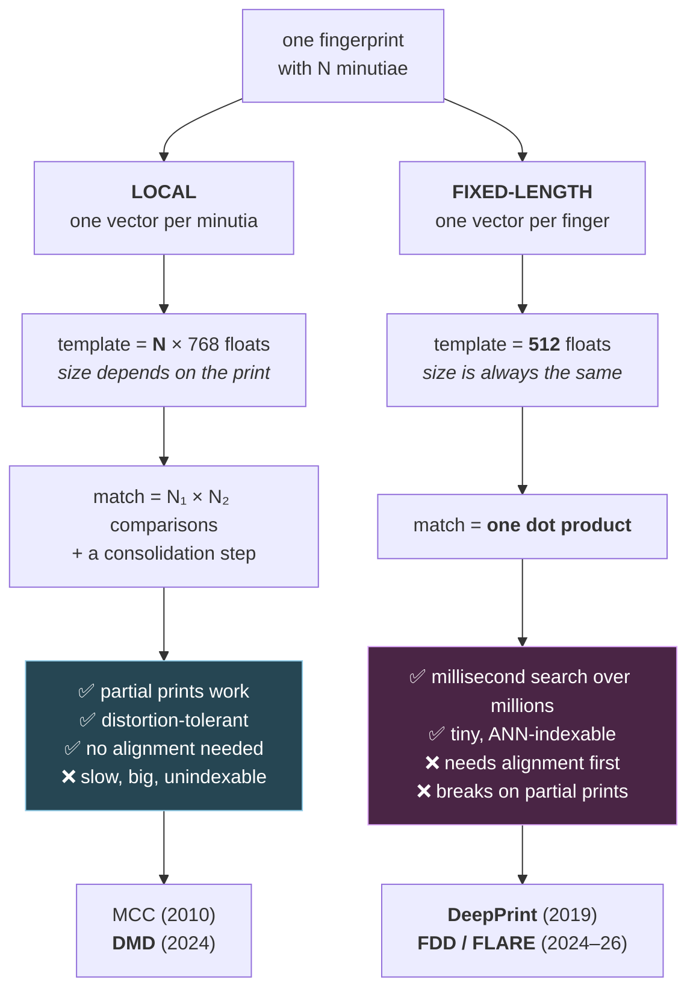

# 4. Descriptors: the core concept

If you understand this file, DMD becomes obvious. So let's go slowly.

## 4.1 What a descriptor is

A **descriptor** is a vector that summarises the appearance of something, designed so
that:

- the *same* thing seen twice → two vectors that are **close**
- *different* things → two vectors that are **far apart**

That's it. The whole game is designing the map from "image region" to "vector" so that
this holds despite nuisance variation (rotation, lighting, noise, distortion).

Distance is usually **cosine similarity**:

```
sim(a, b) = (a · b) / (‖a‖ ‖b‖)      ∈ [−1, 1]
```

Cosine ignores magnitude and only cares about direction, which is usually what you want —
a faint patch and a bright patch of the same skin should match.

## 4.2 Two philosophies: local vs fixed-length

This is the main axis in modern fingerprint recognition, and the three repos in the
README sit at different points on it.



The row to stare at is the third one. **Everything else on this page follows from
"N₁ × N₂ comparisons" versus "one dot product."** Template size, indexability, robustness to
partial prints — they're all downstream of that single choice.

### Local descriptors — one vector per minutia

You get **N descriptors for a print**, where N is the number of minutiae (variable —
10 for a bad latent, 100 for a rolled print).

- ➕ Handles partial prints naturally. A latent showing 15% of the finger still produces
  valid descriptors for the minutiae it *does* have.
- ➕ Tolerates distortion, because each descriptor only covers a small area, and small
  areas are nearly rigid.
- ➖ Matching is expensive: N₁ × N₂ comparisons plus a consolidation step, per pair of
  prints. You can't just do a nearest-neighbour lookup.
- ➖ Variable-length output doesn't fit standard vector-database indexing.

**Examples:** MCC (hand-designed, 2010), **DMD** (learned, 2024).

### Fixed-length descriptors — one vector per finger

Squash the entire fingerprint into a single vector of fixed size (say 512 floats),
regardless of how many minutiae it has.

- ➕ Matching is **one dot product**. You can search a million-print gallery in
  milliseconds with an ANN index. This is a huge deal operationally.
- ➕ Compact storage.
- ➖ Requires the print to be **aligned** first (centred and rotated consistently),
  otherwise the same finger produces different vectors.
- ➖ Degrades on partial prints — the vector encodes the whole finger, and half a finger
  isn't half the vector, it's a different vector.

**Examples:** **DeepPrint** (2019), **FDD / FLARE** (2024–2026).

### The trade-off, stated plainly

> Fixed-length is fast but needs a good, complete, well-aligned image.
> Local is slow but survives partial, messy, unaligned images.
>
> Latents are partial, messy and unaligned. Hence DMD is local.

FLARE is interesting precisely because it tries to have both: fixed-length speed, with
enough alignment and enhancement machinery bolted on to survive latents.

## 4.3 The classical local descriptor: MCC

Worth 90 seconds because DMD is best understood as "MCC, but learned."

**Minutia Cylinder-Code** builds, around each minutia:

1. A **local coordinate frame** centred on the minutia, with the x-axis along the
   minutia's orientation θ. *This is what makes it rotation-invariant* — you've defined
   away the global rotation by using the minutia itself as the reference.
2. A cylinder of cells: a 2D spatial grid over the neighbourhood × a third axis for
   *directional* difference.
3. Each cell's value = how much evidence there is of a nearby minutia at that relative
   position and relative angle.

Result: a fixed-size 3D array per minutia, which MCC then binarises so comparison is a
fast bitwise operation.

Hold on to three things from MCC, because DMD reuses all three:

| MCC idea | Where it shows up in DMD |
|---|---|
| Local frame anchored on the minutia | The TPS crop that rotates each patch by the minutia's θ |
| A **3D** cell structure (spatial × something) | The (channels × 8 × 8) descriptor block |
| A **validity mask** — cells outside the print don't count | The learned `foreground` mask head |
| Binarisation for speed | The `--binary` / `binary=True` scoring path |

The difference: MCC's cells are filled by a hand-written formula counting neighbouring
minutiae. DMD's cells are filled by a CNN looking at the raw pixels.

## 4.4 Why "dense"? The key idea in DMD

Here's the sentence that unlocks the paper.

Most learned local descriptors do this:

```
  patch → CNN → global average pool → flat vector of length D
                        ▲
                    throws away WHERE
```

Global pooling collapses all spatial positions into one number per channel. You keep
"there is a ridge ending kind of texture here" but you lose "…in the upper-left of the
patch."

**DMD does not pool.** It keeps the spatial grid:

```
  patch (128×128) → CNN → feature map of shape (C, 8, 8)
                                                 ▲   ▲
                                          channels  spatial grid preserved
```

So a DMD descriptor is a little 3D block: 8×8 spatial cells, each holding a C-dimensional
feature vector. The paper's figure calls these `f₁` and `f₂` and literally draws them as
Rubik's cubes.

**Why this matters — the payoff:**

Because the spatial layout is preserved, each of the 64 cells corresponds to a known
physical location in the neighbourhood around the minutia. That means you can attach a
**per-cell validity mask** `h` and say:

> "Cells 1–20 of this latent patch are real skin. Cells 21–64 fell outside the smudge.
>  When comparing to the gallery patch, only use cells that are valid in **both**."

You cannot do that with a globally-pooled vector. Once you've averaged over space, the
garbage from invalid regions is irreversibly mixed into every dimension.

For latent prints — where a patch is very often half-missing — this is the whole ballgame.

Look at the illustration in the DMD repo (`figures/dmd_illustration.png`): the left panel
shows two feature cubes `f'₁` and `f'₂`, each with a mask `h₁` and `h₂` below it, and the
masked-out cells drawn in black in the resulting `f₁` and `f₂` before "Feature Similarity."
That picture *is* section 4.4.

## 4.5 Two branches: texture and minutiae

DMD's network splits into two heads after a shared trunk, producing two descriptors that
get concatenated (`models/model_zoo.py:128-133`):

```python
t_x3 = self.texture3(x2)
t_x4 = self.texture4(t_x3)
feature_t  = self.embedding_t(t_x4)     # texture branch
feature_m  = self.embedding(x4)         # minutiae branch
foreground = self.foreground(t_x4)      # validity mask
feature = torch.cat((feature_t, feature_m), dim=1)
```

- **Minutiae branch** — trained with an auxiliary head that predicts a *minutiae map*
  (`self.minu_map`, a 6-channel output at 128×128). Forcing the trunk to be able to locate
  neighbouring minutiae makes its features encode minutiae structure. This is
  MCC-like information, learned.
- **Texture branch** — sees the same patch but is supervised only by identity and mask
  losses. It captures ridge flow, frequency, and general appearance — information that
  MCC throws away entirely.

They're complementary: on a badly degraded latent, minutiae detection may fail while ridge
texture survives, or vice versa. Concatenating covers both.

Note the mask comes off the **texture** branch. That's sensible — "is this region real
skin?" is a texture question, not a minutiae question.

## 4.6 How the descriptor is trained (briefly)

The training code isn't in the repo, but the config file tells you the losses
(`DMD.yaml`):

```yaml
loss_attrs:
  cosface: [1]
  dense:   [0.00125]
  mask:    [1]
  minu:    [0.01]
```

- **`cosface`** — the main event. **CosFace** is a *margin-based softmax* loss. You train
  the network to classify "which finger is this?" over the training identities, but with
  an angular margin that forces same-identity embeddings tightly together and
  different-identity embeddings far apart on the unit hypersphere. It comes from face
  recognition (ArcFace/CosFace/SphereFace family) and it's the standard recipe for
  learning any embedding you plan to compare with cosine similarity.
  > The reason this works: ordinary softmax only needs classes to be *separable*.
  > Margin losses demand they be separable *with room to spare*, which is what you need
  > when test-time identities were never seen during training.
- **`dense`** — a term acting on the dense (spatial) structure, weighted very low (0.00125).
- **`mask`** — supervises the foreground segmentation head.
- **`minu`** — supervises the auxiliary minutiae-map head.

The last two are **auxiliary losses**: their job isn't the output, it's to shape the
shared trunk's representation. Classic multi-task trick.

`NoMP: 44.636115` in the same config is a training-set statistic (mean number of minutiae
per print, roughly) — leftover from training, not used at inference.

## 4.7 Where the three repos land

Now that you have the vocabulary, here's the map you'll spend files 5–9 filling in:

| | Spatial structure | Mask | Descriptors per print | Read next |
|---|---|---|---|---|
| **DMD** | ✅ 8×8 cells | ✅ | N (one per minutia) | files 05, 06 |
| **FDD / FLARE** | ✅ 16×16 cells | ✅ | 1 | file 07 |
| **DeepPrint / flx** | ❌ pooled away | ❌ impossible | 1 | file 08 |

Notice the middle row: FDD is *both* fixed-length *and* dense. Those aren't opposites —
"fixed-length" is about the count of descriptors per print, "dense" is about whether each
descriptor keeps its spatial layout. FDD keeps the mask benefit while getting the
one-dot-product speed, which is why it's the interesting middle point.

The catch, which file 07 develops: to make cell *i* of one print comparable to cell *i* of
another, you must first align both prints to a canonical pose. That's a whole extra
subsystem, and a new single point of failure.

## 4.8 Binarisation — the speed lever

Comparing float descriptors takes real multiplication. Comparing *binary* descriptors is
bit operations, which are ~100× cheaper and 32× smaller in memory.

DMD supports this (`evaluate_mnt.py:177-188`): threshold the features at 0, threshold the
masks at a per-image-type value, and compute agreement instead of cosine. Details in
file 06. It costs a little accuracy and buys a lot of throughput — the usual trade when
you're searching a national database.

---

## Check yourself

1. Define "descriptor" without using the words "vector" or "embedding."
2. Give the one-sentence trade-off between local and fixed-length descriptors. Which is
   right for latents, and why?
3. What does global average pooling destroy, and why does DMD refuse to do it?
4. Why does a per-cell validity mask *require* a spatially-structured descriptor?
5. What is each of DMD's two branches good at? Why is the mask predicted from the texture
   branch rather than the minutiae branch?
6. Why is MCC rotation-invariant? What does DMD do to get the same property?
7. What problem does CosFace solve that plain softmax classification doesn't?

(Answers in `12-exercises.md`.)
