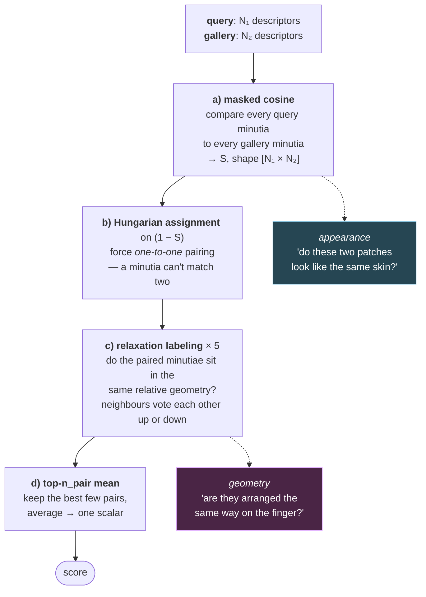

# 5. DMD — the idea

Everything so far has been build-up. This is the payoff file. If you read only one page,
read this one.

## 5.1 The three-sentence version

> DMD crops a small image patch around every minutia, rotated so the minutia's own
> direction points along +x, and runs it through a CNN that outputs a **3D block** of
> features — a grid of spatial cells, each with a feature vector — plus a **validity
> mask** saying which cells are real skin.
>
> To compare two prints, it computes a **mask-weighted cosine similarity** between every
> pair of minutia descriptors, so only the parts of both patches that are genuinely
> visible contribute.
>
> Then it consolidates that similarity matrix into a single score using the **Hungarian
> algorithm** (to force one-to-one minutia correspondence) plus **relaxation labeling**
> (to reward geometrically consistent sets of correspondences).

Everything else is engineering.

## 5.2 The problem being solved, stated precisely

Given a latent print (partial, noisy, distorted, ~15 minutiae) and a gallery of rolled
prints (clean, complete, ~100 minutiae each), rank the gallery so the true mate is at the top.

The specific failure modes DMD is designed around:

| Failure mode | DMD's answer |
|---|---|
| Print is partial → patches fall off the edge of the visible area | Learned per-cell foreground mask; invalid cells excluded from the similarity |
| Global alignment is unknown and hard to estimate on a smudge | Never estimate it. Anchor every patch on a minutia's own frame → rotation/translation invariant by construction |
| Skin distorts non-linearly | Use small local patches (locally nearly rigid), and check geometric consistency softly (sigmoids, not hard thresholds) in relaxation |
| Few minutiae available | Adaptive `n_pair`: use 4 pairs when there are few minutiae, up to 12 when there are many |
| Two prints overlap in only a tiny region → similarity is computed over almost nothing and is unreliably high | Score normalisation: multiply by `sqrt(overlap / N_mean)` so small-overlap matches are discounted |
| Minutiae detection alone is unreliable on latents | Two branches — one minutiae-flavoured, one texture-flavoured — concatenated |

That table *is* the paper's contribution list, reordered.

## 5.3 The pipeline, end to end

```
┌──────────────────────────────────────────────────────────────────────────┐
│ STAGE 0 — OFFLINE, NOT IN THIS REPO                                      │
│ VeriFinger (or FDD) extracts minutiae → one .mnt file per image          │
│ Each row: (x, y, θ)                                                      │
└──────────────────────────────────────────────────────────────────────────┘
                                   │
┌──────────────────────────────────▼───────────────────────────────────────┐
│ STAGE 1 — dump_dataset_mnteval.py                                        │
│ Flatten to a work list. ONE ENTRY PER MINUTIA, not per image:            │
│   {"img": "NIST_SD27/image/query/foo.bmp", "pose_2d": (x, y, θ)}         │
│ → datasets/<DatasetName>.pkl                                             │
└──────────────────────────────────┬───────────────────────────────────────┘
                                   │
┌──────────────────────────────────▼───────────────────────────────────────┐
│ STAGE 2 — extract_feat()                                                 │
│ For each minutia:                                                        │
│   • crop a 128×128 patch centred on (x,y), rotated so θ → +x axis        │
│   • normalise to [-1, 1]                                                 │
│   • CNN → feat (768 floats) + mask (64 floats)                           │
│ → one .pkl per minutia                                                   │
└──────────────────────────────────┬───────────────────────────────────────┘
                                   │
┌──────────────────────────────────▼───────────────────────────────────────┐
│ STAGE 3 — concatenate_feat()                                             │
│ Regroup per image:  feat [N, 768], mask [N, 64], mnt [N, 3]              │
│ → one .pkl per fingerprint image                                         │
└──────────────────────────────────┬───────────────────────────────────────┘
                                   │
┌──────────────────────────────────▼───────────────────────────────────────┐
│ STAGE 4 — calculate_scores()                                             │
│ For every (query, gallery) pair:                                         │
│   a) masked cosine similarity → S, shape [N₁, N₂]                        │
│   b) Hungarian assignment on (1 − S) → one-to-one minutia pairs          │
│   c) relaxation labeling using minutia geometry → refined confidences    │
│   d) mean of top-`n_pair` confidences → one scalar                       │
│ → score_matrix*.csv                                                      │
└──────────────────────────────────┬───────────────────────────────────────┘
                                   │
┌──────────────────────────────────▼───────────────────────────────────────┐
│ STAGE 5 — eval_metric()                                                  │
│ score matrix + genuine-pairs file → Rank-1, Rank-10, TAR@FAR             │
└──────────────────────────────────────────────────────────────────────────┘
```

The stage boundaries are real files on disk. That's deliberate and useful: you can re-run
stage 4 with different scoring options without touching the GPU-heavy stage 2.

## 5.4 The patch: how a minutia becomes an image

This is the step people find least intuitive, so here it is concretely.

You have a fingerprint image, and a minutia at position (x, y) pointing at angle θ.
You want a patch that looks the **same** regardless of how the finger was placed.

Take a 128×128 window. Place its centre at (x, y). Rotate it by θ. Sample.

```
   original image                        extracted patch
   ┌──────────────────┐                  ┌────────────┐
   │      ╱╱╱╱        │                  │  ────────  │
   │    ╱╱ ●→ ╱       │   crop+rotate    │  ──  ●───  │   the minutia is always
   │   ╱╱╱╱╱╱         │  ───────────►    │  ────────  │   at the centre, always
   │                  │                  │            │   pointing right
   └──────────────────┘                  └────────────┘
        minutia at (x,y)
        pointing at angle θ
```

Because the minutia's own orientation defines the patch's orientation, **the same physical
skin region always produces the same patch**, no matter how the finger was rotated when
scanned. Global alignment is solved for free, locally.

The scale is fixed by physical units, not pixels — hence the PPI rescaling from file 01.
At `img_ppi: 500`, `tar_shape: [128,128]`, `middle_shape: [128,128]`, the scale factor is
exactly 1.0 and the patch is 128 image pixels across, i.e. roughly 6.5mm of skin, or about
13–14 ridge periods. Big enough to contain several neighbouring minutiae, small enough
that skin distortion inside it is nearly rigid. That's a deliberate sweet spot.

## 5.5 The descriptor: what those 768 numbers are

```
input patch          1 × 128 × 128
   │  layer0  (stride 2)
   ▼                64 × 64 × 64
   │  layer1
   ▼                64 × 64 × 64
   │  layer2  (stride 2)
   ▼               128 × 32 × 32
   ├──────────────────────────────┐
   │ layer3 (/2)                  │ texture3 (/2)
   ▼                              ▼
  256 × 16 × 16                 256 × 16 × 16
   │ layer4 (/2)                  │ texture4 (/2)
   ▼                              ▼
  512 × 8 × 8                   512 × 8 × 8
   │ embedding                    ├── embedding_t ──►  feature_t   6 × 8 × 8
   ▼                              └── foreground  ──►  mask        1 × 8 × 8
 feature_m  6 × 8 × 8
```

Total downsampling is 16×, so 128 → **8×8 spatial cells**. Each cell covers a 16×16-pixel
region of the patch (~1.6 ridge periods).

- `feature_m`: 6 channels × 8 × 8 = **384** floats
- `feature_t`: 6 channels × 8 × 8 = **384** floats
- concatenated `feature`: **768** floats per minutia
- `mask`: 1 × 8 × 8 = **64** floats in [0,1], one validity value per cell

`ndim_feat: 6` in the config is that "6". It's remarkably small — most descriptors use
128 or 512 dimensions. DMD gets away with 6 *per cell* because it has 64 cells and the
spatial arrangement carries information that other methods have to encode in channels.

**Storage arithmetic:** a rolled print with 100 minutiae costs 100 × (768 + 64) × 4 bytes
≈ 333 KB as floats. Binarised, ~10 KB. That's the pressure behind the `--binary` flag.

## 5.6 The similarity: masked cosine, cell by cell

For two minutiae, one from each print, with descriptors `f₁`, `f₂` and masks `m₁`, `m₂`:

```
             Σ  m₁ᵢ · m₂ᵢ · f₁ᵢ · f₂ᵢ
sim  =  ─────────────────────────────────────────
        √(Σ m₁ᵢ m₂ᵢ f₁ᵢ²) · √(Σ m₁ᵢ m₂ᵢ f₂ᵢ²)
```

That is just cosine similarity, with every term weighted by `m₁ᵢ · m₂ᵢ` — the product of
both masks. A cell contributes only if **both** prints consider it valid.

Note it appears in the denominator too. That's the part people miss: you renormalise by
the norms *computed over the valid region only*, so the similarity isn't penalised for
having a small valid region. It's a fair comparison over whatever overlap exists.

Which immediately creates the next problem, and its fix:

### Score normalisation

If only 3 of 64 cells overlap, the similarity above is computed from very little evidence
and might come out at 0.95 by luck. Over 66,564 impostor pairs, some will get lucky.

So define `n₁₂ = Σ m₁ᵢ · m₂ᵢ` — the **effective overlap area** — and:

```
score  ←  score × √(n₁₂ / N_mean)
```

Pairs with big honest overlap keep their score; pairs with tiny overlap get shrunk.

This is the `-sn` / `--score_norm` command-line flag. The README notes it was used for
VeriFinger-extracted minutiae but not needed for FDD-extracted minutiae — because
FDD produces more reliable minutiae in the first place, so the lucky-tiny-overlap failure
mode is rarer.

> **Don't be confused by the magnitude.** With normalisation on, scores are no longer in
> [−1, 1] — they get multiplied by `sqrt(n₁₂ / N_mean)` where `N_mean` is 5 in the
> evaluation call and `n₁₂` can reach 768. Scores in the tens are normal. As established
> in file 02, only the ordering matters.

## 5.7 The consolidation: from a matrix to a number



The shape of that pipeline is the answer to a question worth asking out loud: *why isn't the
cosine similarity enough?* Because appearance alone will happily match a bifurcation on your
index finger to a similar-looking bifurcation on someone's thumb. Steps (b) and (c) exist to
add the constraint appearance can't express — **that the matched minutiae must also be
arranged the same way relative to each other.** Two independent kinds of evidence, and the
score only survives if both agree.

Covered in file 03 §3.6, but here's the DMD-specific summary:

1. **`calculate_score_torchB`** → `S`, shape `[B, N₁, N₂]`, batched over gallery pairs.
2. **Hungarian** on `1 − S`, padded to square with cost 2. Gives one-to-one pairs.
   (Note: real minutiae counts differ per image, so the batch is padded with `NaN` and
   the NaNs are replaced by cost 2 — a cost so high the assignment avoids them unless
   forced. Neat trick.)
3. **`relax_labeling`** → geometric consistency, 5 iterations, using D1/D2/D3.
4. **Top-`n_pair` mean** → scalar.

One subtlety in step 4 worth flagging because it's genuinely clever and easy to misread
(`evaluate_mnt.py:281-285`):

```python
efficiency = lambda_t / torch.clamp(scores, min=1e-6)
_, sorted_indices = torch.sort(efficiency, dim=1, descending=True)
lambda_t_sorted = torch.gather(lambda_t, 1, sorted_indices)
```

It sorts by **efficiency** — the *ratio* of the post-relaxation confidence to the original
descriptor similarity — but then sums the **λ values**. So the ranking asks "which pairs
gained the most support from their neighbours?" rather than "which pairs looked best on
their own?" A pair with mediocre appearance similarity that is strongly corroborated by
the surrounding geometry outranks a pair that just looked pretty in isolation.

That's a very sensible bias for latents, where appearance is unreliable and geometry is
comparatively trustworthy.

## 5.8 Where DMD sits historically

```
1970s–2000s   Minutiae triplets, Hough alignment          hand-designed, global
2010          MCC — local descriptors, relaxation         hand-designed, local
2019          DeepPrint — one learned vector per finger   learned, fixed-length
2024          DMD — learned DENSE descriptor per minutia  learned, local     ◄── you are here
2024–2026     FDD / FLARE — learned dense, fixed-length   learned, fixed-length
```

Two independent axes: **hand-designed → learned**, and **global ↔ local**. DMD is the
learned-local corner. Its honest one-line pitch is:

> *MCC's structure, but with the cells filled in by a CNN instead of a formula, and with
> a learned validity mask.*

## 5.9 What DMD does NOT do

Being clear about scope prevents a lot of confusion:

- ❌ It does not extract minutiae. VeriFinger or FDD does. (⚠️ The public FLARE repo ships
  **no** minutiae extractor — only pose estimation and the FDD descriptor — so the "or FDD"
  path in DMD's README isn't publicly available. Substitutes and the exact `(x, y, θ)`
  convention DMD expects are in file 06 §6.12.)
- ❌ It does not enhance images. (FLARE's separate `FLARE-Enh` module does.)
- ❌ It does not estimate global pose. It doesn't need to.
- ❌ It does not classify Level-1 patterns.
- ❌ The public repo does not include **training** code — inference and evaluation only.
- ❌ It is not fast. Every query-gallery pair needs an N₁ × N₂ matrix plus a Hungarian
  solve. That's why the May 2025 update was specifically about moving scoring to GPU, and
  why the binary mode exists.

---

## Check yourself

1. Explain DMD in three sentences, without looking.
2. Why does anchoring a patch on a minutia's own orientation remove the need for global
   alignment? What does it *not* remove the need for?
3. Trace the shape of a tensor from `1 × 128 × 128` through to the final 768-float
   descriptor. Where does the 8×8 come from?
4. Write the masked cosine formula and say what `m₁ᵢ · m₂ᵢ` does in the numerator, and
   separately what it does in the denominator.
5. Why is score normalisation needed at all, given the denominator already accounts for
   mask size?
6. In the consolidation, why sort by `efficiency` rather than by `lambda_t`?
7. Name three things DMD explicitly does not do.

(Answers in `12-exercises.md`.)
