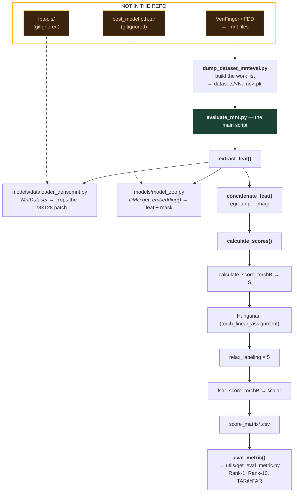
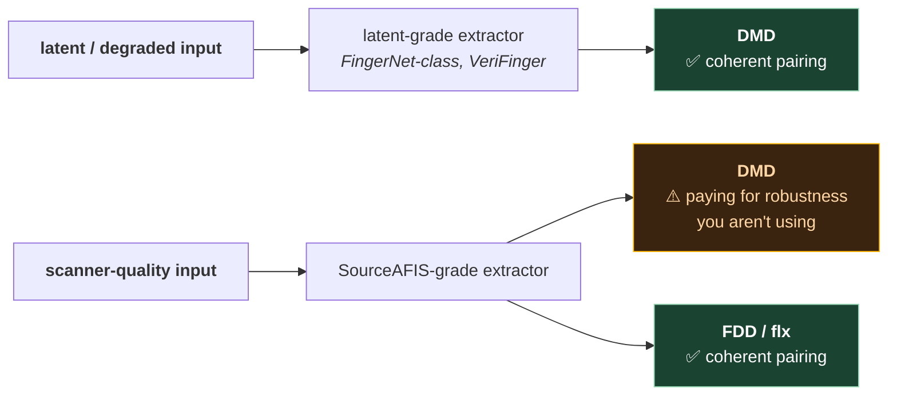

# 6. DMD code walkthrough

Repo: <https://github.com/Yu-Yy/DMD>

All paths below are relative to that repo's root.

## 6.1 File map

```
DMD/
├── DMD.yaml                          config for the base model
├── DMD++.yaml                        config for the improved model
├── dump_dataset_mnteval.py           STAGE 1 — build the work list
├── evaluate_mnt.py                   STAGES 2–5 — the main script
├── models/
│   ├── model_zoo.py                  the DMD network
│   ├── resnet.py                      BasicBlock / Bottleneck (standard ResNet parts)
│   ├── inception.py                   BasicConv2d, BasicDeConv2d helpers
│   ├── units.py                       NormalizeModule, DoubleConv, PositionEncoding2D
│   └── dataloader_densemnt.py        patch extraction (MntDataset) + pair loading (MatchDataset)
├── utils/
│   └── get_eval_metric.py            CMC and TAR@FAR
├── datasets/
│   ├── place_holder.pkl
│   └── N2NLatent_genuine_pairs.txt   3382 genuine pairs, example format
└── figures/dmd_illustration.png      the architecture figure — worth studying
```

Plus two things you must supply yourself:

- **`fptools/`** — a separate helper library, cloned from
  <https://github.com/youngjetduan/fptools>. Provides `uni_io` (directory helpers) and
  `fp_verifinger` (the `.mnt` file reader). It's in `.gitignore`, so it will never appear
  from a plain clone.
- **`logs/DMD/best_model.pth.tar`** — the pretrained weights, downloaded separately.
  Also gitignored.

If you clone and immediately hit `ModuleNotFoundError: fptools`, that's expected, not broken.

### What calls what

The file map above says where things live; this says how control actually flows. Follow the
solid arrows to read the repo in execution order:



Two things that diagram makes obvious and the file listing doesn't. First, **`evaluate_mnt.py`
is four of the five pipeline stages** — it isn't an evaluation script, it's the whole system
with evaluation bolted on the end. Second, everything in the orange box has to be obtained
separately, which is why a fresh clone cannot run.

## 6.2 The config files

`DMD.yaml` and `DMD++.yaml` differ in exactly two lines:

```diff
- eval_path: logs/DMD          + eval_path: logs/DMD++
- input_norm: False            + input_norm: True
```

Same architecture, different weights, and DMD++ turns on the input normalisation layer.

The keys that actually matter at inference:

| Key | Value | Meaning |
|---|---|---|
| `ndim_feat` | 6 | channels per branch. Final descriptor is `2 × 6 × 8 × 8 = 768` |
| `tar_shape` | [128,128] | patch size fed to the network |
| `middle_shape` | [128,128] | intermediate size used in the PPI scale computation |
| `img_ppi` | 500 | resolution the model expects |
| `pos_embed` | true | add 2D sinusoidal position encoding before the embedding heads |
| `input_norm` | False / True | apply `NormalizeModule` to the input patch |
| `prefix` | `/path/to/TEST_DATA` | **edit this** — root of your dataset |
| `batch_size` | 16 | for feature extraction |
| `score_norm` | True | (overridden by the `-sn` CLI flag) |

`lr`, `loss_attrs`, `NoMP`, `debug` are training leftovers with no effect at inference.

> **First thing to change if you run this:** `prefix`.

## 6.3 Stage 1 — `dump_dataset_mnteval.py`

Small file, one important idea.

```python
for mnt_f in mnt_gallery_files:
    mnts = fp_verifinger.load_minutiae(osp.join(mnt_gallery_folder, mnt_f))[:, :3]
    for mnt_ in mnts:                                   # ◄── ONE SAMPLE PER MINUTIA
        img_lst.append(osp.join(dataname, "image", 'gallery', mnt_f.split('.')[0] + f".{img_type}"))
        anchor_2d.append(mnt_)
```

**The dataset unit is a minutia, not an image.** A dataset of 500 images with ~60 minutiae
each becomes 30,000 samples. The same image path appears 60 times, each with a different
`pose_2d`.

This is why the whole downstream design has that "extract per minutia → regroup per image"
shape. It's also why extraction is slow: you run the CNN once per minutia.

Output: `./datasets/<DatasetName>.pkl`, a list of `{"img": path, "pose_2d": (x,y,θ)}`.

> ⚠️ **Gotchas in this file:**
> - `datasets = ['NIST_SD27', "NIST_SD4"]` is **hardcoded** at line 48. To use your own
>   dataset you must edit this list (and `img_types` alongside it). The `--prefix` argument
>   is the only CLI knob.
> - `[:, :3]` discards everything after (x, y, θ) — quality scores, minutia type. DMD
>   deliberately uses only those three.
> - Swap `fp_verifinger.load_minutiae` for your own reader if you don't have VeriFinger.
>   The in-file comment explicitly invites this: *"just make sure the first three columns
>   of mnts are (x, y, theta)."* **This is the only integration point you need** — §6.12
>   works through it end to end.

## 6.4 Patch extraction — `models/dataloader_densemnt.py`

### `MntDataset.__getitem__` (line 76)

```python
item = self.items[index]
img = self.load_img(osp.join(self.prefix, item["img"]))     # full grayscale image
pose_2d = item["pose_2d"]                                    # (x, y, θ) — the anchor minutia
path = "/".join(item["img"].split("/")[-3:]).split(".")[0]   # e.g. "NIST_SD27/image/query/foo"
img_r, _, _, _, _ = self._processing_(img, minu, pose_2d)
img_r = (img_r - 127.5) / 127.5                              # [0,255] → [-1,1]
return {"img_r": img_r[None].astype(np.float32),
        'minu_r': pose_2d, 'index': index, "name": path}
```

Note `'minu_r': pose_2d` — the raw minutia coordinates ride along with the patch, because
stage 4's relaxation labeling needs the original geometry.

Note also `path` keeps three components; `evaluate_mnt.py:433` later checks
`name_i.split('/')[1] == 'gallery'` to route features to the right folder. So the
**`image/gallery` vs `image/query` directory layout is load-bearing**. Don't rename them.

### `_processing_` (line 51) and `fast_tps_distortion` (line 99)

At inference the augmentation parameters are all zero:

```python
rot = 0
shift = np.zeros(2)
flow = np.zeros(198)      # 99 control points × 2 — all zero = no warping
```

So the TPS reduces to a rigid transform. Peeling away the spline machinery, the mapping is:

```
source_point = R(θ) · (target_pixel − patch_centre) / scale  +  (minutia_x, minutia_y)
```

with `scale = img_ppi/500 × tar_shape[0]/middle_shape[0]` (= 1.0 with default config),
and then `cv2.remap` samples the image at those points, filling out-of-bounds with 127.5
(mid-grey → 0.0 after normalisation).

That's the crop-and-rotate from file 05 §5.4. The 99 control points spanning
`(-200..200, -160..160)` are the training-time augmentation grid; with `flow = 0` they
contribute nothing.

> **Why keep the TPS at all?** So that inference sampling is bit-identical to training
> sampling. If you re-implemented the crop with a simple affine warp you'd get subtly
> different interpolation and lose a little accuracy for no reason.

`fast_tps_distortion` also has a `minu is not None` branch that transforms a *set* of
minutiae into the patch frame, including their angles (by transforming two points 10px
apart along the minutia direction and taking the atan2 of the difference — a robust way
to transform an angle through a nonlinear warp). That branch is **not used at inference**
here, since `minu = None` at `dataloader_densemnt.py:79`. It's training-path code.

### `MatchDataset` (line 171)

Feeds stage 4. Its `items` list is the full Cartesian product:

```python
self.items = list(product(self.search_list, self.gallery_list))
```

Every query × every gallery entry. For SD27 that's 258 × 258 = 66,564 items. Each
`__getitem__` loads two pickles and returns their `feat`, `mask`, `mnt`, plus the index
pair so the score can be written back into the right matrix cell.

> **Scaling note:** this is O(N_query × N_gallery) pickle loads, and it re-loads the same
> gallery file 258 times. Fine for benchmarks, not for a real 1M-print search. If you ever
> profile this repo, that's the first thing you'd find.

## 6.5 The network — `models/model_zoo.py`

A ResNet-34-shaped trunk (`layers = [3, 4, 6, 3]`, `BasicBlock`) that forks in two.

```python
self.layer0  # 7×7 conv stride 2 + 3×3 conv → 64ch, /2
self.layer1  # 3 BasicBlocks,  64ch
self.layer2  # 4 BasicBlocks, 128ch, /2
self.layer3  # 6 BasicBlocks, 256ch, /2      ─┐ minutiae branch
self.layer4  # 3 BasicBlocks, 512ch, /2      ─┘

self.texture3 = copy.deepcopy(self.layer3)   ─┐ texture branch
self.texture4 = copy.deepcopy(self.layer4)   ─┘  (same shape, separate weights)
```

`copy.deepcopy` here just clones the *architecture and initial weights*; from the first
gradient step onward they diverge. The shared part is `layer0`–`layer2`.

### The four heads

| Head | Input | Output | Used at inference? |
|---|---|---|---|
| `embedding` | `x4` (minutiae branch) | `ndim_feat × 8 × 8` | ✅ → `feature_m` |
| `embedding_t` | `t_x4` (texture branch) | `ndim_feat × 8 × 8` | ✅ → `feature_t` |
| `foreground` | `t_x4` | `1 × 8 × 8`, Sigmoid | ✅ → `mask` |
| `minu_map` | `x3` | `6 × 128 × 128`, ReLU | ❌ training only |

`minu_map` is the auxiliary minutiae-map head — two deconvs bring 32×32 back up to
128×128. It exists to shape the trunk during training and is absent from `get_embedding`.

### `get_embedding` vs `forward`

This trips people up. **`forward` is never called at inference.** Look at
`evaluate_mnt.py:416`:

```python
outputs = self.model.module.get_embedding(img)
```

- `get_embedding` (line 119) — inference path. Returns flattened `feature`, `feature_t`,
  `feature_m`, `mask`. No `minu_map`, so it skips the expensive upsampling head.
- `forward` (line 142) — training path. Returns everything including `minu_map` and the
  split lists for the loss functions.

Note `.module` — the model is wrapped in `nn.DataParallel`, so `.module` reaches the
underlying `DMD`. A side effect: calling `get_embedding` this way **bypasses DataParallel**,
so it runs on the primary GPU only. Multi-GPU doesn't actually help extraction here.

### Position encoding — `units.py:69`

`PositionEncoding2D` adds fixed sinusoidal encodings (the Transformer kind, extended to
2D) to the 512-channel map before the 1×1 conv heads.

Why? A 1×1 convolution is spatially blind — it sees each cell independently. Adding a
position code lets the head produce *different* features for the same input depending on
*where in the patch* it is. Given that the whole premise of DMD is preserving spatial
structure, this is consistent: the descriptor at cell (0,0) should be interpretable as
"upper-left of the patch," not just "some texture."

### `NormalizeModule` — `units.py:6`

Per-image contrast normalisation to zero mean, unit variance — but with a twist: it
computes `sqrt(var0 · (x − m)² / var)` and then re-signs it by whether `x > m`. That's the
classic Hong-Wan-Jain fingerprint normalisation, not a plain z-score. `DMD.yaml` leaves it
off; `DMD++.yaml` turns it on.

## 6.6 Stage 2 — `extract_feat()` (`evaluate_mnt.py:406`)

```python
outputs = self.model.module.get_embedding(img)
features = outputs["feature"].cpu().numpy()      # [B, 768]
masks    = outputs["mask"].cpu().numpy()         # [B, 64]
...
save_dict = {'feat': feat, 'mask': mask, 'mnt': mnt.numpy()}
```

Writes **one pickle per minutia**, into
`{prefix}/{dataset}/DMD_{ndim_feat}/{search|gallery}/{image_name}/{index}.pkl`.

For SD27 with ~60 minutiae per print over 516 images, that's ~30,000 tiny files. Then:

## 6.7 Stage 3 — `concatenate_feat()` (line 444)

Regroups them into one pickle per image:

```python
feats = np.concatenate([feat['feat'][None,...] for feat in img_org_fs], axis=0)   # [N, 768]
masks = np.concatenate([feat['mask'][None,...] for feat in img_org_fs], axis=0)   # [N, 64]
mnts  = np.concatenate([feat['mnt'][None,...]  for feat in img_org_fs], axis=0)   # [N, 3]
...
os.system(f'rm -rf {img_path}')     # ⚠️ deletes the per-minutia folder
```

> ⚠️ That `rm -rf` runs on an unquoted interpolated path. It's fine for the sanitised
> paths this repo generates, but it's the kind of line you should notice.

Note the sort order: `img_feats.sort()` sorts filenames as **strings**, so
`10.pkl` < `2.pkl`. Minutiae end up in lexicographic-index order rather than numeric order.
Harmless — every downstream consumer treats the N axis as an unordered set — but worth
knowing if you ever try to cross-reference row *i* of `feat` with row *i* of the original
`.mnt` file. They won't correspond.

## 6.8 Stage 4 — scoring

### `calculate_score_torchB` (line 167)

```python
feat1_mask = mask1.repeat(1, 1, ndim_feat)    # [B, N₁, 64] → [B, N₁, 768]
```

The mask has 64 values (one per spatial cell); the feature has 768 (12 channels × 64
cells). `flatten(1)` on a `[C, H, W]` tensor is channel-major, so the 768 vector is
`[c0's 64 cells, c1's 64 cells, ...]`. Tiling the mask 12 times aligns it exactly. Note
the caller passes `ndim_feat=self.ndim_feat*2` (= 12) at line 536, because the feature is
the concatenation of two 6-channel branches. Easy to misread.

**Float path:**

```python
x1  = sqrt( bmm(m₁·f₁², m₂ᵀ) )       # ‖f₁‖ over cells valid in BOTH
x2  = sqrt( bmm(m₁, (f₂²·m₂)ᵀ) )     # ‖f₂‖ over cells valid in BOTH
x12 = bmm(m₁·f₁, (m₂·f₂)ᵀ)           # dot product over valid cells
score = x12 / (x1 * x2).clamp(min=1e-3)
n12 = bmm(m₁, m₂ᵀ)                    # effective overlap
```

This is file 05 §5.6 in code. `bmm` makes it all-pairs at once: `[B,N₁,768] × [B,768,N₂]`
→ `[B,N₁,N₂]`. Every query minutia against every gallery minutia, batched over 256 image
pairs. That's the May-2025 GPU speedup.

**Binary path** (`binary=True`):

```python
feat1_dense = (feat1_dense > 0).float()
feat1_mask  = (feat1_mask > THRESHS[f2f_type[0]]).float()
n12 = bmm(m₁, m₂ᵀ)                                        # count of jointly-valid cells
d12 = n12 − bmm(m₁f₁, m₂f₂ᵀ) − bmm(m₁(1−f₁), m₂(1−f₂)ᵀ)   # count of DISAGREEMENTS
score = 1 − 2·(d12 / n12)                                  # ∈ [−1, 1]
```

`d12` is total minus (both-ones) minus (both-zeros) = the Hamming distance restricted to
valid cells. Then `1 − 2·(fraction disagreeing)` maps 0% disagreement → +1 and 100% → −1.

`THRESHS = {0: 0.2, 1: 0.002, 2: 0.5}` (plain / rolled / latent) with `f2f_type=(2,1)`
means the query mask is thresholded at 0.5 and the gallery mask at 0.002. The gallery
threshold is nearly zero — a rolled print is trusted almost everywhere; the latent must
clear a much higher bar. That asymmetry is the latent-vs-rolled asymmetry made concrete.

**Score normalisation:**

```python
if Normalize:
    score = score * torch.sqrt(n12 / N_mean)
```

Called with `N_mean=5` at line 536 (the function's default of 1327 is unused). Since `n12`
can reach 768, normalised scores routinely exceed 1. Expected — see file 05 §5.6.

### `lsar_score_torchB` (line 235) — LSA + Relaxation

The name: **L**inear **S**um **A**ssignment with **R**elaxation.

```python
new_S = pad(1 − S, ..., value=2)                            # cost matrix, padded square
new_S = where(isnan(new_S), 2.0, new_S)                     # NaN padding → prohibitive cost
batch_set_pairs = batch_linear_assignment(new_S)            # Hungarian, on GPU
```

The `n1 < n2` / `else` branches (lines 301–312) transpose the problem so the assignment is
always solved from the *smaller* side. Necessary because `batch_linear_assignment` requires
rows ≤ columns.

Then the three geometric invariants:

```python
D1 = |dist(m₁ᵢ,m₁ⱼ) − dist(m₂ᵢ,m₂ⱼ)|          # distance agreement
D2 = |Δθ in print 1 − Δθ in print 2|           # relative-orientation agreement
D3 = |radial angle 1 − radial angle 2|         # direction-to-neighbour agreement
rp = sigmoid(D1,μ₁,τ₁) · sigmoid(D2,μ₂,τ₂) · sigmoid(D3,μ₃,τ₃)
```

`μ₁ = 5` px, `μ₂ = μ₃ = π/12` (15°) are the tolerances; the negative `τ` values make each
sigmoid *decreasing*, so small differences → compatibility near 1, large differences → near 0.
`rp[:, i, i] = 0` stops a pair from voting for itself.

Then 5 relaxation iterations, the efficiency-based sort, and the top-`n_pair` mean.
All covered in files 03 and 05.

> Note `evaluate_mnt.py:607` constructs the `Evaluator` with `is_relax=True` **hardcoded**.
> `lsa_score_torchB` (the version without relaxation, line 203) is dead code in the shipped
> CLI. It's there for ablation — flip that flag if you want to measure what relaxation buys.

### `calculate_scores()` (line 502)

Ties it together: build `MatchDataset`, iterate at batch size 256, score, and scatter into
the matrix:

```python
score_matrix[index_pair[:,0], index_pair[:,1]] = score.cpu().numpy()
```

Then write `score_matrix{_relax}{_binary}{_nonorm}.csv` with named rows and columns.

`pad_collate_fn` (line 70) pads variable minutiae counts to the batch max with `NaN`.
NaN — not zero — precisely so downstream code can distinguish "padding" from "real value
that happens to be 0". You'll see `torch.isnan` checks throughout for exactly this.

## 6.9 Stage 5 — `eval_metric()` (line 553)

Reads the CSV back, rebuilds the score matrix in a canonical ordering derived from
`os.listdir` of the image folders, builds the target matrix from the genuine-pairs file,
and calls the two metric functions from file 02.

> ⚠️ **Filename mismatch.** The README documents the file as `genuine_pair.txt`, but the
> code reads:
> ```python
> genuine_pairs_file = osp.join(self.prefix, self.eval_dataset, 'genuine_pairs.txt')
> ```
> **`genuine_pairs.txt`** — plural. Use the code's spelling.
>
> Also note the example file shipped in `datasets/` is named
> `N2NLatent_genuine_pairs.txt`, but the code looks for it under
> `{prefix}/{dataset}/genuine_pairs.txt` — i.e. in your data directory, not in `datasets/`.
> You have to copy and rename it into place.

Two more things to know:

- The file has no header row in the code's expectation — it splits every line on `,`.
  The README's format block shows a `query_filename, gallery_filename` header line; the
  shipped example file has **no** header. Follow the example file.
- Everything is matched by filename with the extension stripped (`x.split('.')[0]`).
  So filenames must be unique after stripping extensions, and must agree between the
  `image/` folder, the `mnt/` folder, and `genuine_pairs.txt`.

## 6.10 Running it

```bash
# 0. prerequisites
git clone https://github.com/youngjetduan/fptools.git      # into the repo root
# download weights → logs/DMD/best_model.pth.tar
# edit `prefix:` in DMD.yaml

# 1. build the per-minutia work list  (edit the hardcoded dataset list first)
python dump_dataset_mnteval.py --prefix /path/to/TEST_DATA

# 2. extract features + 3. concatenate + 4. score + 5. evaluate
python evaluate_mnt.py -d NIST_SD27 -m DMD -sn -e

# later runs: drop -e to reuse cached features, and just re-score
python evaluate_mnt.py -d NIST_SD27 -m DMD -sn
```

Flags:

| Flag | Effect |
|---|---|
| `-d`, `--eval_dataset` | dataset name; must match the folder and the `.pkl` |
| `-m`, `--method` | `DMD` or `DMD++`; selects `<name>.yaml` |
| `-e`, `--extract` | **run stage 2+3.** Without it, the script assumes features exist |
| `-sn`, `--score_norm` | enable overlap-based score normalisation |
| `-b`, `--binary` | binarised descriptors — faster, slightly less accurate |
| `-g`, `--gpus` | GPU ids, default `[0]` |

> **The `-e` flag is the one people miss.** `is_load=args.extract` at line 607 means that
> without `-e`, the model isn't even constructed and the dataset isn't loaded — the script
> jumps straight to scoring and fails confusingly if features aren't already on disk.

## 6.11 Portability notes

Things that will bite you outside a Linux + NVIDIA box:

- `self.main_dev = torch.device(f"cuda:{self.gpus[0]}")` (line 338) — **hardcoded CUDA**,
  no CPU or MPS fallback. On an Apple-silicon Mac this repo will not run as-is.
- `torch_linear_assignment` is a CUDA extension you compile from source.
- `os.popen("stty size")` (line 408) for the progress-bar width — fails without a TTY, so
  redirecting output to a file breaks it.
- `os.system(f'rm -rf ...')` — POSIX only.
- Pinned to `Python 3.8` / `torch 1.10.1`, which are both old enough to be awkward to
  install now.

If you want to run this locally to learn from it, the realistic paths are: a Linux box
with an NVIDIA GPU, a cloud instance, or a read-and-reimplement approach where you port
the scoring functions (which are pure PyTorch and CPU-friendly) and skip the CUDA
assignment extension by using `scipy.optimize.linear_sum_assignment` in a loop.

## 6.12 Plugging in a different minutiae extractor

DMD needs minutiae and does not produce them (§5.9). VeriFinger is a commercial SDK, so
sooner or later you'll want to feed it something else. This section is the whole procedure.

### What DMD actually requires

One array per image. First three columns `(x, y, θ)`. That's it — `[:, :3]` throws away
everything else, so quality scores and minutia types are irrelevant.

The part that isn't obvious, and that costs people days: **which** `(x, y, θ)`. The DMD
README specifies it, and this is the spec to code against:

| Quantity | Convention |
|---|---|
| `x` | horizontal axis, increases **to the right** |
| `y` | vertical axis, increases **downward** — image coordinates, not maths coordinates |
| `θ` | measured from the **x-axis**, **clockwise positive** |

> ⚠️ **Units are not stated in the README.** Radians is near-certain — the patch warp feeds
> θ straight into a rotation matrix (§6.4), and `relax_labeling` takes angle differences —
> but verify it rather than assume, using the check below. A units or sign error does not
> raise; it silently rotates every patch wrongly and you lose accuracy with no symptom.

### Worked example: SourceAFIS as the extractor

[SourceAFIS](https://sourceafis.machinezoo.com/) is open source and its native template
exposes minutiae directly, so it's the most accessible substitute. The conventions line up
better than you have any right to expect:

| | DMD expects | SourceAFIS `.template` |
|---|---|---|
| X axis | increases right | `positionsX` — increases right ✅ |
| Y axis | increases downward | `positionsY` — increases downward ✅ |
| Angle origin | from the x-axis | zero points right ✅ |
| Angle sign | clockwise positive | increases clockwise ✅ |
| Resolution | 500 PPI (§1.3) | normalized to 500 dpi ✅ |
| Angle units | *(unstated — verify)* | **radians** |

Four-for-four on the conventions that normally break this, plus a matching 500 dpi
normalisation. Type (`'E'` / `'B'`) is dropped by `[:, :3]`.

**Plumbing.** SourceAFIS is Java/.NET; DMD is Python. Don't bridge the runtimes — the
native template is **CBOR**, so serialize in Java and parse in Python:

```python
# replaces fp_verifinger.load_minutiae
import cbor2, numpy as np

def load_minutiae_sourceafis(path):
    t = cbor2.load(open(path, "rb"))
    return np.stack([t["positionsX"], t["positionsY"], t["directions"]], axis=1).astype(np.float32)
```

Point `dump_dataset_mnteval.py:26` at that and the rest of the pipeline is unchanged.

### The check that settles it

Do **not** validate this by looking at match scores. A wrong angle convention degrades them
without ever throwing, and you won't be able to tell it apart from "DMD is mediocre on my
data."

Instead, crop a dozen patches with the repo's own `fast_tps_distortion` (§6.4) and **look at
them**. Correct anchoring means the ridge flows along **+x in every patch**, because that is
precisely what the minutia frame is for (§5.4). Wrong units or a flipped sign gives you
patches at scattered rotations, and it is obvious by eye in about ten minutes.

A useful property of this check: it localises the bug. Sign errors and radian/degree errors
produce visibly different scatter patterns, and both differ from "my coordinates are
transposed."

### Two traps

**Bifurcation semantics.** SourceAFIS defines an ending's direction as pointing *toward the
ridge* and a bifurcation's as pointing *toward the split side*. If VeriFinger uses a
different rule for bifurcations, you get a systematic offset on roughly **half** your
minutiae — the nastiest failure mode available here, because endings look correct and you'll
conclude the integration works. Inspect patches from bifurcations and endings *separately*.

**Extractor grade should match matcher grade.** This is the strategic one:



SourceAFIS's extractor is the classical pipeline family from file 03, so it inherits those
failure modes on degraded input. Feed it a latent and it finds few and wrong minutiae — and
since DMD anchors *everything* on minutiae, bad minutiae produce bad descriptors no matter
how good the descriptor network is. **The upstream extractor is a hidden variable in every
DMD number ever published** (file 03 §3.5); changing it changes your results, and the change
is not DMD's doing.

Conversely, if your images are clean enough for SourceAFIS to extract well, they're clean
enough that DMD's latent robustness is cost without benefit — 333 KB per print and a
Hungarian solve per pair (file 09 §9.2). That's not a reason never to do it; partial-print
tolerance on mid-quality input is a legitimate reason to want DMD. Just be deliberate that
you're combining a latent matcher with a non-latent front-end.

### The options

| Extractor | Licence | Best for | Notes |
|---|---|---|---|
| **VeriFinger** | commercial | everything | What the published numbers use |
| **SourceAFIS** | open source | scanner-quality prints | Conventions match DMD; CBOR template |
| **NBIS / MINDTCT** | public domain (NIST) | rolled / plain | The classical pipeline; weak on latents |
| **FingerNet**-class learned extractors | varies | **latents** | The right pairing for DMD's actual use case |
| **FDD** (DMD README) | — | — | ⚠️ The public FLARE repo ships **no** minutiae extractor — only pose estimation and the FDD descriptor. This path is not publicly available. |

---

## Check yourself

1. What is the unit of a "sample" in this codebase, and why does that make extraction slow?
2. Why is `forward` never called at inference? What does `get_embedding` skip, and why?
3. `mask1.repeat(1, 1, ndim_feat)` turns 64 numbers into 768. Explain why the ordering
   lines up with the feature vector, and why `ndim_feat` is 12 rather than 6 at the call site.
4. In the binary path, derive `d12` and explain why `score = 1 − 2·d12/n12` lands in [−1, 1].
5. Why is padding done with `NaN` rather than `0`?
6. What two files must exist that a fresh `git clone` will not give you?
7. Name three things that would stop this repo running on a Mac.
8. You run `python evaluate_mnt.py -d NIST_SD27 -m DMD -sn` and it crashes. What's the
   most likely cause?
9. You swap in a new minutiae extractor and accuracy is poor. Why is inspecting *match
   scores* the wrong way to diagnose it, and what do you inspect instead?
10. Your new extractor reports angles in degrees, counter-clockwise-positive. Describe
    exactly what happens to a patch cropped around a minutia with θ = 90°, and why the
    pipeline won't warn you.
11. Endings look correctly anchored but bifurcations don't. What single upstream difference
    explains that, and what fraction of your descriptors is affected?

(Answers in `12-exercises.md`.)
