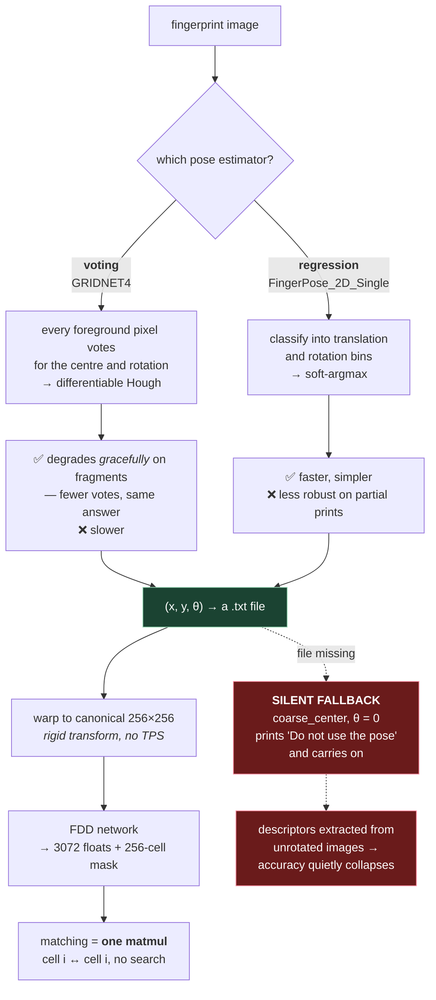

# 7. FLARE / FDD — fixed-length, but still dense

Repo: <https://github.com/Yu-Yy/FLARE>
Papers: TIFS 2026 (FLARE) · WIFS 2024 (FDD, Best Student Paper)

Same lab as DMD, same first author. This is what they built *next*, and reading it right
after DMD is the most efficient way to learn the field, because you can see exactly which
pieces they kept and which they threw away.

## 7.1 The three-sentence version

> FLARE estimates the fingerprint's **global pose** — where the finger's centre is and
> which way it's rotated — then warps the whole image into a canonical 256×256 frame.
> It runs that whole aligned image through a network that is **architecturally identical
> to DMD's**, producing one 16×16 grid of feature cells plus a validity mask — a single
> fixed-length descriptor for the entire finger.
>
> Matching is then just the masked cosine similarity, with **no assignment step and no
> relaxation**, because alignment has already established which cell corresponds to which.

That last clause is the whole point. Hold on to it.

## 7.2 The insight: pay for correspondence once, not every comparison

Go back to the core problem from file 03: *given two prints, which part of A corresponds
to which part of B?*

DMD answers it **at match time**. Every single query-gallery comparison runs a Hungarian
solve plus five rounds of relaxation over an N₁ × N₂ matrix. For a 1-vs-1M search that's
a million Hungarian solves.

FLARE answers it **at extraction time**, once per image, forever. Once both prints are
warped into the same canonical frame, cell (3,7) of the query *is* cell (3,7) of the
gallery. No search required.

```
DMD:     extract (cheap-ish) ────► match (EXPENSIVE, per pair)
FLARE:   extract (EXPENSIVE) ────► match (one dot product, per pair)
```

If you compare each print against a handful of others, DMD's split is fine. If you compare
against millions, FLARE's split is the only one that works. **This is the single most
important trade in the field**, and it's why the same lab built both.

The catch, of course: if pose estimation is wrong, everything downstream is wrong, and
there's no recovery. DMD has no such single point of failure. That's the price.

## 7.3 The pipeline

```
┌────────────────────────────────────────────────────────────────────┐
│ STAGE 1 — POSE ESTIMATION                                          │
│ extract_VotingPose.py    OR    extract_RegressionPose.py           │
│ whole image → (x, y, θ) written to a .txt per image                │
└──────────────────────────────┬─────────────────────────────────────┘
                               │
┌──────────────────────────────▼─────────────────────────────────────┐
│ STAGE 2 — DESCRIPTOR EXTRACTION      extract_FDD.py :: extracting() │
│ warp image to canonical 256×256 using the pose                     │
│ FDD network → feature (3072 floats) + mask (256 floats)            │
│ → one .pkl per image                                               │
└──────────────────────────────┬─────────────────────────────────────┘
                               │
┌──────────────────────────────▼─────────────────────────────────────┐
│ STAGE 3 — MATCHING                   extract_FDD.py :: matching()   │
│ stack all query feats [Nq, 3072], all gallery feats [Ng, 3072]     │
│ ONE masked-cosine matmul → full score matrix → CSV                 │
└────────────────────────────────────────────────────────────────────┘
```

`extract_FDD.py` runs stages 2 and 3 back to back in its `__main__`. There's no separate
evaluation script in this repo — you get a score matrix CSV and compute metrics yourself.

There's also a **FLARE-Enh** module (image enhancement for low-SNR latents), which lives
in a *separate* repo: <https://github.com/Yu-Yy/FLARE_ENH>. Not covered here.

Stage 1 is where FLARE spends the supervision that DMD refuses to spend, so it's worth
drawing the branch and its consequences in one picture:



The red path is the one to remember. FLARE buys its speed by resolving correspondence **once**,
at extraction — which means the pose estimate is load-bearing for everything downstream, and
the repo fails soft rather than loud when it's missing. **If FLARE results look bad, check that
the pose files exist before you debug anything else.**

## 7.4 Pose estimation, strategy 1: voting (`extract_VotingPose.py`)

Model: `GRIDNET4` in `models/model_zoo.py:20`. It's described in its own docstring as a
"FingerNet based votenet."

**The idea — learned Hough voting.** Remember the generalised Hough transform from file
03? Same principle, but the votes come from a network instead of a formula:

> Every foreground pixel in the image looks at its local ridge structure and votes:
> *"based on what I can see around me, the finger's centre is over there, and the finger
> is rotated by about this much."* Then you aggregate all the votes.

Why voting rather than direct prediction: **it degrades gracefully on partial prints.**
If you only have 20% of a finger, you get 20% as many votes — but the votes you do get
still point at the right answer. A network that regresses the pose from a global pooled
feature has no such property; feed it a fragment and it has no idea what it's looking at.

Walking the forward pass (`model_zoo.py:114`):

```python
processed_tv = self.preprocess_tv(input)     # FastCartoonTexture — TV decomposition
processed   = self.input_layer(processed_tv) # NormalizeModule + FingerprintCompose
# ResNet-18 encoder
layer0..layer4
decoder = self.decoder((layer4, layer3, layer2, layer1))   # U-Net-style skip decoder
pixels_out = torch.split(self.pixels_out(decoder), (1, *num_center, *num_center, 1), dim=1)
out_seg    = torch.sigmoid(pixels_out[0])    # segmentation
out_center = pixels_out[1:3]                 # per-pixel centre vote distributions
out_grid   = pixels_out[3:5]                 # per-pixel grid/offset predictions
out_att    = torch.sigmoid(pixels_out[-1]) * out_seg.detach()   # attention, gated by seg
out_center_2d, out_theta_2d, out_exp = dense_hough_voting4(...)
```

Things worth noticing:

- **`FastCartoonTexture`** — total-variation decomposition splitting the image into a
  smooth "cartoon" part and an oscillatory "texture" part. Ridges are texture; background
  gradients and shading are cartoon. It's a classical, non-learned preprocessing step that
  strips illumination variation before the network ever sees the image. Cheap and effective.
- **`num_pose_2d=(33,33,1)`** — the centre is predicted as a distribution over a 33×33
  grid, not as two regressed numbers. Distributions over bins are much easier to learn
  than raw coordinates, and they carry uncertainty.
- **Attention gated by segmentation** (`* out_seg.detach()`) — background pixels can't
  vote. `.detach()` stops the attention gradient from corrupting the segmentation head.
- **U-Net decoder with skips** — pose needs both fine ridge detail and global context.

## 7.5 Pose estimation, strategy 2: regression (`extract_RegressionPose.py`)

Model: `FingerPose_2D_Single` (`model_zoo.py:427`). Simpler and faster — a straight
convnet that outputs two distributions, then converts them to numbers.

```python
model = FingerPose_2D_Single(
    inp_mode='fp',
    trans_out_form='claSum', trans_num_classes=512,   # 256 x-bins + 256 y-bins
    rot_out_form='claSum',   rot_num_classes=180,     # 180 rotation bins
)
```

Despite the file being called "Regression", note `claSum` — it *classifies* into bins and
then takes an expectation. That's **soft-argmax**, and it's the best of both worlds:
classification is easy to train, but the output is continuous rather than quantised.

The conversion lives in `utils/trans_est.py`. Translation (`classify2vector_trans`, line 23):

```python
trans_tensor = np.linspace(-256, 256, trans_num_classes // 2)   # bin centres
x_pred = torch.sum(x_pred * trans_tensor, dim=-1) / (torch.sum(x_pred, dim=-1) + eps)
```

A probability-weighted average of the bin centres. Straightforward.

Rotation (`classify2vector_rot`, line 71) is the interesting one, and it's worth
understanding because **it's a mistake people make constantly**:

```python
cos_pred = torch.sum(pred_theta * torch.cos(rot_tensor), dim=-1) / (torch.sum(pred_theta, dim=-1) + eps)
sin_pred = torch.sum(pred_theta * torch.sin(rot_tensor), dim=-1) / (torch.sum(pred_theta, dim=-1) + eps)
ang_pred = torch.rad2deg(torch.arctan2(sin_pred, cos_pred))
```

It does **not** average the angles. It averages `cos` and `sin` separately, then recovers
the angle with `atan2`.

> **Why this matters.** Suppose the network is torn between 179° and −179° — which are
> 2° apart. Naively averaging gives 0°, which is 180° wrong. Averaging on the unit circle
> gives ≈180°, which is right. **Never take the arithmetic mean of angles.** This shows up
> everywhere in fingerprints (orientation fields, minutia directions, pose) and it's a
> classic silent bug.

There's also `claMax` (`selectMax` at line 16) — zero out everything below 99.9% of the
peak, then take the expectation of what's left. Use it when the distribution is
multi-modal and you want the dominant mode instead of a blend of two wrong answers.

### Both strategies end the same way

```python
T_inv = np.linalg.inv(T)
pose_2d[:2] = np.dot(T_inv[:2, :2], pose_2d[:2]) + T_inv[:2, 2]
pose_2d[2]  = (pose_2d[2] + 180) % 360 - 180
np.savetxt(name, pose_2d)
```

The network saw a padded, resized image, so the predicted pose is in *that* frame. `T` is
the transform that got there, so `T_inv` maps the pose back to **original image
coordinates**. Then the angle is wrapped to (−180, 180].

Output: a plain three-line `.txt` per image, in a folder named `VotingPose/` or
`RegressionPose/` sitting alongside `image/`. Human-readable, easy to inspect, easy to
swap for ground-truth poses. Good design.

> **Which one should you use?** The README exposes both via `-p`. Voting is more robust on
> partial and latent prints (graceful degradation, as above); regression is faster and
> simpler. The fact that they ship both and let you choose per-run is itself informative —
> there isn't a universal winner.

## 7.6 Alignment: turning a pose into a canonical image

`datasets/FPdataset.py:148`, `Descdataset.process_img`:

```python
if pose_2d is not None:
    img_c = pose_2d[:2]
    theta = pose_2d[2]
else:
    img_c = coarse_center(img_ori, img_ppi=500)[::-1]   # fallback
    theta = 0

T = affine_matrix(
    scale=self.tar_shape[0] * 1.0 / self.middle_shape[0],   # 256/512 = 0.5
    theta=np.deg2rad(theta),
    trans=-img_c,
    trans_2=center + shift,
)
img = cv2.warpAffine((img_ori - 127.5) / 127.5, T[:2], dsize=tuple(self.tar_shape[::-1]), ...)
```

Translate so the pose centre is at the origin, rotate by −θ, scale, translate to the
target centre. A plain rigid transform — **no TPS here**, unlike DMD. FLARE doesn't need
the spline because it isn't reproducing a training-time warp augmentation at inference.

Two details worth flagging:

- **The fallback is silent.** If the pose file is missing, `Descdataset.__init__` prints
  `"Do not use the pose"` and carries on with `coarse_center` — an intensity-weighted
  centroid after Gaussian blur and morphological opening (`FPdataset.py:30`) — and
  **θ = 0**. Your descriptors will be extracted from unrotated images and accuracy will
  quietly collapse. If FLARE results look bad, **check that pose files exist first.**
- `scale = 256/512 = 0.5`, so a 512-pixel-wide region of the original 500 PPI image is
  squeezed into 256 pixels. FDD effectively works at ~250 PPI over a large area, where
  DMD works at 500 PPI over a small one. Big field of view, coarse detail — the opposite
  end of the trade from DMD, and exactly right for a whole-finger descriptor.

## 7.7 The FDD network — identical to DMD's, different input

Open `models/model_zoo.py:273` (FLARE) next to `models/model_zoo.py:19` (DMD). The `FDD`
class and the `DMD` class are **the same code**. Same ResNet-34 trunk (`layers=[3,4,6,3]`,
`BasicBlock`), same fork into `layer3/layer4` and `texture3/texture4`, same
`embedding` / `embedding_t` / `foreground` / `minu_map` heads, same `PositionEncoding2D`.

The differences are entirely in the config (`model_weights/desc_configs.yaml`):

| | DMD | FDD |
|---|---|---|
| `tar_shape` | 128 × 128 | **256 × 256** |
| `middle_shape` | 128 × 128 | **512 × 512** |
| `ndim_feat` | 6 | 6 |
| Input is… | a patch around one minutia | **the whole aligned finger** |
| Spatial cells (`tar/16`) | 8 × 8 = 64 | **16 × 16 = 256** |
| Descriptor per image | N × 768 floats | **1 × 3072 floats** |
| Mask per image | N × 64 | **1 × 256** |

So: `2 branches × 6 channels × 256 cells = 3072`.

One real code difference: FDD's `get_embedding` is decorated `@torch.no_grad()`
(`model_zoo.py:372`) and *does* compute `minu_map`, returning it in the output dict — even
though `extract_FDD.py` ignores it. DMD's `get_embedding` skips it entirely. So FDD
inference wastes a little work on an unused head. Harmless, but it's the kind of thing to
notice when you're profiling.

**Template size arithmetic**, since this is what you'd actually store:

- floats: (3072 + 256) × 4 bytes ≈ **13 KB per finger**
- binarised features, thresholded mask: 3072 bits + 256 bits ≈ **416 bytes per finger**

Compare DMD's ~333 KB for a 100-minutiae rolled print. That's a **25×** reduction as
floats, and ~800× binarised. At a million records: 13 GB vs 333 GB, or 416 MB binarised.

## 7.8 Matching — look how short it is

`extract_FDD.py:99`:

```python
def calculate_score(feat1, feat2, mask1, mask2, ndim_feat=12, binary=False, verbose=False):
    feat1_mask = np.tile(mask1, (1, ndim_feat))
    feat2_mask = np.tile(mask2, (1, ndim_feat))
    if binary:
        feat1_dense = (feat1_dense > 0).astype(np.float32)
        feat2_dense = (feat2_dense > 0).astype(np.float32)
        feat1_mask  = (feat1_mask > 0.5).astype(np.float32)
        feat2_mask  = (feat2_mask > 0.2).astype(np.float32)
        n12 = np.matmul(feat1_mask, feat2_mask.T)
        d12 = n12 - np.matmul(feat1_mask*feat1_dense, (feat2_mask*feat2_dense).T) \
                  - np.matmul(feat1_mask*(1-feat1_dense), (feat2_mask*(1-feat2_dense)).T)
        score = 1 - 2 * np.where(n12 > 0, d12 / n12.clip(1e-3, None), 0.5)
    else:
        x1  = np.sqrt(np.matmul(feat1_mask * feat1_dense**2, feat2_mask.T))
        x2  = np.sqrt(np.matmul(feat1_mask, (feat2_dense**2 * feat2_mask).T))
        x12 = np.matmul(feat1_mask * feat1_dense, (feat2_mask * feat2_dense).T)
        score = x12 / (x1 * x2).clip(1e-3, None)
    return score
```

If that looks familiar, it should — **it is DMD's `calculate_score_torchB`, in numpy.**
Identical masked cosine, identical binary Hamming path. Compare it to file 06 §6.8 side
by side; the correspondence is line for line.

But look at what's **missing**:

| DMD has | FDD has |
|---|---|
| Hungarian assignment | — |
| Relaxation labeling | — |
| Adaptive top-`n_pair` selection | — |
| Score normalisation `× √(n₁₂/N_mean)` | — |
| Per-image-type mask thresholds (`THRESHS`) | hardcoded 0.5 / 0.2 |

**All of it is gone.** Not because it wouldn't help, but because it's *unnecessary*: those
mechanisms all exist to establish and validate correspondence between unordered minutiae
sets, and alignment already did that job.

And note the shape. `feat1` here is `[N_query, 3072]` — the whole query set — and `feat2`
is `[N_gallery, 3072]`. The **entire score matrix is three matmuls.** Not per pair. Total.

```python
score_matrix = calculate_score(search_feat, gallery_feat, search_mask, gallery_mask,
                               config.MODEL.ndim_feat * 2, config.binary, verbose=True)
```

That single call at `extract_FDD.py:161` does what DMD's entire batched `MatchDataset`
loop does. The `verbose=True` flag makes it print a per-pair timing, which is a nice touch
for exactly the comparison you'd want to make.

> **The binary thresholds are hardcoded to 0.5 (query) and 0.2 (gallery)**, with DMD's
> `THRESHS` dict left behind as a comment on line 110. So FLARE's binary mode bakes in one
> query-vs-gallery image-type assumption. If your query and gallery are both rolled prints,
> that 0.5 is probably too strict. Something to change if you experiment.

## 7.9 Running it

```bash
# pose (pick one)
python extract_VotingPose.py     -f /path/to/dataset -g 0
python extract_RegressionPose.py -f /path/to/dataset -g 0

# descriptors + matching, in one command
python extract_FDD.py -f /path/to/dataset -g 0 -p VotingPose
python extract_FDD.py -f /path/to/dataset -g 0 -p RegressionPose -b   # binary
```

Expected layout:

```
your_dataset/
├── image/{query,gallery}/*.png
├── VotingPose/{query,gallery}/*.txt      ← created by stage 1
└── FDD_feat_VotingPose/{query,gallery}/*.pkl + score_FDD.csv
```

The folder-name derivation is pure string substitution on the word `image`
(`FPdataset.py:66`, `128`, `138`, `141`):

```python
self.posefolder_path = folder_path.replace("image", pose_name)
self.mask_folder     = folder_path.replace("image", "fingernet/seg")
self.desc_folder     = folder_path.replace("image", f"{method_name}_feat_{pose_name}")
```

> ⚠️ **`.replace()` replaces every occurrence.** If your dataset path contains the
> substring `image` anywhere else — `/data/imagenet/`, `/mnt/images/fp/image/query` — this
> silently produces a wrong path. Keep `image` unique in the path.

Also note `mask_folder` points at `fingernet/seg` — if you supply FingerNet segmentation
masks there, they get warped alongside the image and returned in the batch. `extract_FDD.py`
reads them into `gt_masks` but **never uses them** (`extract_FDD.py:77-79`). Dead code in
the shipped path; presumably live during training.

## 7.10 Same portability caveats as DMD

`.cuda()` is hardcoded in `extract_FDD.py:62`, `extract_VotingPose.py:49`, and
`extract_RegressionPose.py:88`, with no CPU fallback. Unlike DMD, though, there's **no
CUDA extension to compile** — no `torch_linear_assignment`, because there's no assignment
problem. That makes FLARE substantially easier to port to CPU or MPS: swap the `.cuda()`
calls for a device variable and it should run, just slowly. The matching function is
already pure numpy.

---

## Check yourself

1. Why does FDD need no Hungarian algorithm and no relaxation labeling? Answer in one
   sentence, then check it against §7.2.
2. What does FLARE gain by moving correspondence from match time to extraction time?
   What does it give up?
3. Explain learned Hough voting for pose. Why does it degrade more gracefully on a
   partial print than direct regression?
4. Why does `classify2vector_rot` average cos and sin instead of averaging the angle?
   Give the concrete failure case.
5. What is `claSum`, and why is classify-then-take-expectation easier to train than
   direct coordinate regression?
6. FDD and DMD use the same network class. Name every difference in what they produce,
   and trace each one back to a config value.
7. FLARE's pose fallback is silent. Describe the failure: what goes wrong, and what
   symptom would you see?
8. Compute the binarised template size for FDD and for a 100-minutia DMD print. What's
   the ratio?

(Answers in `12-exercises.md`.)
