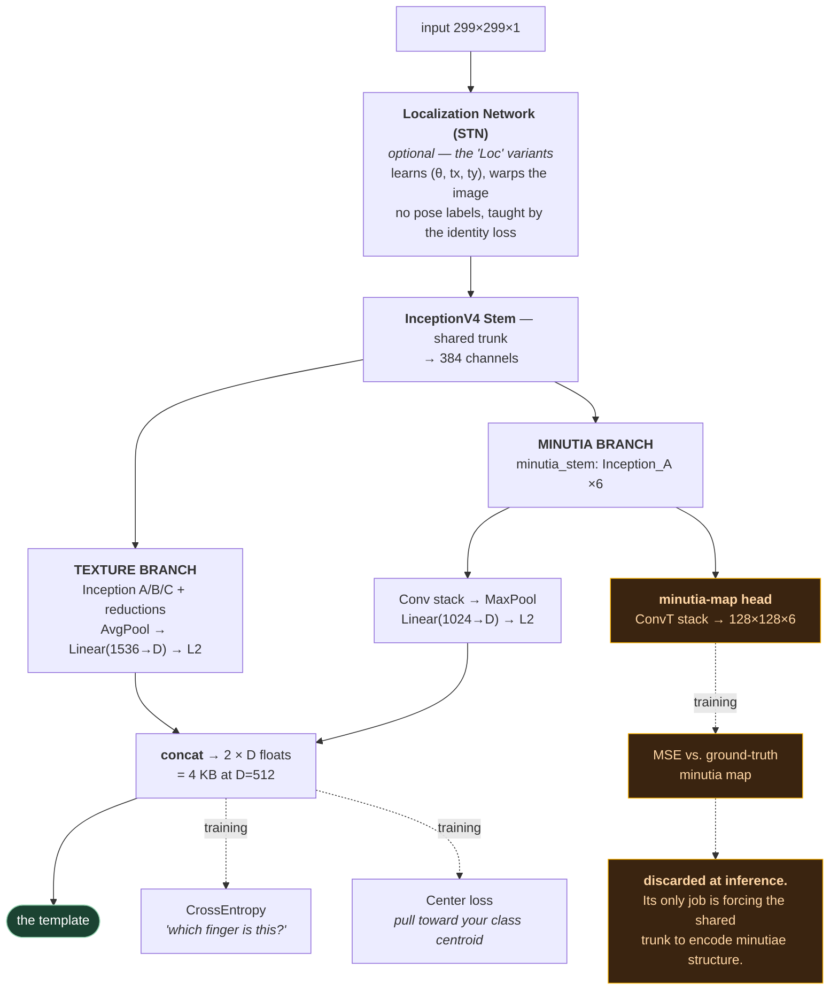

# 8. DeepPrint / flx — one vector, and nothing else

Repo: <https://github.com/tim-rohwedder/fixed-length-fingerprint-extractors>
Original paper: DeepPrint — <https://arxiv.org/abs/1909.09901> (Engelsma, Cao, Jain)
This repo's paper: Rohwedder et al., BIOSIG 2023

This one is different in character from the other two. DMD and FLARE are research
releases: inference code, download the weights, reproduce the table. **flx is a
well-engineered library** — pip-installable, unit-tested, tutorial notebooks, and it
includes the training code the other two withhold. If you want to understand the *full*
lifecycle of a learned fingerprint representation, this is the repo to read.

It's also the most extreme point on the local↔fixed-length axis, which makes it a clean
contrast.

## 8.1 The three-sentence version

> DeepPrint feeds a 299×299 fingerprint image through an Inception-v4 stem, then two
> branches — texture and minutiae — each of which **globally pools its feature map away**
> and projects to a single L2-normalised vector of length D (512 is the paper's
> recommendation).
>
> Optionally, a **Spatial Transformer Network** in front learns to crop and rotate the
> image into a canonical pose, supervised by *nothing but the identity loss*.
>
> Matching two fingerprints is a **single dot product**.

## 8.2 The architecture

Conceptually first, then layer by layer. The shape to hold in your head:



Note what leaves the network at inference: **only the green box.** The orange minutia-map head
is pure training scaffolding — it shapes the trunk's features and is then thrown away. File 09
§9.3 shows all three repos doing exactly this, which is the strongest evidence in the course
that it's a real technique rather than one lab's habit.

Now the same thing with every layer named:

```
input 299×299×1
      │
  ┌───▼──────────────────┐
  │ LocalizationNetwork  │  (optional — the "Loc" variants)
  │  = Spatial Transformer│  learns (θ, tx, ty), warps the image
  └───┬──────────────────┘
      │
  ┌───▼──────────────┐
  │ InceptionV4 Stem │  BasicConv ×3 + Mixed_3a/4a/5a  → 384 ch
  └───┬──────────────┘
      │
      ├──────────────────────────────┬────────────────────────────┐
      │ TEXTURE BRANCH               │ MINUTIA BRANCH             │
      ▼                              ▼                            │
  Inception_A ×4 + Reduction_A   Inception_A ×6  (minutia_stem)   │
  Inception_B ×7 + Reduction_B        │                           │
  Inception_C ×3                      ├───────────┐               │
      │                               │           │               │
  AvgPool2d(8)                   Conv 384→768→768→896→1024   ConvT 384→128
  Flatten                        MaxPool2d(9)                Conv 128→128
  Dropout(0.2)                   Flatten                     ConvT 128→32
  Linear(1536 → D)               Dropout(0.2)                Conv 32→6
  L2 normalize                   Linear(1024 → D)                 │
      │                          L2 normalize                     ▼
      ▼                               │                    minutia_map
  texture_embedding (D)          minutia_embedding (D)      128×128×6
                                                          (TRAINING ONLY)
```

Final representation = `concat(texture_embedding, minutia_embedding)` → **2D floats**.
At D = 512 that's 1024 floats = **4 KB per finger**.

Read `flx/models/deep_print_arch.py` alongside this. The `_Branch_*` classes map onto
the boxes one-to-one.

### The line that defines the whole approach

`deep_print_arch.py:78-93`, in the texture branch:

```python
self._3_avg_pool2d = nn.AvgPool2d(kernel_size=8)
self._4_flatten    = nn.Flatten()
self._5_dropout    = nn.Dropout(p=0.2)
self._6_linear     = nn.Linear(1536, texture_embedding_dims)
...
x = torch.nn.functional.normalize(torch.squeeze(x), dim=1)
```

`AvgPool2d(kernel_size=8)` over an 8×8 feature map collapses **all spatial information**
into one number per channel. This is exactly the "global pooling" that file 04 said DMD
refuses to do, and DeepPrint does it deliberately.

The minutia branch does the same thing with `MaxPool2d(kernel_size=9)` at line 124.

Consequences, and they're all connected:

- ➕ Output is a plain vector. Cosine similarity. ANN-indexable. Tiny.
- ➕ Total pose invariance is *possible*, because there's no spatial layout to misalign.
- ➖ **No validity mask is possible.** There's nothing left to mask. A half-visible print
  produces a vector polluted throughout by the missing half, and you cannot tell which
  dimensions are affected.
- ➖ No graceful degradation on partial prints. This is why DeepPrint is a
  plain/rolled method and DMD is a latent method.

The `torch.nn.functional.normalize` at the end matters too: embeddings live on the unit
hypersphere, so **dot product == cosine similarity**, and the matcher can skip
normalisation entirely.

## 8.3 The Spatial Transformer — alignment with no ground truth

`flx/models/localization_network.py`. This is the most conceptually interesting piece in
the repo, and it's a genuinely different answer to the alignment question than FLARE's.

```python
self.resize = torchvision.transforms.Resize(size=(128, 128), antialias=True)
self.localization = nn.Sequential(   # 4× (Conv + MaxPool)
    Conv2d(1,24,5) → MaxPool → Conv2d(24,32,3) → MaxPool
    → Conv2d(32,48,3) → MaxPool → Conv2d(48,64,3) → MaxPool)
self.fc_loc = nn.Sequential(Linear(8*8*64, 64), ReLU(), Linear(64, 3))

# Initialize the weights/bias with identity transformation
self.fc_loc[2].weight.data.zero_()
self.fc_loc[2].bias.data.copy_(torch.tensor([0, 0, 0], dtype=torch.float))
```

Then in `forward`:

```python
theta = theta_x_y[:, 0]                       # rotation angle
m11, m12, m13 =  cos(theta), -sin(theta), theta_x_y[:, 1]
m21, m22, m23 =  sin(theta),  cos(theta), theta_x_y[:, 2]
mat  = ...view(-1, 2, 3)
grid = F.affine_grid(mat, x.size(), align_corners=False)
x    = F.grid_sample(x, grid, align_corners=False)
```

Three things to appreciate here:

1. **It predicts only 3 numbers**, and assembles them into a *constrained* rotation +
   translation matrix. A generic STN regresses all 6 affine parameters and can learn
   shears and flips — nonsense for a fingerprint. Constraining the family to rigid
   transforms is a strong, correct prior.

2. **The identity initialisation is essential.** Zeroed final weights and zero bias mean
   the STN starts as a no-op: `cos(0)=1, sin(0)=0, tx=ty=0`. Training begins from
   "don't transform anything" and learns to deviate. Without this, a randomly-initialised
   STN warps images arbitrarily on step one, the embedding network learns from garbage,
   and the whole thing diverges. **Every STN needs this trick.**

3. **`affine_grid` + `grid_sample` are differentiable.** That's the entire point — the
   gradient of the identity loss flows back *through the warp* into the pose predictor.

> **Contrast with FLARE, and this is the key comparison.**
>
> | | FLARE pose | DeepPrint STN |
> |---|---|---|
> | Supervision | explicit ground-truth pose labels | **none** — only the identity loss |
> | Objective | "predict the true finger centre and angle" | "warp it however makes identities easiest to separate" |
> | Output | interpretable `(x, y, θ)` in a `.txt` you can inspect | an internal warp you never see |
> | Reusable? | yes, by any downstream component | no, entangled with this model |
> | Needs labelled pose data? | **yes** | no |
>
> Neither is strictly better. FLARE's is inspectable, debuggable, and reusable; it costs
> you a labelled pose dataset. DeepPrint's is free and directly optimises the thing you
> actually care about; but when it fails you have no signal telling you so.
>
> The BIOSIG paper measured exactly this: they perturbed image poses with increasing
> rotation and translation and watched accuracy fall. That experiment
> (`flx/scripts/run_extraction_with_pose_variation.py`,
> `plot_alignment_experiments.py`) is the empirical answer to "how much does alignment
> matter?" — and the answer is: a lot.

## 8.4 The losses — and how they differ from CosFace

`flx/models/deep_print_loss.py`:

```python
W_CROSS_ENTROPY    = 1.0
W_CENTER_LOSS      = 0.125
W_MINUTIA_MAP_LOSS = 0.3
```

```python
def forward(self, embeddings, logits, labels):
    crossent_loss = self.crossent_loss_fun(logits, labels)   # nn.CrossEntropyLoss
    center_loss   = self.center_loss_fun(embeddings, labels) # CenterLoss
    return W_CROSS_ENTROPY * crossent_loss + W_CENTER_LOSS * center_loss
```

Three components:

- **Cross-entropy on identity logits.** "Which of the N training fingers is this?"
  Standard classification. Each branch gets its own `Linear(D, num_fingerprints)` head.
- **Center loss** (`flx/models/center_loss.py`). Maintains a learned centroid per class
  and penalises the distance from each embedding to its class centroid. This is the
  *explicit* version of "pull same-identity embeddings together."
- **Minutia map MSE**, weighted per sample (`_compute_minutia_map_loss`, line 12). The
  auxiliary head.

> **Center loss vs CosFace — the comparison worth internalising.**
>
> Both solve the same problem: plain softmax only makes classes *separable*, but at test
> time you compare identities never seen in training, so you need same-identity embeddings
> genuinely *tight* and different-identity ones genuinely *far*.
>
> - **Center loss** (DeepPrint, 2016-era) adds a **separate term** that explicitly pulls
>   embeddings toward a learned centroid. Two losses, a weight to tune (0.125 here), and
>   an extra set of learnable centroids.
> - **CosFace / ArcFace** (DMD, FDD) **modifies the softmax itself**, subtracting an
>   angular margin from the correct class's logit so the network must separate classes
>   *with room to spare*. One loss, no extra parameters, and it operates natively on the
>   hypersphere where you'll actually compare things.
>
> Margin losses generally won. If you were building this today, you'd reach for
> ArcFace/CosFace. Center loss here is a period detail — but a clear, readable one, which
> is precisely why this repo is good for learning.

Note also that with `DeepPrint_TexMinu`, **each branch is supervised independently** with
its own logits and its own loss. They're not jointly trained toward one embedding; they're
two separate classifiers that happen to share a stem, concatenated at the end. Simple, and
it means you can train and ship `Tex`-only variants — which is exactly what the paper's
embedding-size study does.

> ⚠️ Small bug worth spotting, in `DeepPrintLoss_TexMinu.__init__`
> (`deep_print_loss.py:166-173`): `minu_loss_fun` is constructed with
> `num_embedding_dims=texture_embedding_dims` and `texture_loss_fun` with
> `minutia_embedding_dims`. The two are swapped. Harmless in every shipped config because
> `get_DeepPrint_TexMinu` passes `num_dims` for both — but it would break the moment you
> tried different dimensionalities per branch. A nice illustration of why you read the
> code and not just the paper.

## 8.5 Minutia maps — turning a minutiae list into a tensor

`flx/data/minutia_map.py`. This is the most directly reusable idea in the repo, and it
answers a question that comes up constantly:

> *A minutiae list is variable-length and unordered. A CNN needs a fixed-size tensor.
> How do you convert?*

The answer (from Cao & Jain, *End-to-End Latent Fingerprint Search*), implemented in
`create_minutia_map` at line 88:

1. Make an output tensor of shape `(H, W, n_layers)`. Each **layer is an orientation
   bucket**: layer *k* represents direction `k · 2π / n_layers`.
2. For each minutia, stamp a **Gaussian blob** at its `(x, y)`.
3. Distribute that blob's energy **across layers** according to how close each layer's
   orientation is to the minutia's:

```python
def _layer_weights_softmax(orientations, n_layers):
    layer_orientations = np.linspace(0, 2*np.pi, num=n_layers, endpoint=False)
    orientation_diffs = np.abs(layer_orientations - orientations[:, np.newaxis])
    mask = orientation_diffs > np.pi          # take the SHORTER way round the circle
    orientation_diffs[mask] *= -1
    orientation_diffs[mask] += 2 * np.pi
    weights = np.exp(-orientation_diffs)
    return weights * (1 / np.sum(weights, axis=1))[:, np.newaxis]
```

So a minutia pointing at 0° lights up layer 0 strongly and its neighbours weakly. The
result is a fixed-size, dense, **differentiable** encoding of a variable-length minutiae
set — a soft 3D histogram over (x, y, θ).

Two details that show care:

- The `orientation_diffs > np.pi` correction takes the shorter arc around the circle —
  the same angular-wraparound care as FLARE's cos/sin averaging in file 07 §7.5. **The
  circle keeps biting.**
- The output is padded by `2·sigma` and cropped at the end (`out_image[radius:-radius,
  radius:-radius]`), so blobs near the border don't need bounds checks in the inner loop.

**Why you care beyond flx:** all three repos use a minutiae-map auxiliary head — DMD's
`minu_map` (6 channels at 128×128), FDD's identical head, DeepPrint's `_Branch_MinutiaMap`
(also 6 channels at 128×128). They all need this same ground truth. flx is the only one
of the three that **ships the code to build it**, since it's the only one with training
code. If you ever train any of these, this file is what you need.

## 8.6 Matching — one line

`flx/benchmarks/matchers.py`:

```python
class CosineSimilarityMatcher(VectorizedMatcher):
    def similarity(self, sample1, sample2) -> float:
        emb1 = self._embeddings.get(sample1)
        emb2 = self._embeddings.get(sample2)
        return np.dot(emb1, emb2)                       # ← that's it

    def preload_vectorized(self, samples) -> None:
        self._matrix = np.stack([self._embeddings.get(s) for s in samples])

    def vectorized_similarity(self, sample) -> np.ndarray:
        emb = self._embeddings.get(sample)
        vals = np.matmul(self._matrix, emb.vector)      # 1 vs whole gallery, one matmul
        vals[vals < 0] = 0
        return vals
```

`np.dot` is the *entire* matching algorithm. Legal because the model L2-normalised the
embeddings, so the dot product is already the cosine.

Put the three side by side and the progression is stark:

| | Matching code |
|---|---|
| **DMD** | masked cosine → Hungarian → 5× relaxation → adaptive top-k mean (~150 lines) |
| **FDD** | masked cosine (~25 lines) |
| **DeepPrint** | `np.dot` (1 line) |

The clamp `vals[vals < 0] = 0` has a lovely comment: *"Negative similarity makes no sense,
as a fingerprint does not have an opposite."* True, and it slightly helps score
distributions by removing a meaningless tail.

## 8.7 The benchmarks — the most rigorous evaluation of the three

This is where flx clearly beats the other two, and it's worth studying **even if you never
use DeepPrint**, because the metric implementations are careful and reusable.

### Verification — `flx/benchmarks/verification.py`

A `VerificationBenchmark` is an explicit list of `BiometricComparison` objects, each
tagged mated or non-mated, **serialisable to JSON**. That's a much better design than
DMD's "everything not in the genuine list is an impostor" — you get reproducible,
version-controllable comparison sets, and you can define which impostor pairs are fair to
include.

```python
def threshold_for_fmr(self, fmr: float):
    nms_sorted = np.sort(self._non_mated_scores)
    num_fm = int(self._non_mated_scores.shape[0] * fmr) + 1
    return nms_sorted[-num_fm]
```

"Sort impostor scores; let exactly `num_fm` of them through; return that score." A direct,
readable definition of the operating threshold. Compare it to DMD's
`np.where(far <= 0.001)[0][-1]` idiom (file 02 §2.4) — same concept, two different
expressions. Reading both is how the definition actually sticks.

The EER computation (line 70) is a nice trick worth stealing:

```python
idxs = np.argsort(scores)                                    # sort all scores ascending
num_mated_cumulative     = np.cumsum(is_mated)
num_non_mated_cumulative = np.cumsum(np.logical_not(is_mated))
fnmr = num_mated_cumulative / len(self._mated_comparisons)
fmr  = (len(self._non_mated_comparisons) - num_non_mated_cumulative) / len(self._non_mated_comparisons)
idx  = np.argmin(np.abs(fnmr - fmr))
return fmr[idx]
```

One sort plus two cumulative sums gives FMR and FNMR at *every possible threshold*
simultaneously; then find where they cross. O(n log n) for the entire DET curve.

### Identification — `flx/benchmarks/identification.py`

This is **open-set** identification, which the other two repos don't model at all, and
it's what a real deployment actually faces.

The distinction: in closed-set identification you assume the probe *is* in the gallery, so
the only question is its rank. In open set, the probe **might not be enrolled**, and
wrongly returning a candidate is a serious error. So each fold contains both:

- **mated searches** — the probe is in the gallery
- **non-mated searches** — the probe is not, and the correct answer is "no match"

giving two metrics the other repos never compute:

```python
def false_positive_identification_rate(self, threshold) -> float:
    # rate of NON-MATED searches that wrongly return an enrolled reference
    return np.sum(self._non_mated_similarities >= threshold) / len(self._non_mated_results)

def false_negative_identification_rate(self, threshold=None, fpir=None) -> float:
    # rate of MATED searches where the probe was NOT in the candidate list
    if threshold is not None:
        return np.sum(self._mated_similarities < threshold) / len(self._mated_results)
    nms_sorted = np.sort(self._non_mated_similarities)
    num_fm = int(len(self._non_mated_similarities) * fpir) + 1
    return self.false_negative_identification_rate(threshold=nms_sorted[-num_fm])
```

**FPIR** and **FNIR** are the ISO metrics for open-set identification, and
`FNIR @ FPIR = x` is the identification analogue of `TAR @ FAR = x`. Note the second
branch: pass `fpir` instead of `threshold` and it derives the threshold from the non-mated
score distribution first — the same operating-point logic as `threshold_for_fmr`.

It also runs **cross-validation folds** (`IdentificationBenchmark._run_single_fold`) and
averages across them, rather than reporting one number from one gallery split. Given how
noisy small-gallery Rank-1 numbers are (file 02 §2.5), that's the right call.

And `_mated_ranks` is retained, so you can still produce a CMC curve.

## 8.8 The paper's findings

Worth knowing, because they're empirical answers to questions you'd otherwise guess at:

1. **Optimal texture embedding size ≈ 512.** They swept dimensionality and found
   performance saturates around 512 floats. Below that you lose accuracy; above it you pay
   for nothing. If you need a default number for a fixed-length fingerprint embedding,
   512 is the defensible one.
2. **Sensor type matters.** Optical and capacitive sensors give measurably different
   performance from the same architecture. A model benchmarked on one is not
   automatically valid on the other.
3. **Pose alignment matters a lot.** Perturbing pose degrades accuracy substantially —
   which is the experimental justification for FLARE's entire alignment module.

They trained on **SFinGe synthetic** fingerprints (6000 subjects × 10 impressions) plus
MCYT330. Synthetic training data is a real option in this field and worth knowing about.

> **Terminology warning** (from their README): flx uses **"subject"** to mean *a distinct
> fingerprint* and **"impression"** to mean *one capture of it*. It does **not**
> distinguish different fingers of the same person from fingers of different people. That
> deviates from both the paper's own terminology and ordinary usage. Read their code with
> this in mind or you'll misread every benchmark.

## 8.9 Repo structure and running it

```
flx/
├── models/          deep_print_arch.py, deep_print_loss.py, center_loss.py,
│                    localization_network.py, InceptionV4.py, model_training.py
├── extractor/       fixed_length_extractor.py (model+loss factories), extract_embeddings.py
├── benchmarks/      verification.py, identification.py, matchers.py, biometric_search.py
├── data/            dataset.py, image_loader.py, minutia_map.py, embedding_loader.py, ...
├── image_processing/ augmentation.py, binarization.py
├── scripts/         run_extractor_training.py, run_extraction.py, generate_benchmarks.py, ...
└── visualization/   DET curves, CMC/rank plots, score distributions, heatmaps
```

Naming convention: **`DeepPrint_[Loc][Tex][Minu]_<NDIMS>`**. `Loc` = spatial transformer
included, `Tex` = texture branch, `Minu` = minutia branch, `NDIMS` = embedding dimension.
`fixed_length_extractor.py` has a factory function per combination.

```bash
pip install -e .        # needs Python ≥ 3.9
```

Then start with the notebooks — they're the best on-ramp of any of the three repos:

- `notebooks/dataset_tutorial.ipynb` — how to plug in your own data
- `notebooks/model_training_tutorial.ipynb` — train a variant on a small example dataset
- `notebooks/embedding_generation_tutorial.ipynb` — extract embeddings with a trained model

A 512-dim pretrained model is linked from the README (Google Drive).

Training cost, from their README: up to 100 epochs, ~10–15 min/epoch on an A100, and
they recommend ≥8 CPU cores because preprocessing is CPU-bound. Augmentation is rotation
±15°, translation ±25px, and random gain/contrast — modest, and notably *less* aggressive
than the TPS warping DMD uses.

> Unlike the other two repos, **this one has unit tests** (`tests/test_datasets.py`) and
> is properly packaged. It's the only one of the three you could sensibly build on.

---

## Check yourself

1. What does `AvgPool2d(kernel_size=8)` do to the feature map, and what capability does
   that permanently cost DeepPrint?
2. Why can DeepPrint not have a validity mask? Tie your answer back to file 04 §4.4.
3. Why is the STN's final linear layer initialised to zero weights and zero bias?
   What happens on training step 1 without it?
4. The STN predicts 3 numbers, not 6. Why is that a better prior for fingerprints?
5. Compare center loss and CosFace: what problem do both solve, and how does each solve it?
6. Explain how `create_minutia_map` converts an unordered variable-length minutiae list
   into a fixed-size tensor. What do the layers represent?
7. Why does `vectorized_similarity` clamp negatives to zero?
8. What is open-set identification, and what do FPIR and FNIR measure? Why doesn't
   Rank-1 accuracy capture this?
9. Why is `argsort` + two `cumsum`s enough to get the whole DET curve?
10. What embedding size did the BIOSIG paper recommend, and what does that number mean
    practically?

(Answers in `12-exercises.md`.)
