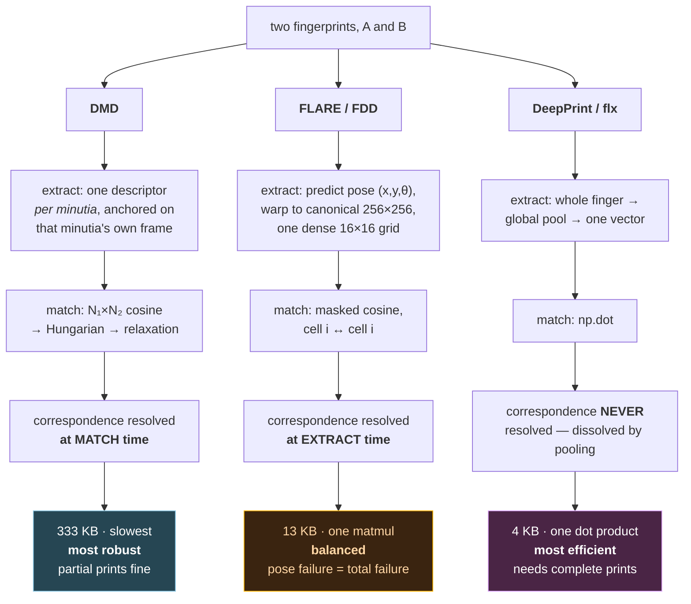
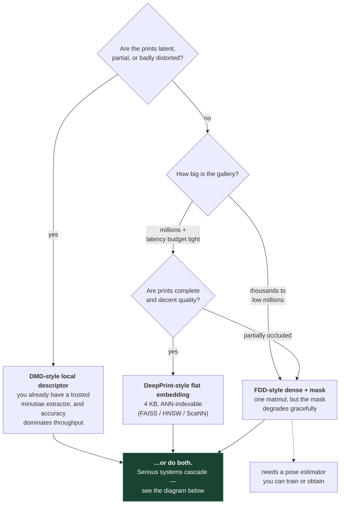
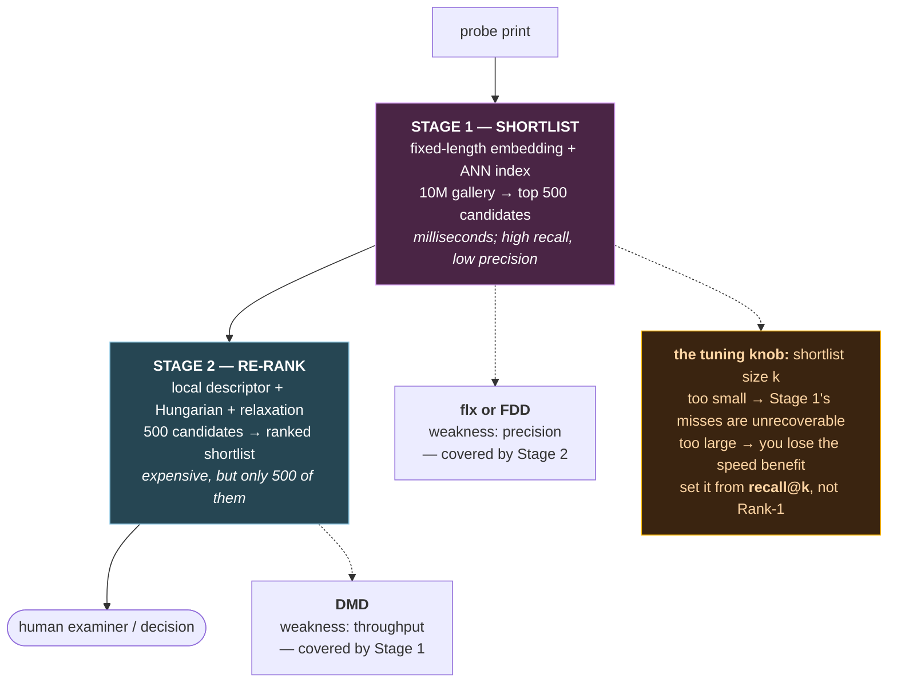

# 9. All three, side by side

This is the file to reread. Everything before it was setup.

## 9.1 The question that organises the whole field

> **Given two fingerprints, how do you know which part of A corresponds to which part of B?**

Every fingerprint matcher is an answer to that question, and the answer determines
everything else: template size, matching cost, robustness to partial prints, and what
external components you need.

The three repos give three different answers.

```
                    WHEN is correspondence resolved?

  DMD                      FLARE / FDD                DeepPrint / flx
  ───────────              ───────────                ───────────────
  at MATCH time            at EXTRACT time            NEVER — dissolved
  (Hungarian assignment    (align to canonical        (global pooling removes
   over minutiae pairs)     pose; cell i ↔ cell i)     spatial structure entirely)

  ▲ most robust                                              most efficient ▲
  │ partial prints OK                                    one dot product    │
  │ no alignment needed                                   4 KB templates    │
  │ N₁×N₂ per comparison                            needs complete, aligned │
  │ 100s of KB per print                                            prints  │
  └────────────────────────────────────────────────────────────────────────┘
```

Cost moves left to right. Robustness moves right to left. There is no free lunch, and
these three repos are three honest points on that curve.

The same three answers, traced as what actually happens to a print:



## 9.2 The comparison table

| | **DMD** | **FLARE / FDD** | **DeepPrint / flx** |
|---|---|---|---|
| **Repo** | [Yu-Yy/DMD](https://github.com/Yu-Yy/DMD) | [Yu-Yy/FLARE](https://github.com/Yu-Yy/FLARE) | [tim-rohwedder/…](https://github.com/tim-rohwedder/fixed-length-fingerprint-extractors) |
| **Venue / year** | IJCB 2024 + journal 2025 | WIFS 2024, TIFS 2026 | BIOSIG 2023 (reimpl. of 2019 paper) |
| **Descriptor type** | local, variable count | fixed-length, dense | fixed-length, flat |
| **Unit of extraction** | one patch per minutia | whole finger | whole finger |
| **Input size** | 128 × 128 patch | 256 × 256 aligned image | 299 × 299 image |
| **Backbone** | ResNet-34-ish | ResNet-34-ish (*same class*) | Inception-v4 |
| **Spatial cells kept** | 8 × 8 = 64 | 16 × 16 = 256 | **0** (pooled away) |
| **Channels** | 6 × 2 branches = 12 | 6 × 2 branches = 12 | — |
| **Template / print** | N × 768 floats + N × 64 mask + N × 3 mnt | 3072 floats + 256 mask | 2 × D floats (D = 512) |
| **Size @ 100 minutiae** | ≈ 333 KB | ≈ 13 KB | ≈ 4 KB |
| **Binarised** | ≈ 10 KB | ≈ 416 B | (not implemented) |
| **Validity mask?** | ✅ per cell | ✅ per cell | ❌ impossible |
| **Alignment** | implicit (minutia frame) | **explicit** learned pose, supervised | **implicit** STN, unsupervised — or none |
| **Needs external minutiae?** | ✅ **yes** (VeriFinger; see file 06 §6.12) | ❌ no | ❌ no (needs maps for *training* only) |
| **Needs pose estimator?** | ❌ no | ✅ yes (ships two) | ❌ no |
| **Matching** | masked cosine → Hungarian → relaxation → top-k mean | masked cosine | `np.dot` |
| **Matching cost** | O(N₁·N₂ + n³) per pair | one matmul, whole matrix | one matmul, whole matrix |
| **Identity loss** | CosFace | CosFace | CrossEntropy + Center loss |
| **Aux minutiae-map head** | ✅ | ✅ | ✅ |
| **Training code shipped?** | ❌ | ❌ | ✅ |
| **Evaluation shipped?** | ✅ Rank-1/10, TAR@FAR | ⚠️ score CSV only | ✅ **best** — open-set, folds, EER, DET |
| **Best at** | **latents**, partial prints | balance; large galleries | speed, scale, clean prints |
| **Weakest at** | throughput | pose failure = total failure | partial / latent prints |

## 9.3 What all three share — the recipe

Strip away the differences and there's a common architecture underneath. This is the
consensus of the field circa 2024, and it's what you'd start from if you built one:

1. **Two branches: texture + minutiae, concatenated.** All three. The rationale is
   identical everywhere: minutiae detection and ridge texture fail under *different*
   conditions, so combining them is strictly more robust than either alone.

2. **A minutiae-map auxiliary head, used only during training.** DMD's `minu_map`, FDD's
   `minu_map`, DeepPrint's `_Branch_MinutiaMap` — all three output **6 orientation
   channels at 128×128**, all three discard it at inference. Its job is to force the
   shared trunk to encode minutiae structure. The convergence on *six channels at 128×128*
   across two independent labs is not coincidence; it traces back to Cao & Jain's
   *End-to-End Latent Fingerprint Search*.

3. **An identity-classification loss with a tightening term.** You train on "which finger
   is this?" over known identities, but plain softmax isn't enough — it only needs classes
   *separable*, and at test time you compare identities never seen in training. So you add
   something that forces tightness: CosFace's angular margin (DMD, FDD) or center loss's
   explicit pull-to-centroid (DeepPrint). Same problem, two eras of solution.

4. **L2-normalised embeddings compared by cosine.** Magnitude carries no identity
   information; direction does.

5. **A binary quantisation path for scale.** DMD and FDD both implement it (threshold
   features at 0, threshold masks, compute Hamming agreement). flx doesn't, but the
   embeddings would quantise fine.

If you understand those five points, you understand the shared 80%.

## 9.4 Alignment: three strategies, in detail

Alignment is where the three genuinely diverge in *kind*, not just degree. Worth its own
treatment.

### DMD — alignment by anchoring

Don't estimate alignment. Crop a patch around each minutia, rotated so the minutia's own
θ points along +x. Same physical skin → same patch, regardless of how the finger was
placed.

- ✅ Cannot fail globally. A wrong minutia hurts one descriptor, not all of them.
- ✅ No pose labels, no pose model.
- ❌ Only works locally. Global correspondence is still unknown → hence Hungarian.
- ❌ Requires an external minutiae extractor to define the anchors.

### FLARE — alignment by explicit supervised pose

Train a model to predict `(x, y, θ)` for the whole finger, warp to canonical, done.
Two strategies shipped:

- **Voting** (`GRIDNET4`) — every foreground pixel votes for the centre and rotation;
  aggregate with a differentiable Hough. Degrades gracefully on partial prints: fewer
  votes, same answer.
- **Regression** (`FingerPose_2D_Single`) — classify into translation and rotation bins,
  then soft-argmax. Faster, simpler, less robust on fragments.

- ✅ Interpretable — pose lands in a `.txt` you can plot and sanity-check.
- ✅ Reusable by any downstream component.
- ❌ Needs ground-truth pose labels to train.
- ❌ **Single point of failure.** Wrong pose → wrong descriptor → no recovery.

### DeepPrint — alignment by unsupervised STN

Put a spatial transformer in front and let the identity loss teach it. It predicts 3
numbers (θ, tx, ty), builds a rigid affine matrix, and warps differentiably.

- ✅ Free. No pose labels at all.
- ✅ Optimises the thing you actually care about, not a proxy.
- ❌ Uninterpretable and non-reusable.
- ❌ Silent failure — no signal when it goes wrong.
- ❌ Needs the identity-initialisation trick or training diverges.

> **The meta-lesson.** These aren't three implementations of one idea; they're three
> different *bets* about where to spend supervision. DMD spends none on alignment and pays
> at match time. FLARE spends labelled pose data and pays at extraction time. DeepPrint
> spends nothing and hopes the identity loss is enough. The BIOSIG pose-perturbation
> experiment (file 08 §8.8) is the empirical referee: alignment matters a lot, which is an
> argument for FLARE's explicitness.

## 9.5 Choosing between them

As a decision procedure — start at the top and take the first branch that fits:



**Use a DMD-style local descriptor when:**
- Inputs are latent, partial, or badly distorted
- Gallery is small-to-medium (thousands, not millions), or you're re-ranking a shortlist
- You already have a trusted minutiae extractor
- Accuracy dominates throughput — forensic casework

**Use an FDD-style fixed-length dense descriptor when:**
- Inputs are reasonable quality but may be partially occluded
- Gallery is large — you need one matmul, not a Hungarian solve
- You can train or obtain a pose estimator
- You want the mask's graceful degradation without paying local-matching cost

**Use a DeepPrint-style flat embedding when:**
- Inputs are plain or rolled, complete, decent quality
- Gallery is very large and you want an ANN index (FAISS, HNSW, ScaNN)
- Template size and bandwidth matter — 4 KB vs 333 KB is a different system design
- Latency budget is tight

**None of the above applies directly to touchless capture.** All three rules assume the print
came off a flat sensor at a known resolution. Finger photos break that assumption before the
matcher is even reached — see file 13, which re-runs this section for contactless input.

**In practice, serious systems cascade:**



Fast-and-approximate narrows the field; slow-and-accurate makes the call. Each stage's
weakness is covered by the other. This is the standard architecture in large-scale
biometric identification, and it's why learning all three of these is more useful than
picking a favourite.

The tuning knob is the shortlist size: too small and Stage 1's misses become
unrecoverable; too large and you lose the speed benefit. You set it from Stage 1's
**recall@k** curve, not from its Rank-1 number.

## 9.6 Reading the code across repos

Some concrete cross-references, useful when you have all three open:

| Concept | DMD | FLARE | flx |
|---|---|---|---|
| The network | `models/model_zoo.py:19` `DMD` | `models/model_zoo.py:273` `FDD` — *same code* | `flx/models/deep_print_arch.py` |
| Inference entry | `get_embedding()` | `get_embedding()` (`@torch.no_grad()`) | `forward()` under `if self.training:` |
| Masked cosine | `evaluate_mnt.py:167` (torch) | `extract_FDD.py:99` (numpy) — *same math* | n/a — no mask |
| Consolidation | `evaluate_mnt.py:235` `lsar_score_torchB` | none — alignment replaces it | none |
| Alignment | `dataloader_densemnt.py:99` TPS crop | `extract_*Pose.py` + `FPdataset.py:148` | `localization_network.py` STN |
| Minutiae-map head | `model_zoo.py:50` | `model_zoo.py:304` | `deep_print_arch.py:139` |
| Minutiae-map **ground truth** | not shipped | not shipped | **`flx/data/minutia_map.py`** ✅ |
| Metrics | `utils/get_eval_metric.py` | not shipped | `flx/benchmarks/` ✅ |
| Training loop | not shipped | not shipped | `flx/models/model_training.py` ✅ |

The pattern is clear: **DMD and FLARE give you the ideas; flx gives you the machinery.**
If you want to actually train something, read flx. If you want to know what to train,
read DMD and FLARE.

## 9.7 Practical caveats across all three

Things that apply regardless of which you pick:

- **Licences are non-commercial.** DMD is Apache 2.0 *but* its README says academic
  research only, no commercial use. FLARE is explicitly "Academic Research License,
  commercial use strictly prohibited." Check flx's own LICENSE separately. If commercial
  use is ever relevant, these are reference implementations to learn from, not code to
  ship. **Read the licences yourself before depending on any of them.**
- **All three hardcode CUDA.** DMD and FLARE call `.cuda()` with no fallback. DMD
  additionally needs a compiled CUDA extension (`torch_linear_assignment`) — FLARE and flx
  don't, so they're much easier to run on CPU.
- **Old pins.** DMD wants Python 3.8 / torch 1.10.1. flx wants Python ≥ 3.9 and is the
  most modern of the three.
- **Evaluation datasets are small.** NIST SD27 has 258 latents. Differences of 1–2% between
  methods on it are noise. Prefer flx's cross-validated, open-set protocol if you're
  measuring anything you intend to believe.
- **None of them handle capture, quality assessment, or standard template formats** —
  those are covered in file 10.

---

## Check yourself

1. State the organising question of §9.1 from memory, and give each repo's answer in one
   clause.
2. Why does robustness trade against efficiency here? Is that fundamental or an accident
   of these three designs?
3. Name the five things all three architectures share.
4. All three use a 6-channel 128×128 minutiae-map auxiliary head. Why 6 channels? What do
   they represent? (Hint: file 08 §8.5.)
5. Compare the three alignment strategies on: supervision needed, interpretability, and
   failure mode.
6. You have a 10M-print gallery of rolled prints and a latent query. Design the pipeline.
   Which method at which stage, and what sets your shortlist size?
7. Your galleries are 5,000 plain prints from a phone sensor, and you need sub-100ms
   matching on a CPU. Which approach, and why not the other two?
8. Which repo would you read to learn how to *train* one of these, and why?

(Answers in `12-exercises.md`.)
