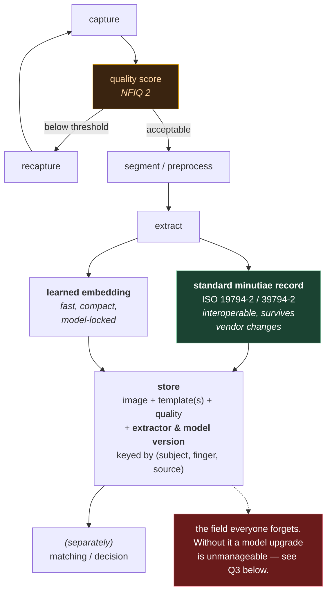

# 10. Templates, formats, and quality

The three research repos all skip this, because papers are scored on accuracy tables. But
if you're doing **template generation** in any real setting, this file is the part that
actually bites — interoperability, quality gating, storage, and standards.

Treat this file as an orientation map, not an authority. Standards documents are the
authority; where a number or clause matters to you, go read the standard.

## 10.1 What "template" actually means

Ambiguously, three different things:

1. **A standardised minutiae record** — a defined binary layout listing minutiae with
   positions, angles, types, and quality. Interoperable across vendors *by design*.
2. **A proprietary SDK template** — whatever a commercial matcher (VeriFinger, Innovatrics,
   Idemia, NEC…) chooses to emit. Usually a superset of minutiae plus undisclosed extra
   features. Only that vendor's matcher can read it.
3. **A learned embedding** — the output of a network like DeepPrint or FDD. A float or
   binary vector.

They are not interchangeable, and the differences are the whole subject of this file.

> **The single most important fact here:** a learned embedding from one model **cannot be
> compared against an embedding from a different model.** Not a different vendor's model —
> a different *training run of the same architecture*. The embedding space is arbitrary;
> only relative geometry within one model is meaningful. Standardised minutiae records,
> by contrast, are readable by anyone.
>
> This is the interoperability-vs-accuracy trade, and it's a system-design decision, not a
> technical detail. It determines whether you can ever swap matchers without re-enrolling
> every subject.

## 10.2 The standards landscape

Roughly, three families you'll meet:

### ISO/IEC 19794-2 — Finger minutiae data

The classic interchange format for minutiae. A record holds a header (resolution, image
size, capture device) and a list of minutiae, each with:

- x, y position
- angle
- type (ending / bifurcation / other)
- a per-minutia quality value

It defines several encodings, including a full record format and more compact "card"
formats for smartcard storage — the compact variants trade precision for bytes, which
matters when a template must fit on a chip.

**INCITS 378** is the US national equivalent; you'll see the two names used almost
interchangeably.

### ISO/IEC 39794-2 — the successor

The newer generation of biometric interchange formats, designed to be extensible
(ASN.1 and XML encodings rather than a fixed binary layout). ICAO has been driving
migration toward the 39794 family for travel documents, with a long transition period.

If you're choosing a format for something new, this is the direction of travel — but check
what your ecosystem actually consumes today, because 19794-2 is still very widely deployed.

### ANSI/NIST-ITL 1 — the transaction format

A different kind of thing: not a template format but a *file/transaction* format for
exchanging biometric data between agencies. Organised into numbered record types:

| Type | Contents |
|---|---|
| Type-1 | Transaction header |
| Type-2 | Descriptive text (subject info) |
| Type-4 | High-resolution grayscale fingerprint image |
| Type-13 | Variable-resolution **latent** image |
| Type-14 | Variable-resolution fingerprint (tenprint) image |
| Type-9 | **Minutiae data** |

The FBI's **EBTS** and Interpol's INT-I are profiles built on top of it. If you ever
exchange data with a law-enforcement system, you'll meet this.

Note that it carries **images** as first-class records, not just templates — which matters,
because…

## 10.3 Store the image, not just the template

A strong operational principle, worth stating plainly:

> **If you can, keep the source image. Templates are derived data.**

Reasons:

- **Algorithms improve.** A better extractor next year can re-derive better templates from
  retained images. It cannot un-bake a template.
- **Format migration.** 19794-2 → 39794-2, or one vendor to another, is a re-extraction
  job if you have images and a re-enrolment campaign if you don't.
- **Learned embeddings are model-locked** (§10.1). Retrain the model and every stored
  embedding is worthless. Retained images make that a batch job instead of a crisis.
- **Forensic review.** A human examiner needs the image.

The counter-pressures are real — storage cost, and privacy/data-minimisation obligations
that may actively require you *not* to retain raw biometrics. That's a legal and policy
question, not a technical one, and it should be answered deliberately rather than by
default.

## 10.4 Image compression — don't reach for JPEG

Fingerprint ridges are exactly the high-frequency structure that block-based DCT
compression damages. JPEG at ordinary quality settings introduces blocking artifacts that
can create and destroy apparent minutiae.

The domain-specific answers:

- **WSQ** (Wavelet Scalar Quantization) — the FBI's specification for 500 PPI fingerprint
  images, typically ~15:1. Designed for exactly this signal.
- **JPEG 2000** — wavelet-based, used for 1000 PPI imagery.

If images arrive as JPEG from an upstream capture device, that's a constraint to be aware
of rather than a disaster — but it's worth knowing that some ridge information was already
lost before your extractor ever ran, and that quality scores will reflect it.

## 10.5 NFIQ 2 — quality that means something

**NFIQ** = NIST Fingerprint Image Quality. Open source, from NIST:
<https://github.com/usnistgov/NFIQ2>. Standardised as **ISO/IEC 29794-4**.

The crucial idea, and it's a genuinely good one:

> Quality is **not** "does this look nice." Quality is defined as **predicted matcher
> performance**. NFIQ 2 is trained so its score correlates with the false non-match rate
> you'd actually get from that sample.

That makes it *actionable*. A low NFIQ 2 score is a prediction that this capture will
cause problems, which is a reason to recapture.

Quality is also **not one number per image** — it varies across the print. NIST's own
illustration, with three prints on the left and their per-region quality maps on the right
(green = usable ridge structure, yellow = marginal, red = unusable):

Source: [Fingerprint images](https://commons.wikimedia.org/wiki/File:Fingerprint_images_(8578329570).jpg), National Institute of Standards and Technology — public domain.

Two things worth noticing. The **top row is a latent** — you can see the tape edge cutting
across it as a solid red band, and how little of the print is green. That's file 01 §1.4's
"10–20 usable minutiae" made visible. And the *spatial* nature of these maps is precisely
what DMD's and FDD's per-cell validity masks learn to reproduce internally (file 09 §9.2) —
the same idea, moved inside the network and trained end-to-end instead of scored separately.

> ⚠️ **NFIQ 1 vs NFIQ 2 have opposite scales.** NFIQ 1 output 1–5 where **1 was best**.
> NFIQ 2 outputs **0–100 where 100 is best**. Mixing these up inverts your quality logic
> and is a real, common bug. Always confirm which version a score came from.

### What quality scores are for

- **Recapture prompting.** Score at capture time; if it's below threshold, ask again while
  the subject is still present. This is by far the highest-value use — a recapture costs
  seconds, a failed match later costs much more.
- **Best-sample selection.** When you have several captures of the same finger, keep the
  best. Quality gives you a principled ordering.
- **Monitoring.** Quality distributions per device/site/operator surface a failing scanner
  or a badly-trained operator long before match rates degrade.
- **Adaptive thresholds.** Some systems adjust decision thresholds by sample quality.
  Reasonable, but it complicates your error-rate accounting — file 02's FAR/FRR analysis
  assumes one threshold.

### What it doesn't do

NFIQ 2 was developed and validated primarily around **plain/rolled captures from
optical-type sensors at 500 PPI**. It is not a general-purpose quality oracle — latents in
particular are a different problem, and forensic latent quality assessment is its own field
(you'll see terms like LQMetric and examiner-assigned VID/VEO judgements). Don't assume a
number transfers across capture modality without checking.

## 10.6 The enrolment decision

Putting quality together with storage, the recurring design question is:

> A new capture arrives for a finger you already have on file. Keep it, replace, or drop?

Common strategies:

| Strategy | Description | Trade-off |
|---|---|---|
| **Best-quality wins** | Keep exactly one sample per slot; replace when a higher-quality capture arrives | Simple, bounded storage; discards diversity |
| **Keep N** | Retain several captures per finger, match against all | Better accuracy (covers pose/pressure variation); N× storage and N× match cost |
| **Multi-sample fusion** | Combine several captures into one enriched template | Best of both; more complex, and format support varies |
| **Append-only** | Keep everything, choose at query time | Maximum flexibility, unbounded growth |

"Slot" here usually means something like `(subject, finger position, capture source)` —
you generally do *not* want to overwrite a rolled enrolment with a plain capture, or a
capture from one device type with another, because they aren't equivalent evidence.

Note the accuracy argument for keeping more than one: **within-finger variation is real.**
The same finger pressed harder, rolled further, or at a different angle produces a
measurably different template. A single "best" sample is a single point estimate of
something with genuine spread.

Also note the standard finger numbering convention (right thumb = 1 through left little =
10, per ANSI/NIST) — worth pinning down explicitly in any schema, because off-by-one and
left/right-swap bugs in finger indices are common and produce a very confusing failure:
everything works, accuracy is just mysteriously poor.

## 10.7 Template protection

Biometrics are not revocable. You cannot issue someone a new fingerprint after a breach.
**ISO/IEC 24745** (biometric information protection) sets out the properties a protected
template scheme should have:

- **Irreversibility** — you can't reconstruct the original biometric from the stored data.
  Note that this is a real concern: minutiae templates are *not* irreversible; there's a
  well-established literature on reconstructing plausible fingerprint images from minutiae
  records.
- **Unlinkability** — templates of the same finger stored in two different systems
  shouldn't be matchable against each other, so a breach of one doesn't compromise the
  other.
- **Renewability / revocability** — you can issue a fresh protected template from the same
  finger and invalidate the old one.

Approaches include cancelable biometrics (apply a revocable, non-invertible transform
before storage), fuzzy vaults/commitments, and — increasingly relevant — homomorphic
encryption over embeddings.

> **A genuine advantage of fixed-length embeddings:** because matching is a dot product,
> it's far more amenable to protection schemes than minutiae matching is. You can compute
> a dot product under homomorphic encryption; you cannot easily run a Hungarian algorithm
> plus relaxation labeling under it. This is a real, and often overlooked, argument in
> favour of the DeepPrint/FDD family for privacy-sensitive deployments.

Encryption at rest and in transit is table stakes and is **not** template protection —
a decrypted-in-memory template is still a reversible biometric.

## 10.8 How performance is really measured

File 02 covered the metrics. The standards layer on top:

- **ISO/IEC 19795** — biometric performance testing and reporting. Defines how to run and
  report an evaluation so the numbers mean something.
- **NIST evaluations** — the closest thing to ground truth in this field, because they're
  independent and run on sequestered data:
  - **MINEX** — interoperability of standard minutiae templates. Does vendor A's template
    match correctly in vendor B's matcher?
  - **PFT** — proprietary fingerprint template evaluation (one-to-one).
  - **FpVTE** — large-scale fingerprint vendor technology evaluation (one-to-many).
  - **ELFT** — evaluation of latent fingerprint technologies.

The reason to know these exist: **self-reported accuracy numbers on small public datasets
are weak evidence.** File 02 §2.5 made the point statistically (258 latents in SD27);
NIST's evaluations are the institutional answer to the same problem. If you're assessing a
commercial matcher, its NIST results are worth more than its marketing.

## 10.9 A quick mental model of a template-generation pipeline

Independent of any particular system, the stages tend to be:

Design questions that recur at each arrow, and are worth having explicit answers to:

1. **Where does quality gating happen?** At capture (best — you can retry) or at ingest
   (you can only reject)?
2. **Which template type(s)?** Standard record for interoperability and longevity, learned
   embedding for speed, or both? "Both" is often right and is cheap if you retain images.
3. **What's the versioning story?** Every stored template should record which extractor and
   which model version produced it. Without that field, a model upgrade is unmanageable —
   you can't tell which rows need re-extraction, and you can't detect embeddings from
   different model versions being compared against each other. **Add it before you need
   it**, because backfilling it is guesswork.
4. **Who owns the match decision?** Extraction and matching are naturally separate
   concerns; the threshold and the accept/reject policy belong with whoever owns the
   consequences of an error, and that's usually not the extraction service.
5. **How do you re-enrol?** If you retained images, it's a batch job. Have you tested it?

---

## Check yourself

1. Give the three meanings of "template" and say which are interoperable.
2. Why can't you compare an embedding from model A against one from model B, even if the
   architecture is identical?
3. What is the argument for retaining source images, and what's the argument against?
4. Why is JPEG a poor choice for fingerprint images? What was designed instead?
5. NFIQ 2 defines quality as what, exactly? Why does that definition make it actionable?
6. A colleague says "quality is 2, that's bad." What do you ask them?
7. Name the three ISO/IEC 24745 properties of a protected template, and explain why
   "we encrypt the database" doesn't satisfy them.
8. Why are fixed-length embeddings easier to protect cryptographically than minutiae sets?
9. What single field should every stored template row carry that people routinely forget?
10. What does MINEX test, and why does that question only make sense for standardised
    templates?

(Answers in `12-exercises.md`.)
