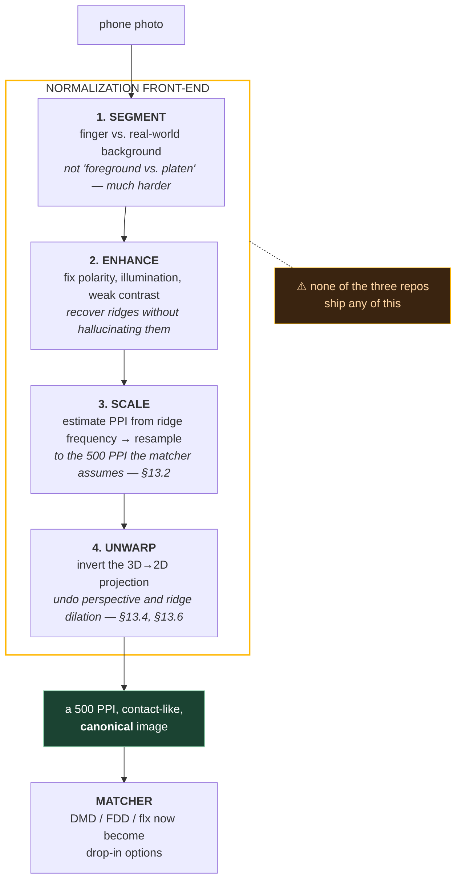
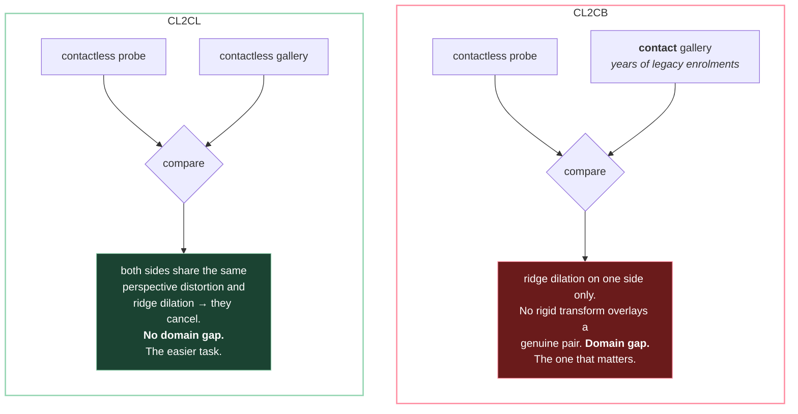

# 13. Touchless and contactless fingerprints

This file exists because of a very reasonable question:

> DMD, FLARE and flx are built for latents. Latents are the hard, degraded case. Touchless
> fingerprints — finger photos from a phone camera — are also a degraded case. So are the
> latent matchers the right tool for touchless?

The instinct is half right, and the half that's wrong is the interesting half. Getting there
needs two corrections first.

**Correction 1: they are not all latent matchers.** File 09's table says it outright. DMD is
*best at latents, partial prints*. FDD is *balance; large galleries*. flx is *speed, scale, clean
prints* and **weakest at partial / latent prints**. DeepPrint is the *anti*-latent design — it
pools spatial structure away entirely (§9.1), which is only safe when the print is complete.

**Correction 2: high image quality never disqualifies a matcher.** flx exists precisely for clean
scanner images. DMD's *gallery* is rolled prints — it runs on high-quality images every single
comparison. The reason not to put DMD behind a live scanner is **cost** — ≈333 KB per print and a
Hungarian solve per pair (§9.2) — not quality. "Too good for this matcher" isn't a thing;
"more robustness than you're willing to pay for" is.

With those out of the way, the real question is sharper: **do the degradations of touchless
capture resemble the degradations of latent capture closely enough that latent-oriented designs
transfer?** Partly. Let's be precise about which parts.

## 13.1 Touchless is not latent

| Degradation | Latent | Touchless |
|---|---|---|
| Partial / occluded area | severe | moderate — edges, blur, finger not fully in frame |
| Non-linear distortion | severe (smear) | severe (perspective + 3D→2D projection) |
| Background clutter | severe | severe — a real scene, not a platen |
| Low ridge–valley contrast | severe | severe — no pressure to flatten the skin |
| **Unknown scale** | no — photographed at a known PPI | **yes — the defining problem** |
| **Out-of-plane rotation** | no — the surface is flat | **yes — roll, pitch, yaw of the finger** |
| Tonal polarity / illumination | mild | severe — shadows, specularity, colour |

The top four rows overlap. That is the grain of truth in the hypothesis, and it's a real one:
anything designed to survive partial area, non-linear warp, clutter and weak contrast has a head
start here.

The bottom three rows don't overlap at all. And they're not minor — they're the rows that decide
whether the pipeline **runs correctly at all**, before accuracy is even on the table. Worse:
**none of the three repos address any of them.** The next three sections are why.

## 13.2 The 500 PPI assumption, and why it breaks first

A camera does not have a PPI. It has a focal length and an unknown finger-to-lens distance,
which together produce an unknown and *per-image varying* scale.

Every one of the three repos assumes otherwise. From file 01 §1.3, the line that appears in
almost every fingerprint codebase:

```python
self.scale = self.img_ppi * 1.0 / 500 * self.tar_shape[0] / self.middle_shape[0]
```

(`DMD/models/dataloader_densemnt.py:38`)

`img_ppi` is a **config value you type in**. It is not measured from the image. And the whole
pipeline is built on top of it:

| Repo | What the 500 PPI assumption buys | Where |
|---|---|---|
| DMD | A 128-px patch = ~6.5 mm of skin = ~13–14 ridge periods — the "deliberate sweet spot" | file 05 §5.4 |
| FLARE / FDD | `scale = 256/512 = 0.5`, so FDD works at ~250 PPI over a large field of view | file 07 §7.6 |
| flx | 299×299 input framed to contain a whole finger at a known physical size | file 08 |

File 01's Check-yourself question 4 asks what happens when you hand DMD a 1000 PPI image with
`img_ppi: 500` left in the config: every ridge is twice as wide as the network expects and
accuracy collapses. **Touchless is that failure mode, permanently, and worse** — because there's
no correct number to type in. The scale differs between two photos of the same finger taken
seconds apart.

The fix is not a config change; it's a measurement. Estimate scale from the image itself using
**ridge frequency**, which the course has already covered: ridges are locally parallel stripes at
about **1/9 cycles per pixel at 500 PPI** (file 03 §3.4). Measure the observed ridge period,
compute the ratio to the expected one, resample. This is the same quantity Gabor enhancement
already needs, so the machinery isn't new — it's just being used for a second purpose.

> **The general lesson.** A hardcoded physical constant is invisible until the input domain
> changes, and then it is the first thing that breaks. It won't throw an error. It will quietly
> return bad scores, which is much harder to debug than a crash.

## 13.3 Pose: 2D rigid isn't enough

File 09 §9.4 laid out three alignment strategies as three bets about where to spend supervision.
Look at what each of them actually *parameterises*:

| Approach | Predicted parameters | Degrees of freedom |
|---|---|---|
| DMD | none — anchors on each minutia's own frame | (local, implicit) |
| FLARE | `(x, y, θ)` | 3, all in-plane |
| DeepPrint STN | `(θ, tx, ty)` → rigid affine | 3, all in-plane |

All three assumed the finger was pressed against a **flat surface**, so the only freedom left was
where on that plane it landed and how it was rotated within it. That assumption is what a platen
buys you, and it's so foundational that no one states it.

Hold a finger in front of a camera and you get three more degrees of freedom — roll, pitch, yaw —
plus distance. FLARE's pose head has no parameter for pitch. DeepPrint's STN builds a rigid
affine matrix, which cannot represent perspective. Neither model can express the transformation
that actually occurred, so neither can undo it.

DMD is the interesting case: it doesn't estimate global pose at all, so there's nothing to
express incorrectly. Its patches are anchored locally, and **any smooth global warp is
approximately rigid over a small enough region**. That's exactly the argument file 05 §5.2 makes
for skin elasticity — and it applies harder here. Hold onto this; it comes back in §13.7.

## 13.4 Ridge dilation, and why this is a domain gap

Press a finger onto glass and the skin flattens and spreads. Photograph the same finger in the
air and it doesn't. The result is that contactless ridges are systematically **dilated** relative
to their contact counterparts, and non-uniformly so — most at the centre of the finger pad, least
at the edges where the curvature turns away from the camera.

This matters more than it sounds. It means that for a **genuine pair** — same finger, contact
gallery image and contactless probe — there is *no rigid transform that overlays them*, and no
global scale factor either. The minutiae are in genuinely different relative positions. You are
not looking at a noisy version of the gallery image; you are looking at a different projection of
the same 3D object.

That is the definition of a **domain gap** rather than noise, and it's why the field treats
contactless-to-contact as its own named problem rather than a robustness footnote. It also
explains why "unwarping" is a distinct pipeline stage in §13.5 instead of something a matcher
could absorb by training on augmented data.

> Latent degradation *destroys* information. Touchless degradation *transforms* it. Destroyed
> information needs a robust matcher. Transformed information needs the transform inverted — and
> those call for different engineering.

## 13.5 The normalization front-end

The published contactless-to-contact systems converge on the same four preprocessing steps, run
*before* any matcher sees the image. C2CL (Grosz, Engelsma & Jain, TIFS 2021) states them
directly: **segment, enhance, scale, unwarp.**



Note what step 3 does to the original question. Once the front-end exists, the matcher is
receiving something that looks like a contact print — which is what all three were built for.
Hence:

> **The matcher is a second-order decision here.** Most of the accuracy comes from a front-end
> that none of these three repos ship. Build it and any of the three works. Skip it and none of
> them do — including the latent-robust ones, because latent robustness does not include scale
> estimation.

That is the direct answer to the question this file opened with. "Which of these three is best
for touchless?" is a reasonable question that turns out to be aimed at the wrong stage of the
pipeline.

## 13.6 Unwarping — and a connection worth noticing

Step 4 is the one with the most interesting literature. The approach that has held up: recover a
**3D finger shape from the single 2D image**, then virtually unroll it into the 2D projection a
contact capture would have produced. Cui, Feng & Zhou (TPAMI 2023) do this with a learned
shape-from-texture algorithm — ridge spacing and curvature across the image tell you about
surface orientation, the same way texture gradient tells you about a receding plane. Reported
effect of unwarping in this literature: on the order of **17% more detectable minutiae**,
averaged over two public contactless datasets. Treat the exact figure the way file 09 §9.7 says
to treat any number from a small evaluation set, but the direction is not in doubt: you are
recovering minutiae that perspective compression had squashed out of detectability.

Now the part worth sitting with. That paper is **Cui, Feng, Zhou**. DMD is **Pan, Duan, Guan,
Feng, Zhou**. FLARE is the same group again. Jianjiang Feng's lab at Tsinghua wrote the latent
matchers this course is built around *and* the touchless front-end.

So the two are not competing schools of thought, and touchless is not a rival problem that
someone else works on. The unwarping work is **the missing stage from the same people** —
the thing that goes in front of DMD and FLARE, not instead of them. The reason it isn't in
either repo is that repos are organised around papers, not around systems.

## 13.7 Re-running §9.5 for touchless

File 09 §9.5 gave three "use X when…" rules for contact prints. Here's the same exercise for
touchless, assuming the front-end from §13.5 is in place. Ranked by how well the **design**
transfers, not by latent benchmark scores:

**1. DMD-style local patches — strongest structural fit.**
Any smooth global warp is locally near-rigid, so per-minutia patches absorb residual perspective
distortion that a global descriptor cannot. This is file 05 §5.2's argument for skin elasticity,
applied to a bigger warp. It's also the only one of the three that doesn't have a global pose
estimate to get wrong (§13.3). Costs: you need a minutiae extractor that survives camera images —
a real problem, since the classical extractors assume contact-print contrast — and you still pay
333 KB and a Hungarian solve per comparison.

**2. FDD-style dense + mask — best practical balance.**
The per-cell validity mask (§9.2) earns more here than it does on contact prints. Touchless
degradation is *spatially uneven* in a way contact degradation isn't: one part of the finger is in
focus and well lit, another is blurred, shadowed, or curving out of view. A mask can say "ignore
this region"; a flat vector cannot. Against it: FLARE's explicit pose stage is a single point of
failure (§9.4), and a domain shift is precisely when a supervised pose model trained on contact
images will fail. The silent `coarse_center` fallback (file 07 §7.6) makes that failure quiet
rather than loud, which is worse.

**3. Flat DeepPrint embedding — weakest structural fit, most used in practice.**
No mask, no spatial structure, no way to express "this region is out of focus." On paper it should
be the worst choice. In practice it's closest to what published CL2C systems are built on, for
exactly the reason §13.5 gives: once the front-end has done its job, the input *is* a clean
complete print, which is the regime flat embeddings were designed for. C2CL itself extracts
**both minutiae and texture** representations — the same two-branch recipe file 09 §9.3 identifies
as the field's consensus architecture.

> The ranking inverts between "which design is most robust to touchless degradation" and "which
> is most used in touchless systems," and that inversion is the whole point of this file. Build
> the front-end and you get to choose your matcher on cost and scale, like any other deployment.
> Skip it and you're asking a matcher to absorb a transformation it has no parameters for.

## 13.8 The task split, and the vocabulary

The literature distinguishes two problems that are easy to conflate:

| Task | Probe | Gallery | Notes |
|---|---|---|---|
| **CL2CL** | contactless | contactless | Both sides share the same distortion; no domain gap. Much easier. |
| **CL2CB** | contactless | contact | The domain gap of §13.4. This is the one that matters operationally. |



CL2CB is the one that matters because **the gallery already exists**. Every deployed system of
any size has years of contact enrolments in it, and re-enrolling the population contactlessly is
not a project anyone approves. So touchless capture almost always means a contactless probe
searched against a contact gallery — which is why interoperability, not raw contactless accuracy,
is the operative question.

Two reference points beyond C2CL:

- **Ridgeformer** (Pandey, Jawade & Setlur, ICIP 2025) — the modern take: a transformer with
  hierarchical feature extraction and multi-stage contrastive training, doing global alignment
  first then local refinement. Reports both CL2CL and CL2CB. Worth reading as the current shape
  of the field, and as evidence that the global-then-local structure keeps reappearing.
- **NIST IR 8307**, *Interoperability Assessment 2019: Contactless-to-Contact Fingerprint
  Capture* (May 2020) — the operational reality check, below.

## 13.9 Datasets, and honest evaluation

| Dataset | Contents |
|---|---|
| **HKPolyU** contactless 2D-to-contact 2D | 1,920 contactless prints with paired contact, 160 subjects |
| **ISPFDv1** (IIITD SmartPhone Fingerphoto) | ~4,000 contactless, ~1,000 contact |
| **ISPFDv2** (IIITD Finger-Selfie v2) | ~16,800 contactless, ~2,400 contact |
| **RidgeBase** | Defines protocols for single-finger, four-finger and set-based matching, in **both** CL2CL and CL2CB |

Use RidgeBase's protocol definitions if you're measuring anything you intend to believe — for the
same reason file 08 §8.7 recommends flx's open-set folds over DMD's or FLARE's evaluation code.
An explicit, published protocol is worth more than a bigger number under an unstated one.

And the number to keep in view, from NIST IR 8307 — 200 federal employees, 8 devices, both
stationary contactless rigs and phones:

> **Contact devices still outperformed contactless ones** at matching into a legacy contact
> database. Capturing multiple fingers at once closed part of the gap.

That was 2019 data and the methods in this file have moved since, so don't read it as a verdict
on the state of the art. Read it as calibration: contactless capture is chosen for **hygiene,
cost, and the fact that everyone already carries a camera**, not because it's more accurate. If
someone presents touchless as a straight accuracy upgrade, that's the claim to push on.

Carry forward file 09 §9.7's warning too, with interest. These datasets are in the hundreds of
subjects. Differences of a point or two between methods on them are noise.

## 13.10 What this means for the original question

Compressed:

1. DMD is a latent matcher; FDD is a generalist; flx is a clean-print matcher. They were never
   one category.
2. Image quality being *high* is never a reason to avoid a matcher. Cost is.
3. Touchless shares latent's *destroyed information* problems but adds *transformed information*
   problems — unknown scale, out-of-plane pose, ridge dilation — that no latent matcher has any
   machinery for.
4. Those are solved by a normalization front-end (segment → enhance → scale → unwarp), not by
   matcher choice.
5. Given that front-end, DMD's local patches transfer best structurally, FDD's mask is the best
   practical balance, and a flat embedding is the weakest fit but what most systems actually use.
6. The front-end you'd want was built by the same lab that built DMD and FLARE. It's a missing
   stage, not a competing approach.

---

## Check yourself

1. Which of the three repos is *not* built for latents, and what in its architecture makes it
   unsuitable for them?
2. "We can't use DMD on a live scanner because the images are too good." Rewrite that sentence so
   it's true.
3. Why does unknown scale break DMD specifically? Name the quantity that stops being meaningful,
   and the config value that silently lies about it.
4. FLARE and DeepPrint both predict three alignment parameters. Why isn't three enough for
   touchless, and which physical motions are unrepresented?
5. Why is contact-vs-contactless a *domain gap* rather than just more noise? Answer in terms of
   what happens to a genuine pair.
6. Why is the FDD validity mask worth more on touchless input than on contact input? Be specific
   about the spatial property that differs.
7. Your gallery is 10M contact rolled prints; your probes are phone photos. Design the pipeline
   end to end, and say which stage you'd expect to dominate your error budget. (Compare your
   answer to file 09's exercise 6 — what changed, and what didn't?)

(Answers in `12-exercises.md`.)
