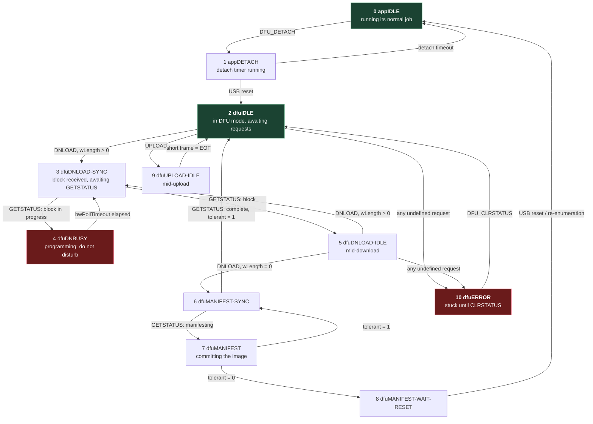

# 3. The DFU state machine

## The problem

The bootloader is running and the host has its handle. Now bytes have to move — into flash
for an update, out of it for a backup — across a link where the device sometimes needs
hundreds of milliseconds to finish erasing a page, cannot interrupt the host to say so,
and has exactly one pipe available.

USB control transfers give you no way for a device to say "not yet, ask me later" other
than NAKing, which the host stack handles invisibly and which cannot carry a duration. So
DFU builds a small explicit protocol on top: after every operation the host *asks* for
status, and the device's reply tells it what happened, what state it is now in, and how
long to wait before asking again. The whole class is that loop.

Everything below is from the USB Device Firmware Upgrade specification, revision 1.1,
5 August 2004.

## Seven requests

DFU uses only the default control pipe — no endpoints of its own (§4.1.2). There are seven
class-specific requests (Table 3.1, Table 3.2):

| Request | `bRequest` | Direction | `wValue` | `wLength` | What it does |
|---|---|---|---|---|---|
| `DFU_DETACH` | 0 | host→device | `wTimeout` | 0 | Ask a running application to enter DFU mode (chapter 2) |
| `DFU_DNLOAD` | 1 | host→device | `wBlockNum` | block size | Send one block of firmware |
| `DFU_UPLOAD` | 2 | device→host | `wBlockNum` | up to `wTransferSize` | Read one block back out |
| `DFU_GETSTATUS` | 3 | device→host | 0 | 6 | The synchronisation point. See below |
| `DFU_CLRSTATUS` | 4 | host→device | 0 | 0 | The only exit from `dfuERROR` |
| `DFU_GETSTATE` | 5 | device→host | 0 | 1 | State only, no side effects |
| `DFU_ABORT` | 6 | host→device | 0 | 0 | Give up the current transfer, return to `dfuIDLE` |

`wBlockNum` is a sequence number that "increments each time a block is transferred,
wrapping to zero from 65,535" (§6.1.1). Note what that implies about maximum image size at
a given transfer size, and note — chapter 4 — that one widely used extension gives
`wBlockNum` an entirely different job.

## `DFU_GETSTATUS`: six bytes that run the protocol

The device answers with six bytes (§6.1.2):

```
 offset  0        1   2   3        4        5
       ┌────────┬────────────────┬────────┬─────────┐
       │bStatus │  bwPollTimeout │ bState │ iString │
       │ 1 byte │  3 bytes       │ 1 byte │ 1 byte  │
       └────────┴────────────────┴────────┴─────────┘
```

- **`bStatus`** — the outcome of the most recent request.
- **`bwPollTimeout`** — "minimum time, in milliseconds, that the host should wait before
  sending a subsequent `DFU_GETSTATUS` request". Three bytes, so up to about 4.6 hours.
- **`bState`** — "an indication of the state that the device is going to enter immediately
  following transmission of this response. (By the time the host receives this information,
  this is the current state of the device.)"
- **`iString`** — index of a string descriptor describing the status, if the device
  supplies one.

`bwPollTimeout` is the field that makes the class work across wildly different flash
technologies. The spec explains that devices implement downloads in at least three ways —
buffer the whole image and program it at the end; erase and write a block at a time; erase
a large region and dribble small blocks into it — and that "all three of these techniques
are accommodated by virtue of the dynamic values specified in the `bwPollTimeout` field and
closed-loop, host-driven state transitions" (§6.1).

⚠️ `bwPollTimeout` is a *minimum*, chosen by the device for the operation it is about to
perform, and it changes from block to block. A host that substitutes its own fixed delay
is guessing at the erase time of a flash part it has never seen. Honour the field.

### The status codes

`bStatus` values, from §6.1.2. Sixteen of them, and the distinctions are useful — several
mean "your file is wrong", several mean "my flash is wrong", and they call for different
responses.

| `bStatus` | Value | Meaning |
|---|---|---|
| `OK` | `0x00` | No error condition is present |
| `errTARGET` | `0x01` | File is not targeted for use by this device |
| `errFILE` | `0x02` | File is for this device but fails some vendor-specific verification test |
| `errWRITE` | `0x03` | Device is unable to write memory |
| `errERASE` | `0x04` | Memory erase function failed |
| `errCHECK_ERASED` | `0x05` | Memory erase check failed |
| `errPROG` | `0x06` | Program memory function failed |
| `errVERIFY` | `0x07` | Programmed memory failed verification |
| `errADDRESS` | `0x08` | Cannot program memory due to received address that is out of range |
| `errNOTDONE` | `0x09` | Received `DFU_DNLOAD` with `wLength` = 0, but device does not think it has all of the data yet |
| `errFIRMWARE` | `0x0A` | Device's firmware is corrupt. It cannot return to run-time (non-DFU) operations |
| `errVENDOR` | `0x0B` | `iString` indicates a vendor-specific error |
| `errUSBR` | `0x0C` | Device detected an unexpected USB reset |
| `errPOR` | `0x0D` | Device detected unexpected power on reset |
| `errUNKNOWN` | `0x0E` | Something went wrong, but the device does not know what it was |
| `errSTALLEDPKT` | `0x0F` | Device stalled an unexpected request |

## Eleven states



The numeric values matter, because they are what comes back in `bState` (§6.1.2):

| State | Value | Meaning |
|---|---|---|
| `appIDLE` | 0 | Running its normal application |
| `appDETACH` | 1 | Has received `DFU_DETACH`, waiting for a USB reset |
| `dfuIDLE` | 2 | In DFU mode, waiting for requests |
| `dfuDNLOAD-SYNC` | 3 | Has received a block, waiting for the host to solicit status |
| `dfuDNBUSY` | 4 | Programming a block into nonvolatile memory |
| `dfuDNLOAD-IDLE` | 5 | Processing a download; expecting more `DFU_DNLOAD` |
| `dfuMANIFEST-SYNC` | 6 | Final block received (or manifestation finished), waiting for `GETSTATUS` |
| `dfuMANIFEST` | 7 | In the manifestation phase |
| `dfuMANIFEST-WAIT-RESET` | 8 | Programmed; waiting for a USB or power-on reset |
| `dfuUPLOAD-IDLE` | 9 | Processing an upload |
| `dfuERROR` | 10 | An error has occurred; awaiting `DFU_CLRSTATUS` |

Two rules about that diagram are worth stating as rules rather than reading off arrows.

**Anything undefined is an error, permanently.** "If the device receives a request, and
there is no transition defined for that request (for whatever state the device happens to
be in when the request arrives), then the device stalls the control pipe and enters the
`dfuERROR` state" (Appendix A.1). And from `dfuERROR` the device "cannot transition … until
after it has received a `DFU_CLRSTATUS` request" (§6.1.3). One misordered request poisons
the session until you clear it. The `appIDLE` and `appDETACH` states are the two exceptions;
an unexpected request there does not force the error state.

**`dfuDNBUSY` accepts nothing.** "Receipt of any DFU class-specific request → Device stalls
the control pipe → `dfuERROR`" (Appendix A.2.5). Polling early to see whether it is done
yet is precisely the thing that breaks it. This is what `bwPollTimeout` is for.

## Downloading

The host slices the image and sends each piece as a `DFU_DNLOAD` control-write, then asks
for status. Block size is bounded by `wTransferSize` from the functional descriptor:
"the host sends between `bMaxPacketSize0` and `wTransferSize` bytes to the device in a
control-write transfer" (§6.1.1).

The end is explicit. "After the final block of firmware has been sent to the device and the
status solicited, the host sends a `DFU_DNLOAD` request with the `wLength` field cleared to
0 and then solicits the status again" (§6.1.1). That **zero-length download** is the
"I'm finished" marker, and it moves the device into manifestation. A device that thinks
data is still missing answers `errNOTDONE`.

Errors come back as a **STALL on the control pipe**: "if the device detects an error, it
signals the host by issuing a STALL handshake on the control endpoint. The host then sends
a DFU class-specific request, called `DFU_GETSTATUS` … to determine the nature of the
problem" (§6.1). So a stall is not the answer; it is the prompt to go and ask for one.

## Uploading — the reason backups are possible

`DFU_UPLOAD` is the inverse, and it is the quietly important half of this chapter:

> The purpose of upload is to provide the capability to retrieve and archive a device's
> firmware. Uploading firmware is, by definition, the inverse of a download, meaning that
> the uploaded image must be usable in a subsequent download.
>
> — USB DFU 1.1, §6.2

That sentence is the specification promising you a backup mechanism: whatever comes out is
required to be something you can put back. The host keeps requesting blocks "until it
responds with a short frame as an end of file (EOF) indicator", the *device* chooses the
address range and the formatting, and the host is responsible for appending the file suffix
(chapter 6). `DFU_ABORT` stops an upload early.

⚠️ Upload is optional. `bitCanUpload` in `bmAttributes` says whether the device supports it
at all, and a device may support downloads and refuse uploads — deliberately, since upload
is also how someone extracts your firmware. If that bit is clear, chapter 5's
read-the-old-image-out-first strategy is simply unavailable to you, and you need to know
that before you design around it.

## Manifestation, and the two kinds of device

After the zero-length download the device enters `dfuMANIFEST-SYNC`, then on the next
`DFU_GETSTATUS` enters `dfuMANIFEST`, "where it completes its reprogramming operations"
(§7). What happens next depends on one bit:

| `bitManifestationTolerant` | Device goes to | Host must |
|---|---|---|
| 1 | `dfuMANIFEST-SYNC` | Send `DFU_GETSTATUS`; the device returns to `dfuIDLE` and can accept another download or upload |
| 0 | `dfuMANIFEST-WAIT-RESET` | Issue a USB reset — unless `bitWillDetach` is also set, in which case the device detaches itself |

"After the bus reset the device will evaluate the firmware status and enter the appropriate
mode" (§7). Which is the sentence from chapter 1 again, seen from the other end: the device
decides, and a device that judges its own firmware bad should stay reachable.

> **Teacher's aside.** The thing to carry away from this chapter is that DFU is
> **host-driven and closed-loop**. The device never volunteers anything. Every transition
> that matters happens because the host asked for status, and the device's reply is both
> the answer and the trigger. Almost every DFU bug reduces to a host that assumed it could
> keep going without asking: skipping the status solicitation after a block, polling during
> `dfuDNBUSY`, treating a STALL as the end rather than as "now ask me why", or timing its
> own delays instead of using `bwPollTimeout`. When something misbehaves, the first question
> is not "what did the device do" but "what did we fail to ask".

## Check yourself

1. Write out the exact request sequence for downloading a three-block image, from
   `dfuIDLE` to the device beginning manifestation. Count the `DFU_GETSTATUS` requests.
2. A host sends a block, gets `bState = 4`, and immediately sends `DFU_GETSTATUS` again.
   What does the device do, and what must the host now do before it can continue?
3. Your device stalls the control pipe partway through a download. Why is it wrong to
   treat that as the final answer, and what do you do instead?
4. `bitCanUpload` is 0 on a device you have to support. Which parts of a safe update
   procedure become impossible, and what would you do instead?
5. A device has `bitManifestationTolerant = 0` and `bitWillDetach = 0`. Describe what the
   host must do after the zero-length download, and what symptom you would see if it
   didn't.
6. `wBlockNum` wraps to zero from 65,535. For a device reporting `wTransferSize` of 1024
   bytes, what is the largest image a single download can carry before the counter wraps,
   and why might that not actually be a limit on some devices? (Chapter 4 answers the
   second half.)
