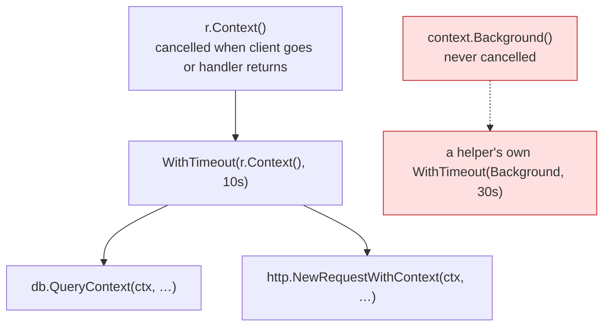

# 1. How a Go service runs

## The problem

The later chapters say things like "a goroutine per connection", "the request's context is
cancelled when the handler returns", "the send blocks for ever", "the zero value means no
limit". Each one is a property of how a Go program runs: goroutines and the scheduler,
channels, the HTTP server's concurrency model, `context`, and zero values. Get these five
straight and most production failures in Go services stop looking mysterious. They're one
of these properties meeting a million requests.

Skip this if you can explain why a blocked goroutine is never garbage collected, what
`r.Context()` is tied to, and what a buffered channel does when it's full.

## Goroutines and the scheduler

A **goroutine** is a function running independently, started with `go f()`. It isn't an
operating-system thread. The Go runtime multiplexes many goroutines onto a smaller number of
threads, and switches between them when one blocks on I/O, a channel, a lock or a sleep.
Goroutines are cheap enough that a server routinely runs tens of thousands.

How many run *at the same time* on CPUs is set by `GOMAXPROCS`. Since Go 1.25 its default
takes container limits into account. The
[release notes](https://go.dev/doc/go1.25): "On Linux, the
runtime considers the CPU bandwidth limit of the cgroup containing the process, if any",
which in Kubernetes "generally correspond[s] to the 'CPU limit' option" and not to "CPU
requests". That default is a GODEBUG setting, so it follows your `go.mod`'s `go` line. From
the [GODEBUG documentation](https://go.dev/doc/godebug): defaults are "amended to match the
Go version listed in `go.mod`". A module still declaring `go 1.24`, built with a newer
toolchain, keeps the old behaviour of using every CPU on the node.

Two properties matter for everything that follows:

- **A goroutine runs until its function returns.** Nothing outside it can stop it. You can
  only *ask* it to stop (a closed channel, a cancelled context) and rely on it checking.
- **A goroutine blocked for ever is never cleaned up.** It holds its stack and everything
  it references, and the garbage collector treats running goroutines as roots, so whatever
  they reference stays alive. A goroutine waiting on a channel nobody will ever send to is a
  permanent leak. Chapter 2's measurement (600 goroutines left behind by 200 requests) and
  chapter 5's fan-out deadlock are both this.

## Channels block, and the size decides when

Goroutines communicate through **channels**. The rule from the
[language specification](https://go.dev/ref/spec#Channel_types):

> If the capacity is zero or absent, the channel is unbuffered and communication succeeds
> only when both a sender and receiver are ready. Otherwise, the channel is buffered and
> communication succeeds without blocking if the buffer is not full (sends) or not empty
> (receives). A nil channel is never ready for communication.

So:

| Channel | Send blocks until | Typical use |
|---|---|---|
| Unbuffered `make(chan T)` | A receiver takes it | Handing off work, synchronising two goroutines |
| Buffered `make(chan T, n)` | There's room in the buffer | Letting up to *n* senders finish without waiting for the reader |
| `nil` | Never. It blocks for ever | Disabling a `select` case on purpose |

A buffered channel is the basis of a common pattern: start *n* goroutines, each sends one
result, and size the buffer to *n* so none of them blocks even if nobody reads yet. It works
exactly as long as the buffer really is *n*, which is the bug in chapter 5.

## The HTTP server: one goroutine per connection

`net/http`'s server is the reason Go services are concurrent without anyone writing `go`.
From `Server.Serve`: it "accepts incoming connections on the Listener l, creating a new
service goroutine for each. The service goroutines read requests and then call s.Handler to
reply to them."

Three consequences:

- **Handlers run concurrently.** Two requests to the same handler run at the same time in
  different goroutines. Any state they share (a map in a struct, a cache, a counter) needs a
  mutex, an atomic, or a design that doesn't share. `go test -race` finds unsynchronised
  access on the paths the tests exercise.
- **A slow handler holds a goroutine, and whatever it holds.** A database connection, an
  outbound HTTP connection, memory for the request body. Concurrency isn't free. It's paid
  for in held resources, which is why chapters 3 and 4 care so much about deadlines.
- **The handler returning ends the request.** Its context is cancelled at that point
  (next section). Work started in a goroutine that outlives the handler is on its own.

## `context`: cancellation and deadlines, passed down

A `context.Context` carries three things down a call chain: a **cancellation signal**, an
optional **deadline**, and request-scoped **values** such as a trace id. Contexts form a tree.
Deriving one (`WithCancel`, `WithTimeout`, `WithDeadline`) creates a child that's cancelled
when its parent is, or earlier.

For an HTTP request, the server creates the root. From `Request.Context`: "For incoming
server requests, the context is canceled when the client's connection closes, the request is
canceled (with HTTP/2), or when the ServeHTTP method returns."

The convention that makes it work: **every function that does I/O takes a `ctx` as its first
argument and passes it on.** Cancellation only reaches code that receives the context and
checks it. The database driver and `net/http` both do. A helper that starts from
`context.Background()` instead (the red branch) can't be reached by any cancellation from
above, and chapters 2–4 keep coming back to that.

`context.Background()` belongs at the roots: `main`, tests, and background jobs that
genuinely belong to no request.

## Zero values: useful, and sometimes "no limit"

Every Go type has a **zero value** (`0`, `""`, `nil`, a struct of zero fields), and the
standard library tries to make zero values usable. A zero `sync.Mutex` is unlocked and ready.
A zero `bytes.Buffer` is empty and ready.

For *configuration* structs, that design has a sharp edge. A zero duration or zero limit
often means "no timeout" or "no limit", because that's the only neutral choice. You've
already met several in this course:

| Zero value | Means |
|---|---|
| `http.Server{}.ReadHeaderTimeout` (with `ReadTimeout` also zero) | No timeout on reading headers |
| `http.Transport{}.IdleConnTimeout` | Idle connections are never closed |
| `http.Client{}.Timeout` | No overall timeout |
| A Kafka client's acks setting, in at least one Go library | Don't wait for the broker |

So `&Thing{}` and the library's documented default are often different things. The library's
`Default…` variable or constructor encodes the sensible values. A struct literal encodes none
of them. Read the field documentation for every zero you leave in a production config.

> **Teacher's aside.** Go's simplicity hides its defaults in plain sight: there's no builder,
> no required argument, nothing that forces you to think about a field you didn't set. The
> habit that pays for itself is to read every field of every config struct you construct, and
> write down, even as a comment, why a zero is acceptable where you leave one.

## Seeing what a running service is doing

Two tools you'll want before you need them:

- `runtime.NumGoroutine()` exported as a metric. A number that climbs steadily without
  falling back is a goroutine leak, whatever the cause.
- The `net/http/pprof` endpoints, especially `/debug/pprof/goroutine?debug=1`, which groups
  every live goroutine by stack trace. A leak shows up as one stack with a count in the
  thousands. Serve it on an internal-only port.

## Check yourself

1. A handler starts a goroutine that waits on `<-results`, and returns before anything is
   sent. What happens to that goroutine, and to the memory it references?
2. Ten goroutines each send one value to `make(chan int, 9)`, and the reader only starts
   reading after all ten have finished. What happens?
3. Two requests hit a handler that increments `h.count++` on a shared struct. What can go
   wrong, and how would you find it before production?
4. A service runs in Kubernetes with a CPU limit of 2 on a 32-core node, built with Go 1.26.
   Its `go.mod` says `go 1.24`. What is `GOMAXPROCS`, and what changes if you bump the `go`
   line to 1.25?
5. Name three things that cancel `r.Context()` for an incoming request, and one way a database
   query started by that handler can keep running anyway.
6. A config struct is built as `&kafka.Writer{Addr: …, Topic: …}`. What should you do before
   trusting it in production, and why isn't "it worked in staging" evidence?
