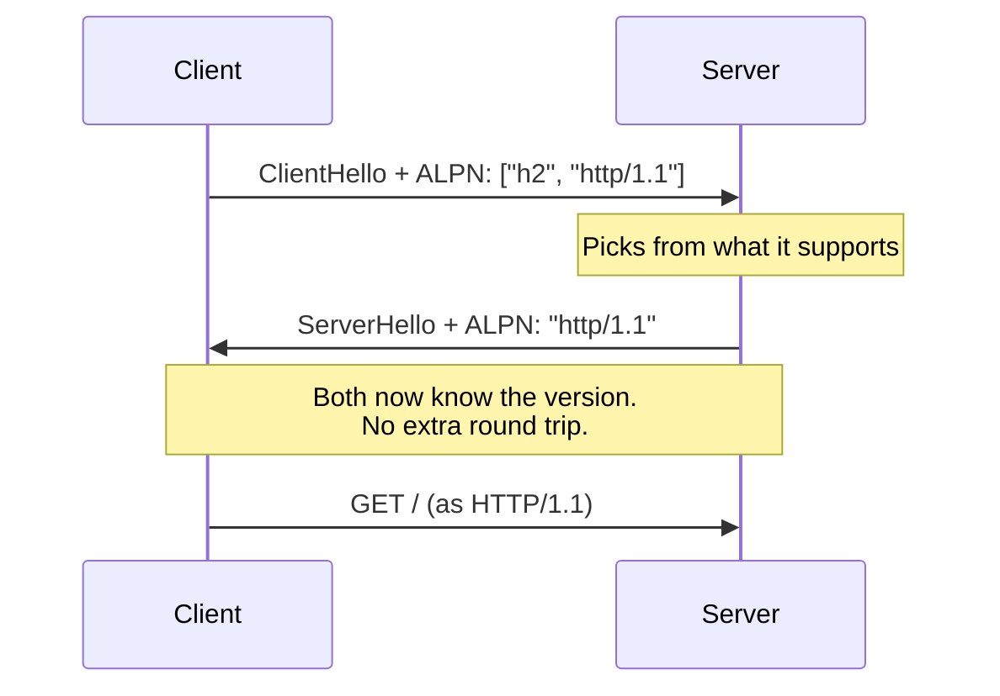

# 2. How the version gets chosen

## The chicken and egg

A client that wants HTTP/2 has a problem. To ask the server "do you speak
HTTP/2?" it must send a request — in some version of HTTP. Asking in HTTP/1.1
costs a round trip before any useful work; asking in HTTP/2 fails against a
server that only speaks HTTP/1.1.

Both approaches exist. Only one is used.

## The upgrade approach, and why it lost

HTTP/1.1 has an `Upgrade` header for switching protocols mid-connection. HTTP/2
originally defined `h2c` for exactly this — cleartext HTTP/2 reached by upgrading
an HTTP/1.1 connection. RFC 9113 §3.1 records the outcome:

> The "h2c" string was previously used as a token for use in the HTTP Upgrade
> mechanism's Upgrade header field. This usage was never widely deployed and is
> deprecated by this document.

Two reasons it failed. It costs a round trip — a request and response in the old
protocol before the new one starts. And intermediaries mangle it: any proxy that
doesn't understand `Upgrade` passes it through or strips it, and the endpoints
then disagree about which protocol they're speaking, which is unrecoverable.

## ALPN: negotiate inside the handshake you're already paying for

The approach that won piggybacks on TLS. Since a TLS handshake happens anyway,
carry the protocol question inside it — **RFC 7301, Application-Layer Protocol
Negotiation**, TLS extension type 16.



The mechanics, from RFC 7301:

| Step | What happens |
|---|---|
| Client | Lists protocol identifiers in the ClientHello, "in descending order of preference" |
| Server | "SHOULD select the most highly preferred protocol that it supports and that is also advertised by the client" |
| Server | Returns that **one** identifier in the ServerHello |
| No overlap | "the server SHALL respond with a fatal 'no_application_protocol' alert" |

Identifiers are byte strings: `http/1.1` from RFC 7301, and `h2` from RFC 9113
§3.1, which says "the string `h2` identifies the protocol where HTTP/2 uses
Transport Layer Security".

> **Teacher's aside.** The server chooses, not the client. A client listing
> `["h2", "http/1.1"]` is stating a preference, not a requirement — and a server
> that offers only `http/1.1` gets `http/1.1`, silently and correctly, with no
> error anywhere. This is the lever: to stop a client using HTTP/2 against your
> server, you don't block anything or refuse anything. You stop offering `h2`.

## Why this makes plain HTTP behave differently

ALPN lives in the TLS handshake. No TLS, no ALPN — and with `h2c` deprecated,
cleartext effectively means HTTP/1.1.

That explains a result that otherwise looks like magic: a server broken over
`https://` and fine over `http://` on the same port and handler. Dropping TLS
dropped the negotiation that selected HTTP/2, and HTTP/1.1 has no streams to
reset.

Useful to know, but a poor fix. HTTPS-only behaviour — `Secure` cookies, mixed
content, referrer policy, HSTS — disappears from local testing along with the
bug. Better to keep TLS and change what it offers.

> ⚠️ **`localhost` is a secure context over plain HTTP.** Browsers treat
> `http://localhost` as trustworthy, so `getUserMedia`, service workers and the
> other secure-context APIs work without a certificate. Handy — and the reason
> "it works locally" tells you nothing about whether it works over `http://` on a
> real host, where those APIs are unavailable.

## Observing and controlling it

`openssl s_client` shows what was selected. Offer both and see what comes back:

```
$ openssl s_client -connect host:443 -alpn h2,http/1.1 </dev/null 2>/dev/null | grep ALPN
ALPN protocol: h2
```

The server picked `h2`. Offer only what you want to test and the same command
tells you whether the server will accept it.

Pinning the server side is a one-line change in most stacks, because the TLS
config object owns the list. In rustls the field is `alpn_protocols` on
`ServerConfig`:

```rust
// Offer only HTTP/1.1. A client asking for h2 gets http/1.1 instead — no error,
// because the server selects and the client's list is a preference.
server_config.alpn_protocols = vec![b"http/1.1".to_vec()];
```

Libraries that build the config for you generally default to `["h2",
"http/1.1"]`, which is the right default and the reason you get HTTP/2 without
having asked for it. Check the library's source for what it sets before assuming
you're on the version you think you are.

## Choosing a version deliberately

| Situation | Version | Why |
|---|---|---|
| Public site, many assets, high latency | HTTP/2 | Multiplexing is worth the complexity |
| Local dev server, one user | HTTP/1.1 | Nothing to multiplex; easier to debug |
| Bisecting a protocol bug | Both, one at a time | The comparison *is* the diagnosis |
| Behind a proxy that terminates TLS | Whatever it offers | Your origin's ALPN is invisible to the browser |

That last row catches people. When a CDN or load balancer terminates TLS, the
browser negotiates with *it*, and the connection from there to your origin is a
separate decision. A server can be HTTP/1.1-only and still be reached over
HTTP/2 by every real user.

## Check yourself

1. Why does ALPN cost no extra round trip when the `Upgrade` header does?
2. A client offers `["h2", "http/1.1"]` and the server supports only HTTP/1.1.
   What does the server send back, and what error does the client see?
3. Your server's config lists `["http/1.1"]`. A client insists on HTTP/2 and
   offers only `["h2"]`. What happens — and which RFC sentence decides it?
4. A colleague fixes an HTTP/2 bug by disabling TLS in the dev server. Name two
   classes of bug this now hides, and say what you'd do instead.
5. A browser reports HTTP/2 to your site, but your origin server offers only
   `http/1.1` in ALPN and is not misconfigured. Explain, and say where you'd look
   to confirm it.
