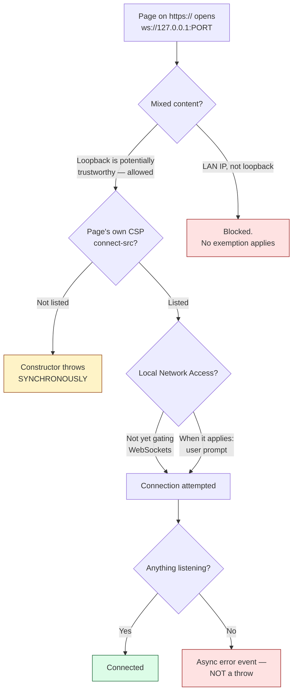

# 4. Reaching localhost from a web page

## The problem

You have a web page on `https://app.example.com` and a program running on the
user's own machine listening on `127.0.0.1`. The page needs to talk to it —
because the local program owns something the browser cannot reach: a USB device,
a smartcard reader, a printer, a local database.

Four separate browser mechanisms stand between the page and that socket. They are
independently configurable, they fail in different ways, and three of the four
produce symptoms that look like "the local program is broken":

| Mechanism | Owned by | Symptom when it refuses |
|---|---|---|
| Mixed content | the spec, not configurable | request blocked; console warning |
| Secure contexts | the spec, not configurable | API unavailable or request blocked |
| Content Security Policy | the *page's own* response headers | connection refused before it opens |
| Local Network Access | the browser, with a user prompt | request blocked pending permission |

Working through them in order is the whole chapter, because the surprising
result — that talking to `127.0.0.1` from an HTTPS page is *allowed* — falls out
of the first two, and is where most people guess wrong.

## Mixed content: why loopback is not a violation

The rule everyone remembers is that an HTTPS page may not load HTTP
subresources. So `https://app.example.com` opening `ws://127.0.0.1:8080` looks
like a textbook violation, and the intuitive fix — putting a TLS certificate on
the local program — is a genuinely difficult problem. You cannot get a public CA
to issue for `127.0.0.1`, so you are into shipping a private CA into the user's
trust store, which is both invasive and a real security liability.

You don't have to, and the reason is worth following precisely.

The Mixed Content specification defines an algorithm, *Should fetching request be
blocked as mixed content?*, and its first step lists conditions under which the
answer is **allowed**. One of them (§4.4, step 1.2) is:

> request's URL is a [potentially trustworthy URL](https://w3c.github.io/webappsec-secure-contexts/#potentially-trustworthy-url)

So the question becomes: is `ws://127.0.0.1` a potentially trustworthy URL? That
term belongs to a different specification — Secure Contexts — whose §3.1 defines
a potentially trustworthy origin as "one which a user agent can generally trust
as delivering data securely", and enumerates what qualifies. The list includes
`https` and `wss`, as you would expect, and also:

> origins matching the CIDR notations `127.0.0.0/8` or `::1/128`

and, subject to name-resolution rules, hosts of `localhost`, `localhost.`, and
anything ending in `.localhost`.

Chain the two together and the result is unambiguous: **loopback is potentially
trustworthy, therefore an a priori authenticated URL, therefore not mixed
content.** No certificate, no private CA, nothing in the trust store.

> **Teacher's aside.** The mental model to correct is "HTTPS means encrypted,
> HTTP means not, and mixed content blocking enforces that". The specification's
> own framing is different: it asks whether the user agent can trust the data as
> *delivered securely*. Encryption is how that is achieved across a network. Over
> loopback there is no network to attack — the bytes never leave the machine, and
> nothing in the OS network stack routes them off it. Encrypting them would
> protect against an attacker who is already inside the machine, and against that
> attacker the certificate in your page's trust store is equally compromised.
>
> This is why the spec says "potentially trustworthy" rather than "secure": it is
> a statement about the *channel's exposure*, not about cryptography.
>
> Note also that trustworthiness is a property of the **origin**, and the spec is
> explicit that neither the domain nor the port affects it. Which port your local
> program listens on is irrelevant to this question.

The same reasoning is why browsers let `http://localhost` use APIs gated on
secure contexts — service workers, geolocation, WebCrypto — while
`http://192.168.1.5` cannot. A private LAN address is still a network.

> ⚠️ `127.0.0.1` is potentially trustworthy. **A private LAN address is not.**
> `127.0.0.0/8` and `::1/128` are the loopback ranges; `192.168.0.0/16`,
> `10.0.0.0/8` and the rest are ordinary network addresses as far as mixed
> content is concerned, and HTTP to them from an HTTPS page *is* blocked. If your
> local program binds `0.0.0.0` and the page reaches it by LAN IP, you have left
> the exemption.

## Content Security Policy: the page blocks itself

The second mechanism is the one that actually bites in production, because it is
not in the specification's hands or the browser's — it is in the page's own
response headers, which in a deployed system often belong to a different team.

If a page sends a `Content-Security-Policy` header with a `connect-src`
directive, that directive is an allowlist for every connection the page's script
can open: `fetch`, `XMLHttpRequest`, `EventSource`, and WebSocket. A policy
written as a sensible default —

```
Content-Security-Policy: connect-src 'self' https://api.example.com
```

— permits nothing on loopback. The local socket is refused, and the refusal has
nothing to do with the local program, which never sees a connection attempt.

Permitting it means naming it, scheme and port included:

```
Content-Security-Policy: connect-src 'self' https://api.example.com ws://127.0.0.1:8080
```

There is one genuinely useful asymmetry here, and it is the most practically
valuable fact in this chapter:

> **A CSP denial makes the `WebSocket` constructor throw synchronously.**

Every other way a WebSocket can fail — nothing listening, wrong port, the
program not running, the handshake rejected — is asynchronous. The constructor
returns an object and you learn about the failure later, in an `error` or `close`
event. CSP is different: the connection is never attempted, so the failure is
known at the moment of the call.

```js
try {
  ws = new WebSocket('ws://127.0.0.1:8080');
} catch (e) {
  // Reached only for a policy denial. A dead port does NOT come here —
  // it arrives later as an error event.
}
```

That distinction is the only signal that separates "your own page's policy
forbade this" from "the local program isn't running", and the two have completely
different fixes — one is a header change by the web team, the other is an
install. Which is why:

> ⚠️ Never wrap that constructor in anything that swallows the throw. A helper
> that catches and returns `null`, or a framework that logs and continues,
> destroys the only distinguishing evidence and turns a header misconfiguration
> into an unfalsifiable "the device isn't detected" report.

## Local Network Access: the browser asks the user

The third mechanism is the newest, and the one whose details you should check
rather than remember, because it is actively shipping.

The threat it addresses is real and was unaddressed for years: any public web
page could quietly probe and send requests to services on the visitor's local
network — routers, printers, admin panels — using the visitor's machine as the
origin of the request. That enables CSRF against devices that assume a request
from the local network is trusted, and it enables fingerprinting a user by what
their network contains.

**Local Network Access (LNA)** makes that require permission. Chrome's own
announcement states the permission launched in **Chrome 142**, with opt-in
testing from Chrome 138 via `chrome://flags/#local-network-access-check`. It
prompts on "any request *from* the public network *to* a local network or
loopback destination", and the destinations it covers include private IPv4
ranges, IPv6 unique local and link-local addresses, `.local` names, and the
loopback interfaces `127.0.0.1` and `::1`.

LNA **supersedes Private Network Access (PNA)**, an earlier attempt that required
the local device to opt in by answering a CORS preflight. That failed for a
mundane reason worth remembering as a design lesson: it put the burden on
software that is often a small embedded HTTP server, frequently unmaintained and
sometimes unmodifiable. A permission model that depends on the *least* maintained
party in the system upgrading does not ship. LNA moves the decision to the
browser and the user, who are both present.

> ⚠️ **WebSockets are not gated on LNA yet.** Chrome's announcement says
> plainly that "WebSockets... connections to the local network are not yet gated
> on the LNA permission", described as a known limitation with support planned.
> So at the time of writing, a WebSocket to loopback raises no prompt — and code
> written to expect one is coding against a future state. Check the current
> status before designing around it either way: this is the single most likely
> claim in this chapter to be out of date, in either direction.

The scope question to ask, when it does apply, is **what the permission is keyed
to**. Chrome's documentation does not state the granularity explicitly, though
the standard permission model is per-origin. For a managed fleet the relevant
lever is enterprise policy, which can pre-grant for named origins rather than
relying on each user to answer a prompt.

## Putting it together

For a page on `https://` talking to a local program on loopback:



The two branches worth internalising are the ones that look identical in a bug
report and are not: a **synchronous throw** is the page's own policy, and an
**asynchronous error** is everything else.

## Check yourself

1. A colleague proposes shipping a private CA into the user's trust store so the
   local program can serve `wss://`. Which two specification sections show this
   is unnecessary, and what does the chain of definitions between them look like?
2. The local program binds `0.0.0.0` instead of `127.0.0.1`, and a tester reaches
   the page from another machine on the LAN, hitting the program by its
   `192.168.x.x` address. Mechanically, what now fails that did not before?
3. You are handed a bug report: "the page can't see the local service". What is
   the first thing you would ask for, and what single observable distinguishes a
   CSP denial from nothing listening on the port?
4. Why did Private Network Access's preflight design fail in practice, and what
   general principle about where to place an opt-in does that illustrate?
5. Someone writes a connection helper that wraps `new WebSocket(...)` in
   `try/catch` and returns `null` on failure, so that callers have one code path.
   What diagnostic capability has been destroyed, and what class of bug becomes
   effectively unfalsifiable?
6. A page must reach a local service *and* be embedded in a customer's site whose
   CSP you do not control. What can you actually do, and what does that tell you
   about where this integration's real constraint lives?
