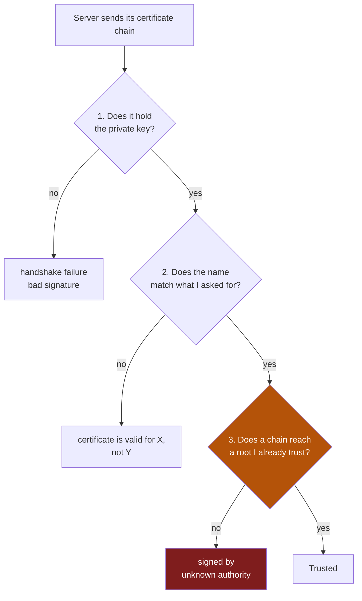

# 4. Certificates, and where trust actually comes from

## The problem

Two strangers can agree a shared secret over a wire anyone is reading, and from
then on nobody in the middle can read what they say. That is a real and slightly
magical result, and on its own it is worth almost nothing.

Because you can do that key exchange with *anyone*. If someone intercepts your
connection and does the exchange with you themselves, you end up with a perfectly
private, perfectly unbreakable channel — to them. Encryption gives you secrecy
with *somebody*. It says nothing about who.

Certificates are the part that answers *whom*. Everything in this chapter exists
to turn "I have a private channel to someone" into "I have a private channel to
the host I asked for".

## The intuition: why a signature and not a directory

Suppose you want to be sure a public key belongs to `example.com`. The obvious
approach is a big list: a directory mapping names to keys, which everyone
consults. That fails for the reason big lists always fail — it has to be
complete, current, and reachable, for every client, forever.

The trick that works instead is to move the problem. Rather than you knowing
every key, someone you *already* trust vouches for each one, in writing, in a form
you can check offline.

That written vouching is a **certificate**. Strip away the encoding and it is
three things:

| Part | What it is |
|---|---|
| A public key | The key being vouched for |
| A name | Who that key belongs to — `example.com` |
| A signature | A third party's cryptographic promise that the first two belong together |

A passport works the same way, and the comparison is worth holding onto. The
passport is not trustworthy because it is hard to forge, laminated, or
official-looking. It is trustworthy because an authority you already accept issued
it, and because you can check their mark. Take away the issuing authority and a
passport is a photo of a stranger with some text next to it.

> **Teacher's aside.** The certificate is public. Anyone can download yours, copy
> it, and present it as their own — there is nothing secret in it. People new to
> this often assume holding the certificate is what proves identity, and it
> doesn't; a certificate is a *claim*, freely copyable. What cannot be copied is
> the matching **private key**, which never appears in the certificate and never
> crosses the wire. Identity is proved by demonstrating possession of that key,
> not by possessing the certificate. Keep the claim and the proof separate in your
> head and most of TLS stops being confusing.

## The three questions, and the three errors

A client validating a server's certificate asks three independent questions. This
is the most useful thing in this chapter, because **each question fails with its
own error message**, and knowing which one you're looking at tells you where to go.



### Question 1 — does it hold the private key?

The server sends its certificate, then separately signs the handshake with the
matching private key. RFC 8446 §4.4.2 describes the `Certificate` message as
carrying:

> The certificate of the endpoint and any per-certificate extensions.

and §4.4.3 describes the `CertificateVerify` message as:

> A signature over the entire handshake using the private key corresponding to
> the public key in the Certificate message.

That second message is what makes the first one mean anything. Because the
signature covers the whole handshake — which includes fresh random values from
both sides — it cannot be recorded and replayed. An attacker who copies a
certificate can present it, but cannot produce this signature.

### Question 2 — does the name match?

The certificate says which names it is valid for. The client checks the name it
*asked for* against that list. RFC 9525 §6 puts the requirement plainly:

> A client needs to verify that the server's presented identity matches its
> reference identity so it can deterministically and automatically authenticate
> the communication.

Note where the comparison happens: against the name you dialled, not against
whatever the connection resolved to. This is why editing a hosts file to point a
name at a different machine does not make a certificate valid — you changed the
routing, not the name being checked.

> ⚠️ **The Common Name field is dead, and some tooling still uses it.** Older
> certificates carried the hostname in the subject's Common Name; modern ones use
> the Subject Alternative Name extension, which can hold several names. RFC 9525
> §2 is unambiguous:
>
> > The Common Name RDN MUST NOT be used to identify a service because it is not
> > strongly typed (it is essentially free-form text) and therefore suffers from
> > ambiguities in interpretation.
>
> RFC 9525 (2023) obsoletes RFC 6125, which still allowed CN as a fallback. So a
> certificate with a correct CN and no matching SAN will be rejected by anything
> current while older tools and older write-ups say it should work. If a
> certificate "looks right" and is still refused, check that the name is in the
> SAN and not only the CN.

### Question 3 — does a chain reach a root you trust?

This is the one that bites hardest, and the rest of the chapter is about it.

## Why a chain rather than one signature

The authority that everyone trusts does not sign your certificate directly. It
signs a small number of **intermediate** authorities, and those sign end
certificates. RFC 5280 §6.1 specifies the algorithm for validating such a
sequence — a **certification path**.

Two reasons it is built this way, and both are about damage control:

| Reason | Consequence |
|---|---|
| The root's private key is the most valuable key in the system | It is kept offline, used rarely, and so cannot sign day-to-day certificates |
| A compromised signer must be revocable | Replacing one intermediate is survivable; replacing a root means updating every client on earth |

So the server typically sends its own certificate *plus* the intermediates needed
to link it upwards. The client supplies the last link itself — the root — from its
own local store. The chain is only complete if the client already has that root.

```
  Root CA            ← you already have this, locally. Not sent over the wire.
     │ signs
  Intermediate CA    ← sent by the server
     │ signs
  example.com        ← sent by the server
```

That bottom-up arrangement is the whole point: **validation terminates at
something you possessed before the connection started.** If it didn't, an
attacker could simply send a chain ending in a root they invented.

## Where "a root you already trust" lives

Here is the part that is pure convention and almost never written down: the set of
roots a program trusts is **a file on the local filesystem**, found by looking in
a hardcoded list of well-known paths.

It is not part of the TLS protocol. It is not shipped inside your binary. It is
not downloaded. It is an operating-system artefact that your language's TLS
library goes looking for at runtime, and the list of places it looks is baked into
that library.

Go's is a good example to read because it is short and explicit. From
`crypto/x509/root_linux.go`:

```go
var certFiles = []string{
	"/etc/ssl/certs/ca-certificates.crt",                // Debian/Ubuntu/Gentoo etc.
	"/etc/pki/tls/certs/ca-bundle.crt",                  // Fedora/RHEL 6
	"/etc/ssl/ca-bundle.pem",                            // OpenSUSE
	"/etc/pki/tls/cacert.pem",                           // OpenELEC
	"/etc/pki/ca-trust/extracted/pem/tls-ca-bundle.pem", // CentOS/RHEL 7
	"/etc/ssl/cert.pem",                                 // Alpine Linux
}
```

It tries each in turn and uses the first that exists. The comments are a list of
Linux distributions, which tells you exactly what kind of thing this is: not a
standard, but an accumulated catalogue of where various operating systems happen
to put the file. Two environment variables override it — `SSL_CERT_FILE` for a
single file and `SSL_CERT_DIR` for a directory — a convention Go inherited from
OpenSSL.

Every TLS library has its own version of this list. That is why the same
certificate can be trusted by one program and rejected by another on the same
machine.

## The trap: an empty filesystem trusts nothing

Now the failure this chapter was written for.

Build a statically linked binary. Put it in an image containing nothing else — no
distribution, no package manager, no `/etc`. It runs, it serves traffic, it
connects to databases, everything works. Then the first time it makes an outbound
HTTPS call, every certificate on earth is rejected as signed by an unknown
authority.

Nothing is wrong with the certificate. There are **zero** roots, because none of
those six files exist, so no chain can terminate anywhere. The client isn't
rejecting a bad certificate — it has nothing to compare against, and the error for
"I don't trust this root" and "I have no roots at all" is the same error.

> ⚠️ **The trust store is part of the operating system, not the language runtime
> or your binary.** A minimal base image is an operating system with the
> interesting parts removed, and the trust store is one of the parts removed. If
> you ship from an empty base, you must copy the bundle in deliberately. The usual
> form is one line lifting it out of a build stage that *does* have it — most
> language base images do, because their package manager needed it:
>
> ```dockerfile
> COPY --from=builder /etc/ssl/certs/ca-certificates.crt /etc/ssl/certs/
> ```

What makes this expensive to diagnose is the delay. The missing file causes no
error at build time, none at startup, and none for any plaintext or inbound
traffic. It surfaces only on the first outbound TLS connection, which in a service
that mostly talks to its neighbours over plain HTTP inside a trusted network might
be months after the image was built — and will look, convincingly, like a problem
with whatever host it finally tried to reach.

## Private authorities

Public bundles contain public CAs — on the order of a hundred-odd roots, the ones
browsers and operating systems have agreed to accept. An organisation that issues
its own certificates for its own internal services is its own authority, and its
root is in nobody's public bundle.

So an internal service presents a perfectly valid certificate, and a client with a
complete public bundle still rejects it as unknown. Correct behaviour: the whole
design rests on terminating at a root you deliberately possess, and you don't
possess that one.

Two ways to possess it, with a real trade-off:

| Approach | Gets you | Costs you |
|---|---|---|
| Append the private root into the bundle you ship | Nothing to configure at runtime; one artefact | Rebuilding when the root rotates |
| Mount the root and point `SSL_CERT_FILE` at it | Rotation without a rebuild | A runtime dependency that can be misconfigured, and the file you name replaces the list, so it must contain the public roots too if you still need them |

The second one has a sharp edge worth repeating: `SSL_CERT_FILE` names *the* file,
not an additional file. Point it at a single private root and you have just
stopped trusting every public CA.

## Why "skip verification" is not a fix

Every TLS library has a switch that turns verification off, and it is reliably the
first thing reached for. Understand what it actually does: it does not skip
question 3. It skips **all three**.

The connection is still encrypted, and that encryption is now worthless in exactly
the way the opening of this chapter described — you have a private channel to
whoever answered. No identity check, so no way to tell the real host from anyone
positioned to intercept.

That is sometimes an acceptable trade for an afternoon of debugging on a trusted
network. It is never a fix, and it has a specific failure mode as a stopgap: it
makes the symptom disappear without moving the cause, so the real work lands
later, under more pressure, usually on whoever deploys to the environment where
the switch is refused.

## Check yourself

1. A colleague says "the connection is encrypted, so it's secure". Encrypted
   against what, and what specifically does the encryption not give them?

2. You copy a server's certificate file and configure your own server to serve it.
   What happens when a client connects, and which of the three checks catches you?

3. A certificate's Common Name is exactly the host you're dialling, the
   certificate is in date, and the client still reports a name mismatch. What
   should you look at, and which document settles it?

4. You add a hosts-file entry pointing `service.internal` at a machine whose
   certificate is issued for `other.example.com`, and the name check fails. You
   then change the entry to point at the correct machine and now get "unknown
   authority" instead. Explain, mechanically, why fixing one error revealed the
   other rather than fixing both.

5. A statically linked binary in an empty image talks happily to five internal
   services for six months, then fails on the first outbound HTTPS call. Nothing
   about the image changed. Why is the long delay the expected behaviour rather
   than a coincidence?

6. You need to trust one private root *and* keep trusting public CAs. Explain why
   setting `SSL_CERT_FILE` to the private root alone is worse than doing nothing,
   and give two ways to get what you wanted.
