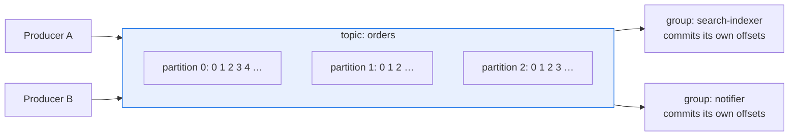

# 1. What Kafka is

## The problem

One service does something, and three others need to know: one updates a search index,
one sends a notification, one recomputes a status. Calling each of them directly couples
the first service to all three. It has to know they exist, wait for them, and decide what
to do when one is down. And a fourth service added next year means changing the first one
again. Kafka's answer is to put a durable, shared **log** in the middle. The first service
writes a record of what happened, and anyone who cares reads it, at their own pace,
whenever they like. The rest of this course is about the details of that promise. This
chapter is the vocabulary and the model.

Skip it if you can say what a partition, an offset, a consumer group and an in-sync
replica are, and how Kafka differs from a queue that deletes messages on acknowledgement.

## A log, not a queue

The single most useful idea: Kafka stores **events in an append-only log, and reading
doesn't remove them.** From the
[Kafka introduction](https://kafka.apache.org/42/getting-started/introduction/): "events
are not deleted after consumption". Instead, each topic keeps events for a configured
time or size.

That's the difference from a classic message queue, and most of Kafka's behaviour follows
from it:

| | Classic queue (e.g. a broker that deletes on ack) | Kafka |
|---|---|---|
| Reading a message | Removes it, once acknowledged | Leaves it. The reader moves a bookmark |
| Several independent readers | Need a copy of the queue each (fan-out exchanges, etc.) | Each consumer group reads the same log with its own bookmark |
| Re-reading old messages | Gone once acknowledged | Move the bookmark back, within retention |
| Acknowledgement | Per message | Per position in a partition: "everything before here is done" |
| Order | Usually per queue, weakened by redelivery and parallel consumers | Within a partition, always |

The per-position acknowledgement in the fourth row is the source of several traps in
[chapter 3](03-offsets-and-delivery-guarantees.md).

## The vocabulary

**Event** (also *record* or *message*). The introduction defines it as recording "the fact
that 'something happened'". It has a **key**, a **value**, a **timestamp** and optional
**headers**. Kafka doesn't look inside the value. It's bytes, and the format (JSON, Avro,
Protobuf) is an agreement between producers and consumers.

**Topic.** A named stream of events, such as `orders` or `customer-changed`. Topics are
"always multi-producer and multi-subscriber": any number of services can write to one and
any number can read it.

**Partition.** A topic is split into partitions, and each partition is a separate log on
a broker. Partitions are how Kafka scales: different partitions live on different servers
and are read in parallel. They're also the unit of ordering, which is the whole of
[chapter 2](02-partitions-keys-and-order.md).

**Offset.** Each event's position in its partition: 0, 1, 2 and up, never reused. An event
is identified by *topic, partition, offset*.

**Broker.** A Kafka server. The brokers together form a **cluster** and store the
partitions. Each partition has one **leader** broker, which takes all writes for it (and,
by default, all reads; consumers can be configured to read from a nearby follower instead),
and **followers** that copy it.

**Replication.** Each partition is copied to several brokers. The introduction calls a
"replication factor of 3" a "common production setting". The replicas that are fully caught
up with the leader are the **in-sync replicas** (ISR). If the leader fails, an in-sync
follower takes over.

**Producer.** A client that writes events. It chooses the partition for each event (usually
from the key) and waits for some number of acknowledgements, which is a durability setting
covered in [chapter 5](05-publishing-from-a-request.md).

**Consumer** and **consumer group.** A consumer reads events. Consumers sharing a group id
form a **group**, and Kafka assigns each partition to exactly one member of the group, so
the group reads each event once between them. A different group reads the same events
again, independently. That's how three services can all read one topic.

**Committed offset.** For each partition, each group stores the offset it has finished up
to. A restarting consumer resumes from it. It's the only progress Kafka records for you.

## How long events are kept

Retention is per topic. From the
[topic configuration](https://kafka.apache.org/43/configuration/topic-configs/):

| Setting | Default | Meaning |
|---|---|---|
| `retention.ms` | 604800000 (7 days) | How long before old log segments are discarded, under the "delete" policy |
| `retention.bytes` | -1 (no limit) | Maximum size per partition before old segments are discarded |
| `cleanup.policy` | `delete` | `delete` discards old segments by time or size. `compact` "retains the latest value for each key" |

Two consequences worth stating early:

- A consumer that's down for longer than retention **loses events for good**. Nothing
  warns it. When it comes back, the oldest events it needed have been deleted.
- **Compaction** turns a topic into "the latest value per key", a changelog you can rebuild
  current state from. Different semantics, different uses, and not covered further here.

## Durability, in one setting

When a producer writes with `acks=all`, the leader waits for the in-sync replicas. A topic
setting decides how many that has to be, `min.insync.replicas`: "the minimum number of
in-sync replicas (including the leader) required for a write to succeed when a producer
sets `acks` to "all"". Its default is **1**. With the default, `acks=all` can be satisfied
by the leader alone, if the followers have fallen out of sync. A common production pairing
is replication factor 3 with `min.insync.replicas=2`, so every acknowledged write exists on
at least two brokers.

## Where the cluster's own state lives

The cluster's metadata (which brokers exist, which is leader for each partition) used to
live in a separate ZooKeeper ensemble. Since Kafka 4.0 it lives in Kafka's own built-in
consensus layer, **KRaft**. The 4.0 upgrade notes: "Apache Kafka 4.0 only supports KRaft
mode - ZooKeeper mode has been removed." Older articles and runbooks that mention ZooKeeper
describe a deployment shape that current Kafka no longer has.

> **Teacher's aside.** People new to Kafka picture it as a queue with extra features, and
> then they're surprised that messages don't disappear, that acknowledging one message
> acknowledges every earlier one, and that a new consumer can read last week's data. Picture
> it instead as a set of append-only files that many readers tail, each keeping its own
> bookmark. Almost every behaviour in the following chapters follows from that picture.

## Check yourself

1. A topic has one producer and two consumer groups, A and B. Group A processes an event.
   Can group B still read it? What would have to happen for B to never see it?
2. A consumer is switched off for ten days on a topic with default retention. What happens
   when it starts again, and what does it see?
3. Why does Kafka acknowledge positions rather than individual messages, and what does that
   cost a consumer that wants to process messages in parallel?
4. A cluster has replication factor 3 and default `min.insync.replicas`. Two followers fall
   behind and drop out of the ISR. A producer with `acks=all` writes an event, and then the
   leader's disk fails. Is the event safe? What setting would have made it so?
5. A group has eight consumers reading a topic with six partitions. How many are doing work,
   and what are the others doing?
