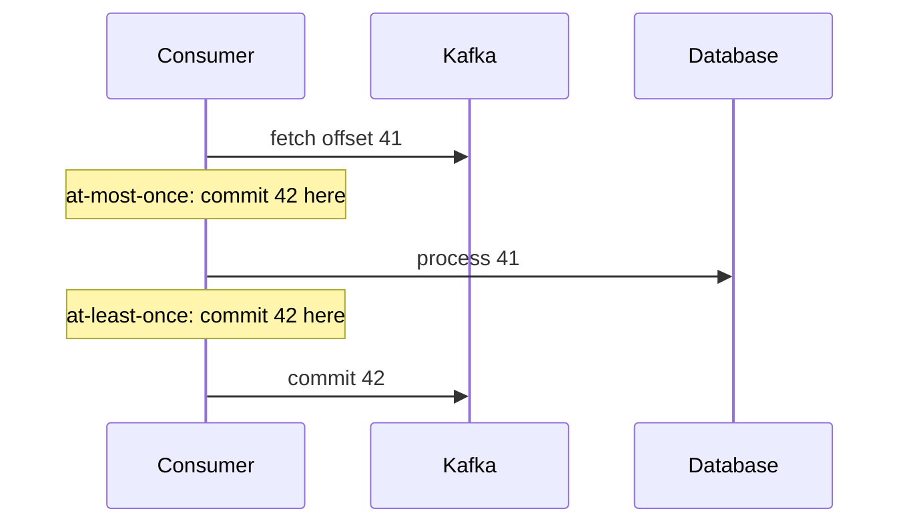

# 3. Offsets and delivery guarantees

## The problem

A consumer crashes and restarts, and some messages are processed twice. Or, after a
code change, some are never processed at all. Both come down to one number per partition,
the consumer group's **committed offset**, and to *when* your code moves it. Kafka
doesn't deliver a message "once" or "twice". It delivers from wherever the committed
offset says, and the guarantee you get is decided by the line of code that commits.

## Consumer groups and committed offsets

A **consumer group** is a set of consumers sharing a group id. Kafka assigns each
partition of the topic to exactly one member of the group, so the group as a whole reads
each message once, and adding members spreads partitions across them (up to one member
per partition; beyond that, extra members sit idle).

For each partition the group stores a **committed offset**: "everything before this has
been dealt with". A consumer that restarts, or a different member that takes over the
partition, resumes from it. Conceptually it's a bookmark, and it's the *only* thing Kafka
knows about your progress.

## Where you commit decides the guarantee

From the Kafka design documentation
([delivery semantics](https://docs.confluent.io/kafka/design/delivery-semantics.html)):

> **At-most-once:** a consumer reads a set of messages, saves its position in the log, and
> then processes the messages.
>
> **At-least-once:** a consumer reads a set of messages, processes the messages, and then
> saves its position.



A crash between the two steps loses the message in the first ordering and repeats it in
the second. There's no third ordering that avoids both, because the processing (a
database write) and the commit (a Kafka write) are two systems with no shared
transaction.

So at-least-once is the normal choice, and its cost is that **every handler must be safe
to run twice**. The design documentation's suggestion: "you can assign messages a primary
key, so that updates are idempotent, meaning that if the message is received twice, it
just overwrites the existing record". In practice that means a unique constraint on an
event id, or an update that's naturally idempotent ("set resolved = true where …").

## Redelivery isn't only after crashes

People design for "the consumer might crash". Redelivery is more common than that:

- **Rebalances.** When a member joins, leaves or is judged dead (missed heartbeats, or too
  long between polls), partitions are reassigned. The new owner starts from the committed
  offset, so anything the old owner processed but hadn't committed runs again.
- **Asynchronous commits.** Many clients batch commits on a timer. In kafka-go,
  `CommitInterval` > 0 makes commits asynchronous. The source says: "CommitInterval
  indicates the interval at which offsets are committed to the broker. If 0, commits will
  be handled synchronously." With a one-second interval, `CommitMessages` returns before
  the commit reaches the broker, and a restart within that second replays up to a second
  of messages.
- **Deploys.** A rolling deploy is a series of members leaving and joining, so a series
  of rebalances.

If the handler is idempotent, all of these are harmless. If it isn't, each one is a small
data bug.

## Committing an offset commits everything before it

Kafka stores one offset per partition, not a set of processed messages. kafka-go's
`CommitMessages` documentation spells out what follows:

> Because kafka consumer groups track a single offset per partition, the highest message
> offset passed to CommitMessages will cause all previous messages to be committed.

Fine for a consumer that processes one message at a time, in order. Dangerous the moment
you add concurrency:

```
partition 0, three workers:

worker 1: offset 10  — slow, still running
worker 2: offset 11  — done, commits 11  →  committed offset is now 12
worker 3: offset 12  — done
          crash
restart from 12: offset 10 was never finished, and is never redelivered
```

Parallel processing within a partition needs to track completion and commit only the
highest offset below which *everything* is done. Otherwise parallelise across
partitions, which keeps per-key order intact as well.

## Where a new group starts

When a group has no committed offset for a partition (a brand-new group id, or offsets
that have expired), the client decides where to begin. The defaults differ:

| Client | Default for a group with no committed offset |
|---|---|
| Java client, `auto.offset.reset` | `latest`: only messages produced from now on ([consumer configs](https://kafka.apache.org/43/configuration/consumer-configs/)) |
| kafka-go, `ReaderConfig.StartOffset` | `FirstOffset`: everything still retained (kafka-go `reader.go`: "Default: FirstOffset") |

> ⚠️ **The trap: renaming a consumer group.** Changing the group id, to tidy up a name or
> separate environments, creates a new group with no offsets. A kafka-go consumer then
> reprocesses the topic's entire retention: days or weeks of messages, at full speed,
> through handlers that may not be idempotent. A Java consumer with defaults does the
> opposite and silently skips everything produced while the old group was down. Neither
> is wrong as a default. Both are surprises if you assumed the other.

## Committing regardless of outcome

A common simplification: process the message, and **commit whether it succeeded or
failed**, on the grounds that failures go to a dead-letter queue (chapter 4) and
retrying them would block the partition. That's a reasonable design with one
requirement that's easy to miss: the commit must come *after the failure is safely
recorded somewhere*. If the handler tries to publish to the dead-letter topic, the
publish fails, and the code logs it and commits anyway, the message is gone. Kafka has
moved past it, and the only trace is a log line.

The order of operations has to be:

1. Process. On failure, write the failure to the dead-letter topic and **wait for that
   write to succeed**.
2. Only then commit.
3. If the dead-letter write itself fails, don't commit. Stop, back off, or crash, so the
   message is redelivered.

## Check yourself

1. Write out, step by step, how a message gets processed twice under at-least-once
   delivery without any process crashing.
2. A consumer uses `CommitInterval: time.Second`. It processes and "commits" offset 500,
   then the pod is killed 200 ms later. Where does the replacement start, and why?
3. Three goroutines process messages from one partition concurrently and each commits its
   own message when done. Construct a sequence that loses a message permanently.
4. An engineer renames a kafka-go consumer group from `orders-indexer` to
   `orders-indexer-v2`. What happens on the next deploy? What would have happened with the
   Java client's defaults?
5. A handler fails, its dead-letter publish fails too, and it commits anyway. What's the
   state of the system, and what evidence of the message remains?
6. Why is "make the handler idempotent" a better answer than "make delivery exactly-once"
   for a consumer whose effect is a database write?
