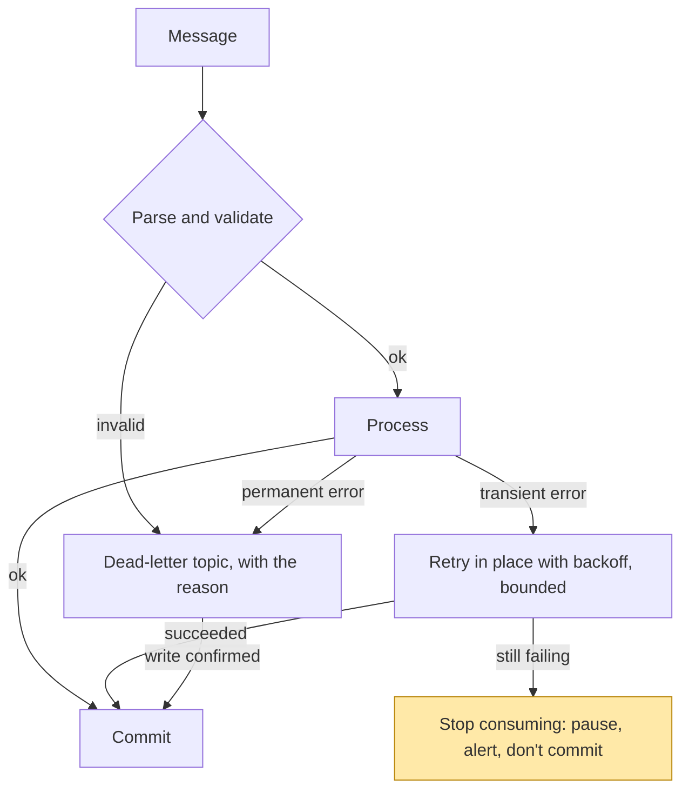

# 4. When a message fails

## The problem

A consumer gets a message it can't process. If it retries forever, the partition stops:
every message behind the bad one waits, possibly for ever. If it gives up and moves on, the
message is lost unless it was put somewhere. Every consumer has to choose between those,
for each kind of failure, and a single policy for all failures is wrong in one direction
or the other.

## Two kinds of failure

The first question about any failure is whether trying again could succeed.

| Kind | Examples | Will a retry help? |
|---|---|---|
| **Transient** | Database unavailable, timeout calling another service, a lock conflict, a broker leader election | Yes, after a wait |
| **Permanent** | Malformed JSON, a required field missing, an id that doesn't parse, a business rule that rejects the event | No. It will fail the same way every time |

A message that fails permanently and is retried forever is a **poison pill**: it blocks
its partition, and every consumer that takes over the partition after a rebalance blocks
on it too.

The opposite mistake is quieter. Treat a transient failure as permanent, and a
five-minute database outage sends every message in those five minutes to the dead-letter
queue, all of which would have succeeded a minute later.

So the handler has to classify:

The yellow node is the one most consumers lack. If a dependency is down, the right move is
usually to stop, not to keep pulling messages and failing them. A paused consumer builds
**lag**, which you can monitor and which drains when the dependency recovers. A consumer
that dead-letters everything produces a pile of messages that someone has to replay by
hand.

## Retrying in place versus retry topics

For transient failures there are two shapes:

| | Retry in place | Retry topic(s) |
|---|---|---|
| How | Loop with backoff inside the handler before committing | Publish the message to a `…-retry` topic consumed with a delay, then commit the original |
| Order | Preserved. Nothing behind it in the partition is processed | Lost. Later messages for the same key overtake the retried one |
| Partition blocked? | Yes, for as long as the retries take | No |
| Complexity | Low | Extra topics, delay logic, a final dead-letter topic |

If per-key order matters (chapter 2), a retry topic breaks it: the retried "details
changed" can land after a newer "re-verified". So either retry in place, or make the
consumer order-independent by comparing event timestamps, as chapter 2 describes.

## What goes in a dead-letter message

A dead-letter topic (**DLQ**) is only useful if someone can act on what's in it. The
minimum:

| Field | Why |
|---|---|
| Original topic, partition, offset | Find the message in the source log, and know where in the stream it was |
| Original key and value, unmodified | Replay it once the bug is fixed |
| Failure reason and error type | Triage without reproducing |
| Whether it was classified permanent or exhausted retries | Decide whether replaying will help |
| Service name and version | Know which code failed it |
| Time of failure | Correlate with deploys and incidents |

Two cautions:

- **The DLQ holds copies of real payloads.** If the source topic carries personal data, so
  does the DLQ. Give it the same access control and retention as the source, or stricter,
  and don't let "it's just for debugging" give it a longer retention.
- **A DLQ needs an owner and a replay path.** Without someone watching it and a tool that
  republishes a fixed message to the source topic, a DLQ is a write-only log of data you
  lost.

## A health check that writes to a real topic

A pattern worth avoiding: a startup health check that proves the producer works by
publishing a test message, and picks the dead-letter topic as a "safe" place to send it.
Every deploy then puts a fake failure into the DLQ, so alerting on DLQ volume becomes
useless, and anything consuming the DLQ has to filter out health-check noise. A startup
probe that *publishes* also makes the service unable to start whenever Kafka is degraded,
even if the service only uses Kafka for a side feature.

Check connectivity with a metadata request (listing partitions), not a write. Decide
separately whether a Kafka outage should stop the service from starting at all.

> **Teacher's aside.** A dead-letter queue feels like the safe default, because nothing is
> thrown away. But "nothing thrown away" only holds if the write to the DLQ is confirmed
> *before* the commit (chapter 3), the DLQ is retained and readable, and someone replays
> it. Treat a DLQ as a promise to come back for each message. If nobody will, it's a
> slower way of dropping them.

## Check yourself

1. A message has a malformed timestamp. The consumer retries it with exponential backoff
   capped at 30 seconds, forever. Describe what happens to the partition, and to the
   rebalance that follows when an operator restarts the pod.
2. The database is down for ten minutes. Compare what a "DLQ on any error" consumer and a
   "pause on transient errors" consumer leave behind once it recovers.
3. Why does a retry topic break per-key ordering, and what does the consumer need in
   order to tolerate that?
4. A DLQ message contains only `{"error": "processing failed"}`. List what you can't do
   with it.
5. Give two separate reasons a startup health check shouldn't publish to the dead-letter
   topic.
