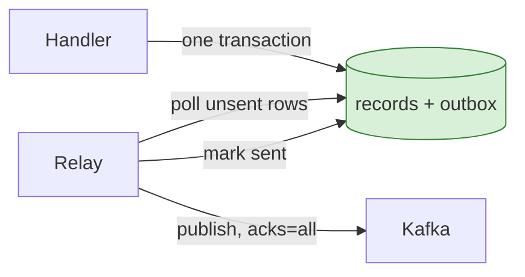

# 5. Publishing from a request handler

## The problem

An HTTP handler saves a record and then publishes an event saying it did, so other
services can react. It works almost always. Each failure is rare, silent, and permanent:
the record exists and the event doesn't, or the event exists and the record doesn't.
Nothing retries it, because nothing knows it happened. This chapter is about why "write
then publish" can't be made reliable by being careful, and what to do instead.

## Two writes, no transaction

The handler writes to two systems: the database and Kafka. They share no transaction,
so there's always a moment between the two writes where a crash, a timeout or a deploy
leaves one done and the other not. This is the **dual-write problem**.

| Order | Failure between the writes | Result |
|---|---|---|
| Database, then publish | Publish fails, or the process dies | Record exists; nobody downstream hears about it |
| Publish, then database | Database write fails, or the process dies | Downstream reacts to a record that doesn't exist |

Retrying the publish narrows the window and doesn't close it: the process can die during
the retry loop. There is no ordering of two non-transactional writes that is safe.

## Fire-and-forget makes the window bigger

A common refinement is to publish in a background goroutine so the response isn't slowed
down:

```go
go func() {
    ctx, cancel := context.WithTimeout(context.Background(), 10*time.Second)
    defer cancel()
    if err := producer.Publish(ctx, topic, key, event); err != nil {
        log.Error("failed to publish", "err", err)
    }
}()
return http.StatusCreated
```

Two details in it are right and worth understanding:

- It **doesn't use the request's context**. In Go, the request's context is cancelled when
  the handler returns, so a goroutine using it fails almost immediately. A fresh
  `context.Background()` with its own timeout fixes that. Since Go 1.21,
  `context.WithoutCancel(r.Context())` does the same while keeping the request's values
  (trace ids, for example). The source: "WithoutCancel returns a derived context that
  points to the parent context and is not canceled when parent is canceled."
- It **bounds the publish** with its own timeout, so a stuck broker can't leak goroutines
  for ever.

And it adds two new ways to lose the event:

- **Shutdown.** Graceful shutdown waits for in-flight *HTTP requests*, not for goroutines
  they started. A deploy that stops the process half a second after a response can drop
  every publish still in flight. Tracking them in a `sync.WaitGroup` that shutdown waits
  on helps. It still doesn't help if the process is killed.
- **Errors go only to the log.** The caller already received `201 Created`. A failed
  publish becomes a log line that nobody will reconcile.

## Durability settings decide what "published" means

When `Publish` returns success, what has actually happened depends on the producer's
**acks** setting. The Kafka producer documentation
([producer configs](https://kafka.apache.org/43/configuration/producer-configs/)):

| `acks` | Meaning | Lost if… |
|---|---|---|
| `0` | "the producer will not wait for any acknowledgment from the server at all" | The message never reached the broker |
| `1` | "the leader will write the record to its local log but will respond without awaiting full acknowledgement from all followers" | The leader fails before a follower copies it |
| `all` | "the leader will wait for the full set of in-sync replicas to acknowledge the record" | Every in-sync replica is lost |

The Java client has defaulted to `all` since Kafka 3.0. The 3.0 upgrade notes say: "The
producer has stronger delivery guarantees by default: `idempotence` is enabled and `acks`
is set to `all` instead of `1`."

> ⚠️ **The trap: a zero value that means "don't wait".** kafka-go's `Writer` documents
> `RequiredAcks` as "Defaults to RequireNone", which is `acks=0`. A `Writer` built as a
> struct literal that never sets `RequiredAcks` doesn't wait for the broker at all, so
> every publish "succeeds" whether or not it was stored. Set it explicitly, and prefer
> `RequireAll` for events that matter.

## Batching makes synchronous publishes slow by default

kafka-go's `Writer` batches messages per partition and flushes when a batch fills or
`BatchTimeout` passes. The default is "to flush at least every second". A synchronous
`WriteMessages` from a request handler that publishes one message at a time waits for
the batch timeout, which adds up to a second to the call. That's one reason the
fire-and-forget goroutine gets written in the first place.

The better fixes are a short `BatchTimeout` (a few milliseconds) for low-volume
request-driven producers, or one shared `Writer` for the whole process so batches fill
from many goroutines. The library's own advice: "The best way to achieve good batching
behavior is to share one Writer amongst multiple go routines."

## The fix: the transactional outbox

The way out of the dual write is to stop doing two writes. Write the event into a table
in the **same database transaction** as the record:

```sql
BEGIN;
INSERT INTO transactions (...) VALUES (...);
INSERT INTO outbox (id, topic, key, payload, created_at)
     VALUES (gen_random_uuid(), 'txn.completed', $key, $payload, now());
COMMIT;
```

Either both rows exist or neither does. A separate **relay** reads unpublished outbox
rows, publishes them, and marks them sent:



The relay can crash between publishing and marking a row sent, so it may publish twice.
That's at-least-once delivery, which consumers must handle anyway (chapter 3). The event
id from the outbox row makes deduplication easy downstream. A relay that reads the
database's change log instead of polling (change data capture, such as Debezium) is the
same idea with less load on the table.

References: [Transactional outbox](https://microservices.io/patterns/data/transactional-outbox.html)
(Chris Richardson), and AWS's
[prescriptive guidance](https://docs.aws.amazon.com/prescriptive-guidance/latest/cloud-design-patterns/transactional-outbox.html).

> **Teacher's aside.** The outbox looks like overhead next to one `Publish` call: a table,
> a relay, a cleanup job. What it buys is that the event becomes *data*: queryable, durable,
> replayable. "Did we ever publish the event for record X?" becomes a `SELECT`. With
> fire-and-forget, the honest answer is "check the logs, if they're still retained".

## When fire-and-forget is fine

Not every event deserves an outbox. If a lost event costs only a slightly stale cache, a
delayed notification, or a metric that's slightly off, and something else eventually
corrects it, then fire-and-forget with a detached context, explicit acks and logged
errors is a fair trade. The question to ask about each event: *if this one is silently
lost, what is wrong, for how long, and who notices?* If the answer is "a customer's
status is wrong until someone touches it", that's an outbox.

## Check yourself

1. A handler writes a row and then publishes in the same goroutine, retrying the publish
   three times. List the ways the row can exist with no event.
2. Why does a goroutine that publishes using `r.Context()` fail even when Kafka is
   healthy? What are the two fixes, and how do they differ?
3. A kafka-go `Writer` is built without setting `RequiredAcks`. A broker restarts during
   a deploy. What does the application believe about the messages sent during the
   restart, and what's true?
4. A service publishes one message per request synchronously with kafka-go's default
   `BatchTimeout`. p50 latency jumps by about a second. Explain it, and give two fixes.
5. The outbox relay publishes a row, then crashes before marking it sent. What happens
   next, and what does the consumer need in order to cope?
6. For each, outbox or fire-and-forget? (a) "Customer verified", which clears a
   compliance flag elsewhere. (b) "Image cache warm", a hint to pre-fetch a thumbnail.
   Justify each in one sentence.
