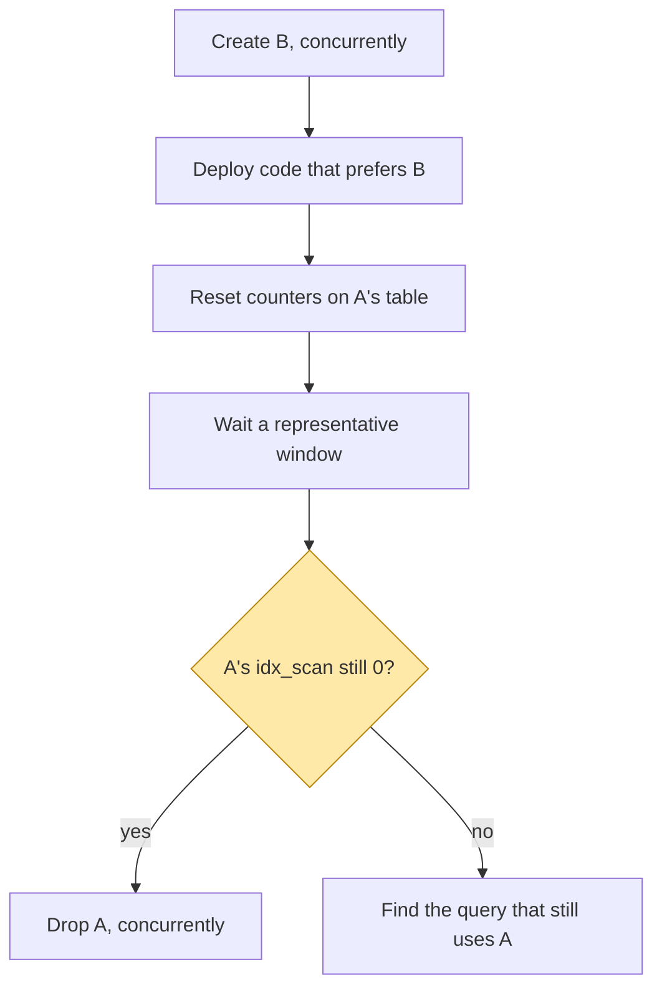

# 3. Is anything using this index?

## The problem

Every index costs something on every write: each `INSERT`, and each `UPDATE` that
can't be done in place, has to add an entry to every index on the table. An unused
index on a busy table is pure tax. So you want to drop it, and the moment you try, you
find the question "is anything using this?" is much harder to answer than it looks.
Code search tells you what *should* reach it. Only the database can tell you what
*does*, and the database's answer has blind spots.

This chapter is about collecting evidence before a drop, and about why the obvious
evidence can mislead you.

## The counter

PostgreSQL counts index use in the cumulative statistics system. The view to read is
`pg_stat_user_indexes` ([§27.2](https://www.postgresql.org/docs/current/monitoring-stats.html)):

| Column | Meaning |
|---|---|
| `idx_scan` | "Number of index scans initiated on this index" |
| `last_idx_scan` | Time of the last scan (PostgreSQL 16 and later) |
| `idx_tup_read` | Index entries returned by scans on this index |
| `idx_tup_fetch` | Live table rows fetched by simple index scans using this index |

```sql
SELECT indexrelname, idx_scan, idx_tup_read, last_idx_scan,
       pg_size_pretty(pg_relation_size(indexrelid)) AS size
  FROM pg_stat_user_indexes
 WHERE relname = 'orders'
 ORDER BY idx_scan;
```

An index with `idx_scan = 0` over a long, representative window is a candidate. That
much is well known. The rest of this chapter is about the cases where the number lies.

## Four ways the counter misleads

### 1. It counts since the last reset, not since the index was created

A non-zero `idx_scan` might be one query from eight months ago. To ask "is it used
*now*?" you reset the counter for that index and wait:

```sql
SELECT pg_stat_reset_single_table_counters(indexrelid)
  FROM pg_stat_user_indexes
 WHERE indexrelname = 'orders_customer_trgm';
```

> ⚠️ Pass the **index's** OID, not the table's. Despite the function's name, resetting a
> table's counters leaves its indexes' counters untouched. I checked this on
> PostgreSQL 17: after `pg_stat_reset_single_table_counters('t'::regclass)` every index
> on `t` kept its `idx_scan`. Resetting by the index's own OID cleared it.

Then the wait has to be representative. A day misses weekly jobs. A week misses the
month-end report. Pick the window from what runs on your system, not a rule of thumb.

### 2. Each server counts only its own scans

On a primary with read replicas, every server has its own statistics. The
[hot standby](https://www.postgresql.org/docs/current/hot-standby.html) chapter says
the statistics system "is active during recovery. All scans, reads, blocks, index
usage, etc., will be recorded normally on the standby." That means a query that runs
only on a replica increments the replica's counter and leaves the primary's at zero.
Dropping an index on the primary drops it everywhere, because replicas replay the
primary's changes.

So check `idx_scan` on every server that takes reads, not just the one you're
connected to.

### 3. A replacement can make a live index look dead, or a dead one look live

This one is subtle, and it's the reason the evidence has to be gathered in a specific
order.

Suppose index A serves a search and you're replacing it with a better index B. Before
B exists, A's counter goes up whenever *anyone* searches, including the very feature
you're migrating to B. So a non-zero count on A today proves nothing about whether
anything *other than* that feature needs A. You can only ask that question once B
exists and has taken over its traffic.

The safe sequence:



Note what that means for your migration tooling: creating B and dropping A must be
**separate deploys**. If they're in the same batch of migrations, the runner applies
both together and the window in the middle, where the only valid evidence exists,
never happens.

### 4. `idx_scan` can count more than once per query

The manual warns that each index *search* increments `idx_scan`, and some plans search
an index many times in one execution. Its example is `col = v1 OR col = v2 …`. A large
count is not necessarily many queries. For "is it zero?" this doesn't matter. For
"which index is busiest?" it does.

## Finding the query that still uses it

If the counter isn't zero after the wait, `pg_stat_statements` (an extension, but
installed almost everywhere) records normalised query texts with call counts:

```sql
SELECT calls, left(query, 120)
  FROM pg_stat_statements
 WHERE query ILIKE '%the_column_or_expression%'
 ORDER BY calls DESC;
```

Then run `EXPLAIN` on each candidate to confirm it picks the index you care about.
`EXPLAIN` is the only thing that tells you which index a specific query uses. The
statistics only say that *something* did.

> **Teacher's aside.** Code search and database statistics answer different questions,
> and you need both. Code search tells you every place that *could* produce a query,
> including dead code, which inflates the list. Statistics tell you what actually ran,
> but only on the servers you checked and in the window you waited, which can shrink
> it. When they disagree, don't pick one. The disagreement points at something
> specific: a caller you didn't know about, a replica you didn't check, or a job that
> hasn't run yet.

## What an unused index costs

It's worth knowing what you're paying, so you know whether the investigation is worth
it:

- **Writes.** Every insert updates every index on the table. A GIN index amortises some
  of this with a pending list, but the work is still done eventually.
- **Updates.** An update that touches an indexed column can't be a **HOT** (heap-only
  tuple) update, so it has to write new entries into *every* index, not just the
  changed one.
- **Memory.** Index pages compete for the same buffer cache as the pages you actually
  read.
- **Maintenance.** Vacuum has to process it.

A small index on a quiet table costs nothing worth measuring. A large GIN index on the
hottest table in the database is worth a week of evidence-gathering.

## Check yourself

1. `idx_scan` on an index is 82. Give three different situations that would produce
   that number and in which dropping the index is still safe.
2. Your primary shows `idx_scan = 0` for an index after a month. Why might dropping it
   still break production, and what do you check?
3. You're replacing index A with index B. A colleague proposes one migration file that
   creates B and drops A, "so they stay in sync". What goes wrong, specifically?
4. Why reset the counter for one index rather than calling the database-wide reset? And
   what happens if you pass the table's name instead of the index's?
5. The statistics show an index is used, but every code path you can find avoids it.
   What two tools would you reach for, in what order, and what does each tell you?
