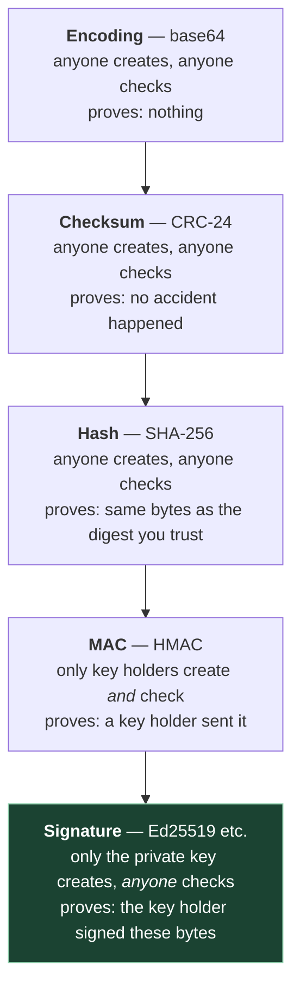
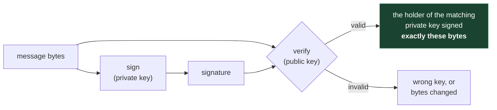

# 1. Foundations — what each mechanism actually proves

**Who can skip this:** if you can already say, without hesitating, why a SHA-256 printed
next to a download proves nothing about who made the file, and why HMAC can't give you
"anyone can verify, only I can sign", skip to [file 02](02-trust-anchors.md). Everyone else: this chapter is the
model the whole course hangs off. Every later chapter assumes it.

## 1.1 The problem

Someone hands you a piece of text and says *"this is what Alice wrote"*. How would you
know?

That question hides three different failures, and it matters which one you're defending
against:

| Failure | Example | Who causes it |
|---|---|---|
| **Corruption** | A byte flips on a bad disk; a chat client turns `'` into `’`; an editor strips a trailing newline | Nobody, on purpose. Accidents |
| **Tampering** | Someone between Alice and you changes "pay 10" to "pay 10,000" | An attacker who can touch the data in transit or at rest |
| **Impersonation** | The text never came from Alice at all | An attacker who can make up the whole thing |

There's a ladder of mechanisms people reach for here — encoding, checksums, hashes, MACs,
signatures. They look alike from a distance: each one produces a blob of gibberish that
travels next to your data. They are not alike. **Each rung defends against a strictly
different set of failures**, and most real-world mistakes in this area come from using a
lower rung and believing you got a higher one.

The question to ask of every rung is the same: **who can create this, and who can check
it?** Almost everything else follows from the answer.



Let's climb it.

## 1.2 Encoding: base64 proves nothing

**Base64** is a way of writing arbitrary bytes using only 64 printable characters, so
binary data survives systems that only carry text — email bodies, JSON strings, copy-paste.
It's defined in [RFC 4648 §4](https://www.rfc-editor.org/rfc/rfc4648#section-4): the
alphabet is `A–Z`, `a–z`, `0–9`, `+` and `/`, with `=` as padding.

```
$ printf 'pay alice 10' | base64
cGF5IGFsaWNlIDEw
```

That looks scrambled, and that's the trap. There is no key. The transformation is public
and reversible. Anyone can decode it, change "alice" to "mallory", and re-encode it, and
the result is exactly as valid-looking as the original.

So base64 is a **transport** tool, not a security tool. It tells you nothing about who
made the data or whether it changed. (Keep it in mind, though — it comes back in [file 04](04-signing-in-automation.md)
as the right way to move exact bytes through a shell.)

## 1.3 Checksums: catching accidents

The next problem is accidents. Data gets mangled in transit, and you'd like to notice.

A **checksum** is a short value computed from the data by a fixed, public function.
Recompute it at the other end; if it differs, something changed. The classic family is the
**CRC** (cyclic redundancy check), which is designed to catch the kinds of errors noisy
channels produce — flipped bits, short bursts.

A concrete one you may have seen: OpenPGP's ASCII armour (the `-----BEGIN PGP
SIGNATURE-----` blocks) can end with a short line made of `=` followed by four base64
characters. That's a **CRC-24** of the decoded data, itself base64-encoded. [RFC 4880 §6](https://www.rfc-editor.org/rfc/rfc4880#section-6)
describes it ("generator 0x864CFB and an initialization of 0xB704CE"), and §6.1 gives a
sample implementation in C. Its stated rationale is entirely about accidents: 24 bits fit
evenly into base64, and "the nonzero initialization can detect more errors than a zero
initialization."

Here's the thing a checksum can't do. Running RFC 9580's sample code locally:

```
F79720  pay alice 10
C31ADE  pay mallory 10000
```

An attacker who changes the message just runs the same public function and writes down the
new checksum. Nothing stops them, because **creating a valid checksum needs nothing but
the data**. A checksum answers "did the channel garble this?", never "did someone change
this?".

(Sanity check on that code: it produces `21CF02` for the input `123456789`, which matches
the published check value for CRC-24/OPENPGP in the
[RevEng CRC catalogue](https://reveng.sourceforge.io/crc-catalogue/17plus.htm).)

The standards body reached the same conclusion. **RFC 4880 is obsolete**: it was replaced
in July 2024 by [RFC 9580](https://www.rfc-editor.org/rfc/rfc9580), whose
[§6.1 "Optional Checksum"](https://www.rfc-editor.org/rfc/rfc9580#section-6.1) says an
implementation "MUST NOT reject an OpenPGP object when the CRC24 footer is present,
missing, malformed, or disagrees with the computed CRC24 sum", that it "SHOULD NOT be
generated", and gives the reason plainly: computing it "incurs a significant cost, while
providing no meaningful integrity protection." In OpenPGP the protection comes from the
signature (or the encryption's own integrity check) over the content, not the armour
footer.

## 1.4 Cryptographic hashes: a fingerprint of the bytes

A **cryptographic hash** like SHA-256 ([FIPS 180-4](https://csrc.nist.gov/pubs/fips/180-4/upd1/final))
looks like a bigger checksum — a fixed-size digest (32 bytes) computed by a public
function. The difference is what's *hard*. A cryptographic hash is designed so that nobody
can feasibly:

- find a second input with the same digest as a given input (**second-preimage resistance**), or
- find any two inputs with the same digest (**collision resistance**).

A CRC makes no such promise; it was never meant to resist someone trying.

```
$ printf 'pay alice 10' | shasum -a 256
37fd94ae6cdbaab54d81db99e742e7b1f19458186d364c464137d8670c83f77b
```

So surely publishing the hash next to the data protects it? **No — and this is the most
common mistake on the whole ladder.** The hash function is still public and still keyless.
Someone who can replace the data can also replace the digest sitting next to it, by
running SHA-256 on their version. The collision resistance never comes into play, because
the attacker isn't trying to match *your* digest; they're publishing their own.

A hash only helps when **the digest reaches you over a channel the attacker can't touch**.
If Alice reads you the digest over a phone call you trust, and the download you got from
an untrusted mirror matches it, then the hash's resistance properties do real work: the
mirror couldn't have produced different bytes with that digest.

Notice what just happened. To make the hash useful you needed a second, authenticated
channel from Alice. Doing that for every file, for every reader, doesn't scale. What you
want is a way to make *the digest itself* carry proof of where it came from. That's the
next two rungs.

## 1.5 MACs and HMAC: proof between people who share a secret

Add a secret key to the hash and the attacker's trick stops working: they can still change
the data, but they can't compute the new tag without the key.

That's a **message authentication code (MAC)**. The standard construction built from a
hash function is **HMAC**, from [RFC 2104](https://www.rfc-editor.org/rfc/rfc2104):

```
HMAC(K, text) = H(K XOR opad, H(K XOR ipad, text))
```

(`ipad` and `opad` are fixed padding constants defined in the RFC; `H` is any iterated
cryptographic hash, such as SHA-256.)

```
$ printf 'I wrote this.\n' | openssl dgst -sha256 -hmac 'shared-secret'
SHA2-256(stdin)= a20606915329477d5a9c2abcea25aa9ff39c520d8635579f9a88ada2461ec880
```

RFC 2104's introduction says who it's for: MACs "are used between two parties that share a
secret key in order to validate information transmitted between these parties." That's
the whole capability, and the whole limit. The same key both creates and checks the tag.
Follow that through for the "publish something anyone can verify" case:

| You… | Then… |
|---|---|
| keep the key secret | the public can't verify anything — checking requires the key |
| publish the key so people can verify | anyone can now create valid tags — forgery is free |

There is no third option. **HMAC cannot give you "only I can sign, anyone can check."**

Where it is the right tool: two parties who already share a key and only need to convince
*each other*. Webhooks are the textbook case — a provider and a receiver agree a secret
once, the provider tags each request, and the receiver rejects anything whose tag doesn't
check. It's fast and simple.

But notice one more limit, which matters for disputes. Both parties hold the same key, so
**either of them could have produced any given tag**. If the provider later says "we never
sent that request", the receiver's HMAC can't settle it: the receiver could have made the
tag themselves. A MAC authenticates the message to the other party; it can't convince a
third party who wrote it.

## 1.6 Digital signatures: split the key in two

The fix is to split the key: one half creates, the other half checks, and you can't derive
the first from the second.

A **digital signature** scheme gives you a **key pair**:

- the **private key** (secret, held by the signer) produces signatures;
- the **public key** (published to the world) verifies them.



Now the asymmetry you wanted exists. Only Alice can produce a signature that verifies
under Alice's public key. Anyone holding the public key can check it. Publishing the public
key costs Alice nothing.

What a valid signature proves, stated narrowly:

> **Someone holding the private key that matches this public key signed exactly these
> bytes.**

Every word in that sentence is load-bearing, and so is everything it leaves out:

| A valid signature does **not** tell you… | Why | Where it's handled |
|---|---|---|
| …that the public key is Alice's | The maths links the signature to a key, not to a person | [File 02](02-trust-anchors.md) |
| …when it was signed | The signature formats in this course carry no trusted timestamp | [File 03 §3.8](03-ssh-signatures.md) |
| …that only Alice holds the key | A leaked key signs as well as the original | Files 02 and 04 |
| …that Alice meant it, read it, or that it's true | Intent and truth aren't properties of bytes | Not by cryptography |
| …that the bytes you're looking at are the bytes she signed, *if any byte differs* | One changed byte — a newline — and it fails | [File 04 §4.7](04-signing-in-automation.md) |

The signing algorithms used in this course (Ed25519, and the RSA and ECDSA variants SSH
supports) are covered in their own standards; we treat them as black boxes with the
contract above. [File 03 §3.7](03-ssh-signatures.md) looks at one property that does leak through: whether signing
the same message twice gives the same bytes.

## 1.7 The ladder, side by side

| Mechanism | Needs a secret? | Who can **create** a valid one | Who can **check** it | Catches accidental corruption | Stops tampering by an outsider | Convinces a third party who wrote it |
|---|---|---|---|---|---|---|
| **Base64** (RFC 4648) | No | Anyone | Anyone | No¹ | No | No |
| **CRC-24** (RFC 4880 §6; optional in RFC 9580) | No | Anyone | Anyone | Yes — its only job | No | No |
| **SHA-256** published next to the data | No | Anyone | Anyone | Yes | **No** — attacker recomputes it | No |
| **SHA-256** received over a trusted channel | No | Anyone | Anyone | Yes | Yes, *because of the channel* | Only as far as the channel does |
| **HMAC** (RFC 2104) | Shared secret | Every key holder | Every key holder | Yes | Yes, against non-holders | **No** — any holder could have made it |
| **Digital signature** | Private key | Only the private key holder | **Anyone** with the public key | Yes | Yes | Yes — *to the extent the public key is bound to them* |

¹ Invalid base64 characters may cause a decode error, but that's an accident of the format,
not a check.

> **Teacher's aside.** People talk about each step up the ladder as *removing* the need for
> trust. It doesn't. It **moves** it, each time to something smaller and easier to protect.
> The hash moves trust from "the whole file" to "a 32-byte digest, delivered safely". HMAC
> moves it to "a secret key, distributed safely and kept secret by everyone who has it".
> A signature moves it to "a public key, known to be the right one" — which is a much
> better deal, because a public key needs to be *authentic* but not *secret*, and it can be
> distributed once and reused for every message forever. But the trust is still there.
> A signature checked against a public key you got from the attacker proves exactly as
> much as a hash checked against a digest you got from the attacker. [File 02](02-trust-anchors.md) is entirely
> about that remaining question.

---

## Check yourself

1. A colleague says "the payload is base64-encoded, so it can't be altered in transit
   without us noticing." What exactly would an attacker do, and why does nothing fail?
2. A download page serves a file and, on the same page, its SHA-256. Which of the three
   failures in §1.1 does the digest defend against, and which doesn't it? What single
   change to *where the digest lives* would change your answer?
3. RFC 9580 tells implementations to accept armoured data even when the CRC-24 footer
   disagrees with the content. Why doesn't that weaken OpenPGP's security? What would
   catch a tampered message instead?
4. You want readers of your notes to be able to confirm a post is really yours. Explain
   why HMAC fails at this, considering both what you could do with the key.
5. A webhook receiver and a provider share an HMAC key. The provider denies sending a
   particular request; the receiver shows a valid tag. Who's right, and why can't the tag
   decide it? Would a signature by the provider settle it, and what would you still have
   to establish?
6. Someone argues "a signature is just a hash plus a key, so it's no stronger than an HMAC
   with a well-guarded key." What's the precise difference in *who can check* and *who
   could have created*, and why does that difference matter more than key strength?

(Answers in [`07-exercises.md`](07-exercises.md).)
