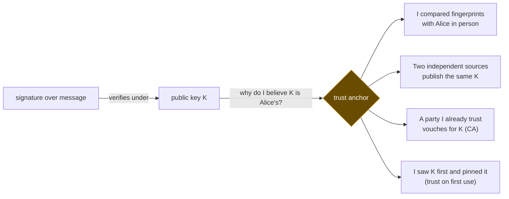

# 2. Trust anchors — is this really their public key?

## 2.1 The problem

[File 01](01-foundations.md) ended with a signature that proves "the holder of *this* private key signed
*these* bytes". The obvious attack is now one level up: don't forge the signature, **swap
the key**.

Picture a page that shows a signed statement, the signature, and "here's my public key"
— all served from the same place. An attacker who can change that page writes their own
statement, signs it with their own key, and replaces the public key with theirs.
Verification succeeds. It's the hash-next-to-the-data mistake from [file 01 §1.4](01-foundations.md), one rung
higher.

So a verifier needs a public key it got **some other way** — a way the attacker can't also
control. The key you start from, accepted on grounds outside the signature system itself,
is called a **trust anchor**. Every signature check bottoms out in one.



## 2.2 The ways to anchor a key

There's no perfect answer, only trade-offs. These are the main families:

| Approach | How you come to believe K is Alice's | What it costs | What breaks it |
|---|---|---|---|
| **Out-of-band comparison** | Alice tells you her key's fingerprint over a channel you trust (in person, a call) | Doesn't scale past people you can talk to | Only a compromised channel |
| **Trust on first use (TOFU)** | You accept whatever key you see the first time and alarm if it ever changes | Nothing up front | An attacker present at the *first* contact |
| **Independent cross-checks** | Several sources run by different parties publish the same key | You must check more than one place | Compromise of *all* sources at once |
| **A vouching authority** | Someone you already trust signs a statement binding K to a name (a certificate authority, CA) | You inherit every authority's mistakes | Any one trusted authority misissuing |
| **Web of trust** | People you trust sign each other's keys (classic PGP) | Social effort; hard to reason about | Careless signers |

A **fingerprint** in that table is a short hash of the public key, so you compare 50-odd
characters instead of a long base64 blob. OpenSSH prints them like this:

```
$ ssh-keygen -lf k.pub
256 SHA256:30/gF7srI49GpVd44oIkphGD6NdBu9bSjQx4G8ffRsM alice@example.com (ED25519)
```

(All keys in this course are throwaway keys generated for the examples.)

## 2.3 Cross-checking against an independent publisher

For someone publishing signed material on their own site, the cheapest strong anchor is
**cross-checking**: publish the public key in your own place *and* make sure it's
retrievable from a second place you don't run, that's secured separately. An attacker who
takes over your site can change the key there, but now it disagrees with the second
source, and anyone who checks both notices.

GitHub is a common second source because it publishes users' public keys without
authentication. It keeps **two separate lists**, and the difference matters:

| What | How to fetch | Source |
|---|---|---|
| **Authentication keys** (the ones used for `git push` over SSH) | REST: `GET /users/{username}/keys` — "Lists the verified public SSH keys for a user. This is accessible by anyone." Also served as plain text at `https://github.com/<username>.keys` | [REST API: Git SSH keys](https://docs.github.com/en/rest/users/keys#list-public-keys-for-a-user) |
| **Signing keys** (the ones GitHub uses to mark commits "Verified") | REST: `GET /users/{username}/ssh_signing_keys` — "This operation is accessible by anyone." | [REST API: SSH signing keys](https://docs.github.com/en/rest/users/ssh-signing-keys#list-ssh-signing-keys-for-a-user) |

I could find the REST endpoints in GitHub's documentation but not a docs page describing
the `github.com/<username>.keys` URL itself; it does serve `text/plain` (checked October
2026), and it's widely used, but treat the REST endpoint as the documented one.

In practice, to cross-check a signing key:

```sh
curl -s https://api.github.com/users/<username>/ssh_signing_keys | jq -r '.[].key'
```

then compare against the key in your `allowed_signers` file ([file 03 §3.5](03-ssh-signatures.md)) — ideally by
fingerprint.

The two lists are genuinely separate. GitHub's docs say: "You can add an SSH key and use it
for authentication, or commit signing, or both. If you want to use the same SSH key for
both authentication and signing, you need to upload it twice"
([Adding a new SSH key](https://docs.github.com/en/authentication/connecting-to-github-with-ssh/adding-a-new-ssh-key-to-your-github-account)).
So if you're cross-checking a *signing* key, look in the signing list. Finding it in the
authentication list tells you it's on the account, not that it's registered for signing.

What cross-checking does **not** give you: protection against GitHub itself being wrong,
or against an attacker who has taken over the GitHub account too. The second source is a
trust anchor, not an oracle. Its value is **independence** — the attacker now has to
compromise two separately secured things at once.

## 2.4 Keep signing keys separate from login keys

Nothing stops you using one SSH key for logging in and for signing. GitHub explicitly
allows it. The question is what you lose when that one key leaks.

| If this key leaks… | …the thief can |
|---|---|
| **A login (authentication) key** | Push to every repository the account can write to; log in to any server that has the key in `authorized_keys` |
| **A dedicated signing key** | Produce signatures that verify as yours: forged signed statements, and — if the key is registered on GitHub as a signing key — commits that GitHub marks **Verified** (subject to its email checks, [file 05 §5.3](05-git-commit-signing.md)) |
| **One key used for both** | All of the above |

Separation buys three things:

- **Smaller blast radius.** A signing key that's only a signing key can't be used to log
  in anywhere. A login key that's never registered for signing can't make anything look
  "Verified".
- **Different storage for different risk.** A signing key used by a CI pipeline ([file 04](04-signing-in-automation.md))
  has to live in a secret store, unencrypted, on machines you don't sit at. You don't want
  that same key to open your servers.
- **Independent revocation.** You can rotate one without disturbing the other.

A leak has a long tail on GitHub specifically. GitHub stores a **persistent verification
record** for each commit when it first verifies the signature, and "if a signing key is
later revoked, expired, or otherwise altered, previously verified commits retain their
verified status" ([About commit signature verification](https://docs.github.com/en/authentication/managing-commit-signature-verification/about-commit-signature-verification#persistent-commit-signature-verification)).
So commits a thief pushed with your leaked signing key *before you noticed* keep their
Verified badge after you remove the key. Removing the key stops new damage; it doesn't
undo old damage.

> **Teacher's aside.** People sometimes argue key separation is pointless for SSH
> signatures because the protocol already stops a file signature from being mistaken for a
> login signature. That part is true — the SSHSIG format starts the signed data with a
> magic `SSHSIG` preamble precisely so it "can never be confused with any message signed
> during SSH user or host authentication" ([file 03 §3.3](03-ssh-signatures.md)). But that's a guarantee about
> *signatures*, not about *keys*. It stops an attacker reusing a signature you made in one
> context in another. It does nothing about an attacker who **has the key** — they can
> simply make fresh signatures in whatever context they like. Protocol separation limits
> what a captured signature is worth; key separation limits what a captured key is worth.
> You want both.

## 2.5 Vouching at scale: certificates and transparency

Cross-checks work for a handful of keys. The web needed the same thing for every website,
and its answer is the **certificate authority (CA)**: a party your browser already trusts
signs a **certificate** binding a public key to a domain name. That's the "vouching
authority" row of the §2.2 table, industrialised.

Its weakness is in that table too: any trusted CA can issue a certificate for any domain.
One careless or compromised CA can vouch for an attacker's key for your domain, and
browsers would accept it.

**Certificate Transparency (CT)** doesn't prevent that. It makes it *visible*. CAs submit
certificates to public, append-only logs (built on Merkle trees, so a log can't quietly
rewrite its history without that being provable), and browsers can require proof that a
certificate was logged. The original protocol is
[RFC 6962](https://www.rfc-editor.org/rfc/rfc6962) (June 2013); version 2.0 is
[RFC 9162](https://www.rfc-editor.org/rfc/rfc9162) (December 2021), which obsoletes it.
**Both are published as Experimental**, not Standards Track — worth knowing before you
call CT "the standard". Both describe logging certificates "in a manner that allows anyone
to audit certification authority (CA) activity and notice the issuance of suspect
certificates" (RFC 9162 abstract; RFC 6962's wording is almost identical).

Two things to be honest about:

- **Logs don't catch anything themselves.** RFC 9162 §11.2: "The logs do not themselves
  detect misissued certificates; they rely instead on interested parties, such as domain
  owners, to monitor them and take corrective action when a misissue is detected." CT is only as good as the people
  watching it — typically domain owners monitoring for certificates they didn't request.
- **Enforcement comes from browser policy, not the RFC.** Chrome, for example, requires
  certificates to carry signed timestamps from logs (SCTs), from at least two distinct log
  operators ([Chrome CT policy](https://googlechrome.github.io/CertificateTransparency/ct_policy.html)).
  That policy page doesn't name an RFC version, and I haven't verified how much of deployed
  CT has moved from the RFC 6962 design to RFC 9162; don't quote either as "what browsers
  use" without checking.

The general idea transfers: when you can't stop a trusted party from vouching wrongly,
make every act of vouching public so the wrong ones can be found.

---

## Check yourself

1. A page serves a signed statement, its signature, and the signer's public key, all from
   the same host. You verify it successfully. State precisely what you've learned, and
   what an attacker controlling that host could have done.
2. Why does checking a key against GitHub's published list add real assurance, and which
   attacker does it not stop? What property of the two sources is doing the work?
3. Someone uses one SSH key for logging in to servers, pushing to GitHub, and signing
   commits. Their laptop is stolen with the key on it. List what the thief can do. Now
   redo the list for someone who used two separate keys and only the signing key was on
   the laptop.
4. You find out your signing key leaked a week ago and remove it from GitHub today. Do
   commits pushed with it during that week stop showing "Verified"? Why might GitHub have
   chosen that behaviour, and what does it mean for how quickly you need to act?
5. CT doesn't stop a CA misissuing a certificate for your domain. What does it give you
   instead, and what has to be true of *you* for it to help?

(Answers in [`07-exercises.md`](07-exercises.md).)
