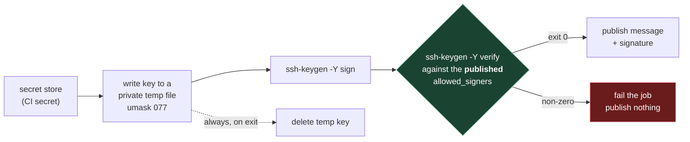

# 4. Signing in automation

## 4.1 The problem

Signing by hand doesn't last. Sooner or later you want a pipeline to sign things — a
release, a generated statement, a manifest — every time it runs. That means the private
key has to exist, unencrypted, on a machine you don't sit at, at a moment you aren't
watching. And it means a pipeline can now *publish a claim* ("this is signed by me") with
no human checking the claim is true.

This chapter is about doing that without making the key, or the claim, the weak point.
The examples use GitHub Actions, but the principles carry to any CI system.



## 4.2 A dedicated key, and what "dedicated" buys

Generate a key that exists only for this job:

```sh
ssh-keygen -t ed25519 -N '' -C 'release-signing' -f release_signing
```

- **No passphrase** (`-N ''`), because nothing in CI can type one. That's a real loss of
  protection, and it's why the secret store is now the thing protecting the key.
- **Signing only.** Don't register it anywhere as a login key ([file 02 §2.4](02-trust-anchors.md)). If you
  register it on GitHub at all, register it as a signing key.
- **Namespace-restricted** in the `allowed_signers` you publish, e.g.
  `namespaces="file"`, so even a stolen copy can't produce signatures your verifiers would
  accept in other namespaces ([file 03 §3.5](03-ssh-signatures.md)).
- **Ed25519**, which gives you deterministic signatures ([file 03 §3.7](03-ssh-signatures.md)) — so re-running the
  pipeline on unchanged content produces an unchanged signature file.

## 4.3 Keeping it as a CI secret

Store the private key file's contents as a repository or environment secret. GitHub's
documentation is worth reading in full
([Using secrets in GitHub Actions](https://docs.github.com/en/actions/security-for-github-actions/security-guides/using-secrets-in-github-actions),
[Secure use reference](https://docs.github.com/en/actions/reference/security/secure-use)),
but the points that matter here:

| Fact (from GitHub's docs) | What it means for a signing key |
|---|---|
| "With the exception of `GITHUB_TOKEN`, secrets are not passed to the runner when a workflow is triggered from a forked repository." | A pull request from a fork can't get your key. Don't work around this |
| "Because there are multiple ways a secret value can be transformed, automatic redaction is not guaranteed." | Never print the key, or anything derived from it. Log masking is a safety net, not a control |
| "If an unredacted secret is sent to a workflow run log, you should delete the log and rotate the secret." | If it ever appears in a log, treat it as leaked (§4.6) |

A multi-line PEM-style private key is exactly the kind of value whose redaction you
shouldn't rely on.

## 4.4 Putting the key on disk, briefly

`ssh-keygen -f` wants a file. So the job writes the secret to a file, uses it, and
removes it:

```sh
set -eu
umask 077                                  # files created from here on: owner-only
keydir=$(mktemp -d)
trap 'rm -rf "$keydir"' EXIT               # delete on success *and* on failure
printf '%s\n' "$SIGNING_KEY" > "$keydir/key"
ssh-keygen -Y sign -f "$keydir/key" -n file statement.txt
```

Why each line:

- **`umask 077` before writing**, not `chmod 600` after. The umask applies at creation, so
  the file is never readable by anyone else, even for an instant. A `chmod` afterwards
  leaves a window. It's also not just hygiene: `ssh-keygen` refuses to use a private key
  that's too readable —

  ```
  Permissions 0644 for 'k644' are too open.
  It is required that your private key files are NOT accessible by others.
  This private key will be ignored.
  ```

- **`mktemp -d`**, so the path is unpredictable and private, not a fixed `/tmp/key`.
- **`trap … EXIT`**, so the key is removed whether signing succeeded or not.
- **`printf '%s\n'`**, because of the next trap.

> ⚠️ **A private key file without its final newline doesn't load, and the error doesn't
> say so.** With OpenSSH 10.0p2, a key written with `printf '%s'` (no trailing newline)
> failed with `Couldn't load public key knonl: No such file or directory` — `ssh-keygen`
> couldn't parse the private key, fell back to looking for a `.pub` file next to it, and
> reported *that* failure. A key with Windows (CRLF) line endings also failed. One extra
> trailing newline was fine. If you store the key via a web form or another tool, check
> what happened to its line endings.

## 4.5 Verify before you publish

`ssh-keygen -Y sign` exiting 0 means a signature was written. It does not mean the thing
you're about to publish will verify for your readers. Between the two sit plenty of ways
to be wrong:

| What went wrong | `sign` exits 0? | Reader's `verify` |
|---|---|---|
| The CI secret holds an old key, not the one in your published `allowed_signers` | Yes | Fails |
| A later step reformats the message (trims whitespace, normalises line endings, templating) | Yes | Fails |
| Signed with `-n file`, readers told to use `-n something-else` | Yes | Fails |
| Published `allowed_signers` wasn't updated after rotation | Yes | Fails |

So make the pipeline run **the reader's exact check** before it publishes anything, and
fail the job if it doesn't pass:

```sh
# allowed_signers is the same file readers use, committed in the repo — not generated here.
# Under set -e, a non-zero exit stops the job before anything is published.
ssh-keygen -Y verify -f allowed_signers -I alice@example.com -n file \
  -s statement.txt.sig < statement.txt
```

Two rules make this gate actually mean something:

1. **Verify against the published trust file**, not a public key you derive in the job
   with `ssh-keygen -y -f "$keydir/key"`. A key derived from the secret always matches the
   secret; that check can't catch "the secret is the wrong key".
2. **Verify the exact bytes you'll publish**, after every transformation, not an
   intermediate copy.

The principle is broader than SSH: **a pipeline should never be able to publish a claim
it hasn't checked.** "Signed ✓" is a claim. If the check fails, publishing nothing is the
correct outcome.

## 4.6 Rotation when a key leaks

Suppose the key leaks — printed in a log, a compromised runner, a mistaken commit. The
steps:

| Step | Why |
|---|---|
| Generate a new key; replace the CI secret | Stop the pipeline using the leaked one |
| Remove the old key from anywhere it's registered (e.g. GitHub signing keys) | Stop new forgeries being shown as yours — but see [file 02 §2.4](02-trust-anchors.md): GitHub keeps already-verified commits verified |
| Update your published `allowed_signers` and any cross-check source ([file 02 §2.3](02-trust-anchors.md)) together | Readers must see the new key and stop trusting the old one |
| Re-sign what's still published, with the new key | Old signatures will stop verifying once the old key is gone or expired |
| Optionally publish the old key as revoked (`ssh-keygen -Y verify -r`, or git's `gpg.ssh.revocationFile`) | An explicit "never trust this" for verifiers that keep a revocation list |

The tempting shortcut is to keep the old key in `allowed_signers` with
`valid-before="<leak date>"`, hoping old signatures stay good and new forgeries fail. It
doesn't work for plain file signatures, and [file 03 §3.8](03-ssh-signatures.md) shows why: **the signature
carries no time.** `valid-before` is checked against the *verifier's* clock (or a time the
verifier chooses). So:

- checked today, *every* signature from the old key fails, legitimate ones included;
- checked with `-O verify-time=<some past date>`, every signature from the old key passes,
  forged ones included.

The signature alone can't tell you which side of the leak it was made on. If you need that
distinction you need a trustworthy timestamp from outside the signature — which SSH
signatures don't provide. [File 05 §5.4](05-git-commit-signing.md) shows the same problem in git, where it's worse,
because there the timestamp comes from the signer.

> **Teacher's aside.** People think of a key leak as a moment: "it leaked on Tuesday".
> From the verifier's side it isn't a moment, it's a **loss of the ability to date
> anything** that key ever signed. Before the leak, "Alice's key signed this" implied
> "Alice signed this". After it, the same sentence implies "Alice *or the thief* signed
> this, at an unknown time". That's why rotation means re-signing what you still stand
> behind, not just swapping keys going forward.

## 4.7 Moving exact bytes through a shell

A signature is over **exact bytes**. Change one and verification fails — including bytes
you can't see:

```
$ printf 'I wrote this.' | ssh-keygen -Y verify -f allowed_signers -I alice@example.com -n file -s msg.txt.sig
Signature verification failed: incorrect signature
Could not verify signature.
```

The signed file was `I wrote this.\n`. Feeding `I wrote this.` — no trailing newline —
fails. Trailing newlines, CRLF versus LF, curly versus straight quotes, a trailing space a
chat app trimmed: all of these break a signature, and none of them are visible.

This bites hardest when you want to give someone a **copy-pasteable shell snippet** that
recreates a signed message so they can verify it. The obvious approach is quoting:

```sh
echo 'It's mine.' > msg.txt
```

The apostrophe ends the single-quoted string early, and the shell sees an unterminated
quote:

```
sh: -c: line 0: unexpected EOF while looking for matching `''
```

Switch to double quotes and apostrophes work, but now `$`, backticks and `\` are
interpreted — a message containing `$HOME` silently becomes your home directory. Heredocs
have their own rules about trailing newlines and expansion. Every quoting scheme has
characters it mangles.

The robust answer is the encoding from [file 01 §1.2](01-foundations.md). **Base64 the exact bytes** and decode
on the other side:

```
$ base64 < q.txt
SXQncyBtaW5lLgo=
$ echo 'SXQncyBtaW5lLgo=' | base64 -d > msg.txt
```

```
$ echo 'SXQncyBtaW5lLgo=' | base64 -d | cmp - q.txt && echo BYTE-IDENTICAL
BYTE-IDENTICAL
```

It works because the base64 alphabet (RFC 4648 §4: `A–Z a–z 0–9 + /` and `=`) contains no
quote, dollar, backtick or backslash, so single-quoting it is always safe, and decoding
restores every byte — trailing newline included. The cost is readability: the reader can't
see the message in the snippet. A common compromise is to show the message as plain text
for humans and provide the base64 for the actual verification.

(`-d` is documented by GNU coreutils as `-d`/`--decode`, and worked with the macOS
`base64` used for these examples. Other platforms' `base64` tools vary; check the ones your
readers use.)

---

## Check yourself

1. Why must `umask 077` come *before* the key is written rather than a `chmod 600` after?
   Describe the window the second approach leaves open.
2. Your verify-before-publish step derives the public key from the CI secret with
   `ssh-keygen -y` and verifies against that. Name a failure this misses that verifying
   against the committed `allowed_signers` would catch.
3. A colleague wants to drop the verify step: "`sign` already exited 0." Give two concrete
   ways the published "signed" claim could still be false for every reader.
4. Your signing key leaked. You keep it in `allowed_signers` with
   `valid-before="<leak date>"`. A reader verifies an old, legitimate signature today. What
   happens? An attacker hands a reader a forgery and suggests `-O verify-time=` set to last
   year. What happens? What's the underlying reason both outcomes are wrong?
5. You need to give users a one-line command that recreates `Don't forget: $5 off.\n`
   byte-for-byte. Show why `echo '…'` and `echo "…"` both fail, and what the base64 version
   preserves that they don't.
6. A pipeline signs `notes.md`, then a formatting step strips trailing whitespace, then it
   publishes. Where must the verify gate go, and what would it report if it were placed
   before the formatter?

(Answers in [`07-exercises.md`](07-exercises.md).)
