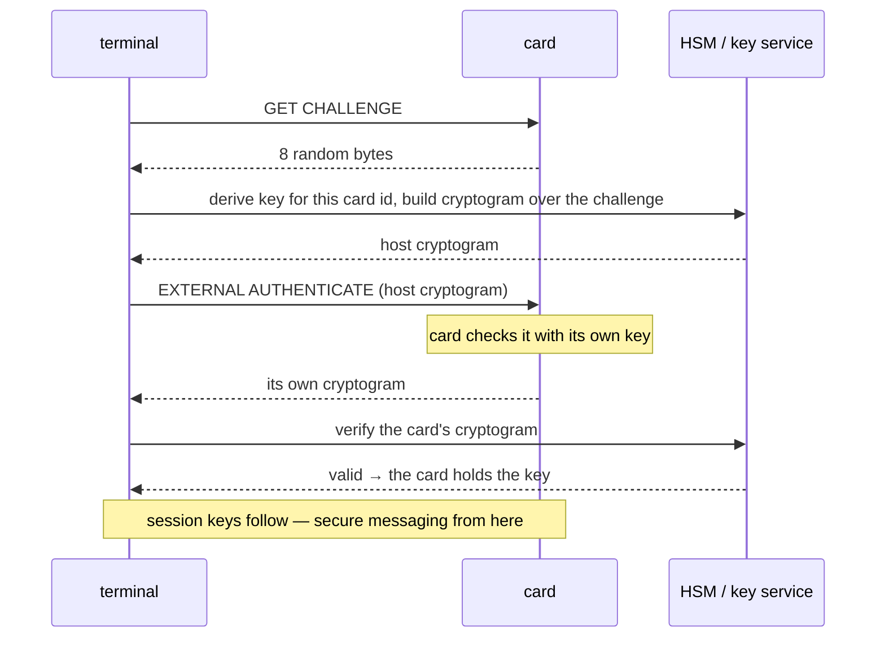
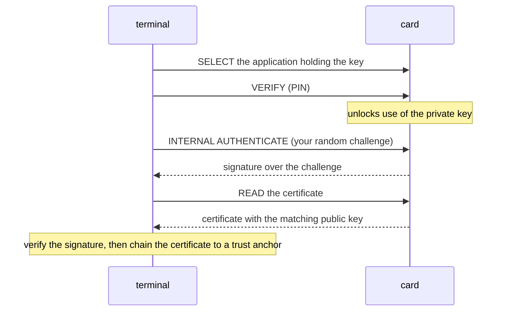
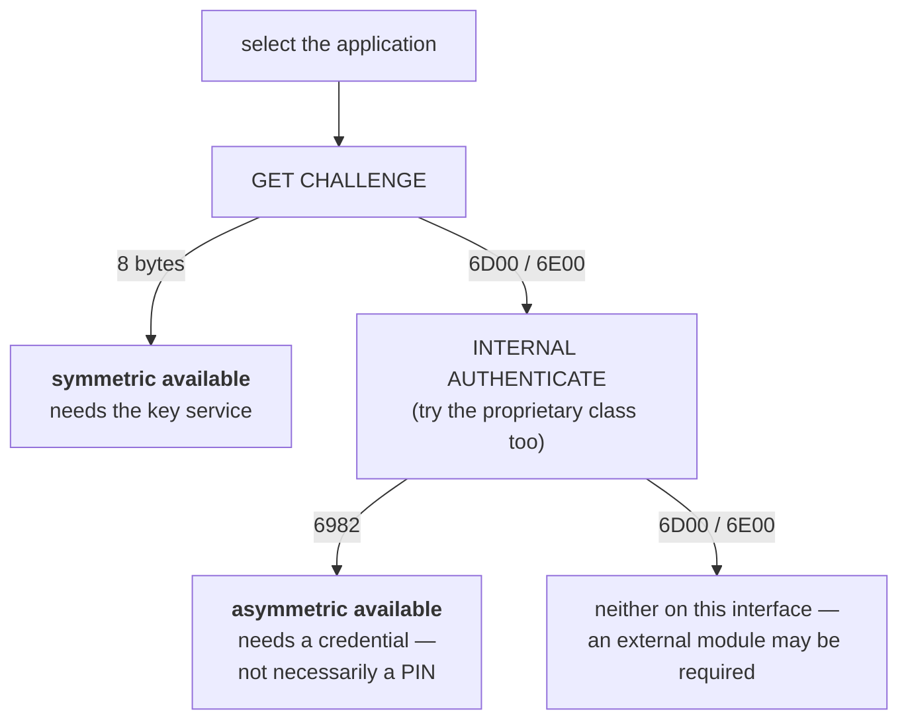

# 6. Proving a card is genuine

## The problem

Everything on a card that can be read can be copied. Certificates, photographs, demographic
records, identifiers — all of it. So none of it proves the card in the reader is the card
the issuer made. A cloner reads a genuine card once and writes the bytes onto a card of
their own.

Genuineness can therefore only come from one thing: making the card **demonstrate
possession of a secret** that was never readable in the first place. Chapter 1 called that
the reason the format exists; this chapter is how it is actually done.

Three mechanisms, in the order you meet them.

## Mechanism one: symmetric — challenge and a diversified key

Each card is personalised with a secret key. Not the *same* key — a **diversified** one,
derived at personalisation time from a master key held in an HSM and something unique to
the card:

```
card_key = KDF(master_key, card_identifier)
```

The card holds `card_key` and cannot emit it. The issuer holds `master_key` in an HSM and
can re-derive `card_key` for any card on demand, given its identifier. Nobody else can do
either.

> **Teacher's aside.** Diversification is why a compromised card doesn't compromise the
> fleet. Extract one card's key and you have *that card*; you cannot derive any other,
> because inverting the KDF to recover the master is infeasible. It is also why the
> identifier the derivation uses matters so much: derive over the wrong value and you get a
> perfectly well-formed key that no card will ever accept.

The exchange then proves possession over a fresh random value, so it can't be replayed:

```
terminal ──── GET CHALLENGE ──────────▶ card
        ◀──── 8 random bytes ──────────
        (HSM derives card_key, computes a cryptogram over the challenge)
        ──── EXTERNAL AUTHENTICATE ────▶     terminal proves itself to the card
        ◀──── the card's cryptogram ────     card proves itself to the terminal
```

### Which direction proves what

This is the part that is routinely got wrong, and it matters.

| Step | Who proves what | Can a clone fake it? |
|---|---|---|
| `EXTERNAL AUTHENTICATE` returns success | The **card** accepted the **terminal** | **Yes.** A hostile clone runs its own firmware and can simply answer "success" without checking anything |
| The **card's** cryptogram verifies | The **card** proved itself to the terminal | No — it requires computing a MAC over the challenge with a key the clone doesn't have |

So "mutual authentication succeeded" is only a genuineness claim if you verified the
**card's** cryptogram. A success status on the terminal-proves-itself step is worth nothing
against an adversary who built the card.

Both halves matter for different reasons: the terminal proving itself is what stops an
attacker's *reader* extracting data from a genuine card; the card proving itself is what
detects a clone.

### Secure channels

Having both sides authenticate also yields session keys, which is what a **secure channel**
runs on: subsequent APDUs get a MAC, and optionally encryption, so neither the commands nor
the data can be read or altered in transit.

GlobalPlatform standardises these as **Secure Channel Protocols**. The generations differ
mainly in cryptography:

| | Cryptography | Notes |
|---|---|---|
| SCP01 | 3DES | Oldest; no response MAC |
| SCP02 | 3DES with a sequence counter | Long the default |
| SCP03 | AES with CMAC | Current; defined in a GlobalPlatform amendment (Amendment D) |

A card advertises what it supports in its **card recognition data**, readable with
`GET DATA` at tag `66` — a set of object identifiers naming the GlobalPlatform version and
the secure channel protocol. Note what this is and isn't: it describes the **Issuer
Security Domain's** channel, used for card management. An applet may implement its own
secure messaging with different cryptography entirely.

## Mechanism two: asymmetric — the card signs your challenge

No shared secret, no HSM. The card holds a private key; its certificate holds the matching
public key. You send a challenge you invented; the card signs it; you verify with the
public key.

ISO/IEC 7816-8 defines the commands — `INTERNAL AUTHENTICATE`, and `PSO: COMPUTE DIGITAL
SIGNATURE` for the general signing case.

This is simpler to reason about than the symmetric case, and it is card-to-terminal by
construction: there is no step where the card merely *accepts* something. Either it
produced a signature over your challenge or it didn't.

Such keys are normally **PIN-protected**, so an attempt without prior authentication
returns "security status not satisfied" rather than a signature. That response is
informative: it says the mechanism exists and is gated, which is a very different answer
from "instruction not supported".

## The two flows side by side

Both mechanisms answer the same question and share the same skeleton — *you* supply a
fresh challenge, the card does something only its secret makes possible, you check the
result. What differs is who else has to be involved.

**Symmetric.** The secret is shared, so a third party must hold the other copy:



**Asymmetric.** The secret is the card's alone, so nobody else is needed — but the key is
gated behind some credential. Shown here with a PIN, which is the common case for a key
that signs on the holder's behalf; the next section covers when it isn't a PIN:



The comparison that matters:

| | symmetric | asymmetric |
|---|---|---|
| Card holds | a key diversified from a master | its own private key |
| Who else is needed | an HSM holding the master | nobody |
| Works offline | no | yes, apart from the trust anchor |
| Typically gated by | nothing the holder holds — it is machine-to-machine | a credential, but *which* one depends on what the key asserts — see the next section |
| Yields a secure channel | yes, session keys fall out of it | no |
| Fakeable half | the card merely *accepting* your cryptogram | none — it either signed or it didn't |
| Needs a trust anchor | no, the master key is the anchor | **yes**, or it proves nothing |

> **Teacher's aside.** Notice that the symmetric flow needs no certificate and no CA: the
> master key in the HSM *is* the anchor, and it came from the issuer. The asymmetric flow
> needs no HSM but does need a CA certificate obtained out of band. Neither is
> "more secure" — they move the dependency. One asks you to hold a secret safely, the other
> asks you to know a public key truthfully. A scheme that can't do the first reaches for the
> second, and vice versa.

## Which credential gates which mechanism

The diagram above puts `VERIFY (PIN)` in the asymmetric flow, and that shorthand —
*asymmetric means a PIN* — is true often enough to be dangerous. Carry it to a real
national eID and you will end up asking a holder for a secret they never needed to give
you, to answer a question that never concerned them.

The confusion is that "PIN" is doing two unrelated jobs in most people's heads. Separate
them and the rule falls out.

**An access credential gets you talking to the chip at all.** It isn't secret in the sense
of something posted to you — it is printed on the document, and anyone holding the card has
it. Its purpose is to prove the terminal has the physical card in its hand, which is what
stops a chip being read through a coat pocket.

**A use credential authorises a key to act.** It is known only to the holder, delivered
through a channel that isn't the card, and its purpose is consent.

| | access credential | use credential |
|---|---|---|
| Examples | MRZ, CAN (Card Access Number) | user PIN, signature PIN |
| Where it comes from | printed on the card | posted separately, or chosen at enrolment |
| Who has it | anyone holding the card | the holder alone |
| Can it be changed | no, it is static | yes — and it is usually the only one that can |
| Can it be blocked | no | yes: retry counter, then a PUK |
| What it unlocks | a secure channel to the chip | a key that signs, or a release of personal data |

ICAO Doc 9303 and BSI TR-03110 make this concrete. **PACE**, the protocol that opens the
channel, runs with four passwords — MRZ, CAN, PIN and PUK — and TR-03110 assigns them by
terminal role: an **Inspection System** (border control, document check) uses the CAN or
the MRZ, while an **Authentication Terminal** (a service reading your personal data) uses
the PIN. Same card, same chip, two different gates for two different jobs.

Now apply that to the three mechanisms:

| Mechanism | Gated by | Why |
|---|---|---|
| Symmetric mutual authentication | nothing the holder has — the *terminal* needs the key module | machine-to-machine; the holder isn't a party to it |
| Asymmetric, proving the **chip** is genuine | an access credential, where the scheme uses one | the chip needs no permission to be itself |
| Asymmetric, signing **on the holder's behalf** | a use credential — the PIN | this is an assertion, and assertions need consent |

> **Teacher's aside.** The dividing line is not symmetric-versus-asymmetric, and it is not
> which command you send. It is **what the key's output claims**. A key whose output says
> *"this chip is the one the issuer made"* is gated on possession of the card. A key whose
> output says *"the holder agrees to this"* is gated on the holder. ICAO's Active
> Authentication and Chip Authentication are both asymmetric, both prove the chip genuine,
> and neither asks for a PIN — because neither is speaking for the person.

So `6982` from `INTERNAL AUTHENTICATE` tells you the mechanism exists and is locked. It
does **not** tell you a PIN will open it. Work out what the key is *for* before you go
asking anyone for a secret.

## A scheme may use different mechanisms across generations

This is the practical sting, and it is easy to get wrong in code.

A national scheme issuing cards over two decades will change platform more than once, and
the authentication mechanism changes with it. It is entirely normal to find that an **older
generation supports only the asymmetric path** — a PIN-gated key in a PKI application —
while **newer generations add symmetric mutual authentication** backed by an HSM, because
the issuer has since built the infrastructure for it.

Two consequences follow:

- **Software written against the newer generation will conclude the older one "has no
  authentication".** It probes for a challenge-response that isn't there, gets "instruction
  not supported", and reports the card as unverifiable. The mechanism was simply elsewhere.
- **The older generation may need something extra that the newer one doesn't** — a second
  card in the reader holding the symmetric keys, for instance, which is how schemes handled
  this before a central key service existed. A terminal without that module cannot
  authenticate those cards at all, regardless of what the card supports.

So the rule is the same as chapter 2's rule about the ATR: **detect, don't assume.** And the
detection is cheap, because the free probes from chapter 3 answer it —



Nothing in that diagram presents a credential, so the whole of it is free to run on an
unfamiliar card.

Both branches of that flowchart, and both directions of generational drift, show up in the
worked comparison of two real schemes later in this chapter.

## The cipher can change across generations too — and it hides until the last step

The drift above is about *which mechanism* a generation has. There is a subtler one: two
generations can run the **same mechanism, the same APDU sequence**, and differ only in the
**cipher underneath**. GlobalPlatform's own secure channels are the textbook case — an older
generation may run **SCP01/SCP02 on 3DES**, a newer one **SCP03 on AES** (defined in GP
Amendment D). The card management, the `SELECT`, the `MANAGE SECURITY ENVIRONMENT`, the
`GET CHALLENGE` — all identical on the wire. Only the cryptography differs.

This is nasty precisely because it stays invisible almost to the end:

- Every setup step returns success on both generations. `SELECT` → `9000`, `MSE` → `9000`,
  `GET CHALLENGE` → eight bytes. A host built for the newer cipher sees a clean handshake and
  assumes it is talking a language it understands.
- The divergence only surfaces at **`EXTERNAL AUTHENTICATE`**, where you finally present a
  cryptogram — because a 3DES cryptogram and an AES cryptogram are **different lengths and
  different constructions**. The card rejects the wrong one on **length or format** (a
  "wrong length" status word) *before* it ever checks the key.

That last point is a gift, and worth internalising: a **length/format rejection is not a
failed authentication.** The card parsed your command, found the envelope the wrong shape,
and stopped — no key was tested, so no retry or lock counter moved. It tells you *wrong
cipher/structure*, cleanly distinct from the *wrong key* answer (which is a genuine crypto
failure and does cost an attempt). When you are reverse-engineering a generation you can
iterate safely as long as you keep getting length errors; the moment you get a key-level
failure instead, you have the envelope right and are now spending real attempts.

The key sizes give the generation away before you send anything. Diversification produces a
key of exactly the size the cipher demands: **double-length 3DES is 16 bytes; AES-256 is 32.**
So a key-derivation service that hands you a 32-byte key for a card whose secure channel is
3DES has handed you the *wrong generation's* material — the right diversifier, the wrong
cipher. A key of the wrong length for the generation cannot be made to work by reshaping the
command; it is simply not that card's key.

> **Teacher's aside.** The general rule underneath all of this: a working *handshake* is not
> a working *protocol*. Success up to the point where a secret is finally exercised proves
> only that you agree on the choreography, not on the cryptography. Design your probing so
> the cheap, side-effect-free steps run first and the one irreversible step — the cryptogram
> that a wrong guess charges you for — runs last, once, and only when everything before it
> has removed the ambiguity it can.

## Mechanism three: signed data objects

Rather than authenticating the card, sign the *contents*. The issuer signs each data object
at personalisation, and the terminal verifies the signature after reading.

This detects tampering with the data. It does **not**, by itself, detect a clone — the
signature is as copyable as the data it covers.

## The trap that catches all three

Mechanisms two and three both verify something using a certificate. Where does that
certificate come from?

If the answer is *"from the card"*, you have proven nothing about authenticity:

```
genuine card:  data + signature + certificate  →  verifies ✓
cloned card:   own data + own signature + own certificate  →  also verifies ✓
```

The cloner supplies a self-consistent set. Verification succeeds because internal
consistency is all you checked.

> ⚠️ A verification is only as good as where the trust anchor came from. The certificate
> on the card must chain to a CA certificate you obtained **out of band** — from the issuer,
> through a channel that isn't the card — and pinned by fingerprint. Extracting a CA from
> the card, or from a response that CA itself signed, is circular and buys nothing.

The same applies to mechanism one, differently: the HSM is the out-of-band anchor. The
master key came from the issuer, so re-deriving with it is a statement about the issuer's
key, not about anything the card claimed.

## Two national eID schemes, worked

Everything above is a menu. It is worth seeing what two real issuers actually ordered,
because they differ on nearly every line and neither is doing anything unusual. Both are
national identity cards. Both have been in issue long enough to have changed platform.

### The credentials

| | German eID (Personalausweis) | Emirates ID |
|---|---|---|
| Standards family | ICAO Doc 9303 + BSI TR-03110 | issuer-specific, via the EIDA/ICP toolkit |
| Holder PIN | 6 digits, chosen by the holder | 4 digits, chosen by the holder |
| How the holder gets it | a posted **PIN letter** holding a five-digit one-time PIN under a scratch field, replaced with a chosen six-digit PIN on first use | chosen **in person at enrolment**, immediately after fingerprint and photo |
| Access credential | **CAN**, printed on the card face; or the MRZ | MRZ is printed; no CAN documented |
| If the holder forgets it | PUK, from the same letter | **fingerprint** — at a service centre, a self-service kiosk, or over the online Validation Gateway |
| After three wrong entries | suspended, then blocked | blocked |

Notice what each delivery channel buys and costs. A posted letter lets a citizen activate
the card alone, at home, whenever they get round to it — and guarantees a percentage of
letters are binned unopened. Enrolment-desk selection puts an official in the loop and
nothing in the post to intercept — and means that if the step is skipped, the card ships
with no PIN set at all. ICP documents precisely that state, and the route out of it.

> ⚠️ **"I never got a PIN" is not evidence that a card has no PKI application.** On a
> posted-letter scheme it usually means the letter went unopened; on an enrolment-desk
> scheme it usually means the step was skipped. Both are recoverable, by different routes.
> The actual test for whether the application exists is a `SELECT` — `6A82` means there is
> nothing there, and nothing else does.

### The genuineness mechanism

Here the two schemes sit on opposite sides of this chapter.

The German card is **mechanism two**. Active Authentication and Chip Authentication are
asymmetric, they prove the chip is genuine, and a terminal reaches them by opening a PACE
channel with the CAN or MRZ printed on the card. No key service, no HSM, no holder secret.

The Emirates ID is **mechanism one**, and it is the clearest real instance of that
"an external module may be required" leaf in the flowchart above. ICP's own toolkit
installation and configuration guide declares three applets, each with its own secure
messaging module:

```ini
[SM_Modules]
# SAGEM_SAM 1, SAFENET_LUNA_HSM 2, LOGICA_SOFTWARE_HSM = 3
ID_SM_Name  = 3        # the ID applet
PKI_SM_Name = 3        # the PKI applet
MOC_SM_Name = 3        # the match-on-card applet

[DataSigningCertificates]
PATH = ...\EIDAToolkit\Libs\SigningCerts

[SAM]
PIN  = 0123
ATR3 = 3B781800000153414D20454155

[UAECard]
NUMBER = 5
ATR1 = 3B6A00008065A20130013D72D641
...

[TestCard]
```

Read as a specification, that says a great deal:

- **Option 3, the software HSM, is documented "to be used with test cards only."** A live
  deployment needs option 1, a SAGEM **SAM** — a second smart card in the machine, with its
  own PIN issued by the authority — or option 2, a SafeNet Luna **HSM**. The guide states
  the card-genuine check runs locally only when such a module is attached; otherwise a
  secure-messaging web service proxies to a remote one over HTTPS.
- **Three applets, three independently configured modules.** Holder data, PKI and
  match-on-card are separate security domains, so authority to read demographics is not
  authority to sign.
- **`[DataSigningCertificates]`** is mechanism three running alongside, not instead of.
  The issuer signs the public data files; the toolkit validates those signatures against
  certificates that ship with the toolkit rather than with the card — which is exactly the
  out-of-band trust anchor §The trap that catches all three insists on.
- **`[UAECard]` enumerates five ATRs, `[TestCard]` a further list.** Chapter 2's rule,
  written into a config file.

> ⚠️ Two different things are called "PIN" in that file. `[SAM] PIN` and `[HSM] PIN` belong
> to the *terminal's* crypto module and are issued to the operator; the holder's four-digit
> PIN lives on the citizen's card and unlocks nothing in the terminal. Confusing the two is
> how people conclude a scheme has a hardcoded PIN.

The card-genuine call pairs `MW_SM_GetCipheredPIN` with `MW_VerifyCipheredPIN`, and its
documented failure code is `E_SM_CARD_NOT_GENUINE`. The naming suggests holder-PIN
verification rides *inside* the secure-messaging session, so a single transaction both
checks the person and proves the card — welding together the two things the previous
section separated.

> **Teacher's aside.** That welding is a design choice with a cost, and it is worth seeing
> why. If verifying the holder and authenticating the card are one operation, then a
> terminal that only wants to know the card is real must still be equipped to handle the
> holder's secret — and a terminal that only wants holder consent must still be equipped
> with a key module. Separating them, as the ICAO family does, lets a border desk
> authenticate a chip with no secret at all and lets a web service ask for consent with no
> HSM at all. Neither design is wrong; they optimise for different terminals.

### The same scheme, two generations

The toolkit document above is dated 2012 and issued by the Emirates Identity Authority,
which no longer exists under that name. The current ICP **Validation Gateway** lists Card
Authentication — "verify that EIDA Card are Genuine and Checking the status" — as an
*online* service, and the current public toolkit page describes only two business
functions: reading public data, and digital signing with PIN verification.

That is this chapter's generational warning, running in the opposite direction to the
example above. Not asymmetric → symmetric, but **a SAM in every terminal → a central key
service over the network**. The mechanism did not change; its location did. Terminal
software written against the 2012 toolkit and terminal software written against the
Gateway will disagree about what "authenticate this card" even requires, and each will be
right about its own generation.

### What is not settled

Stated plainly, because guessing here would be worse than the gap:

- **Whether the Emirates ID's contactless interface implements ICAO 9303 eMRTD at all** —
  Active Authentication, BAC/PACE, an LDS. Nothing found either way. If it does, there is
  an asymmetric genuineness path sitting alongside the SAM one, and the comparison above
  is only half the picture.
- **Whether a CAN is printed on the card.** No evidence of one, which is consistent with a
  scheme whose access control is module-based rather than password-based — but absence of
  evidence is all that is.
- **Whether current cards still support the SAM path**, or only the Gateway.
- The exact semantics of `MW_SM_GetCipheredPIN` are inferred from function names, error
  codes and the installation guide. The developer's guide that would settle them is
  currently unreachable on the issuer's site.

### One ATR, for the taste of it

The SAM's own ATR is `3B781800000153414D20454155`. `TS=3B`, `T0=78` → three interface
bytes follow and there are **8 historical bytes**: `01 53 41 4D 20 45 41 55`. The last
seven are ASCII **`SAM EAU`**. The module announces itself in plain text.

The five live-card ATRs are more interesting, and they are decoded as a worked example in
[chapter 2 §One card model, five ATRs](02-the-atr.md#one-card-model-five-atrs).

## What a clone can and cannot do

Worth committing to memory, because it settles most arguments:

| A cloner can | A cloner cannot |
|---|---|
| Copy every readable byte, including certificates | Extract a key from a genuine card's secure element |
| Return any status word they like | Produce a MAC over a fresh challenge with a diversified key they don't have |
| Present a self-signed certificate and matching data | Make that certificate chain to the issuer's CA |
| Replay a previously observed exchange | Predict the challenge you will choose next |

Every defence is one of the right-hand column. Every mistake is accepting something from
the left-hand column as though it were proof.

## Check yourself

1. A terminal reports "mutual authentication OK". What exactly has been established, and
   what question must you ask before treating it as an anti-clone result?
2. Why does diversification mean that extracting one card's key does not compromise the
   fleet? What would have to be true for it to?
3. A card's data objects are signed, and the signature verifies against a certificate read
   from the same card. State precisely what this does and does not prove.
4. `INTERNAL AUTHENTICATE` returns "security status not satisfied". Is this good news or
   bad news for someone trying to establish the card is genuine? Why?
5. An engineer proposes obtaining the issuer's CA certificate by extracting it from an
   OCSP response, since responses embed their signer's chain. What is wrong with this, and
   under what circumstance would it be acceptable?
6. You must verify cards from a generation that supports neither challenge-response nor
   on-card signing. What can still be established, what cannot, and what would you need
   from the issuer to close the gap?
7. A scheme's older cards answer `6D00` to `GET CHALLENGE` and `6982` to
   `INTERNAL AUTHENTICATE`; its newer cards do the reverse. Which mechanism does each
   generation use, and what does a terminal need in each case that it doesn't need in the
   other?
8. The symmetric flow needs no CA certificate and the asymmetric flow does. Does that make
   symmetric authentication stronger? Answer in terms of where each one's trust comes from.
9. A holder says they were never given a PIN for their national ID card. Name two entirely
   different situations that produce that sentence, and give the one probe that
   distinguishes them from the card itself.
10. A border desk authenticates a chip with no secret from the holder, while a web service
    reading the same card's data must ask for the holder's PIN. Both use asymmetric
    cryptography on the same chip. Explain why the gates differ, in terms of what each
    key's output claims.
11. A deployment guide offers three secure-messaging modules and marks one "test cards
    only". A developer picks it because it needs no hardware and everything passes. What
    exactly have their passing tests established about a live card, and what have they not?
12. Every setup step of a mutual authentication succeeds — `SELECT`, security-environment
    set, `GET CHALLENGE` all return `9000` — but `EXTERNAL AUTHENTICATE` is rejected with a
    "wrong length" status. Has the card rejected your *key* or your *envelope*? Why does the
    distinction matter for how many more times you can safely try, and what does it tell you
    to check before the next attempt?
13. A key-derivation service returns a 32-byte key for a card whose secure channel you
    believe is 3DES. What is almost certainly wrong — the diversifier, the cipher, or the
    service — and how does the key length alone tell you?
