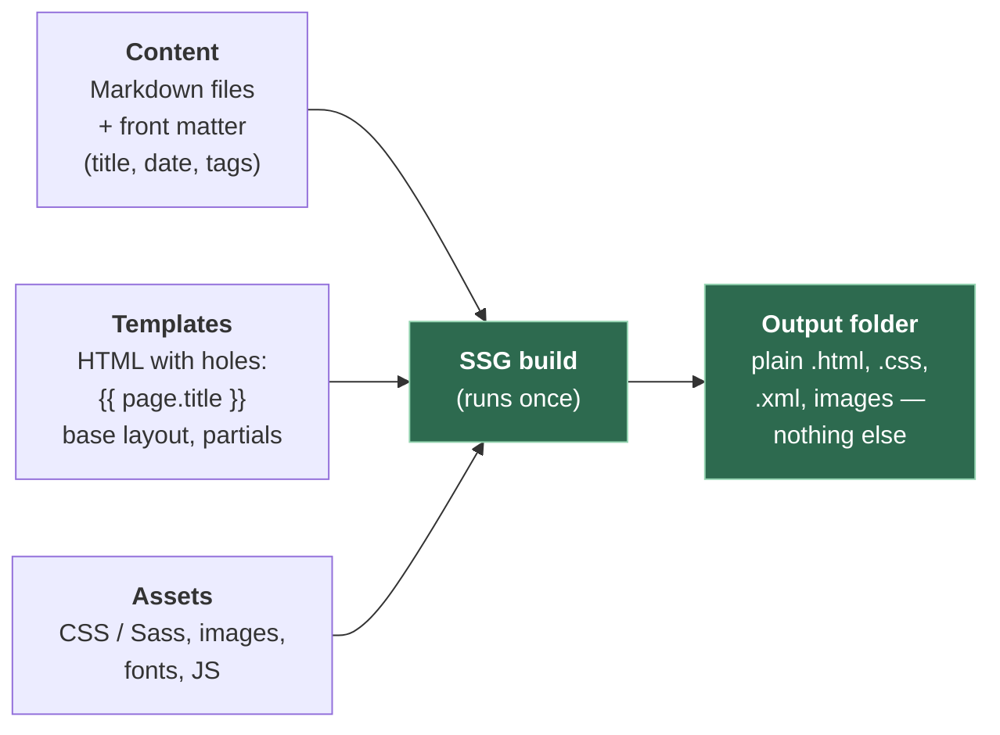
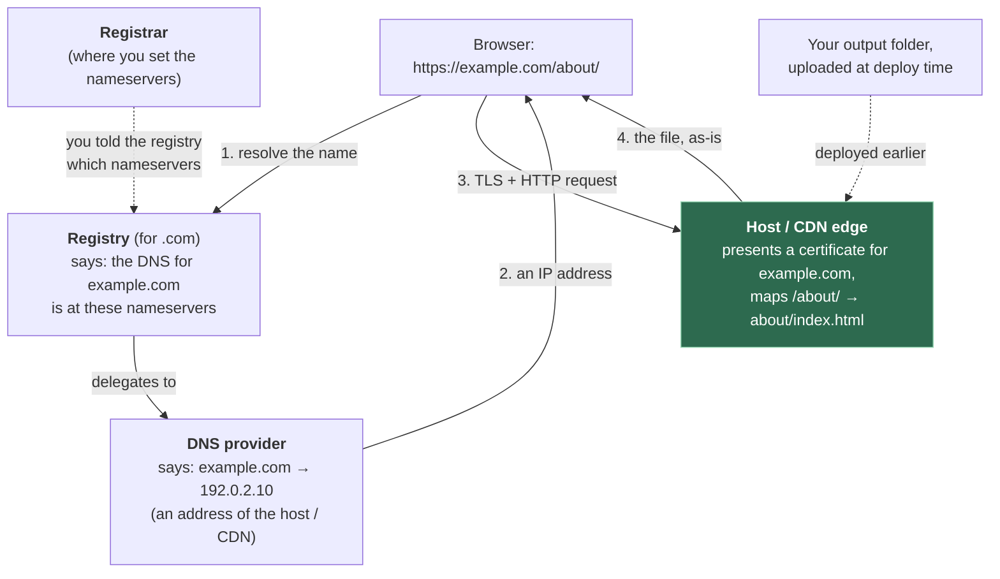

# 1. Foundations — what a static site is, and how it reaches a browser

**Who can skip this:** if you can already explain the difference between a build step and
request-time rendering, why `about/index.html` gives you the URL `/about/`, and which of
registrar, DNS provider and host is responsible for what — skim the diagram in §1.5 and
move on. Everyone else, read it in order; every later chapter assumes this vocabulary.

## 1.1 The problem

You want a page on the internet with your words on it. The most common way people get
there is to install a blogging platform that runs a program and a database on a server,
and that program builds each page every time someone asks for it.

That works, and it costs you something you may not have meant to buy: a program that
must stay running, stay patched, and stay up under load, for a page whose contents change
perhaps once a week. If your words don't change between visitors, generating them afresh
for every visitor is work done for nobody.

The alternative is to do that work **once**, ahead of time, and hand out the result.

## 1.2 What "static" means

MDN draws the line cleanly. A **static** web server "sends its hosted files as-is to your
browser". A **dynamic** one adds "an application server and a database", which "updates
the hosted files before sending content to your browser"
([MDN — What is a web server?](https://developer.mozilla.org/en-US/docs/Learn_web_development/Howto/Web_mechanics/What_is_a_web_server)).

So **static** describes *when the HTML is made*, not what the page looks like or whether
it moves. A static page can have animations, a search box, and JavaScript that fetches
data from an API. What makes it static is that the server hands every visitor the same
bytes for the same URL, from a file that existed before they asked.

| | Static | Dynamic (request-time rendering) |
|---|---|---|
| When HTML is produced | Once, at **build time**, on your machine or CI | On **every request**, on the server |
| What the server needs | Something that can read files and speak HTTP | A runtime, your code, often a database |
| Same URL, two visitors | Identical bytes | Can differ (logged-in user, cart, locale) |
| Failure if traffic spikes | Mostly a bandwidth question | CPU, memory, database connections |
| What there is to attack | The file server | The file server, your code, its dependencies, the database |
| Changing a page | Rebuild and re-upload | Edit the database; next request sees it |

> **Teacher's aside.** People hear "static" and think "basic" or "no JavaScript". Neither
> follows. The honest definition is narrower: *no code of yours runs on the server at
> request time.* Everything that does run, runs either in your build (before anyone
> visits) or in the visitor's browser (after the bytes arrive). That one property is why
> static hosting is cheap, fast and hard to break — there is no per-request program to
> overload or exploit — and it's also exactly what you give up: anything that needs to
> know *who* is asking, at the moment they ask, can't be done by the server.

## 1.3 What a static site generator does

You could write every HTML file by hand. For three pages that's fine. By the tenth page
you have the same header pasted ten times, and changing the navigation means editing ten
files without missing one.

A **static site generator (SSG)** is the program that solves that. It takes two kinds of
input and produces one kind of output:



- **Content** is usually Markdown with a block of metadata at the top called **front
  matter** — YAML or TOML between delimiter lines — holding the title, date, draft flag
  and so on.
- **Templates** are HTML with placeholders and simple logic ("for each post in this
  section, print a link"). Each generator has its own **template engine** with its own
  syntax; chapter 02 compares them.
- The **build** walks the content, renders each piece through the right template, copies
  or processes the assets, and writes everything into an output folder (`public/`,
  `dist/`, `_site/` — the name varies by generator).

The output folder is the whole website. It has no dependency on the generator. You could
zip it, email it, and the recipient could serve it with any file server. That separation
is the design: **the generator is a build tool, not a runtime.** It never runs in
production.

## 1.4 Clean URLs — why everything is called `index.html`

Look inside a generator's output and you'll see something like this:

```
public/
├── index.html                  →  https://example.com/
├── about/
│   └── index.html              →  https://example.com/about/
├── posts/
│   ├── index.html              →  https://example.com/posts/
│   └── first-post/
│       └── index.html          →  https://example.com/posts/first-post/
├── style.css
└── atom.xml
```

Why not `about.html`? Because then the URL is `/about.html`, which exposes an
implementation detail in every link anyone ever makes to you. If you later change
generator or format, the `.html` becomes a lie you have to keep, or a broken link.

The trick relies on a convention almost every web server has: when a request names a
directory, serve a designated file inside it. In nginx this is the `index` directive,
whose default is `index index.html;`, and which works by an internal redirect so the
browser never sees the filename
([nginx — ngx_http_index_module](https://nginx.org/en/docs/http/ngx_http_index_module.html)).
Apache calls it `DirectoryIndex`; static hosts do the same thing without asking.

So a generator that wants the URL `/about/` writes `about/index.html`. The piece of the
URL naming the page — `first-post` — is called the **slug**, and generators usually derive
it from the filename or the title, or let you set it in front matter.

> ⚠️ **The trailing slash is part of the URL.** `/about` and `/about/` are different
> URLs. Most static hosts and servers redirect one to the other, but which direction, and
> whether with a 301 or 308, varies by host. It bites in two places: relative links (on
> `/about`, a link to `photo.jpg` resolves to `/photo.jpg`; on `/about/`, to
> `/about/photo.jpg`), and moving hosts (the new one may canonicalise the other way, and
> every old link takes an extra redirect). Pick one form, generate links in that form, and
> check what your host does with the other.

## 1.5 Who does what — registrar, DNS, host, CDN

Getting from "I have an output folder" to "a stranger types a name and sees my page"
involves several separate jobs. They are often sold by the same company, which is
convenient and also why people find them hard to tell apart. They are different roles:

| Role | What it actually does | Analogy |
|---|---|---|
| **Registry** | Runs a top-level domain (`.com`, `.dev`, `.uk`); keeps the authoritative list of who holds which name under it | The land registry |
| **Registrar** | Sells you the right to use a name for a period, and records it with the registry | The solicitor who files your deed |
| **DNS provider** | Answers "what address is `example.com`?" — hosts your DNS records | The signpost at the junction |
| **Host** | Stores your files and answers HTTP requests for them | The building |
| **CDN** | Keeps copies of your files in data centres around the world and answers from the nearest one | Branch offices of the building |
| **Certificate authority (CA)** | Issues the TLS certificate proving the host may speak for your name | The passport office |

And the flow, from a browser's point of view:



Read it as two different timelines. The solid arrows happen on every visit (with caching
along the way). The dotted ones happened once: you told your registrar which nameservers
to use, and you deployed your files to the host. A visitor's browser never talks to your
registrar or to your build machine.

> **Teacher's aside.** The most common confusion is "I bought the domain at X, so X hosts
> my site". Buying a name gets you the right to choose its nameservers — nothing more.
> The registrar, the DNS provider and the host can be three different companies, and
> moving any one of them doesn't require moving the others. Keeping the roles separate in
> your head is what makes chapter 05 tractable.

## 1.6 The whole lifecycle, end to end

Putting §1.3 and §1.5 together, here is everything that happens between editing a
Markdown file and a visitor reading it. Each later chapter takes one box.

```
 ┌────────────── on your side, once per change ──────────────┐   ┌──── per visit ────┐
 │                                                            │   │                   │
 │  edit content ─▶ git push ─▶ CI: build ─▶ CI: deploy  ─────┼──▶│  DNS lookup       │
 │  (Markdown)                  (SSG →      (upload output    │   │  TLS handshake    │
 │                               output/)    to the host)     │   │  GET /about/      │
 │                                                            │   │  file returned    │
 │   ch. 02: which SSG          ch. 04: CI   ch. 03: which    │   │  ch. 05: domain,  │
 │                                           host             │   │  DNS, certificate │
 └────────────────────────────────────────────────────────────┘   └───────────────────┘
                                                      ch. 06: what happens the moment it's public
```

Two consequences fall straight out of this picture:

1. **Deploying is just copying files.** Whatever host you pick, its job is to receive a
   folder and serve it. That's why moving between static hosts is usually easy — and why,
   when it isn't, the reason is something the host added on top (build systems, redirects
   config, serverless functions), not the files.
2. **The build is where your risk moved.** With nothing running at request time, the
   interesting security surface is the pipeline that produces and uploads the files: who
   can push, what the CI job is allowed to do, and what code it downloads and runs.
   Chapter 04 is about exactly that.

---

## Check yourself

1. A page shows the visitor's local time using JavaScript, and fetches the latest
   exchange rate from a public API. Is it static? Say precisely what property decides.
2. You rename `content/about.md` to `content/about-me.md` and rebuild. Describe,
   mechanically, what happens to every existing link to your about page, and why.
3. Your site is served at `/notes/` and the page contains ``. A
   host change starts serving the same page at `/notes` (no slash) without redirecting.
   What breaks and why?
4. You bought a domain at registrar A, point it at nameservers run by company B, and
   deploy to host C. Host C goes out of business. Which of the three do you have to deal
   with, and what record changes?
5. A colleague says "static sites are more secure because there's no server". Correct the
   claim: what has been removed, what remains, and where did the risk move?

(Answers in [08-exercises.md](08-exercises.md).)
