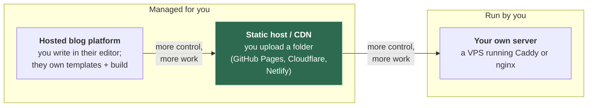

# 3. Where to host it

## 3.1 The problem

File 01 showed that hosting a static site is, at heart, copying a folder somewhere that
answers HTTP. Hosts differ in everything around that: what they cost, whether your
source must be public, whether you can use your own domain, what they add to your pages,
and how hard it is to leave. Those differences are buried in pricing pages and plan
footnotes, and you usually find them only after you've built around one host.

This chapter lays them out. All plan details were checked on 5 October 2026 against each
provider's own pages; plans change, so treat every row as "true on that date" and recheck
before committing.

## 3.2 Four kinds of host

The middle box is where most engineers end up, and where the rest of this course assumes
you are. But each step right trades convenience for control, and the trade is worth
seeing in full.

| | Hosted blog platform | Static host | Own server |
|---|---|---|---|
| You provide | Words | A folder of files | A folder, a server, its upkeep |
| Who runs the build | Them | You (locally or CI, file 04) | You |
| TLS certificates | Them | Them | You (or software you run, §3.6) |
| Leaving | Export content; rebuild the design elsewhere | Upload the same folder elsewhere | Upload the same folder elsewhere |

## 3.3 Hosted blog platforms — the example of Bear Blog

A hosted platform is the right answer if you want to write and not engineer. It's worth
looking at one closely because its free tier shows exactly which features platforms treat
as premium. Bear Blog is a good example: minimal, popular with engineers, and explicit
about its limits.

Bear's upgrade page — which needs a login to view, so this comes from the template that
renders it in Bear's own public repository
([`templates/dashboard/upgrade.html`](https://github.com/HermanMartinus/bearblog/blob/master/templates/dashboard/upgrade.html),
as of late September 2026) — lists what upgrading adds, including:

- "Custom domains"
- "Add javascript to page content"
- "Add code to head and footer elements"
- "Remove Bear branding (but only if you want to)"
- "In-depth analytics", "Email subscriber capture", "Media and file uploading"

Its stated price is "$6 per month, $49 per year (4 months free), or $189 once-off" (same
template; third-party sites quoting other figures were out of date). The docs add that
hiding the "Made with Bear" footer with CSS is reset for free users
([docs — styling](https://docs.bearblog.dev/styling/)), and that comment embeds need JS
and so are "only available on upgraded blogs"
([docs — comments](https://docs.bearblog.dev/comments/)).

So on the free tier: no own domain, no scripts, no control of `<head>`, and the
platform's footer stays. None of that is unreasonable — the platform has to be paid for
somehow — but note what the free tier means for portability: **without your own domain,
every link anyone makes to you points at the platform's domain**, and leaving breaks
them all. File 05 is about why owning the name matters more than owning the server.

> **Teacher's aside.** "No trackers" on a platform's marketing page and "no scripts on
> my page" are different claims. Bear says it supports no Google Analytics, and its basic
> analytics count reads ([docs — analytics](https://docs.bearblog.dev/analytics/)) — which
> requires *something* on the page. A Bear blog page inspected on 5 October 2026 contained
> two small first-party inline scripts (a view-count beacon and a timezone cookie) and no
> third-party ones. That's modest and in keeping with the platform's privacy stance; the
> general lesson is that on any hosted platform, **the platform decides what's in your
> HTML**, and the only way to know is to view the source of a published page.

## 3.4 The static hosts

Three you'll meet constantly. All take a folder, all serve it over HTTPS from a CDN, all
support custom domains. The differences are in the margins:

| | **GitHub Pages** | **Cloudflare** (Workers static assets / Pages) | **Netlify** (Free plan) |
|---|---|---|---|
| Cost | Free | Free tier; static asset requests "free and unlimited" | "$0 forever", 300 credits/month, hard limit |
| Private source repo | **Only on paid plans** (Pro, Team, Enterprise) | Yes — deploy from CI with a token; repo visibility doesn't matter | Organisation-owned private repos need Pro; personal private repos not stated clearly (see below) |
| Custom domain | Yes | Yes; for Workers the domain must be a zone on Cloudflare | Yes, "with SSL" |
| HTTPS | Yes; "Enforce HTTPS" setting | Yes, automatic | Yes, Let's Encrypt, automatic |
| Size / usage limits | Site ≤ 1 GB; soft 100 GB/month bandwidth; soft 10 builds/hour | Free: 20,000 files per version, 25 MiB per file | Credits: deploys, bandwidth and requests each cost credits |
| What happens at the limit | "Soft" — you may be contacted | Static requests aren't metered on Free; build/file limits block deploys | **Projects pause** until the next cycle; visitors see "Site not available" |
| Commercial use | Not for "online business, e-commerce" or SaaS | Allowed | Allowed |
| Adds things to your pages? | No | Pages: one-click Web Analytics **injects a script** on next deploy | Optional features can |
| Auth for CI deploys | OIDC (file 04 §4.4) | Stored API token | Stored token |

Sources: GitHub Pages — [what it is](https://docs.github.com/en/pages/getting-started-with-github-pages/what-is-github-pages),
[limits](https://docs.github.com/en/pages/getting-started-with-github-pages/github-pages-limits),
[HTTPS](https://docs.github.com/en/pages/getting-started-with-github-pages/securing-your-github-pages-site-with-https).
Cloudflare — [static assets billing](https://developers.cloudflare.com/workers/static-assets/billing-and-limitations/),
[Workers limits](https://developers.cloudflare.com/workers/platform/limits/),
[Workers custom domains](https://developers.cloudflare.com/workers/configuration/routing/custom-domains/),
[Pages Web Analytics](https://developers.cloudflare.com/pages/how-to/web-analytics/).
Netlify — [pricing](https://www.netlify.com/pricing/),
[credit-based plans](https://docs.netlify.com/manage/accounts-and-billing/billing/billing-for-credit-based-plans/credit-based-pricing-plans/),
[paused projects](https://docs.netlify.com/manage/accounts-and-billing/billing/resume-paused-projects/),
[HTTPS](https://docs.netlify.com/manage/domains/secure-domains-with-https/https-ssl/).

The rows that bite people:

**GitHub Pages and private repositories.** GitHub's own wording: Pages "is available in
public repositories with GitHub Free and GitHub Free for organizations, and in public and
private repositories with GitHub Pro, GitHub Team, GitHub Enterprise Cloud, and GitHub
Enterprise Server." If you want your drafts, notes and build config private on a free
account, GitHub Pages is out — you'd host the source on GitHub and deploy elsewhere.
Note that the *published site* is public either way; this is about the source.

**Netlify's credit model.** Since 4 September 2025, new Netlify accounts are on
credit-based plans. The Free plan's 300 monthly credits are a **hard** limit "with no auto
recharge option", and running out pauses every project on the team until the next
cycle. For a small personal site that's probably fine; a post that unexpectedly does well
can take the site offline rather than run up a bill. Which outcome you prefer is a real
choice. On private repositories, Netlify's feature table marks "Organization-owned private
repos" as Pro-only and doesn't say plainly what a personal account's private repo can do
on Free — I couldn't settle that from its documentation, so test it before you rely on
it.

**Vercel**, often mentioned alongside these, restricts its free Hobby plan to
"non-commercial, personal use only" ([Vercel — Hobby](https://vercel.com/docs/plans/hobby)).

## 3.5 Cloudflare: Pages, or Workers with static assets?

Cloudflare has two products that can serve a static site, and its guidance has changed.
Pages was the original static-site product. In April 2025 Cloudflare wrote that Pages
"will continue to be supported, but, going forward, all of our investment, optimizations,
and feature work will be dedicated to improving Workers", and "you should start with
Workers" ([Cloudflare blog, 8 Apr 2025](https://blog.cloudflare.com/full-stack-development-on-cloudflare-workers/)).
The Pages docs now carry the banner "Start new projects with Workers"
([Pages docs](https://developers.cloudflare.com/pages/), as of October 2026), and there is
an official [migration guide](https://developers.cloudflare.com/workers/static-assets/migration-guides/migrate-from-pages/).

For a purely static site, the practical differences:

| | Pages | Workers static assets |
|---|---|---|
| Status | Supported, not where new work goes | Cloudflare's recommended starting point |
| Free limits | 500 builds/month, 20,000 files, 25 MiB per file | 20,000 files per version, 25 MiB per file; static requests free and unlimited |
| Custom domain on a subdomain | A CNAME from any DNS provider is enough | Custom Domains need the zone on Cloudflare |
| Custom domain on the apex | Zone must be on Cloudflare | Zone must be on Cloudflare |

That last pair of rows is the lock-in to notice: on Workers, the domain's DNS must be
hosted by Cloudflare, which ties two of file 01's roles — DNS provider and host — to one
company. That's convenient and often what you'd choose anyway. It's also something to
decide on purpose rather than discover.

> ⚠️ **Wherever "free and unlimited" applies, check what it applies *to*.** On Workers,
> requests for static assets are free and unlimited; requests that run Worker *code* are
> limited (100,000 a day on Free, per the limits page). A static site that adds a single
> function — a redirect rule written as code, a contact form — moves those requests into
> the metered category.

## 3.6 Your own server

The far end of the spectrum: rent a small virtual server and run a web server on it. You
gain total control — any headers, any logs, no platform terms — and you take on
everything the static hosts did for you: OS patches, firewall, monitoring, certificates,
and the fact that a single server in one data centre is slower for distant visitors than
a CDN.

The single biggest thing that changed this trade in the last decade is automatic HTTPS.

| Server | Certificates | Minimal static config |
|---|---|---|
| **Caddy** | "By default, Caddy serves all sites over HTTPS", obtaining certificates from Let's Encrypt or ZeroSSL itself ([Caddy — Automatic HTTPS](https://caddyserver.com/docs/automatic-https)) | `example.com {` `  root /srv` `  file_server` `}` |
| **nginx** | Configured by hand with `ssl_certificate`; certificates usually obtained with certbot. Since 1.29.0 there is an optional `ngx_http_acme_module`, not built by default ([nginx — ACME module](https://nginx.org/en/docs/http/ngx_http_acme_module.html)) | `server { root /srv; … }` plus TLS directives |

Caddy's three-line config gets you a static site with a valid, auto-renewing certificate.
That's genuinely competitive with a managed host for effort. What it doesn't get you is
someone else being paged when the machine falls over.

## 3.7 Lock-in: what actually ties you to a host

Hosting a folder is portable by construction. Lock-in comes from everything a host
offers on top, and each feature is a reasonable convenience that becomes a migration
task:

| Feature you used | Why it's sticky |
|---|---|
| Host-specific redirect files (`_redirects`, `vercel.json`, Worker code) | Each host has its own format; redirects silently stop working after a move |
| Serverless functions / form handling | Code written against one platform's API |
| The host builds your site from git | Your build config lives in their dashboard, not your repo |
| DNS hosted by the host (required for some features) | Moving host means moving DNS too |
| Injected analytics | History stays behind |
| Platform subdomain (`*.github.io`, `*.pages.dev`, a blog platform's domain) | Every inbound link points at a name you don't own |

The last row is the expensive one, and the only one you can't fix later. Everything else
can be redone at a new host in an afternoon. Links on other people's websites can't be
edited.

---

## Check yourself

1. You want your site's source in a private repository and want to pay nothing. Which of
   GitHub Pages, Cloudflare and Netlify fit, with what caveat each? Where would the
   source live and how would it get deployed?
2. A free-tier hosted blog has been running for two years on the platform's subdomain.
   You now want your own domain and a different design. What can you take with you, and
   what is lost permanently?
3. A post goes viral. Describe what happens on each of: GitHub Pages, Netlify Free, and
   Cloudflare Workers static assets. Which failure would you rather have, and why is that
   a preference rather than a fact?
4. You add a single Worker function to a Cloudflare-hosted static site to handle
   redirects. What has changed about how your traffic is metered, and what alternative
   keeps the site fully static?
5. Someone says "Caddy makes HTTPS automatic, so self-hosting is now as easy as a static
   host". What does that claim get right, and what does it leave out that a static host
   still does for you?

(Answers in [08-exercises.md](08-exercises.md).)
