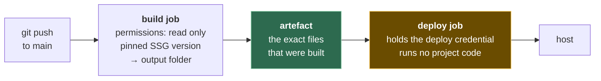

# 4. Deploying from CI, safely

## 4.1 The problem

You can deploy a static site by running the generator on your laptop and uploading the
output folder by hand. It works, and it has three problems that get worse with time:
the build depends on whatever versions happen to be on your laptop that day, nobody can
tell afterwards which commit is live, and the credentials that can overwrite your site
sit in a file in your home directory.

Moving the build and deploy into **continuous integration (CI)** fixes the first two. It
does not automatically fix the third — it moves it. As file 01 §1.6 put it, a static site
has no code running at request time, so the pipeline that produces and uploads the files
*is* your attack surface. This chapter is about building that pipeline so that it is
reproducible and so that it holds as little power as possible.

Examples use GitHub Actions because it's the most common pairing with the hosts in
file 03. The principles carry to any CI system.

## 4.2 The shape: build once, deploy the artefact



Two jobs, not one, for two reasons:

1. **What you deploy is what you built.** The build produces a single **artefact** — the
   output folder, packaged — and the deploy job ships that artefact without rebuilding.
   If you later need to know what's live, there is one object to point to.
2. **The credential and the untrusted code never share a job.** The build job runs your
   generator, its plugins, and (for Node-based generators) whatever is in
   `node_modules`. That is a lot of code you didn't write. The deploy job runs one
   well-known action. Only the deploy job gets the power to change your site.

## 4.3 Permissions: start from nothing

Every GitHub Actions job gets a token, `GITHUB_TOKEN`, scoped to the repository. What
it can do is set by a `permissions` block. GitHub's own guidance is to grant "the minimum
required permissions", to set the default "to read access only for repository contents",
and to increase permissions "as required, for individual jobs"
([GitHub — Secure use reference](https://docs.github.com/en/actions/reference/security/secure-use)).

New repositories in a personal account already default to the restricted setting:
`GITHUB_TOKEN` "only has read access for the `contents` and `packages` scopes";
organisation repositories inherit whatever the organisation chose
([GitHub — Managing Actions settings for a repository](https://docs.github.com/en/repositories/managing-your-repositorys-settings-and-features/enabling-features-for-your-repository/managing-github-actions-settings-for-a-repository)).
Don't rely on the default — write the block, so the workflow says what it needs and
still says it after someone changes a setting.

```yaml
permissions:
  contents: read        # workflow-wide default: read the repo, nothing else

jobs:
  build:
    # inherits contents: read
  deploy:
    permissions:
      pages: write      # only this job may create a Pages deployment
      id-token: write   # only this job may request an OIDC token (§4.4)
```

## 4.4 Two ways to prove "I'm allowed to deploy": OIDC vs a stored secret

The deploy job has to convince the host it's allowed to replace your site. There are two
families of answer, and they differ in what an attacker gets if they steal it.

| | **Long-lived secret** (API token) | **OIDC token** |
|---|---|---|
| What it is | A string you create at the host and paste into CI secrets | A signed, short-lived token CI mints per job, describing the job |
| Lifetime | Until you revoke it | Expires with the job |
| Bound to | Nothing — works from anywhere | Claims about *which* repo, branch, workflow is running |
| If leaked | Usable by anyone until revoked | Little or no use after the job ends |
| Setup | Easy everywhere | Host must support it |

**OIDC** (OpenID Connect) works like this: the CI provider signs a statement — "this is a
job in repository R, on ref `refs/heads/main`, in workflow W" — and the host checks the
signature and the claims instead of checking a password. GitHub summarises the benefit as
"no cloud secrets" and tokens "only valid for a single job"
([GitHub — OpenID Connect](https://docs.github.com/en/actions/concepts/security/openid-connect)).

> **Teacher's aside.** People think of OIDC as "a fancier secret". The difference is
> structural: a secret is something the job *has*; an OIDC token is a description of what
> the job *is*, signed by someone the host trusts. You can't leak "being the main-branch
> workflow of this repository" the way you can leak a string — that's why it's worth
> preferring whenever the host offers it.

What the two common static hosts actually support, as of October 2026:

| Host | How CI authenticates | Source |
|---|---|---|
| **GitHub Pages** | OIDC. `actions/deploy-pages` needs `id-token: write` "to verify the deployment originates from an appropriate source"; the token carries the ref and is validated by the Pages API | [deploy-pages README](https://github.com/actions/deploy-pages/blob/main/README.md) |
| **Cloudflare (Workers / Pages)** | A stored **API token** (`CLOUDFLARE_API_TOKEN`) plus account ID | [Cloudflare — GitHub Actions](https://developers.cloudflare.com/workers/ci-cd/external-cicd/github-actions/) |

I found no Cloudflare documentation of OIDC deploys from GitHub Actions. A feature request
for it on `cloudflare/wrangler-action` (issue #402, opened January 2026) was converted to a
discussion in May 2026 without an implementation. If that changes, prefer it.

When you must use a stored token, **scope it**. Cloudflare's docs walk you through
creating a token from the "Edit Cloudflare Workers" permission template and say: "We
recommend scoping these down as much as possible to limit the access of your token" — and
not to store the value in the repository, "as it gives access to deploy Workers on your
account" (same page). A token that can only deploy to one account is a bad thing to leak;
a global API key that can also change DNS and transfer domains is a disaster.

## 4.5 A GitHub Pages workflow, annotated

This follows the shape of GitHub's starter workflow for Pages
([actions/starter-workflows, `pages/hugo.yml`](https://github.com/actions/starter-workflows/blob/main/pages/hugo.yml))
and the Hugo docs ([Host on GitHub Pages](https://gohugo.io/host-and-deploy/host-on-github-pages/)),
with the generator step left generic. Versions shown are the latest major tags as of
October 2026 — `actions/configure-pages` v6, `actions/upload-pages-artifact` v5,
`actions/deploy-pages` v5, `actions/checkout` v7. §4.7 explains why you'd replace the tags
with commit SHAs.

```yaml
name: deploy

on:
  push:
    branches: [main]
  workflow_dispatch:

permissions:
  contents: read

# One deploy at a time; don't kill a deploy that's already running (§4.8).
concurrency:
  group: pages
  cancel-in-progress: false

jobs:
  build:
    runs-on: ubuntu-latest
    steps:
      - uses: actions/checkout@v7
      - uses: actions/configure-pages@v6
      - name: Install the generator (pinned — see §4.6)
        run: ./ci/install-ssg.sh
      - name: Build
        run: ./ci/build.sh            # writes ./public
      - uses: actions/upload-pages-artifact@v5
        with:
          path: ./public

  deploy:
    needs: build
    runs-on: ubuntu-latest
    permissions:
      pages: write
      id-token: write
    environment:
      name: github-pages
      url: ${{ steps.deployment.outputs.page_url }}
    steps:
      - id: deployment
        uses: actions/deploy-pages@v5
```

Things worth noticing:

- The deploy job has **no checkout step**. It never sees your source, only the artefact.
- `environment: github-pages` makes the deploy visible in the repository's Environments
  view, and lets you add protection rules (required reviewers, branch restrictions) to the
  one job that can publish.
- Copy-pasted examples go stale. As of October 2026 the deploy-pages README example still
  shows `@v4`, and GitHub's own starter workflow uses older majors than the Hugo docs do.
  Check each action's releases page rather than trusting whichever example you found.

> ⚠️ **"Failed to create deployment (status: 404) … Ensure GitHub Pages has been
> enabled"** is not a permissions bug and not a workflow bug. It means Pages is not
> switched on for the repository, or is set to build from a branch rather than from
> Actions. That exact message is constructed in `deploy-pages`'s source
> (`src/internal/deployment.js`) for a 404 response; the 403 case instead says "Ensure
> GITHUB_TOKEN has permission "pages: write"". `configure-pages` fails earlier with "Get
> Pages site failed. Please verify that the repository has Pages enabled and configured
> to build using GitHub Actions"
> ([configure-pages `src/api-client.js`](https://github.com/actions/configure-pages/blob/main/src/api-client.js)).
> The fix is in the repository's **Settings → Pages**: set the source to **GitHub
> Actions**. `configure-pages` has an `enablement: true` input that tries to do this for
> you, but it "requires a token other than `GITHUB_TOKEN`" — a more powerful credential,
> which is a poor trade for a one-time click.

## 4.6 Pin the tools you run, and check what you download

A build that says "install the latest generator" is a different build every time the
generator ships a release. Pinning gives you two things: the build you ran last month
can be run again, and an upgrade happens when you decide, in a commit you can revert.

| Tool comes from | Pin it with |
|---|---|
| npm (Eleventy, Astro, Wrangler) | A lockfile (`package-lock.json`) committed, and `npm ci` (installs exactly the lockfile) rather than `npm install` |
| A release binary (Hugo, Zola) | An explicit version in the workflow, **and a checksum** |
| A container image | A digest (`image@sha256:…`), not just a tag |
| A CI action | A full commit SHA (§4.7) |

The checksum is the part people skip. A version number tells you *which* file you asked
for. It does not tell you that the file you received is the one that was published when
you chose that version. The fix is to record the file's SHA-256 when you pin the version,
and refuse to run anything that doesn't match:

```bash
# Values recorded when the version was chosen. Change both together, in one commit.
ZOLA_VERSION="v0.23.6"
ZOLA_SHA256="8f5132b3522412d04e395e0b25f6d68613ad272a873e54a2b3ebf664873024a4"

curl -sSfL -o zola.tar.gz \
  "https://github.com/getzola/zola/releases/download/${ZOLA_VERSION}/zola-${ZOLA_VERSION}-x86_64-unknown-linux-gnu.tar.gz"
echo "${ZOLA_SHA256}  zola.tar.gz" | sha256sum -c -     # non-zero exit = stop the build
tar -xzf zola.tar.gz
```

(That hash is the real digest of the Zola v0.23.6 Linux x86-64 build, as reported by the
GitHub Releases API on 5 October 2026. It's here to show the shape; record your own.)

Where to get the hash:

| Project | Where the checksum lives (as of October 2026) |
|---|---|
| Hugo | Each release ships a `hugo_<version>_checksums.txt` asset |
| Zola | No checksums file in the release; use the digest GitHub computes |
| Anything on GitHub Releases | Since June 2025 GitHub shows a SHA-256 digest for every uploaded release asset, in the UI and the API ([GitHub changelog, 2025-06-03](https://github.blog/changelog/2025-06-03-releases-now-expose-digests-for-release-assets/)). Older assets were not backfilled |

> **Teacher's aside.** "But I got the hash from the same release page — if the release
> were compromised, the hash would be too." True on day one, and that's not the threat a
> pinned hash defends against. Its job is to make *later* changes loud: a release asset
> swapped next month, a mirror serving something else, a redirect to the wrong file. You
> trust the file once, when you choose it; the hash makes sure every later build gets the
> file you trusted. That's the same reasoning as a lockfile.

Neither Hugo's docs nor GitHub's starter workflow verify a checksum, as of October 2026
— both pin the version and download it. They're good starting points; this is the line
to add.

## 4.7 Pin actions to commit SHAs

`uses: actions/checkout@v7` looks like a version. It's a **git tag**, and whoever controls
the action's repository can move a tag to point at different code. Your workflow then
runs that code, with your job's permissions and secrets, without anything in your
repository changing.

This is not hypothetical. In March 2025 the popular `tj-actions/changed-files` action
was compromised: "Attackers retroactively modified multiple version tags to reference a
malicious commit, exposing CI/CD secrets in workflow logs"
([GitHub advisory GHSA-mrrh-fwg8-r2c3](https://github.com/advisories/GHSA-mrrh-fwg8-r2c3);
[CISA alert, CVE-2025-30066](https://www.cisa.gov/news-events/alerts/2025/03/18/supply-chain-compromise-third-party-tj-actionschanged-files-cve-2025-30066-and-reviewdogaction)).
Workflows that referenced a tag ran the malicious commit. Workflows pinned to a SHA did
not.

GitHub's guidance is direct: "Pinning an action to a full-length commit SHA is currently
the only way to use an action as an immutable release", and "you should verify it is from
the action's repository and not a repository fork"
([Secure use reference](https://docs.github.com/en/actions/reference/security/secure-use)).

```yaml
# Tag — mutable. Whoever controls the repo decides what runs.
- uses: actions/deploy-pages@v5

# SHA — immutable. Keep the tag in a comment so humans and update bots can read it.
- uses: actions/deploy-pages@<40-hex-character commit SHA>  # v5.0.1
```

(I've left the SHA as a placeholder rather than print one you might paste without
checking. Get it from the action's release page or `git ls-remote`, from the action's own
repository.)

Two newer GitHub features push in the same direction, and both are worth knowing exist:

- Since August 2025, administrators can **require** SHA pinning through the allowed
  actions policy; "any workflow that attempts to use an action that isn't pinned will
  fail" ([GitHub changelog, 2025-08-15](https://github.blog/changelog/2025-08-15-github-actions-policy-now-supports-blocking-and-sha-pinning-actions/)).
- **Immutable releases** became generally available in October 2025: a release published
  as immutable can't have its assets changed or its tag moved
  ([GitHub changelog, 2025-10-28](https://github.blog/changelog/2025-10-28-immutable-releases-are-now-generally-available/)).
  This helps only for actions whose maintainers opt in, so it doesn't replace pinning.

The cost of SHA pinning is that updates stop happening by themselves. That's the point —
but it means you need something (Dependabot, Renovate, or a calendar reminder) to propose
updates, and you need to read them.

## 4.8 Concurrency: two pushes, one site

Push twice in quick succession and two workflow runs start. Without coordination they
race, and the older build can finish deploying *after* the newer one — your site goes
backwards.

GitHub's `concurrency` key fixes this. Within a group "there can be at most one running
job or workflow … at any time"; a newly queued run waits as `pending`, and "by default,
any existing `pending` job or workflow in the same concurrency group will be canceled and
the new queued job or workflow will take its place"
([workflow syntax — concurrency](https://docs.github.com/en/actions/reference/workflows-and-actions/workflow-syntax)).

| Setting | Behaviour | Good for |
|---|---|---|
| `cancel-in-progress: false` (GitHub's Pages starter) | The running deploy finishes; queued runs in between are skipped; the latest runs next | Deploys — don't interrupt an upload halfway |
| `cancel-in-progress: true` | The running job is killed as soon as a newer one queues | Builds and tests, where only the newest result matters |

The starter workflow's comment gives the reason for `false`: "do NOT cancel in-progress
runs as we want to allow these production deployments to complete." Note that the
official Zola Pages action's example uses `true` instead
([getzola/github-pages](https://github.com/getzola/github-pages)), so examples disagree.
For a static host that swaps deployments atomically, cancelling mid-upload is probably
harmless; for anything that copies files in place, it can leave a half-updated site. If
you don't know which your host does, use `false`.

## 4.9 The deploy to Cloudflare, for contrast

The Cloudflare equivalent of the deploy job uses `cloudflare/wrangler-action` (v4 as of
October 2026, defaulting to Wrangler v4) with the stored token. The build job is the same
as §4.5 except that its last step uses the generic `actions/upload-artifact` with
`name: site` instead of the Pages-specific upload:

```yaml
  deploy:
    needs: build
    runs-on: ubuntu-latest
    steps:
      - uses: actions/checkout@v7          # wrangler needs its config file
      - uses: actions/download-artifact@<pinned>
        with: { name: site, path: public }
      - uses: cloudflare/wrangler-action@v4
        with:
          apiToken: ${{ secrets.CLOUDFLARE_API_TOKEN }}
          accountId: ${{ secrets.CLOUDFLARE_ACCOUNT_ID }}
          wranglerVersion: "4.x"           # pin; README accepts exact versions too
          command: deploy
```

Two differences from the Pages workflow are worth naming. There's no `id-token`
permission because there's no OIDC — the secret is the credential, so it matters more
who can edit this workflow file. And the action, by its README, uses an existing Wrangler
install if one is present and otherwise installs "a default version", so set
`wranglerVersion` (or install Wrangler from your lockfile) if you want the deploy tool
pinned like everything else
([cloudflare/wrangler-action](https://github.com/cloudflare/wrangler-action)).

---

## Check yourself

1. Your workflow has one job that runs `npm ci`, builds, and deploys with a Cloudflare
   token in its environment. A dependency's post-install script is malicious. What can
   it do that it couldn't if you'd used the two-job shape in §4.2?
2. Why does `actions/deploy-pages` need `id-token: write` but not a secret, while the
   Cloudflare deploy needs a secret but not `id-token: write`? What would an attacker
   who copied each credential out of a log be able to do an hour later?
3. Your Pages deploy fails with `Failed to create deployment (status: 404)`. A teammate
   suggests adding `permissions: write-all`. Explain why that won't help, and what will.
4. You pin `HUGO_VERSION=0.167.0` but don't check a hash. Describe a concrete sequence
   of events in which your build runs a binary you never chose, and say which control
   (version pin, checksum, SHA-pinned action) would have stopped it.
5. You push commits A then B, ten seconds apart, with `cancel-in-progress: false`, and
   then C while A is still deploying. Which commits get deployed, in what order, and
   what's live at the end? What changes with `true`?
6. A workflow pins every action to a SHA but references a reusable workflow by tag, and
   a third-party action pinned by SHA itself calls another action by tag internally. How
   much of the "immutable" guarantee survives? What does that tell you about where SHA
   pinning stops protecting you?

(Answers in [08-exercises.md](08-exercises.md).)
