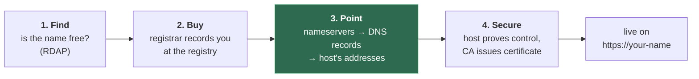

# 5. Your own domain — buying it, pointing it, securing it

## 5.1 The problem

File 03 §3.7 ended on the one form of lock-in you can't undo: links that point at a
name you don't own. A domain fixes that. It's the only part of the stack that people
outside your control will copy into their own pages, so it's the part that has to
outlive every other choice.

Getting one involves four separate steps that are easy to blur together: **find** a
name that's free, **buy** it from a registrar, **point** it at your host with DNS, and
**secure** it with a certificate. Each has its own trap.



## 5.2 Is the name free? RDAP, and why a 404 isn't an answer

The old tool for "who owns this domain?" was **WHOIS**: a plain-text protocol with no
standard format. Its replacement is **RDAP**, the Registration Data Access Protocol —
the same question over HTTPS, answered in JSON, with a defined query format
(`/domain/example.com`, [RFC 9082](https://www.rfc-editor.org/rfc/rfc9082.html)) and
response format ([RFC 9083](https://www.rfc-editor.org/rfc/rfc9083.html)). For generic
TLDs (`.com`, `.dev`, `.org` …) ICANN made the switch definitive: "As of 28 January 2025,
the Registration Data Access Protocol (RDAP) will be the definitive source … in place of
sunsetted WHOIS services"
([ICANN, 27 Jan 2025](https://www.icann.org/en/announcements/details/icann-update-launching-rdap-sunsetting-whois-27-01-2025-en)).

Each TLD's registry runs its own RDAP server. To find the right one, a client reads a
**bootstrap** file published by IANA that maps TLDs to servers
([RFC 9224](https://www.rfc-editor.org/rfc/rfc9224.html);
[the file itself](https://data.iana.org/rdap/dns.json)). The public service **rdap.org**
does this for you: it's "a 'bootstrap server', i.e. single end point for RDAP queries",
redirecting you to the authoritative server ([about.rdap.org](https://about.rdap.org/)).

So `curl -sL https://rdap.org/domain/example.com` gives you the registration record, and
an RDAP server signals "no such registration" with **404** —
[RFC 7480 §5.3](https://www.rfc-editor.org/rfc/rfc7480.html) says an empty result set
"returns a 404 (Not Found) response code".

> ⚠️ **A 404 from rdap.org is not proof a name is available.** rdap.org only knows
> servers "registered with IANA", and returns 404 when it "doesn't know of an RDAP service
> which is authoritative for the requested resource" (same page). That's the same status
> code as "not registered". And coverage of country-code TLDs is patchy: ccTLD policy is
> set nationally, with "no role for ICANN"
> ([ICANN — ccTLDs](https://www.icann.org/en/resources/compliance/cctld)). In the IANA
> bootstrap file published 30 September 2026, only 72 two-letter ccTLDs had an entry;
> `.de`, `.io`, `.co`, `.jp` and `.me` were among those absent. A 404 for
> `something.io` tells you nothing. Check where the 404 came from — rdap.org itself, or
> the registry's server after a redirect — and for ccTLDs use the registry's own lookup.

The registrar's search box is the final word, because it asks the registry directly at
the moment you buy.

## 5.3 Buying it: registrars and the renewal price

A registrar sells you a registration, usually by the year. The trap is the price:

| Price | What it is |
|---|---|
| **Registration** (first year) | Often discounted — a promotion to win you as a customer |
| **Renewal** | What you'll pay every year after, for as long as you keep the name |
| **Transfer** | Moving the name to another registrar; usually includes a year's renewal |

Registrars that list these separately show the gap plainly — Porkbun, for example, shows
registration, renewal and transfer columns and flags promotional first-year prices as
"1st Yr Sale!" ([porkbun.com/products/domains](https://porkbun.com/products/domains), as
of October 2026). **Compare renewal prices, not first-year prices** — you'll pay renewal
for as long as the name matters to you.

Some registrars sell **at cost**. Cloudflare Registrar's FAQ: "Cloudflare Registrar sells
domains at cost: you pay the registry and ICANN list price with no markup" — with the
condition that "all domains on Cloudflare Registrar use Cloudflare nameservers"
([Cloudflare Registrar FAQ](https://developers.cloudflare.com/registrar/faq/)). That's
the file 01 §1.5 roles colliding again: cheap registration in exchange for registrar and
DNS provider being the same company.

I've deliberately quoted no prices: they vary by TLD and change, and a confident wrong
number is worse than none. Look them up for your TLD on the day.

## 5.4 What you hand over: registrant data and redaction

Registering a name means giving the registrar your details — name, address, email,
phone. Two things are true at once, and people usually know only one:

**They must be accurate.** Under ICANN's 2013 Registrar Accreditation Agreement the
registrant "shall provide to Registrar accurate and reliable contact details" and update
them within seven days; wilfully inaccurate data is "a basis for suspension and/or
cancellation" (§3.7.7.1–2,
[2013 RAA](https://www.icann.org/resources/pages/approved-with-specs-2013-09-17-en)).
Fake details are a way to lose the name in a dispute.

**They are mostly not published any more.** Since GDPR, gTLD registration data has been
redacted by default — first under ICANN's 2018 Temporary Specification, now under the
**Registration Data Policy**, in force since 21 August 2025
([ICANN](https://www.icann.org/en/announcements/details/icann-registration-data-policy-now-in-effect-for-contracted-parties-21-08-2025-en)).
RDAP even has a standard way to say which fields were withheld
([RFC 9537](https://www.rfc-editor.org/rfc/rfc9537.html)).

So "privacy" now has two layers. **Redaction** is the registry/registrar withholding your
personal fields from public lookups. A **privacy or proxy service** replaces your details
with the service's own in the record itself. Redaction is the default for gTLDs; ccTLDs
follow their own national rules, which vary. Run an RDAP lookup on your own name after
buying and see what's actually exposed.

## 5.5 `.dev` (and friends): HTTPS isn't optional

Most TLDs leave HTTPS up to you. A few don't. Google Registry states: "The .dev
top-level domain is included on the HSTS preload list, making HTTPS required on all
connections to .dev websites"
([Google Registry — .dev](https://www.registry.google/domains/dev/)).

**HSTS** (HTTP Strict Transport Security) is a header telling browsers "only ever use
HTTPS for this host". Normally a browser learns it on the first visit. The **preload
list** is a list built into browsers so they know before the first visit. Chromium's copy
contains, for the whole TLD:

```json
{ "name": "dev", "policy": "public-suffix", "mode": "force-https", "include_subdomains": true }
```

([`transport_security_state_static.json`](https://chromium.googlesource.com/chromium/src/+/main/net/http/transport_security_state_static.json),
checked October 2026; `.app` and `.page` have identical entries.)

The consequence: a browser will never load `http://anything.dev`. It rewrites to
`https://` before sending a byte, and if the certificate is missing or wrong, there's no
"proceed anyway" button. Your site does not work at all until the host has issued a valid
certificate — which, right after you attach the domain, can take minutes. That gap is
normal; don't start changing DNS records because of it.

## 5.6 Pointing it: DNS records

Once you own the name, you set its **nameservers** at the registrar (which DNS provider
answers for it), then create **records** at that DNS provider (what the answers are).

| Record | Maps a name to | Use for a static site |
|---|---|---|
| **A** | An IPv4 address | Apex pointed at a host that publishes fixed IPs |
| **AAAA** | An IPv6 address | Same, for IPv6 |
| **CNAME** | Another *name* — "go and ask about that one instead" | `www.example.com` → `you.host.example` |
| **ALIAS / ANAME / flattened CNAME** | Another name, but answered as A/AAAA | The apex, when the host gives you a name not an IP |
| **CAA** | Which certificate authorities may issue for you | Optional hardening (§5.7) |
| **TXT** | Arbitrary text | Ownership verification for hosts |

The reason the fourth row exists is a rule from the DNS's original design: "If a CNAME RR
is present at a node, no other data should be present"
([RFC 1034 §3.6.2](https://www.rfc-editor.org/rfc/rfc1034.html); tightened in
[RFC 2181 §10.1](https://www.rfc-editor.org/rfc/rfc2181.html)). The **apex** of your zone
— `example.com` itself — must hold SOA and NS records. So it can't hold a CNAME.

```
 www.example.com   CNAME   you.host.example      ✅ fine: www has nothing else
 example.com       CNAME   you.host.example      ❌ illegal: apex already has SOA + NS
 example.com       ALIAS   you.host.example      ✅ provider resolves it, answers with A/AAAA
```

Every host wants to give you a name, not an IP, because its IPs change. Providers solved
the apex problem separately, without a standard:

| Name | Who | What it does |
|---|---|---|
| **CNAME flattening** | Cloudflare | "allows you to use a CNAME record at your zone apex"; returns "the final IP address instead of a CNAME record" ([docs](https://developers.cloudflare.com/dns/cname-flattening/)) |
| **ALIAS** | DNSimple (and others, by other names) | "something we built at DNSimple to solve a specific problem: you cannot use a CNAME record on your root domain" ([docs](https://support.dnsimple.com/articles/alias-record/)) |
| **ANAME** | IETF draft | Proposed standard version; the draft expired in 2019 and was never published as an RFC ([datatracker](https://datatracker.ietf.org/doc/draft-ietf-dnsop-aname/)) |
| **HTTPS / SVCB AliasMode** | Standard, [RFC 9460](https://www.rfc-editor.org/rfc/rfc9460.html) (2023) | "The primary purpose of AliasMode is to allow aliasing at the zone apex" — but only for clients that look up HTTPS records |

> **Teacher's aside.** "Flattening" sounds like magic; it isn't. Your DNS provider does
> the CNAME chase *itself*, on its own servers, and hands the visitor the resulting A/AAAA
> records as if you'd typed them in. The visitor never sees the CNAME. That has
> consequences you only meet when something's wrong: if the target name stops resolving
> (a "dangling" CNAME, say after you delete the site at the host), Cloudflare documents
> that flattening "returns an empty response (NODATA)" — your apex silently has no
> address, rather than an error pointing at the target. And by my reasoning rather than
> any vendor's docs, the IPs are the ones your DNS provider got from where *it* is, so a
> host that tailors DNS answers by location may answer less precisely. Both are reasons
> "use `www` with a plain CNAME and redirect the apex to it" is still common advice.

## 5.7 Securing it: how the host gets a certificate for your name

When you add a custom domain at a host, it needs a TLS certificate for that name. It
can't just ask for one — a certificate authority will only issue to someone who proves
they control the name. The protocol for this is **ACME**, and the proof is a
**challenge** ([Let's Encrypt — challenge types](https://letsencrypt.org/docs/challenge-types/)):

| Challenge | How control is proved | Notes |
|---|---|---|
| **HTTP-01** | CA fetches a token from `http://your-name/.well-known/acme-challenge/…` | "the most common challenge type today"; port 80 only; no wildcards |
| **DNS-01** | You (or the host, via API) publish a TXT record | Works for wildcards; needs DNS write access |
| **TLS-ALPN-01** | Answered inside a TLS handshake on port 443 | "not suitable for most people" |

This explains the order of operations every host asks for: **point DNS at the host
first**, then the host can pass HTTP-01 (because requests for your name now reach it) or
it asks you for a TXT record. Until one succeeds, there's no certificate — and on a `.dev`
domain (§5.5), no site.

Two more things worth knowing:

- **Certificates are getting shorter-lived.** Let's Encrypt issues 90-day certificates
  today and has announced a move to 45 days, with the default reaching 64 days on
  10 February 2027 and 45 days on 16 February 2028
  ([Let's Encrypt, 2 Dec 2025](https://letsencrypt.org/2025/12/02/from-90-to-45)). The
  CA/Browser Forum's Ballot SC-081v3 (April 2025) cuts the maximum for all public
  certificates from 398 to 47 days in steps between March 2026 and March 2029
  ([CA/B Forum](https://cabforum.org/2025/04/11/ballot-sc081v3-introduce-schedule-of-reducing-validity-and-data-reuse-periods/)).
  On a managed host renewal is automatic and you won't notice; on your own server, it's
  why automation (Caddy, certbot timers) is mandatory rather than nice.
- **CAA records** let you name which CAs may issue for your domain
  ([RFC 8659](https://www.rfc-editor.org/rfc/rfc8659.html)). Set one and a mis-issuance
  by any other CA should be refused. Set one wrongly — naming a CA your host doesn't use
  — and your host's certificate requests fail. Check which CA your host uses first.

---

## Check yourself

1. You query `https://rdap.org/domain/yourname.io` and get a 404. A friend concludes the
   name is free. What else could the 404 mean, how would you tell the cases apart, and
   what's the definitive check?
2. Two registrars offer the same name: one at a low first-year price, one at cost with
   no promotion. What numbers do you compare, over what horizon, and what non-price
   condition might come attached to the at-cost option?
3. You attach a `.dev` domain to a new host, update DNS, and immediately open the site.
   The browser shows a certificate error with no way past it. Explain each mechanism
   involved, and say what you should do next (and what you shouldn't).
4. Your host gives you `site-1234.host.example` and asks you to point both `example.com`
   and `www.example.com` at it. Your DNS provider has no ALIAS or flattening. Write the
   records you can create, explain why the obvious apex record is illegal, and give two
   ways around it.
5. You add a CAA record allowing only one CA, then move hosts. The new host's dashboard
   says "certificate pending" forever. Explain the chain of events, and how the ACME
   challenge types interact with your DNS here.

(Answers in [08-exercises.md](08-exercises.md).)
