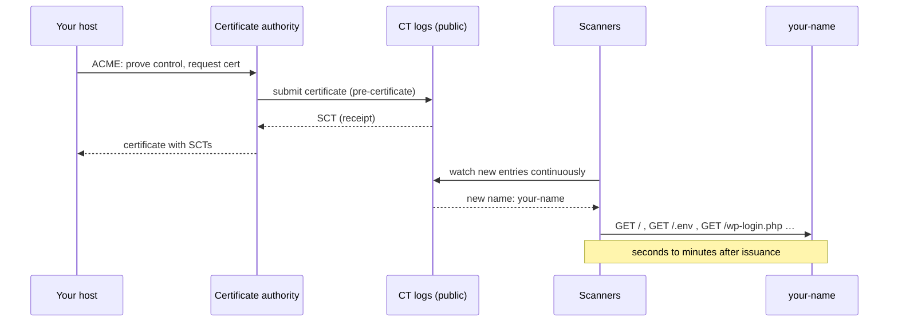

# 6. Going live — who shows up, and what to measure

## 6.1 The problem

You attach your domain, the certificate is issued, and you tell nobody. Within minutes,
something starts requesting your pages. If you have analytics on, you'll see "visitors"
from countries you've never been to, using browsers nobody admits to using, requesting
paths your site doesn't have.

That isn't a misconfiguration or a leak. It's the predictable result of how certificates
are issued, and understanding it is what lets you read your own numbers. The second half
of this chapter is about the choices that follow: whether to measure at all, and whether
to publish a feed.

## 6.2 Certificate Transparency: every certificate is public

Certificate authorities make mistakes, and occasionally get compromised. In 2011 the
Dutch CA DigiNotar was breached and attackers used it "to create more than 500 fraudulent
certificates", which were used to impersonate major sites; that incident and others like
it led Google engineers Ben Laurie and Adam Langley to propose CT, drafted with the IETF
in 2012 ([DigiCert — CT background](https://www.digicert.com/certificate-transparency/status-background.htm),
a CA's account rather than a neutral one, but consistent with contemporary reporting).
Before CT there was no systematic way for a domain owner to find out a certificate had
been issued for their name. **Certificate Transparency (CT)** is the fix: make every
issued certificate public, in logs anyone can read.

[RFC 6962](https://www.rfc-editor.org/rfc/rfc6962.html) (2013) describes "publicly
logging the existence of Transport Layer Security (TLS) certificates as they are issued
or observed, in a manner that allows anyone to audit certificate authority (CA)
activity". Its successor [RFC 9162](https://www.rfc-editor.org/rfc/rfc9162.html) (2021,
CT version 2.0) keeps the same model of append-only, publicly auditable logs. Both are
formally *Experimental* RFCs — but the deployed system is mandatory in practice, because
browsers enforce it:

| Browser | Rule | Source |
|---|---|---|
| Chrome | A certificate must come with **Signed Certificate Timestamps** (SCTs) — receipts from CT logs — to be "CT Compliant"; enforced for certificates issued after 30 April 2018 | [Chrome CT policy](https://googlechrome.github.io/CertificateTransparency/ct_policy.html); [announcement](https://groups.google.com/a/chromium.org/g/ct-policy/c/wHILiYf31DE/m/iMFmpMEkAQAJ) |
| Apple platforms | "At least two Signed Certificate Timestamps" | [Apple CT policy](https://support.apple.com/en-us/103214) |

So the CA **must** log your certificate before a browser will accept it, and a log entry
contains the hostnames the certificate covers. Your new name is public the moment your
host gets its certificate — before you've told anyone, and regardless of whether anything
links to it. Search engines over CT logs, such as [crt.sh](https://crt.sh/), let anyone
look a domain up; try yours.

How fast? Two measurement studies give numbers:

| Study | Finding |
|---|---|
| Scheitle et al., IMC 2018 ([arXiv 1809.08325](https://arxiv.org/pdf/1809.08325)) | CT data "is being used to identify targets for scanning campaigns only minutes after certificate issuance"; first DNS queries for the new names "after 73 seconds to ≈3 minutes" |
| Pletinckx et al., 2023 ([UCSB](https://seclab.cs.ucsb.edu/files/publications/pletinckx_ctl_23.pdf)) | "adding a certificate to a CT log leads to incoming network probes, just seconds after publishing the entry" |

> **Teacher's aside.** People assume a site nobody has linked to is a site nobody can
> find — "security through obscurity, but at least obscure". With HTTPS, that assumption
> is false by design. Issuing the certificate *is* the announcement. If something
> mustn't be found, it needs authentication, not an unguessable hostname. (A wildcard
> certificate — `*.example.com` — does keep individual subdomain names out of the logs,
> but Pletinckx et al. note attackers then turn to passive DNS data to find them. It
> hides names from CT; it doesn't hide them.)

## 6.3 Reading your first week of analytics

With that in mind, the first days of a new site's traffic stop being mysterious.
Here's what typically shows up and what it means — the specifics vary, so treat this as
a guide for reading your own logs rather than a measured profile:

| You see | Likely explanation |
|---|---|
| Requests within minutes of the certificate being issued | CT-driven scanners (§6.2) |
| Requests for `/.env`, `/.git/config`, `/wp-login.php`, `/xmlrpc.php` | Probes for leaked secrets and WordPress installs; they 404 on a static site and are harmless |
| User agents like `curl/…`, `python-requests/…`, `Go-http-client/…` | Scripts that don't pretend to be browsers |
| A plausible, slightly old desktop browser string from many unrelated addresses | Scripts that *do* pretend; a user-agent string is self-reported and free to fake |
| Traffic "from" countries clustered around cloud regions | Scanners run on rented servers in data centres, not on home connections |
| Search engine crawlers | Real and useful; the big ones can be verified (below) |

Two distinctions sharpen this.

**What your analytics can see depends on how it collects.** There are two kinds:

| | Request-based (server or CDN logs) | Script-based (a JS beacon on the page) |
|---|---|---|
| Counts | Every HTTP request | Only clients that run the page's JavaScript |
| Scanners using curl | Counted | Invisible — they never execute the script |
| Headless browsers | Counted | Counted if they run JS |
| Ad-blocker users | Counted | Often invisible — blockers block beacons |

So a new site with request-based analytics looks busy, and the same site with
script-based analytics looks nearly empty. Neither is lying; they're counting different
things. Most real humans fall in the intersection.

**"Data centre" isn't "visitor country".** CDN dashboards often show both, and they mean
different things. Cloudflare's network analytics, for instance, shows "the top source
Cloudflare data centers where the displayed traffic was ingested", while its Web
Analytics dimension "Country" is "the visitor's country"
([network analytics](https://developers.cloudflare.com/analytics/network-analytics/understand/main-dashboard/);
[Web Analytics dimensions](https://developers.cloudflare.com/web-analytics/data-metrics/dimensions/)).
A CDN routes each request to a nearby edge data centre, so the data centre tells you
roughly *where the request entered the network*, which is usually but not always in or
near the requester's country. Don't read a busy data centre as a fan base.

**Telling bots from humans, roughly.** No method is exact. In ascending order of
effort:

1. Discount anything requesting paths that don't exist on your site.
2. Discount self-identified tools (`curl`, `python-requests`, `Go-http-client`).
3. Compare request-based and script-based counts; humans show up in both.
4. For named crawlers, rely on the platform's verification rather than the user-agent
   string. Cloudflare, for example, marks **verified bots** — ones it "has confirmed is
   transparent about who it is and what it does"
   ([Cloudflare — verified bots](https://developers.cloudflare.com/bots/concepts/bot/verified-bots/)).

> ⚠️ **Don't act on day-one numbers.** The pattern for a brand-new site is a burst of
> automated traffic that decays. Waiting a few weeks before deciding anything — that a
> post is popular, that you need a CDN upgrade, that you're being attacked — costs
> nothing and avoids reacting to scanners.

## 6.4 To measure or not

A static site can have no analytics at all, and many personal sites choose that: no
script, no cookies, no consent banner question, nothing to maintain. You lose the
answer to "is anyone reading this?", which matters to some people and not to others.

If you do measure, the options sit on a spectrum:

| Option | What runs on your page | Notes |
|---|---|---|
| Nothing | Nothing | Zero data, zero obligations |
| Host/CDN request logs or dashboard | Nothing | Counts bots heavily (§6.3); no page changes |
| Cookie-free script analytics (e.g. Cloudflare Web Analytics, Plausible, GoatCounter) | A small script | Cloudflare: "does not use any client-side state, such as cookies or localStorage" ([source](https://www.cloudflare.com/web-analytics/)); Plausible: "We do not use cookies or any other persistent identifiers" ([source](https://plausible.io/privacy-focused-web-analytics)) |
| Full analytics suites with cookies and identifiers | A larger script | Most detail; most privacy and legal obligations |

The legal side — whether a given tool needs consent where you and your readers are — is
a jurisdiction question this course doesn't settle. "No cookies" removes the most common
trigger but isn't by itself a legal opinion.

## 6.5 Feeds: a choice, not a requirement

A **feed** is a machine-readable list of your recent posts that feed readers poll, so
people can follow you without visiting. Two formats:

| Format | Standard |
|---|---|
| **RSS 2.0** | RSS Advisory Board specification, current version 2.0.11 (March 2009) ([rssboard.org](https://www.rssboard.org/rss-specification)) |
| **Atom** | IETF standard, [RFC 4287](https://www.rfc-editor.org/rfc/rfc4287.html) (2005) |

Readers handle both; Atom is the more tightly specified. Generators differ in their
defaults, and that matters if you want *no* feed: Hugo generates RSS "by default" for
home, section and taxonomy pages, so you have to switch it off; Zola has
`generate_feeds = false` by default, so you have to switch it on (file 02 §2.3).

Reasons you might deliberately not publish one:

- **A feed is a promise that's hard to withdraw.** Subscribers' readers keep polling the
  URL indefinitely. Change or remove it and they silently stop getting updates, with no
  way for you to tell them.
- **Full-content feeds copy your content into other software,** where your page's design,
  corrections and context don't follow. Summary-only feeds are a middle path.
- **It's one more output to keep valid.** A malformed feed fails silently in readers.

And reasons to publish one: it's the main way technical readers follow small sites, and
it costs nothing to serve. Either decision is defensible; the mistake is publishing one
by default without having decided.

### Styling feeds, and XSLT going away

Click a raw feed link in a browser and you get XML. A common fix was to attach an XSLT
stylesheet (`<?xml-stylesheet type="text/xsl" href="…"?>`) so browsers render the feed as
a readable page. That's ending. Chrome announced "Removing XSLT for a more secure
browser" ([Chrome for Developers, 29 Oct 2025](https://developer.chrome.com/docs/web-platform/deprecating-xslt)):

| Chrome version | Date | Step |
|---|---|---|
| 143 | 2 Dec 2025 | Official deprecation |
| 152 | 25 Aug 2026 | Origin trial (opt-in extension for sites that need time) |
| **158** | **17 Nov 2026** | "XSLT stops functioning on Stable releases" except for origin-trial and enterprise-policy participants |
| 176 | 17 Aug 2027 | Full removal |

The same post says "The Firefox and WebKit projects have also indicated plans to remove
XSLT", names feeds as a main use, and notes that XML styled with CSS (`type="text/css"`)
is not being removed. The WHATWG discussion
([whatwg/html #11523](https://github.com/whatwg/html/issues/11523)) was still open as of
October 2026. If you style a feed today, use CSS, or link to an ordinary HTML page that
explains what the feed is — don't build on XSLT.

---

## Check yourself

1. You deploy a site to a hostname you've never shared, and twenty minutes later your
   logs show requests for `/.env`. Trace the chain of events from "host requests a
   certificate" to that request, naming the mechanism at each step.
2. Your CDN dashboard shows 400 requests on day one; your script-based analytics shows 3
   visitors. Give the mechanism that reconciles these, and say which number is closer to
   "humans who read the page".
3. Most of your traffic is attributed to a data centre in a country you have no readers
   in. Give two different explanations and how you'd tell which is true.
4. A colleague proposes a hard-to-guess subdomain (`staging-8f3a2.example.com`) as
   "protection" for an unreleased site. What happens when HTTPS is enabled? Would a
   wildcard certificate change the answer, and fully?
5. You've published an Atom feed with an XSLT stylesheet for two years. What changes for
   (a) feed reader subscribers and (b) people clicking the feed link in Chrome after
   November 2026? What would you change, and what would you leave alone?

(Answers in [08-exercises.md](08-exercises.md).)
