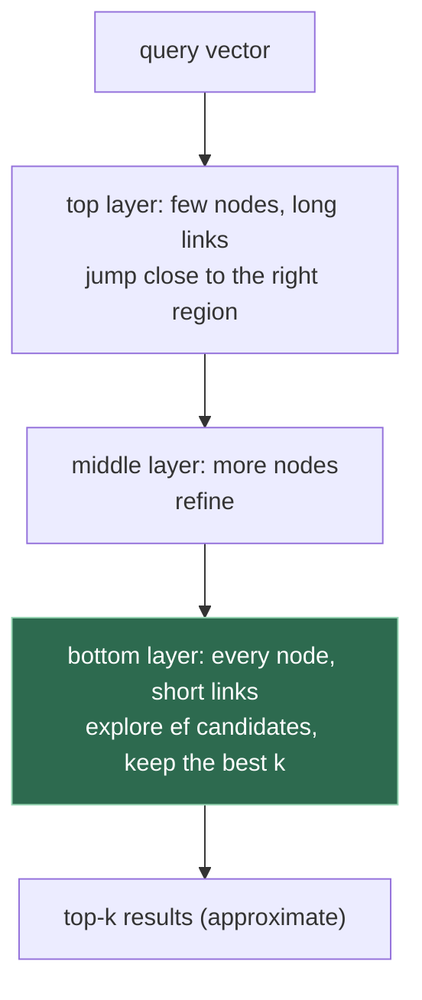

# 1. What vector search is

## The problem

A database index finds rows whose value *equals* something, or falls in a range. Plenty of
questions aren't like that: "which stored documents say roughly the same thing as this
one?", "which images look like this image?", "have we seen this person, this product, this
song before, under a different id?". There's no exact value to look up. Vector search answers
them by turning each item into a list of numbers and looking for nearby lists, and almost
everything that surprises people about it, scores that aren't probabilities, results that
change with a tuning parameter, a "match" that's missing, follows from how "nearby" is
computed and how it's approximated.

Skip this chapter if you can explain cosine similarity, what HNSW trades for its speed, and
what `ef` controls. Everyone else should read it: later chapters use those terms without
re-introducing them.

The engine used for examples is Qdrant 1.19, run in a throwaway container. The ideas are
general; parameter names are Qdrant's.

## Embeddings

A model (a neural network, usually) maps an item to a fixed-length vector of floating-point
numbers, its **embedding**. Models are trained so that items a human would call similar get
vectors that point in similar directions. A 512-dimensional embedding is just 512 numbers, and
on its own each number means nothing. Only distances between embeddings from the **same**
model mean anything.

That last point carries weight later. Two different models produce two different spaces. A
score of 0.8 from one model and 0.8 from another aren't the same amount of similarity, and a
vector from one model compared with a vector from the other is meaningless.

## Measuring "nearby"

| Measure | Definition | Better when | Notes |
|---|---|---|---|
| Cosine similarity | cos of the angle between vectors, in [−1, 1] | higher | Ignores length. For unit-length vectors it equals the dot product |
| Dot product | Σ aᵢbᵢ | higher | Sensitive to length; some models are trained for it |
| Euclidean distance | straight-line distance | lower | For unit vectors it's a monotonic function of cosine |

Qdrant's search documentation spells out the direction for thresholds: a `score_threshold`
excludes lower scores for dot product and cosine and higher ones for Euclidean distance, "This
parameter may exclude lower or higher scores depending on the used metric." Which one a model
expects is part of its contract; use the one it was trained for.

A **score** is a similarity under that measure. It isn't a probability that two items are the
same thing. Turning a score into a decision ("same person", "duplicate document") needs a
threshold chosen on labelled data for *that* model, and the threshold moves whenever the model
does.

## Exact search and why nobody does it at scale

The exact answer to "the 10 nearest vectors" is to compute the score against every stored
vector and keep the best ten. For N vectors of d dimensions that's N × d multiplications per
query: a hundred million 512-d vectors is about fifty billion operations, every query. Qdrant
will do it if asked (`exact: true`: "option to not use the approximate search (ANN). If set to
true, the search may run for a long as it performs a full scan to retrieve exact results").
It's the ground truth you test approximate search against, not a production setting for large
collections.

## Approximate nearest neighbours: HNSW

**Approximate nearest neighbour (ANN)** search accepts that it will sometimes miss a true
neighbour in exchange for touching a tiny fraction of the data. The most widely used method is
**HNSW**, from Malkov and Yashunin,
[*Efficient and robust approximate nearest neighbor search using Hierarchical Navigable Small World graphs*](https://arxiv.org/abs/1603.09320).
It builds a multi-layer graph: each vector is a node linked to some of its near neighbours,
upper layers are sparse with long links, lower layers dense with short ones. A search starts at
the top, walks greedily towards the query, and drops down a layer at a time. The paper reports
logarithmic scaling of search complexity.

At the bottom layer the search keeps a list of `ef` candidates while it explores. Qdrant's
`hnsw_ef` is the "value that specifies `ef` parameter of the HNSW algorithm". A bigger `ef`
explores more of the graph: slower, and more likely to find the true neighbours. It's the main
speed–accuracy dial at query time.

The quality measure is **recall**: of the true top-k (from exact search), what fraction did the
approximate search return? Recall depends on the data, the graph's build parameters and `ef`,
so it has to be measured on your data, not assumed.

> **Teacher's aside.** People expect a search engine either to find a thing or not. ANN search
> can miss an item that's genuinely the closest, with no error and no warning, because the walk
> through the graph never reached it. That isn't a bug to be fixed, it's the trade being made.
> The engineering question is never "does it miss?" but "how often, on our data, at our
> settings, and what does a miss cost us?"

## Collections, points and payloads

| Term | Meaning |
|---|---|
| **Collection** | A set of points sharing a vector configuration (size, distance) |
| **Point** | One stored item: an id, one or more vectors, and a payload |
| **Point id** | A 64-bit unsigned integer or a UUID. Writing a point with an existing id overwrites it |
| **Named vectors** | Several vectors per point, one per model, each searched separately with `using` |
| **Payload** | JSON-like fields stored with the point, returned with results and usable in filters |
| **Filter** | Conditions on payload (`must`, `should`, `must_not`) applied during search |

Filters matter because they run *inside* the search, not after it. "The ten nearest documents
that aren't from this author" returns ten, not ten minus however many the author wrote, if the
filter is part of the query.

## Check yourself

1. Two teams store embeddings from different models in one collection's single vector field.
   What do searches return, and why doesn't anything error?
2. A product manager asks for "a 0.8 similarity threshold" before anyone has chosen a model.
   What's missing from the request?
3. Why is `exact: true` the right setting for a test that measures recall, and the wrong one for
   a hundred-million-point production collection?
4. A search with `ef = 16` misses an item that `ef = 256` finds. Explain mechanically what
   happened in the graph.
5. You want the ten nearest items excluding the query's own author. Why is it better to put the
   exclusion in the search's filter than to search for ten and drop the author's items
   afterwards?
